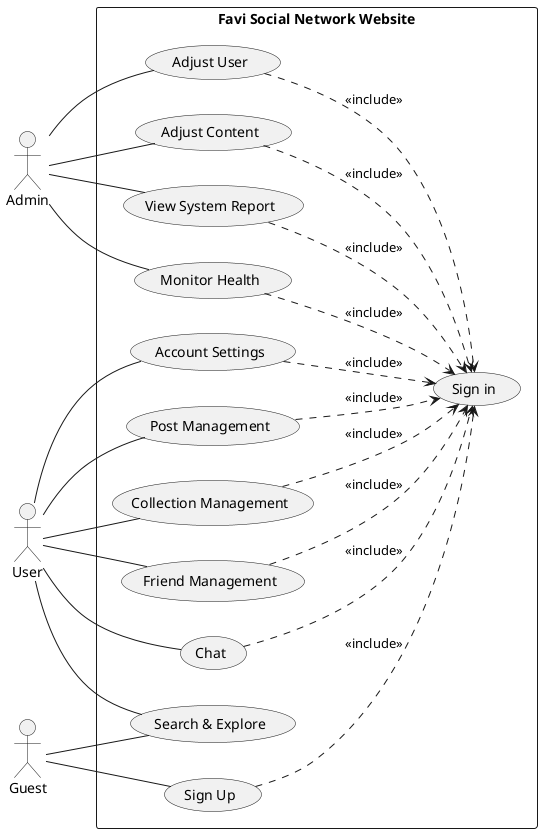

# 3.2.1. Sơ đồ Use Case Tổng quát

Dưới đây là sơ đồ Use case tổng quát của hệ thống Favi, được mô tả bằng cú pháp PlantUML.

```plantuml
@startuml
left to right direction
skinparam packageStyle rectangle

actor "Admin" as admin
actor "User" as user
actor "Guest" as guest

rectangle "Favi Social Network Website" {
    usecase "Sign in" as UC_SignIn
    
    ' Admin Use Cases
    usecase "Adjust User" as UC_AdjustUser
    usecase "Adjust Content" as UC_ContentMod
    usecase "View System Report" as UC_SystemReport
    usecase "Monitor Health" as UC_Monitor
    
    ' User Use Cases
    usecase "Account Settings" as UC_AccountSettings
    usecase "Post Management" as UC_PostManagement
    usecase "Collection Management" as UC_CollectionManagement
    usecase "Friend Management" as UC_FriendManagement
    usecase "Chat" as UC_Chat
    usecase "Search & Explore" as UC_Search
    usecase "Sign Up" as UC_SignUp

    ' Admin Relationships
    admin -- UC_AdjustUser
    admin -- UC_ContentMod
    admin -- UC_SystemReport
    admin -- UC_Monitor
    
    ' User Relationships
    user -- UC_AccountSettings
    user -- UC_PostManagement
    user -- UC_CollectionManagement
    user -- UC_FriendManagement
    user -- UC_Chat
    user -- UC_Search
    
    ' Guest Relationships
    guest -- UC_SignUp
    guest -- UC_Search

    ' Include Sign In Relationships (Pattern from sample)
    UC_AdjustUser ..> UC_SignIn : <<include>>
    UC_ContentMod ..> UC_SignIn : <<include>>
    UC_SystemReport ..> UC_SignIn : <<include>>
    UC_Monitor ..> UC_SignIn : <<include>>
    
    UC_AccountSettings ..> UC_SignIn : <<include>>
    UC_PostManagement ..> UC_SignIn : <<include>>
    UC_CollectionManagement ..> UC_SignIn : <<include>>
    UC_FriendManagement ..> UC_SignIn : <<include>>
    UC_Chat ..> UC_SignIn : <<include>>
    
    ' Sign Up typically leads to Sign In
    UC_SignUp ..> UC_SignIn : <<include>>
}
@enduml
```
