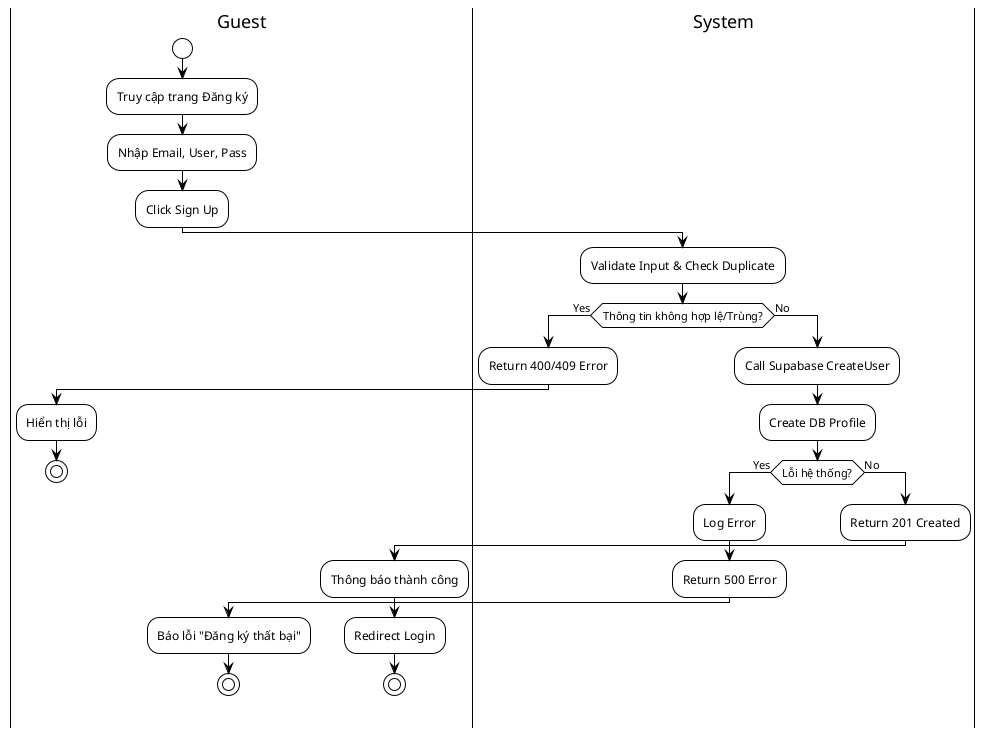
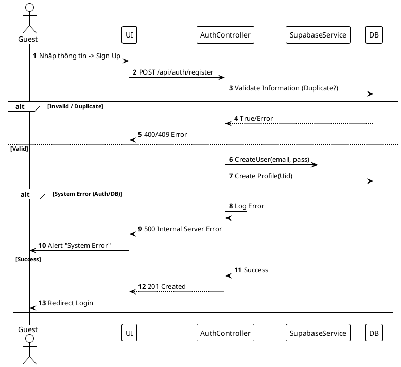

# 3.2.2.10. UC-US-10: Đăng ký tài khoản (Sign Up)

## 1. Đặc tả Use Case

| Mục | Nội dung |
| :--- | :--- |
| **Mã UC** | UC-US-10 |
| **Tên UC** | Đăng ký tài khoản (Sign Up) |
| **Mô tả** | Cho phép khách (Guest) tạo tài khoản mới để truy cập hệ thống bằng Email và Mật khẩu. |
| **Tác nhân sử dụng** | Guest (Khách vãng lai) |
| **Sự kiện kích hoạt** | Người dùng nhấn nút "Đăng ký" (Register) trên màn hình Login hoặc Landing Page. |
| **Luồng sự kiện chính** | **1. Khởi tạo đăng ký** 1. Guest truy cập trang `/register`. 2. Nhập: Email, Username, Password, Confirm Password. 3. Hệ thống Client validate format (Email đúng định dạng, Pass >= 6 ký tự). 4. Nhấn "Sign Up".  **2. Xử lý đăng ký** 1. Hệ thống gọi `POST /api/auth/register`. 2. `AuthService` kiểm tra Email tồn tại (qua Supabase) và Username tồn tại (qua DB nội bộ). 3. Gọi Supabase Auth để tạo User (Identity). 4. Tạo bản ghi `Profile` mặc định trong DB Favi (Avatar mặc định, Role User). 5. Trả về 201 Created. 6. Hiển thị thông báo "Đăng ký thành công", chuyển về trang Login. |
| **Luồng sự kiện phụ** | **A1. Email hoặc Username đã tồn tại (409)**: - API check Duplicate trả về 409 Conflict. - Hệ thống báo "Email hoặc Username đã được sử dụng".  **A2. Lỗi kết nối bên thứ 3 (502)**: - Không gọi được Supabase API. - Hệ thống báo "Service Unavailable". |
| **Yêu cầu trước khi thực hiện** | Email chưa được sử dụng trong hệ thống. |
| **Yêu cầu sau khi thực hiện** | Tài khoản User và Profile được khởi tạo. |
| **Yêu cầu phi chức năng** | Mật khẩu phải được mã hóa (Hash) bởi Identity Provider. |

## 2. Biểu đồ

### 2.1. Activity Diagram (Tổng quát)

### 2.2. Sequence Diagram (Tổng quát)

