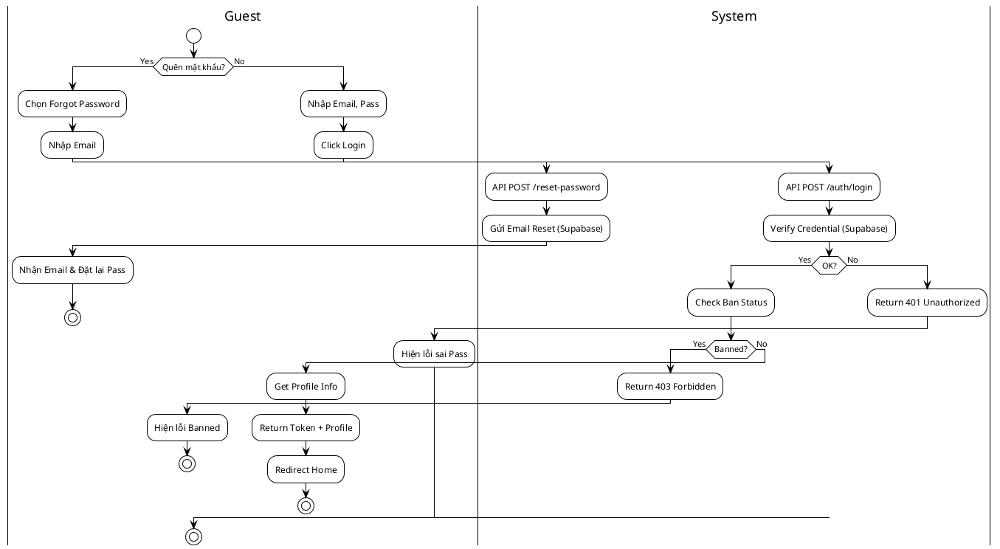
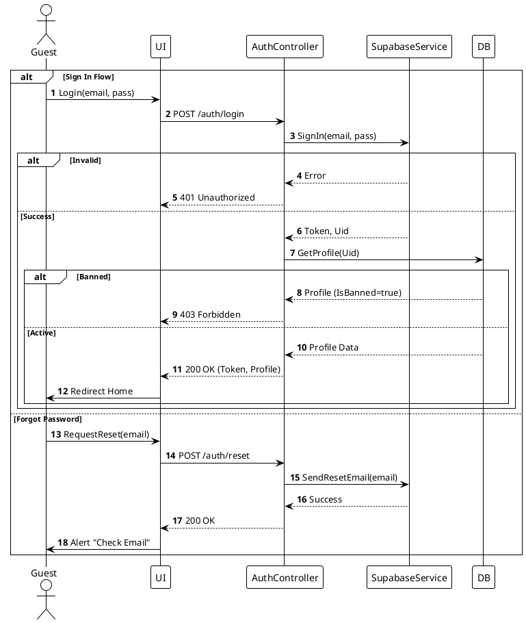

# 3.2.2.11. UC-US-11: Đăng nhập & Quên mật khẩu (Sign In & Forgot Password)

## 1. Đặc tả Use Case

| Mục | Nội dung |
| :--- | :--- |
| **Mã UC** | UC-US-11 |
| **Tên UC** | Đăng nhập & Quên mật khẩu (Sign In & Forgot Password) |
| **Mô tả** | Người dùng xác thực danh tính để truy cập hệ thống, hoặc yêu cầu đặt lại mật khẩu khi quên. |
| **Tác nhân sử dụng** | Guest |
| **Sự kiện kích hoạt** | Truy cập trang Login, hoặc nhấn "Forgot Password". |
| **Luồng sự kiện chính** | **1. Đăng nhập (Sign In)** 1. Guest nhập Email và Password. 2. Nhấn "Log in". 3. Hệ thống gọi `POST /api/auth/login`. 4. `AuthService` chuyển tiếp thông tin tới Supabase để xác thực. 5. Nếu đúng: Trả về Access Token + Refresh Token. 6. Hệ thống lấy thông tin Profile từ DB để trả về Client. 7. Client lưu Token và chuyển hướng vào Home.  **2. Quên mật khẩu (Forgot Password)** 1. Guest chọn "Forgot Password". 2. Nhập Email đăng ký. 3. Nhấn "Send Reset Link". 4. Hệ thống gọi `POST /api/auth/reset-password`: Supabase gửi email chứa link đặt lại. 5. Thông báo "Kiểm tra email của bạn". |
| **Luồng sự kiện phụ** | **A1. Sai thông tin đăng nhập (401)**: - Supabase trả về lỗi Invalid Credentials. - API trả về 401. - Hiển thị "Email hoặc mật khẩu không đúng".  **A2. Tài khoản bị khóa (403)**: - Kiểm tra cột `IsBanned` trong bảng `Profiles`. - Nếu true -> Trả về 403 Forbidden kèm lý do/ngày mở khóa. - Hiển thị "Tài khoản của bạn đã bị khóa". |
| **Yêu cầu trước khi thực hiện** | Tài khoản đã tồn tại và chưa bị khóa vĩnh viễn. |
| **Yêu cầu sau khi thực hiện** | Client nhận được JWT Token hợp lệ. |
| **Yêu cầu phi chức năng** | Bảo mật: Token không được lộ ra ngoài (HTTPS). |

## 2. Biểu đồ

### 2.1. Activity Diagram (Tổng quát)

### 2.2. Sequence Diagram (Tổng quát)

