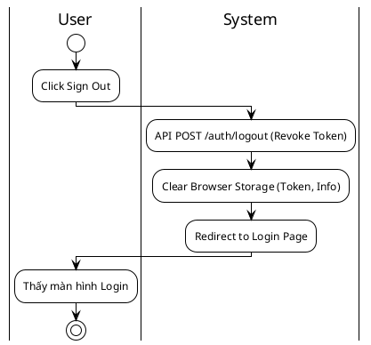
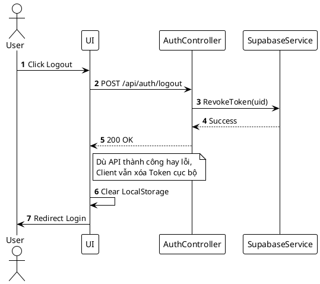

# 3.2.2.12. UC-US-12: Đăng xuất (Sign Out)

## 1. Đặc tả Use Case

| Mục | Nội dung |
| :--- | :--- |
| **Mã UC** | UC-US-12 |
| **Tên UC** | Đăng xuất (Sign Out) |
| **Mô tả** | Người dùng chấm dứt phiên làm việc hiện tại, xóa thông tin xác thực khỏi thiết bị để bảo mật tài khoản. |
| **Tác nhân sử dụng** | User |
| **Sự kiện kích hoạt** | Người dùng chọn "Logout" từ Menu cá nhân. |
| **Luồng sự kiện chính** | **1. Thực hiện Đăng xuất** 1. User nhấn "Sign Out". 2. Hệ thống gọi `POST /api/auth/logout` (Optional - để revoke refresh token phía server). 3. Client xóa Access Token, Refresh Token và User Info khỏi LocalStorage/Cookies. 4. Client chuyển hướng người dùng về trang Login hoặc Landing Page. |
| **Luồng sự kiện phụ** | **A1. Lỗi mạng (Network Error)**: - API Logout fail. - Client vẫn **BẮT BUỘC** xóa token cục bộ để đảm bảo user thoát khỏi giao diện. - Chuyển hướng về Login như bình thường. |
| **Yêu cầu trước khi thực hiện** | Người dùng đang có phiên đăng nhập hợp lệ. |
| **Yêu cầu sau khi thực hiện** | Token bị vô hiệu hóa (nếu có cơ chế revoke) và bị xóa khỏi Client. |
| **Yêu cầu phi chức năng** | Thao tác phải diễn ra tức thì (< 1s). |

## 2. Biểu đồ

### 2.1. Activity Diagram (Tổng quát)

### 2.2. Sequence Diagram (Tổng quát)

