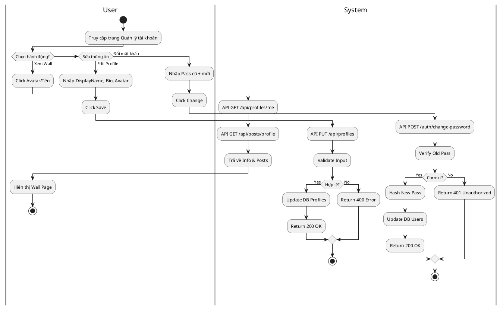
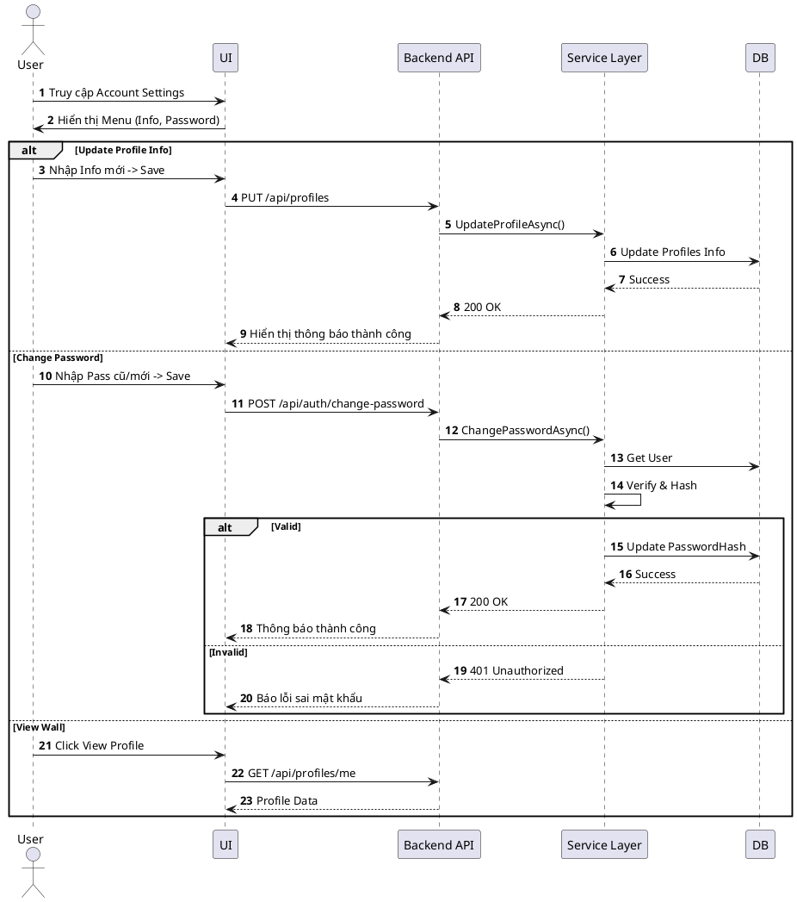

# 3.2.2.1. UC-US-01: Quản lý thiết lập tài khoản (Manage Account)

## 1. Đặc tả Use Case

| Mục | Nội dung |
| :--- | :--- |
| **Mã UC** | UC-US-01 |
| **Tên UC** | Quản lý thiết lập tài khoản (Manage Account) |
| **Mô tả** | Người dùng xem trang cá nhân (Wall), cập nhật thông tin hồ sơ (Profile) và thay đổi mật khẩu đăng nhập. |
| **Tác nhân sử dụng** | User |
| **Sự kiện kích hoạt** | Người dùng chọn menu "My Profile" hoặc "Settings" từ giao diện ứng dụng. |
| **Luồng sự kiện chính** | **1. Xem hồ sơ cá nhân (View Wall)** 1. User truy cập URL `/profile/me`. 2. Hệ thống gọi `GET /api/profiles/me`: Lấy thông tin hiển thị (Avatar, Bio). 3. Hệ thống gọi `GET /api/posts/profile/{id}`: Lấy danh sách bài viết. 4. Hiển thị giao diện Wall Page.  **2. Cập nhật thông tin (Update Info)** 1. User chọn "Edit Profile". 2. Nhập DisplayName, Bio mới, chọn Avatar mới. 3. Nhấn "Save". 4. Hệ thống gọi `PUT /api/profiles`: `ProfileService` validate và cập nhật bảng `Profiles`. 5. Hệ thống trả về 200 OK -> Giao diện cập nhật thông tin mới.  **3. Đổi mật khẩu (Change Password)** 1. User chọn chức năng "Change Password". 2. Nhập Mật khẩu cũ và Mật khẩu mới. 3. Hệ thống gọi `POST /api/auth/change-password`:    - `AuthService` kiểm tra hash mật khẩu cũ.    - Hash mật khẩu mới và cập nhật bảng `Users`. 4. Trả về 200 OK -> Thông báo "Password changed". |
| **Luồng sự kiện phụ** | **A1. Sai mật khẩu cũ (Change Password)**: - API trả về 401 Unauthorized (`WRONG_PASSWORD`). - Hệ thống hiển thị lỗi "Mật khẩu cũ không chính xác".  **A2. File Avatar quá lớn (>5MB)**: - API trả về 400 Bad Request (`INVALID_FILE`). - Hệ thống báo "File too large".  **A3. Lỗi kết nối Database**: - Service timeout/exception -> API trả về 500 Internal Server Error. - Hệ thống ghi Log và báo "System Error". |
| **Yêu cầu trước khi thực hiện** | Người dùng đã đăng nhập (Token hợp lệ). |
| **Yêu cầu sau khi thực hiện** | Dữ liệu `Profiles` hoặc `Users` được cập nhật đồng bộ. |
| **Yêu cầu phi chức năng** | Upload ảnh phải hoàn tất < 3s. |

## 2. Biểu đồ

### 2.1. Activity Diagram (Tổng quát)

### 2.2. Sequence Diagram (Tổng quát)

