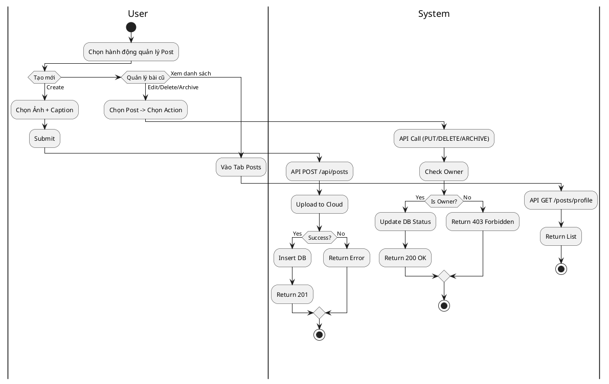
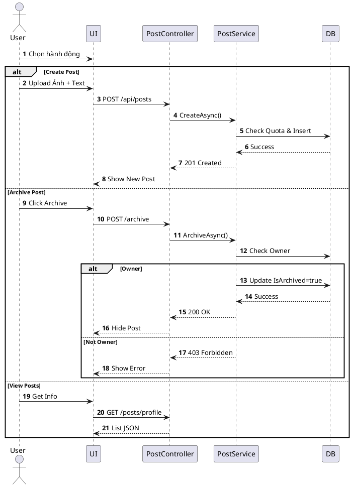

# 3.2.2.2. UC-US-02: Quản lý bài viết (Manage Post)

## 1. Đặc tả Use Case

| Mục | Nội dung |
| :--- | :--- |
| **Mã UC** | UC-US-02 |
| **Tên UC** | Quản lý bài viết (Manage Post) |
| **Mô tả** | Người dùng tạo mới, xem danh sách bài đã đăng, chỉnh sửa, xóa (soft delete) và lưu trữ (archive) bài viết cá nhân. |
| **Tác nhân sử dụng** | User |
| **Sự kiện kích hoạt** | Người dùng nhấn nút "+" (Create) hoặc chọn "Manage" trên bài viết. |
| **Luồng sự kiện chính** | **1. Tạo bài viết (Create)** 1. User chọn Ảnh và nhập Caption. 2. Hệ thống gọi `POST /api/posts`: Upload ảnh và Insert `Posts`. 3. Trả về 201 Created -> Hiển thị bài viết mới.  **2. Xem bài đăng của mình (View List)** 1. User truy cập tab "Posts" trên Wall. 2. Hệ thống gọi `GET /api/posts/profile/{id}`: Query bài viết (loại trừ Deleted/Archived). 3. Trả về danh sách phân trang.  **3. Lưu trữ (Archive)** 1. User chọn "Archive" trên bài viết. 2. Hệ thống gọi `POST /api/posts/{id}/archive`. 3. `PostService` kiểm tra quyền chủ sở hữu -> Set `IsArchived = true`. 4. Trả về 200 OK -> Ẩn bài viết khỏi Wall.  **4. Xóa bài viết (Delete)** 1. User chọn "Delete". 2. Hệ thống gọi `DELETE /api/posts/{id}`. 3. Set `DeletedDayExpiredAt` = Now + 30 days. |
| **Luồng sự kiện phụ** | **A1. Không có quyền (Not Owner)**: - Cố tình gọi API sửa/xóa bài người khác -> API trả về 403 Forbidden (`ERR_NOT_OWNER`). - Hệ thống báo lỗi "Bạn không có quyền này".  **A2. Bài viết không tồn tại (Not Found)**: - Bài đã bị xóa vĩnh viễn -> API trả về 404 Not Found.  **A3. Lỗi Upload ảnh**: - Cloud Storage lỗi -> API trả về 500 Internal Server Error. |
| **Yêu cầu trước khi thực hiện** | Người dùng đã đăng nhập; File upload hợp lệ (nếu có). |
| **Yêu cầu sau khi thực hiện** | Trạng thái bài viết (`IsArchived`, `DeletedDayExpiredAt`) cập nhật đúng trong DB. |
| **Yêu cầu phi chức năng** | Upload ảnh và tạo bài viết hoàn tất < 3s. |

## 2. Biểu đồ

### 2.1. Activity Diagram (Tổng quát)

### 2.2. Sequence Diagram (Tổng quát)

