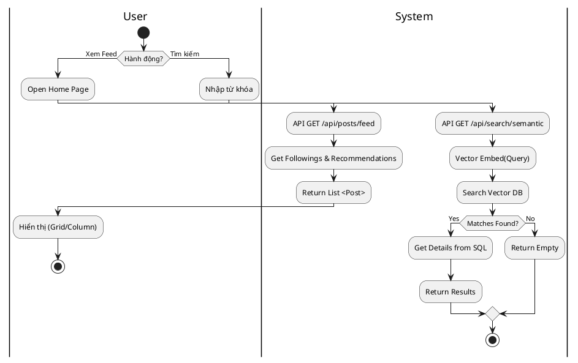
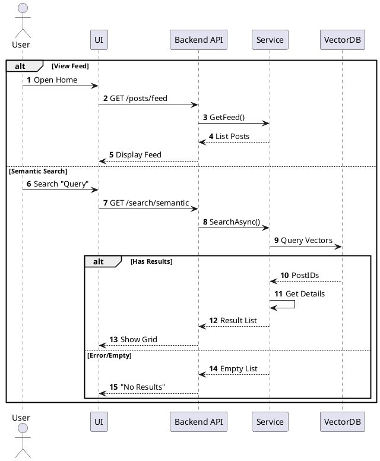

# 3.2.2.3. UC-US-03: Xem Newsfeed & Tìm kiếm (View & Search)

## 1. Đặc tả Use Case

| Mục | Nội dung |
| :--- | :--- |
| **Mã UC** | UC-US-03 |
| **Tên UC** | Xem Newsfeed và Tìm kiếm (view & Search) |
| **Mô tả** | Người dùng xem nội dung bài viết (dạng Cột hoặc Lưới) và tìm kiếm bài viết theo ngữ nghĩa (Semantic Search). |
| **Tác nhân sử dụng** | User |
| **Sự kiện kích hoạt** | Vào trang chủ hoặc nhập từ khóa vào thanh tìm kiếm. |
| **Luồng sự kiện chính** | **1. Xem Newsfeed** 1. User truy cập trang chủ. 2. Hệ thống gọi `GET /api/posts/feed`. 3. `PostService` truy vấn bài viết từ người theo dõi (Followings) và thuật toán gợi ý. 4. Trả về danh sách `PostResponse` phân trang. 5. UI hiển thị theo chế độ đã chọn (Cột/Lưới).  **2. Tìm kiếm (Semantic Search)** 1. User nhập nội dung mô tả (VD: "bãi biển hoàng hôn") -> Nhấn Search. 2. Hệ thống gọi `GET /api/search/semantic`. 3. `SearchService` gọi Vector DB để tìm các ID bài viết tương đồng. 4. Server query chi tiết Post từ DB chính theo ID. 5. Trả về kết quả search. |
| **Luồng sự kiện phụ** | **A1. Không có kết quả (Search)**: - Vector DB trả về rỗng -> API trả về danh sách rỗng (`[]`). - UI hiển thị "No results found".  **A2. Lỗi Vector DB (Timeout)**: - Service không gọi được Vector DB -> Ghi Log lỗi `ERR_VECTOR_SERVICE`. - Fallback sang tìm kiếm Keyword (SQL LIKE).  **A3. Lỗi Mạng (Newsfeed)**: - API trả về 500/Network Error -> UI hiển thị nút "Retry". |
| **Yêu cầu trước khi thực hiện** | User có thể cần đăng nhập (để xem Feed cá nhân), hoặc Guest (xem Public Feed). |
| **Yêu cầu sau khi thực hiện** | Hiển thị đúng nội dung theo quyền riêng tư. |
| **Yêu cầu phi chức năng** | Tìm kiếm trả về kết quả < 2s. |

## 2. Biểu đồ

### 2.1. Activity Diagram (Tổng quát)

### 2.2. Sequence Diagram (Tổng quát)

