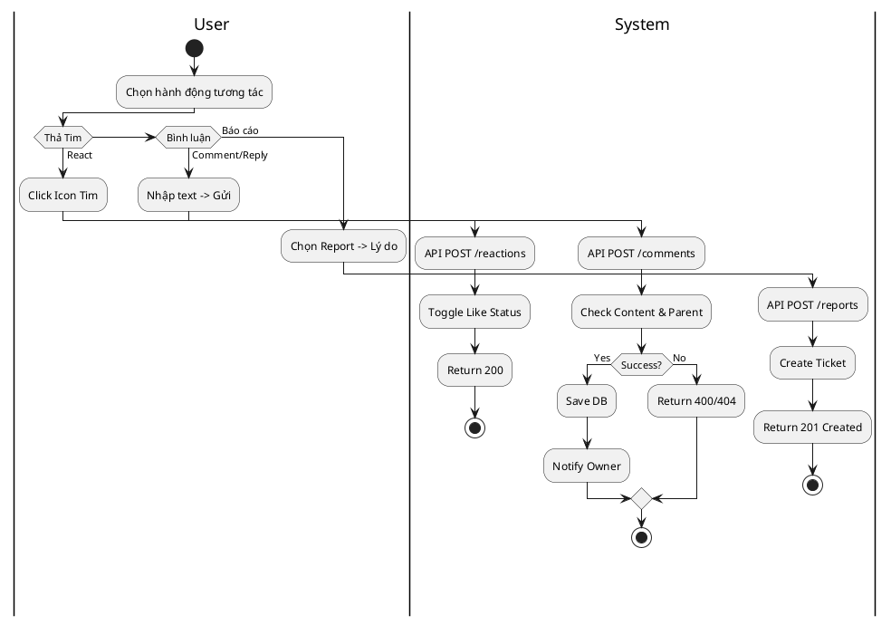
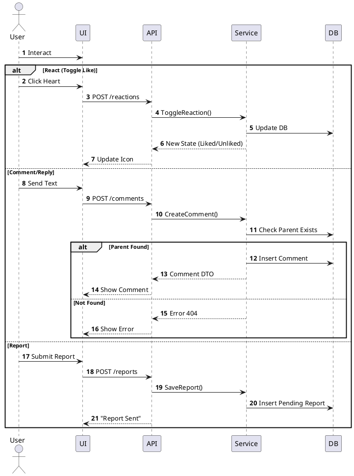

# 3.2.2.4. UC-US-04: Tương tác nội dung (Interact with Content)

## 1. Đặc tả Use Case

| Mục | Nội dung |
| :--- | :--- |
| **Mã UC** | UC-US-04 |
| **Tên UC** | Tương tác nội dung (Like, Comment, Report) |
| **Mô tả** | Người dùng thực hiện thả tim, bình luận và báo cáo nội dung vi phạm. |
| **Tác nhân sử dụng** | User |
| **Sự kiện kích hoạt** | Người dùng thao tác trên thanh công cụ của bài viết/bình luận. |
| **Luồng sự kiện chính** | **1. Thả tim (React)** 1. User click Tim. 2. Hệ thống gọi `POST /api/posts/{id}/reactions`. 3. Server toggle trạng thái và update bộ đếm (Count).  **2. Bình luận & Trả lời (Comment/Reply)** 1. User nhập nội dung -> Gửi. 2. Hệ thống gọi `POST /api/comments` (kèm `parentId` nếu là Reply). 3. `CommentService` lưu DB -> `NotificationService` tạo thông báo. 4. Trả về 200 OK -> UI chèn comment mới vào list.  **3. Báo cáo (Report)** 1. User chọn Report -> Chọn lý do. 2. Hệ thống gọi `POST /api/reports`. 3. Server tạo Ticket trạng thái 'Pending' cho Admin. |
| **Luồng sự kiện phụ** | **A1. Nội dung gốc bị xóa (Deleted Content)**: - Khi Reply/React một bài viết vừa bị xóa -> API trả về 404 Not Found. - UI báo "Nội dung không còn tồn tại".  **A2. Spam (Rate Limit)**: - User comment quá nhanh (>10 lần/phút) -> API trả về 429 Too Many Requests. - UI báo "Bạn thao tác quá nhanh". |
| **Yêu cầu trước khi thực hiện** | Đã đăng nhập. |
| **Yêu cầu sau khi thực hiện** | Số lượng Reaction/Comment tăng lên; Thông báo được gửi đi. |
| **Yêu cầu phi chức năng** | Reaction phải phản hồi tức thì về mặt UI (Optimistic UI). |

## 2. Biểu đồ

### 2.1. Activity Diagram (Tổng quát)

### 2.2. Sequence Diagram (Tổng quát)

