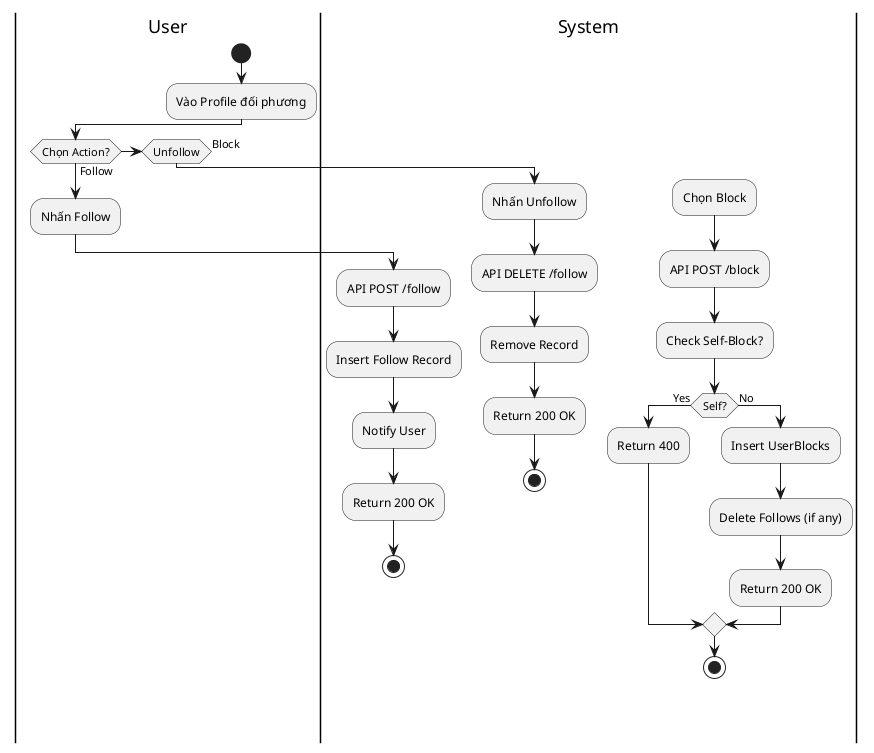
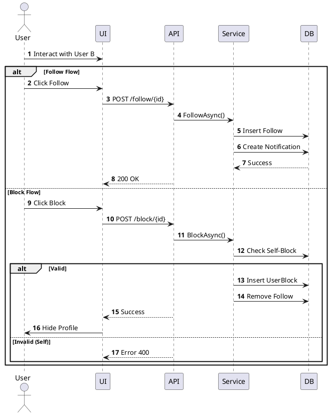

# 3.2.2.5. UC-US-05: Tương tác người dùng (Interact with People)

## 1. Đặc tả Use Case

| Mục | Nội dung |
| :--- | :--- |
| **Mã UC** | UC-US-05 |
| **Tên UC** | Tương tác người dùng (Connect & Block) |
| **Mô tả** | Người dùng theo dõi (Follow) để cập nhật hoạt động hoặc chặn (Block) để ngăn chặn tương tác. |
| **Tác nhân sử dụng** | User |
| **Sự kiện kích hoạt** | Trên trang Profile người khác hoặc từ menu ngữ cảnh. |
| **Luồng sự kiện chính** | **1. Theo dõi (Follow)** 1. User nhấn "Follow". 2. Hệ thống gọi `POST /api/profiles/follow/{id}`. 3. Server tạo quan hệ `Follows` -> User kia nhận thông báo. 4. Button chuyển thành "Following".  **2. Bỏ theo dõi (Unfollow)** 1. User nhấn "Unfollow". 2. Hệ thống gọi `DELETE /api/profiles/follow/{id}`. 3. Server xóa record trong `Follows`.  **3. Chặn (Block)** 1. User chọn "Block". 2. Hệ thống gọi `POST /api/profiles/block/{id}`. 3. Server thêm vào `UserBlocks` và xóa quan hệ Follows (nếu có). 4. Ẩn toàn bộ nội dung của người bị chặn. |
| **Luồng sự kiện phụ** | **A1. Chặn chính mình (Self Action)**: - API trả về 400 Bad Request. - UI báo lỗi "Không thể thực hiện với chính bạn".  **A2. Người dùng không tồn tại**: - API trả về 404 Not Found.  **A3. Đã Follow rồi**: - Gọi API Follow lặp lại -> Server trả về 200/409 tùy logic (Idempotent) nhưng không tạo record trùng. |
| **Yêu cầu trước khi thực hiện** | Đã đăng nhập. |
| **Yêu cầu sau khi thực hiện** | Mối quan hệ được cập nhật trong DB. |
| **Yêu cầu phi chức năng** | Không có. |

## 2. Biểu đồ

### 2.1. Activity Diagram (Tổng quát)

### 2.2. Sequence Diagram (Tổng quát)

