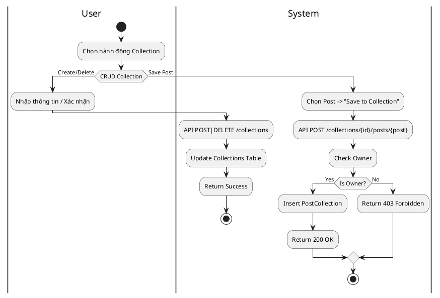
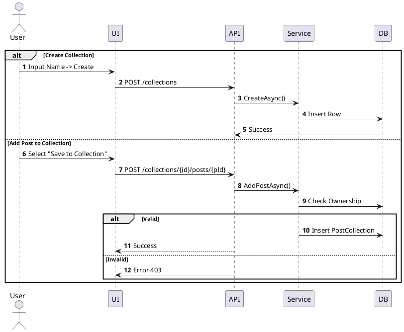

# 3.2.2.6. UC-US-06: Quản lý Bộ sưu tập (Manage Collection)

## 1. Đặc tả Use Case

| Mục | Nội dung |
| :--- | :--- |
| **Mã UC** | UC-US-06 |
| **Tên UC** | Quản lý Bộ sưu tập (Manage Collection) |
| **Mô tả** | Người dùng tạo, sửa, xóa bộ sưu tập (Album) và thêm/bớt bài viết vào bộ sưu tập. |
| **Tác nhân sử dụng** | User |
| **Sự kiện kích hoạt** | Người dùng vào tab "Collection" hoặc chọn "Save" trên bài viết. |
| **Luồng sự kiện chính** | **1. Tạo Bộ sưu tập** 1. User nhấn "New Collection". 2. Nhập tên và chọn chế độ Private/Public. 3. Hệ thống gọi `POST /api/collections` -> Insert DB.  **2. Thêm bài viết vào Collection** 1. User chọn "Save" trên bài viết. 2. Chọn Collection đích. 3. Hệ thống gọi `POST /api/collections/{id}/posts/{postId}`. 4. Server tạo liên kết `PostCollections`.  **3. Xóa bộ sưu tập** 1. User chọn Delete Collection. 2. Hệ thống gọi `DELETE /api/collections/{id}`. 3. Xóa Collection và các liên kết (không xóa bài viết gốc). |
| **Luồng sự kiện phụ** | **A1. Không phải chủ sở hữu (Delete/Edit)**: - API trả về 403 Forbidden.  **A2. Collection riêng tư (Access)**: - Người khác truy cập Collection Private -> API trả về 403 Forbidden.  **A3. Bài viết đã tồn tại trong Collection**: - API trả về thành công hoặc thông báo "Đã lưu trước đó". |
| **Yêu cầu trước khi thực hiện** | Đã đăng nhập. |
| **Yêu cầu sau khi thực hiện** | Cấu trúc Collection thay đổi. |

## 2. Biểu đồ

### 2.1. Activity Diagram (Tổng quát)

### 2.2. Sequence Diagram (Tổng quát)

