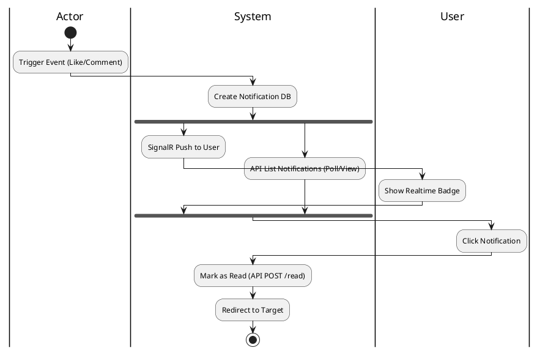
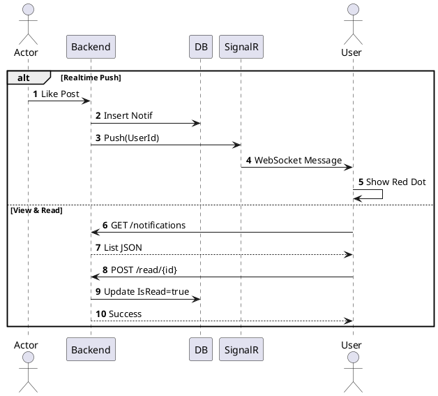

# 3.2.2.7. UC-US-07: Giám sát thông báo (Monitor Notification)

## 1. Đặc tả Use Case

| Mục | Nội dung |
| :--- | :--- |
| **Mã UC** | UC-US-07 |
| **Tên UC** | Giám sát thông báo (Monitor Notification) |
| **Mô tả** | User nhận thông báo realtime về các tương tác và xem lại lịch sử thông báo. |
| **Tác nhân sử dụng** | User |
| **Sự kiện kích hoạt** | Có tương tác liên quan (Like/Comment/Follow) hoặc User click chuông. |
| **Luồng sự kiện chính** | **1. Nhận thông báo (Realtime)** 1. Hệ thống (SignalR Hub) nhận sự kiện. 2. Push message tới Client qua WebSocket. 3. Client hiển thị Toast/Badge.  **2. Xem danh sách thông báo** 1. User click Chuông. 2. Hệ thống gọi `GET /api/notifications`. 3. Trả về danh sách.  **3. Đọc thông báo** 1. User click vào thông báo. 2. Hệ thống gọi `POST /api/notifications/{id}/read`. 3. Cập nhật `IsRead = true`. 4. Chuyển hướng user tới trang đích. |
| **Luồng sự kiện phụ** | **A1. Mất kết nối SignalR**: - Client không nhận được Notify realtime -> Phải refresh trang để thấy (qua API GET).  **A2. Thông báo không tồn tại**: - Click vào thông báo cũ đã bị xóa -> API trả về 404. |
| **Yêu cầu phi chức năng** | Thông báo realtime < 1s. |

## 2. Biểu đồ

### 2.1. Activity Diagram (Tổng quát)

### 2.2. Sequence Diagram (Tổng quát)

