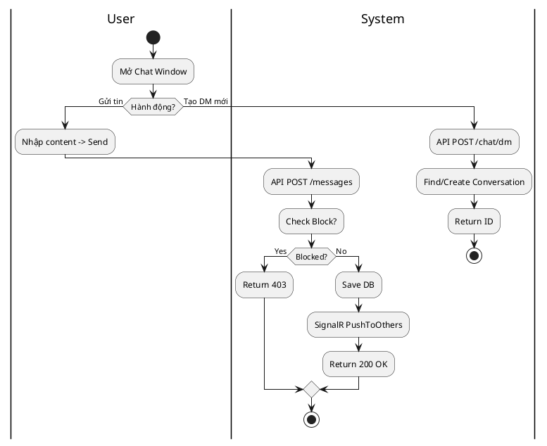
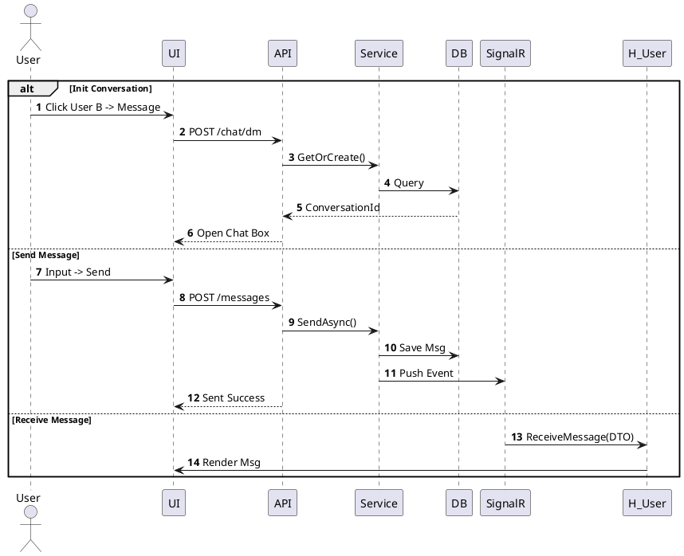

# 3.2.2.8. UC-US-08: Trò chuyện (Chat System)

## 1. Đặc tả Use Case

| Mục | Nội dung |
| :--- | :--- |
| **Mã UC** | UC-US-08 |
| **Tên UC** | Trò chuyện (Chat System) |
| **Mô tả** | Người dùng gửi và nhận tin nhắn riêng (DM) hoặc nhóm (Group) theo thời gian thực. |
| **Tác nhân sử dụng** | User |
| **Sự kiện kích hoạt** | User nhấn "Message" trên Profile hoặc vào trang Chat. |
| **Luồng sự kiện chính** | **1. Khởi tạo hội thoại (DM)** 1. User chọn gửi tin nhắn cho User B. 2. Hệ thống gọi `POST /api/chat/dm` (`otherProfileId`). 3. Nếu chưa có, tạo mới `Conversation`. Trả về ID.  **2. Gửi tin nhắn (Send)** 1. User nhập nội dung -> Gửi. 2. Hệ thống gọi `POST /api/chat/{id}/messages`. 3. Server lưu DB và push SignalR `ReceiveMessage` tới thành viên khác.  **3. Nhận tin nhắn & Đọc** 1. User nhận tin qua SignalR. 2. Khi xem tin, API gọi `POST /api/chat/{id}/read`. 3. Reset Unread Count. |
| **Luồng sự kiện phụ** | **A1. Bị chặn (Blocked)**: - Gửi tin cho người đã chặn mình -> API trả về 403 Forbidden. - UI báo "Không thể gửi tin nhắn".  **A2. File quá lớn**: - Upload ảnh/video > 20MB -> Trả về 400 Bad Request. |
| **Yêu cầu trước khi thực hiện** | Đã đăng nhập. |
| **Yêu cầu sau khi thực hiện** | Tin nhắn được lưu trữ vĩnh viễn (trừ khi xóa). |

## 2. Biểu đồ

### 2.1. Activity Diagram (Tổng quát)

### 2.2. Sequence Diagram (Tổng quát)

