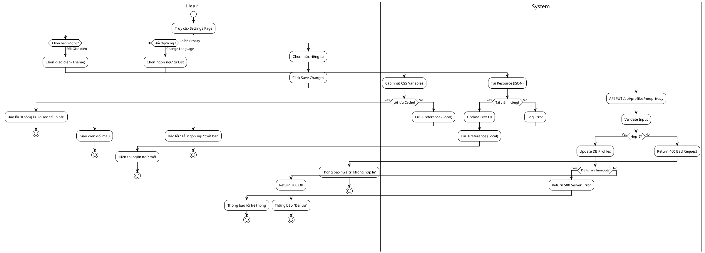
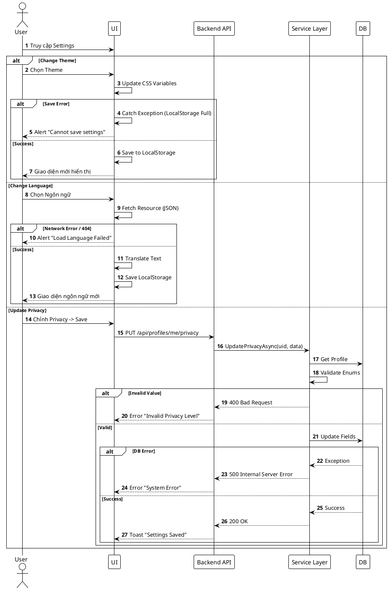

# 3.2.2.9. UC-US-09: Cài đặt tài khoản (User Account Settings)

## 1. Đặc tả Use Case

| Mục | Nội dung |
| :--- | :--- |
| **Mã UC** | UC-US-09 |
| **Tên UC** | Cài đặt tài khoản (User Account Settings) |
| **Mô tả** | Người dùng thực hiện thay đổi giao diện (Theme), ngôn ngữ hiển thị và cài đặt các quyền riêng tư (Privacy) cho tài khoản cá nhân. |
| **Tác nhân sử dụng** | User |
| **Sự kiện kích hoạt** | Người dùng chọn menu "Settings" hoặc biểu tượng bánh răng từ trang cá nhân. |
| **Luồng sự kiện chính** | **1. Đổi Giao diện (Change Theme)** 1. User truy cập tab "Appearance". 2. User chọn theme mong muốn từ danh sách. 3. Hệ thống Client apply ngay bộ màu sắc mới (CSS Variables). 4. Hệ thống lưu cấu hình vào LocalStorage.  **2. Đổi Ngôn ngữ (Change Language)** 1. User truy cập tab "Language". 2. User chọn ngôn ngữ: Tiếng Việt hoặc English. 3. Hệ thống Client tải bộ resource ngôn ngữ tương ứng. 4. Giao diện làm mới (reload text) để hiển thị ngôn ngữ đã chọn. 5. Lưu cấu hình vào LocalStorage.  **3. Cài đặt Quyền riêng tư (Privacy Settings)** 1. User chọn tab "Privacy". 2. Chỉnh sửa quyền:    - **Profile Visibility**: Public/Friend/Private.    - **Message**: Ai có thể nhắn tin (Everyone/Follower/Nobody).    - **Interaction**: Ai xem được danh sách Follower/Following. 3. Nhấn "Save Changes". 4. Hệ thống gọi `PUT /api/profiles/me/privacy` để cập nhật Database. 5. Trả về 200 OK -> Thông báo "Privacy updated". |
| **Luồng sự kiện phụ** | **A1. Lỗi Validation Privacy (400)**: - Nếu giá trị Privacy không hợp lệ (ngoài enum cho phép). - API trả về lỗi `INVALID_VALUE`. - Hệ thống báo "Giá trị cài đặt không hợp lệ".  **A2. Lỗi Hệ thống (500)**: - Không lưu được vào Database. - API trả về 500. - Hệ thống báo "Vui lòng thử lại sau". |
| **Yêu cầu trước khi thực hiện** | Tài khoản đang ở trạng thái đăng nhập. |
| **Yêu cầu sau khi thực hiện** | Các cấu hình mới được áp dụng và lưu lại cho lần đăng nhập sau. |
| **Yêu cầu phi chức năng** | Thay đổi Theme/Language phải phản hồi tức thì (< 100ms). |

## 2. Biểu đồ

### 2.1. Activity Diagram (Tổng quát)

### 2.2. Sequence Diagram (Tổng quát)

