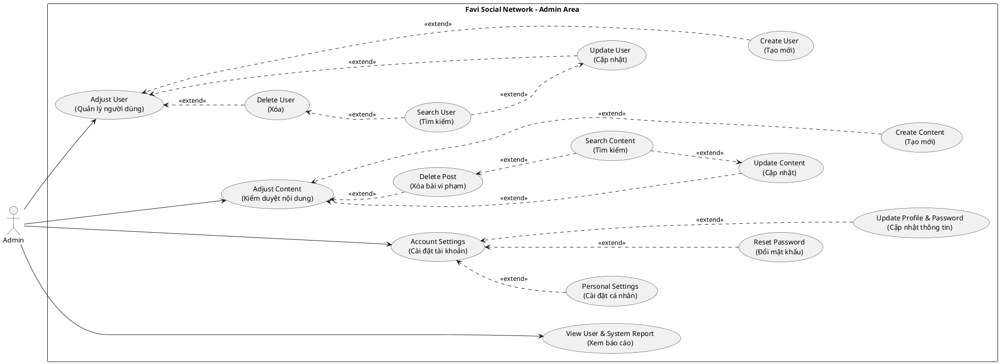

# 3.2.2. Sơ đồ Use Case Admin

Dưới đây là sơ đồ chi tiết các chức năng dành cho Quản trị viên (Admin), tuân thủ định dạng "Mở rộng" (Extend) từ các chức năng tìm kiếm và cập nhật.

```plantuml
@startuml
left to right direction
skinparam packageStyle rectangle

actor "Admin" as admin

rectangle "Favi Social Network - Admin Area" {
    
    ' === USER MANAGEMENT ===
    usecase "Adjust User\n(Quản lý người dùng)" as UC_AdjustUser
    
    ' Các use case extend xếp theo chiều dọc bên phải
    usecase "Delete User\n(Xóa)" as UC_DeleteUser
    usecase "Update User\n(Cập nhật)" as UC_UpdateUser  
    usecase "Create User\n(Tạo mới)" as UC_CreateUser
    usecase "Search User\n(Tìm kiếm)" as UC_SearchUser

    admin --> UC_AdjustUser
    
    ' Mối quan hệ extend
    UC_DeleteUser ..> UC_AdjustUser : <<extend>>
    UC_UpdateUser ..> UC_AdjustUser : <<extend>>
    UC_CreateUser ..> UC_AdjustUser : <<extend>>
    
    ' Search extend tới Delete và Update
    UC_SearchUser ..> UC_DeleteUser : <<extend>>
    UC_SearchUser ..> UC_UpdateUser : <<extend>>

    ' Sắp xếp theo chiều dọc
    UC_DeleteUser -[hidden]down- UC_UpdateUser
    UC_UpdateUser -[hidden]down- UC_CreateUser
    UC_SearchUser -[hidden]up- UC_DeleteUser


    ' === CONTENT MANAGEMENT ===
    usecase "Adjust Content\n(Kiểm duyệt nội dung)" as UC_AdjustContent
    
    usecase "Delete Post\n(Xóa bài vi phạm)" as UC_DeletePost
    usecase "Update Content\n(Cập nhật)" as UC_UpdateContent
    usecase "Create Content\n(Tạo mới)" as UC_CreateContent
    usecase "Search Content\n(Tìm kiếm)" as UC_SearchContent

    admin --> UC_AdjustContent
    
    UC_DeletePost ..> UC_AdjustContent : <<extend>>
    UC_UpdateContent ..> UC_AdjustContent : <<extend>>
    UC_CreateContent ..> UC_AdjustContent : <<extend>>
    
    UC_SearchContent ..> UC_DeletePost : <<extend>>
    UC_SearchContent ..> UC_UpdateContent : <<extend>>

    UC_DeletePost -[hidden]down- UC_UpdateContent
    UC_UpdateContent -[hidden]down- UC_CreateContent
    UC_SearchContent -[hidden]up- UC_DeletePost


    ' === ACCOUNT SETTINGS ===
    usecase "Account Settings\n(Cài đặt tài khoản)" as UC_AccountSettings
    
    usecase "Personal Settings\n(Cài đặt cá nhân)" as UC_PersonalSettings
    usecase "Reset Password\n(Đổi mật khẩu)" as UC_ResetPw
    usecase "Update Profile & Password\n(Cập nhật thông tin)" as UC_UpdateProfile
    
    admin --> UC_AccountSettings
    
    UC_PersonalSettings ..> UC_AccountSettings : <<extend>>
    UC_ResetPw ..> UC_AccountSettings : <<extend>>
    UC_UpdateProfile ..> UC_AccountSettings : <<extend>>

    UC_PersonalSettings -[hidden]down- UC_ResetPw
    UC_ResetPw -[hidden]down- UC_UpdateProfile


    ' === VIEW REPORTS ===
    usecase "View User & System Report\n(Xem báo cáo)" as UC_ViewReport
    
    admin --> UC_ViewReport


    ' Căn các use case chính theo chiều dọc
    UC_AdjustUser -[hidden]down- UC_AdjustContent
    UC_AdjustContent -[hidden]down- UC_AccountSettings
    UC_AccountSettings -[hidden]down- UC_ViewReport
    
    ' Đẩy các use case extend sang phải
    UC_AdjustUser -[hidden]right- UC_DeleteUser
    UC_AdjustContent -[hidden]right- UC_DeletePost
    UC_AccountSettings -[hidden]right- UC_PersonalSettings

}
@enduml
```
