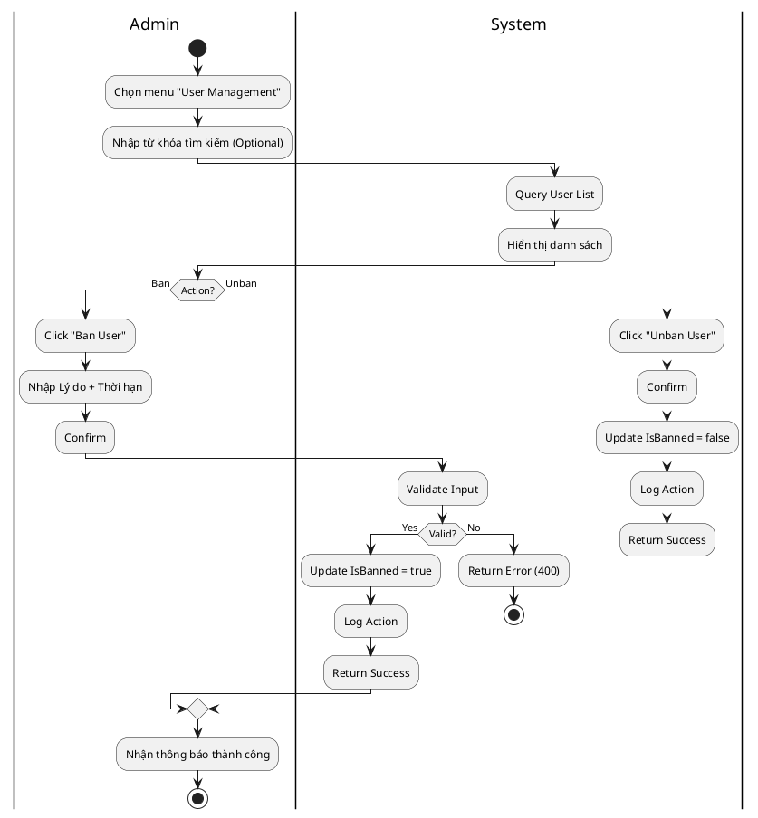
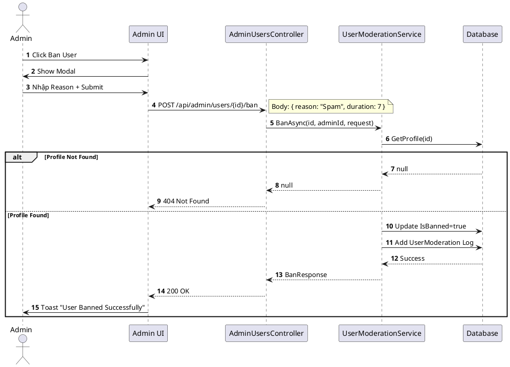
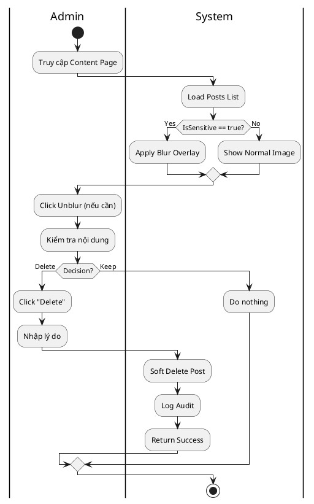
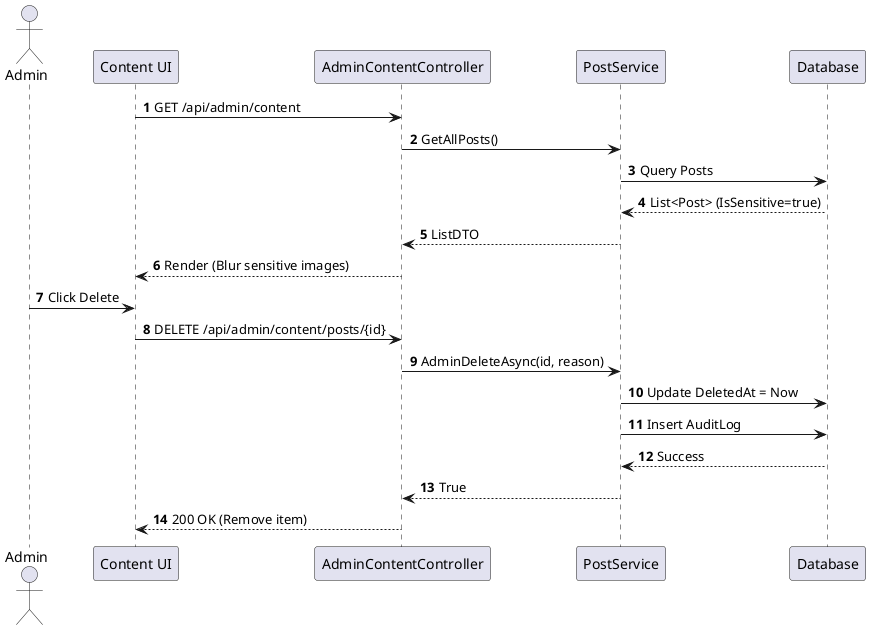
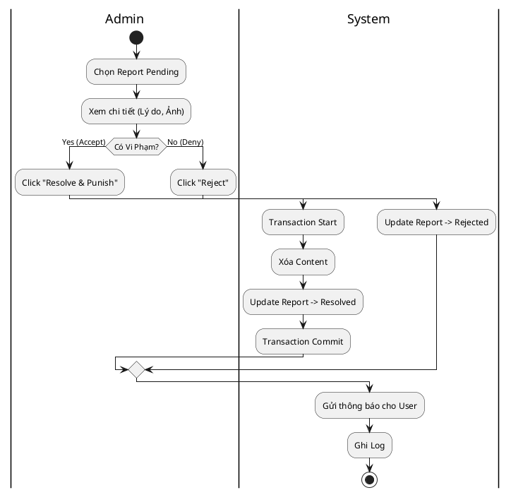
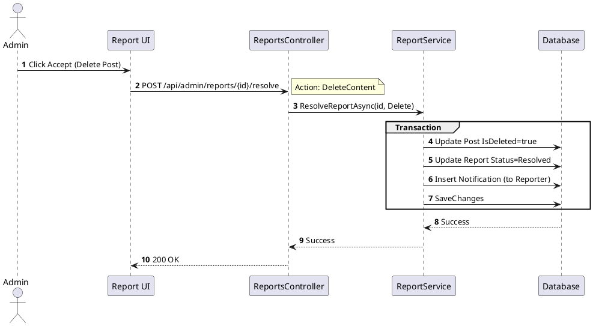
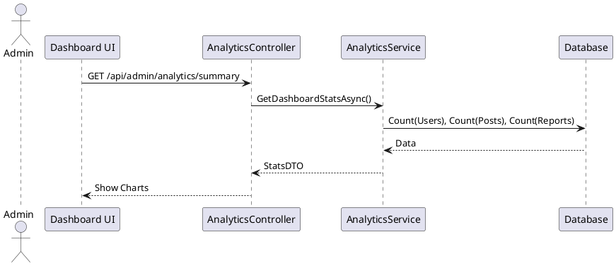
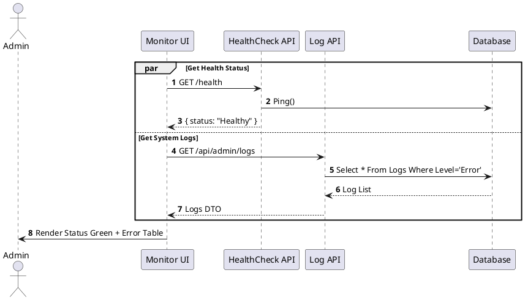

# 3.2.2. Đặc tả Use Case Admin

Chi tiết các chức năng dành cho Quản trị viên (Admin). Tài liệu này mô tả trạng thái lý tưởng của hệ thống (Target State), bao gồm các tính năng cần bổ sung như đã phân tích trong Gap Analysis.

## 3.2.2.1. UC-AD-01: Quản lý người dùng (Adjust User)

| Mã UC | UC-AD-01 |
| :--- | :--- |
| **Tên UC** | Quản lý người dùng (Adjust User) |
| **Mô tả** | Admin xem danh sách, tìm kiếm và thục hiện khóa (Ban) hoặc mở khóa (Unban) tài khoản người dùng vi phạm quy tắc cộng đồng. |
| **Tác nhân sử dụng** | Admin |
| **Sự kiện kích hoạt** | Admin chọn menu "User Management" từ Sidebar. |
| **Luồng sự kiện chính** | 1. Admin truy cập trang Quản lý người dùng. 2. Hệ thống gọi API `GET /api/admin/users`: Truy vấn danh sách Profile từ DB -> Trả về danh sách (UserDTO). 3. Admin nhập từ khóa vào ô tìm kiếm (Tên/Email) -> Nhấn Enter. 4. Hệ thống lọc và hiển thị kết quả. 5. **Ban User**: Admin chọn một User đang hoạt động -> Nhấn nút "Ban". 6. Hệ thống hiển thị Modal yêu cầu nhập Lý do & Thời hạn. 7. Admin nhập thông tin -> Xác nhận. 8. Hệ thống gọi API `POST /api/admin/users/{id}/ban` -> `UserModerationService` cập nhật `IsBanned = true` và ghi AuditLog. 9. Hệ thống trả về `200 OK` -> Giao diện cập nhật trạng thái User thành "Banned". |
| **Luồng sự kiện phụ** | **A1. User không tồn tại**: API trả về 404 -> Hệ thống báo lỗi "User not found". **A2. Lỗi kết nối DB**: Service gọi DB bị timeout -> Hệ thống ghi log lỗi "DB Connection Timeout" và báo "System Error" (500). **A3. Admin không có quyền**: Policy từ chối -> Hệ thống báo lỗi 403. |
| **Yêu cầu trước khi thực hiện** | Admin đã đăng nhập; Token còn hiệu lực. |
| **Yêu cầu sau khi thực hiện** | Trạng thái User thay đổi; Log được ghi vào bảng `UserModerations` và `AuditLogs`. |
| **Yêu cầu phi chức năng** | Phản hồi danh sách < 1s. |

##### **Sơ đồ hoạt động**

##### **Sơ đồ tuần tự**

## 3.2.2.2. UC-AD-02: Quản lý nội dung & AI Blur (Manage Content)

| Mã UC | UC-AD-02 |
| :--- | :--- |
| **Tên UC** | Quản lý nội dung & AI Blur |
| **Mô tả** | Hệ thống tự động làm mờ ảnh nhạy cảm (AI Blur). Admin xem xét và xóa nội dung vi phạm. |
| **Tác nhân sử dụng** | Admin |
| **Sự kiện kích hoạt** | Admin chọn menu "Content Management". |
| **Luồng sự kiện chính** | 1. Admin truy cập trang Quản lý nội dung. 2. Hệ thống tải danh sách bài viết (`GET /api/admin/content`). 3. **AI Check**: Với mỗi ảnh, FE kiểm tra cờ `IsSensitive` (hoặc URL blur). Nếu có, hiển thị lớp phủ mờ. 4. Admin click vào ảnh -> Lớp mờ biến mất (Unblur) để xem nội dung gốc. 5. **Xóa bài**: Admin xác định vi phạm -> Nhấn "Delete Post". 6. Hệ thống gọi `DELETE /api/admin/content/posts/{id}` -> `PostService` thực hiện Soft Delete. 7. Admin nhập lý do xóa. 8. Hệ thống lưu Soft Delete và ghi Audit Log. |
| **Luồng sự kiện phụ** | **A1. Bài viết không tồn tại**: Trả về 404 -> Báo lỗi "Post not found". **A2. Lỗi AI Service**: Nếu AI Service không phản hồi -> Ghi log "AI Service Timeout" -> Hiển thị ảnh gốc kèm cảnh báo. **A3. Lỗi Database**: Ghi log "DB Error" -> Trả về 500. |
| **Yêu cầu trước khi thực hiện** | Admin đăng nhập. |
| **Yêu cầu sau khi thực hiện** | Bài viết chuyển trạng thái `Deleted`; AuditLog ghi nhận hành động xóa. |
| **Yêu cầu phi chức năng** | Thao tác unblur mượt mà; API xóa phản hồi < 500ms. |

##### **Sơ đồ hoạt động**

##### **Sơ đồ tuần tự**

## 3.2.2.3. UC-AD-03: Quản lý báo cáo (Managing User Reports)

| Mã UC | UC-AD-03 |
| :--- | :--- |
| **Tên UC** | Quản lý báo cáo (Accept/Deny) |
| **Mô tả** | Xử lý báo cáo vi phạm từ người dùng. Chấp nhận (Accept) để xử phạt hoặc Từ chối (Rejet) báo cáo. |
| **Tác nhân sử dụng** | Admin |
| **Sự kiện kích hoạt** | Admin chọn menu "User Reports". |
| **Luồng sự kiện chính** | 1. Admin xem danh sách Report Pending (`GET /api/reports`). 2. **Accept (Xử phạt)**: Admin xác nhận vi phạm -> Nhấn "Resolve & Delete Post". 3. Hệ thống thực hiện transaction: (a) Xóa bài viết, (b) Đổi trạng thái Report `Resolved`, (c) Gửi thông báo cho người báo cáo. 4. **Deny (Bác bỏ)**: Admin thấy không vi phạm -> Nhấn "Reject". 5. Hệ thống Update Report `Rejected`, gửi thông báo kết quả. |
| **Luồng sự kiện phụ** | **A1. Report không tồn tại**: Báo lỗi 404. **A2. Lỗi Transaction**: Nếu xóa bài thành công nhưng update report thất bại -> Rollback toàn bộ -> Ghi log lỗi "Resolve Report Transaction Failed". **A3. Content đã xóa**: Tự động chuyển Report sang `Resolved`. |
| **Yêu cầu trước khi thực hiện** | Có báo cáo trạng thái Pending. |
| **Yêu cầu sau khi thực hiện** | Report không còn Pending; Notification được gửi đi. |
| **Yêu cầu phi chức năng** | Đảm bảo tính nhất quán dữ liệu (Transaction). |

##### **Sơ đồ hoạt động**

##### **Sơ đồ tuần tự**

## 3.2.2.4. UC-AD-04: Thống kê (Dashboard Statistics)

| Mã UC | UC-AD-04 |
| :--- | :--- |
| **Tên UC** | Xem thống kê Dashboard |
| **Mô tả** | Xem tổng quan số liệu tăng trưởng của hệ thống (Users, Posts). |
| **Tác nhân sử dụng** | Admin |
| **Sự kiện kích hoạt** | Admin đăng nhập thành công vào trang chủ Admin. |
| **Luồng sự kiện chính** | 1. Admin vào Dashboard. 2. Hệ thống gọi API `GetDashboardStats`. 3. Server thực hiện các lệnh `Count` trên DB (hoặc Cache). 4. Trả về: Tổng User, User mới, Tổng Post, Report Pending. 5. UI hiển thị biểu đồ và các thẻ số liệu. |
| **Luồng sự kiện phụ** | **A1. Lỗi timeout**: Nếu query quá lâu -> Ghi log "Stats Query Timeout" -> Trả về dữ liệu Cache cũ hoặc 0. **A2. Lỗi Cache**: Redis sập -> Fallback về Query DB trực tiếp. |
| **Yêu cầu trước khi thực hiện** | Login thành công. |
| **Yêu cầu sau khi thực hiện** | Không đổi dữ liệu. |
| **Yêu cầu phi chức năng** | Tải Dashboard < 2s. |

##### **Sơ đồ tuần tự**

## 3.2.2.5. UC-AD-05: Monitor System Logs & Health

| Mã UC | UC-AD-05 |
| :--- | :--- |
| **Tên UC** | Giám sát Log & Sức khỏe hệ thống |
| **Mô tả** | Xem trạng thái Server (Health Check) và Log lỗi hệ thống. |
| **Tác nhân sử dụng** | Admin |
| **Sự kiện kích hoạt** | Admin chọn menu "System Monitor". |
| **Luồng sự kiện chính** | 1. Admin vào "System Monitor". 2. **Health Check**: UI gọi `/health`. Server check DB, Redis. Trả về "Healthy". 3. **System Logs**: UI gọi `/api/admin/logs`. Server truy vấn bảng `SystemLogs`. 4. Admin xem chi tiết lỗi (StackTrace) để xử lý. |
| **Luồng sự kiện phụ** | **A1. Server Down**: API `/health` không phản hồi -> UI hiển thị "Server Offline". **A2. DB Down**: Check `/health` báo "Unhealthy" (DB Connect Fail) -> Admin nhận diện được nguyên nhân. **A3. Lỗi query log**: Ghi log nội bộ (Console) -> Trả về danh sách rỗng. |
| **Yêu cầu trước khi thực hiện** | Admin có quyền `System.View`. |
| **Yêu cầu sau khi thực hiện** | Log truy cập màn hình Monitor được ghi nhận. |
| **Yêu cầu phi chức năng** | Giao diện trực quan (Xanh/Đỏ). |

##### **Sơ đồ tuần tự**

