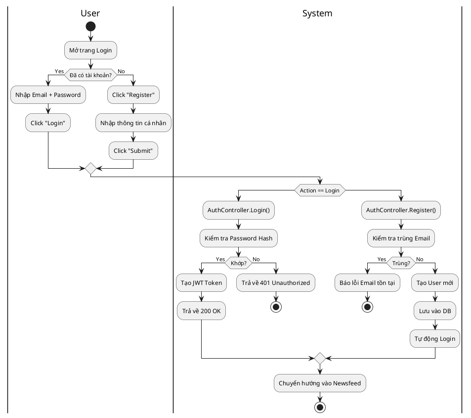
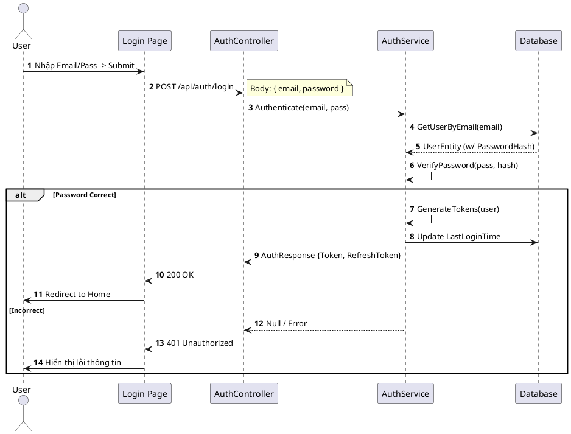
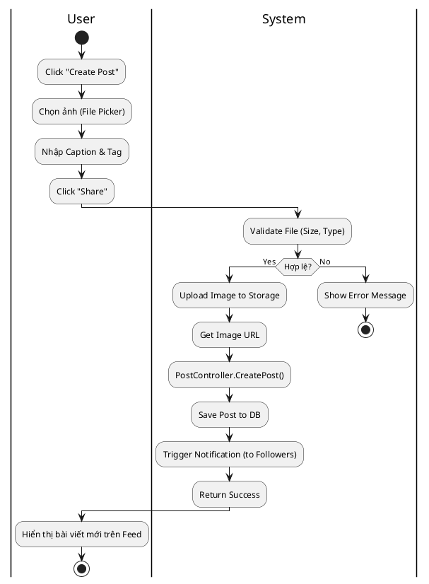
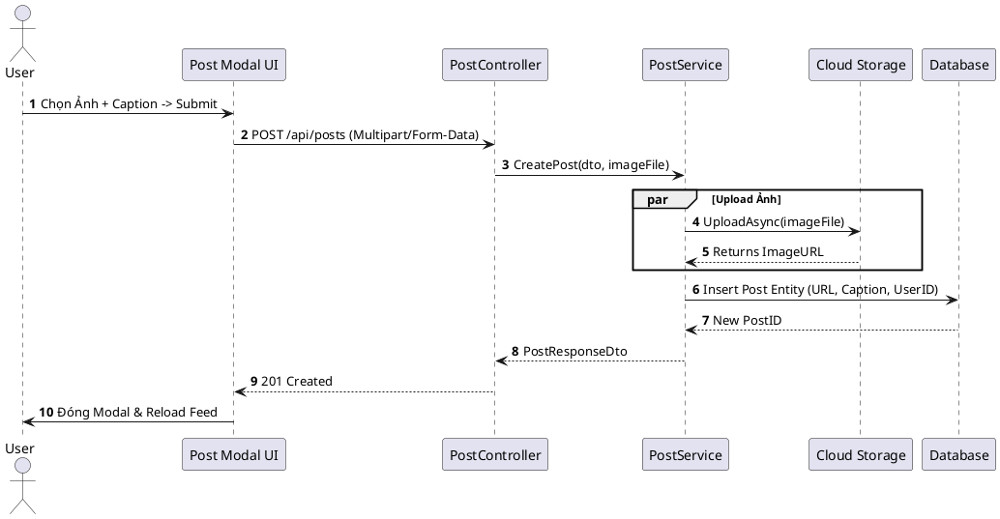
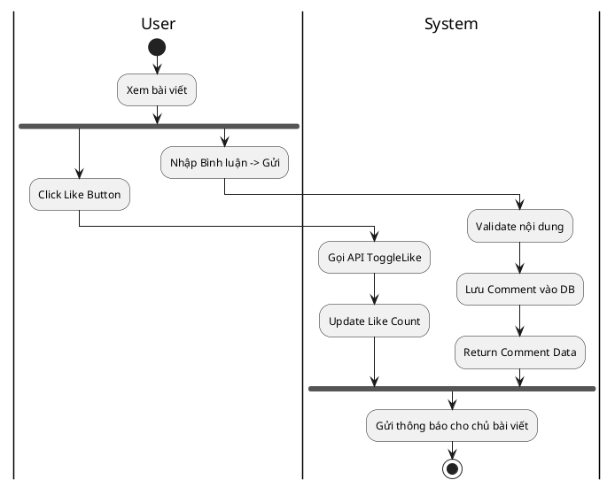
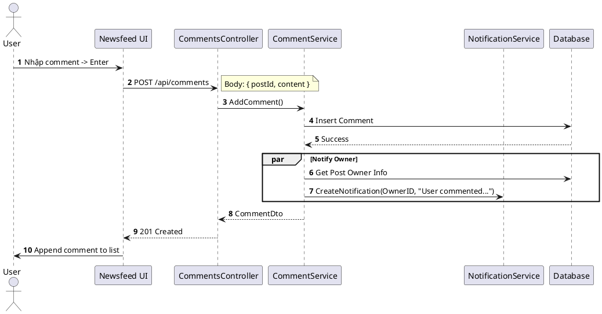

# 3.2.2. Đặc tả Use Case User

Chi tiết các chức năng dành cho Người dùng thường (User), tuân thủ định dạng đặc tả chi tiết và sử dụng sơ đồ PlantUML.

## 3.2.2.1. UC-US-01: Đăng nhập & Đăng ký (Authentication)

| Mã UC | UC-US-01 |
| :--- | :--- |
| **Tên UC** | Đăng nhập & Đăng ký |
| **Mô tả** | Người dùng đăng ký tài khoản mới vào hệ thống hoặc đăng nhập để được cấp quyền truy cập các chức năng dành cho thành viên. |
| **Tác nhân sử dụng** | Guest (Khách), User |
| **Sự kiện kích hoạt** | Người dùng mở ứng dụng Favi lần đầu hoặc chọn "Logout" trước đó. |
| **Luồng sự kiện chính** | **A. Luồng Đăng nhập (Sign In)** 1. Người dùng nhập Username/Email và Password. 2. Nhấn nút "Login". 3. Hệ thống mã hóa mật khẩu và so khớp với CSDL. 4. Nếu hợp lệ, hệ thống tạo JWT Token và Refresh Token. 5. Chuyển hướng người dùng vào trang Newsfeed.  **B. Luồng Đăng ký (Sign Up)** 1. Người dùng chọn "Create Account". 2. Nhập Email, Tên hiển thị, Mật khẩu. 3. Nhấn "Register". 4. Hệ thống kiểm tra sự tồn tại của Email. 5. Tạo tài khoản mới với trạng thái Active. 6. Tự động đăng nhập và chuyển hướng. |
| **Luồng sự kiện phụ** | **A1. Sai mật khẩu quá 5 lần**: Hệ thống khóa tạm thời IP (Rate Limit) trong 15 phút. **A2. Email đã tồn tại**: Báo lỗi "Email is already taken" khi đăng ký. **A3. Lỗi xác thực Token**: Khi Token hết hạn, User được chuyển về trang Login. |
| **Yêu cầu trước khi thực hiện** | Người dùng có kết nối Internet. |
| **Yêu cầu sau khi thực hiện** | Access Token được lưu ở LocalStorage/Cookie; User Profile được lưu vào Global State. |
| **Yêu cầu phi chức năng** | Bảo mật mật khẩu (Hash Bcrypt); Token chuẩn JWT HS256/RS256. |

##### **Sơ đồ hoạt động**

##### **Sơ đồ tuần tự (Login)**

## 3.2.2.2. UC-US-02: Quản lý bài viết (Manage Post)

| Mã UC | UC-US-02 |
| :--- | :--- |
| **Tên UC** | Quản lý bài viết (Manage Post) |
| **Mô tả** | Người dùng có thể đăng tải hình ảnh, viết caption, gắn thẻ (tag) và quản lý (sửa/xóa) các bài viết mình đã tạo. |
| **Tác nhân sử dụng** | User |
| **Sự kiện kích hoạt** | Người dùng nhấn nút "+" hoặc "Create Post" trên thanh điều hướng. |
| **Luồng sự kiện chính** | **Tạo bài viết mới** 1. Người dùng chọn ảnh từ thiết bị. 2. Nhập nội dung mô tả (Caption). 3. (Tùy chọn) Chọn bộ lọc màu hoặc gắn thẻ bạn bè. 4. Nhấn "Post". 5. Hệ thống upload ảnh lên Cloud Storage (ví dụ: Azure Blob/AWS S3). 6. Hệ thống lưu metadata bài viết vào CSDL. 7. Bài viết xuất hiện trên Profile và Newsfeed. |
| **Luồng sự kiện phụ** | **A1. Ảnh quá khổ**: File > 10MB -> Báo lỗi và từ chối upload. **A2. Định dạng không hỗ trợ**: Upload file .exe/.txt -> Báo lỗi chỉ chấp nhận .jpg/.png. **A3. Nội dung vi phạm**: Chứa từ khóa cấm -> Hệ thống tự động flag hoặc từ chối đăng. |
| **Yêu cầu trước khi thực hiện** | Người dùng đã đăng nhập. |
| **Yêu cầu sau khi thực hiện** | Bài viết được lưu vĩnh viễn (trừ khi xóa); Số lượng bài post của user tăng +1. |
| **Yêu cầu phi chức năng** | Upload ảnh < 3s (mạng ổn định); Ảnh được nén tự động để tối ưu hiển thị. |

##### **Sơ đồ hoạt động**

##### **Sơ đồ tuần tự (Create Post)**

## 3.2.2.3. UC-US-03: Tương tác (Interact with Content)

| Mã UC | UC-US-03 |
| :--- | :--- |
| **Tên UC** | Tương tác nội dung (Like/Comment) |
| **Mô tả** | Người dùng thể hiện cảm xúc (Like/Love...) hoặc thảo luận (Comment) trên bài viết của người khác. |
| **Tác nhân sử dụng** | User |
| **Sự kiện kích hoạt** | Người dùng xem một bài viết trên Newsfeed. |
| **Luồng sự kiện chính** | 1. Người dùng xem bài viết. 2. **Thả tim**: Nhấn nút "Heart" -> Icon chuyển sang màu đỏ -> Số like tăng lên 1. 3. **Bình luận**: Nhấn icon "Comment" -> Nhập nội dung -> Nhấn Enter/Gửi -> Bình luận xuất hiện ngay lập tức bên dưới bài viết. |
| **Luồng sự kiện phụ** | **A1. Bỏ like (Unlike)**: Nhấn lại vào nút Heart -> Số like giảm đi 1. **A2. Spam comment**: Gửi quá nhiều trong thời gian ngắn -> Rate limit chặn lại. |
| **Yêu cầu sau khi thực hiện** | Chủ bài viết nhận được thông báo (Notification). |

##### **Sơ đồ hoạt động**

##### **Sơ đồ tuần tự (Comment)**

