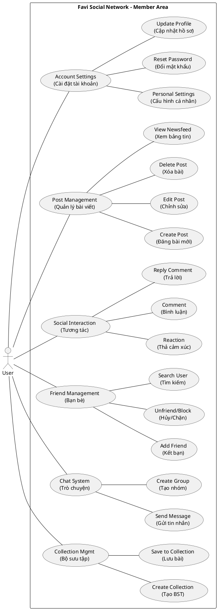

# 3.2.3. Sơ đồ Use Case User (Member)

Dưới đây là sơ đồ chi tiết các chức năng dành cho Người dùng (User), tuân thủ định dạng "Cấu trúc cây" (Tree Structure) như mẫu tham khảo.

```plantuml
@startuml
left to right direction
skinparam packageStyle rectangle

actor "User" as user

rectangle "Favi Social Network - Member Area" {
    
    ' --- Account Settings Tree ---
    usecase "Account Settings\n(Cài đặt tài khoản)" as UC_Acc
    usecase "Personal Settings\n(Cấu hình cá nhân)" as UC_Personal
    usecase "Reset Password\n(Đổi mật khẩu)" as UC_ResetPw
    usecase "Update Profile\n(Cập nhật hồ sơ)" as UC_UpdateProfile
    
    user -- UC_Acc
    UC_Acc -- UC_Personal
    UC_Acc -- UC_ResetPw
    UC_Acc -- UC_UpdateProfile

    ' --- Post Management Tree ---
    usecase "Post Management\n(Quản lý bài viết)" as UC_PostMgmt
    usecase "Create Post\n(Đăng bài mới)" as UC_CreatePost
    usecase "Edit Post\n(Chỉnh sửa)" as UC_EditPost
    usecase "Delete Post\n(Xóa bài)" as UC_DeletePost
    usecase "View Newsfeed\n(Xem bảng tin)" as UC_ViewFeed
    
    user -- UC_PostMgmt
    UC_PostMgmt -- UC_CreatePost
    UC_PostMgmt -- UC_EditPost
    UC_PostMgmt -- UC_DeletePost
    UC_PostMgmt -- UC_ViewFeed

    ' --- Interaction Tree ---
    usecase "Social Interaction\n(Tương tác)" as UC_Interact
    usecase "Reaction\n(Thả cảm xúc)" as UC_React
    usecase "Comment\n(Bình luận)" as UC_Comment
    usecase "Reply Comment\n(Trả lời)" as UC_Reply
    
    user -- UC_Interact
    UC_Interact -- UC_React
    UC_Interact -- UC_Comment
    UC_Interact -- UC_Reply

    ' --- Friend Management Tree ---
    usecase "Friend Management\n(Bạn bè)" as UC_FriMgmt
    usecase "Add Friend\n(Kết bạn)" as UC_AddFriend
    usecase "Unfriend/Block\n(Hủy/Chặn)" as UC_Block
    usecase "Search User\n(Tìm kiếm)" as UC_SearchUser
    
    user -- UC_FriMgmt
    UC_FriMgmt -- UC_AddFriend
    UC_FriMgmt -- UC_Block
    UC_FriMgmt -- UC_SearchUser

    ' --- Chat Tree ---
    usecase "Chat System\n(Trò chuyện)" as UC_ChatSys
    usecase "Send Message\n(Gửi tin nhắn)" as UC_SendMsg
    usecase "Create Group\n(Tạo nhóm)" as UC_CreateGroup
    
    user -- UC_ChatSys
    UC_ChatSys -- UC_SendMsg
    UC_ChatSys -- UC_CreateGroup

    ' --- Collection Tree ---
    usecase "Collection Mgmt\n(Bộ sưu tập)" as UC_ColMgmt
    usecase "Create Collection\n(Tạo BST)" as UC_CreateCol
    usecase "Save to Collection\n(Lưu bài)" as UC_SaveCol
    
    user -- UC_ColMgmt
    UC_ColMgmt -- UC_CreateCol
    UC_ColMgmt -- UC_SaveCol
}
@enduml
```
