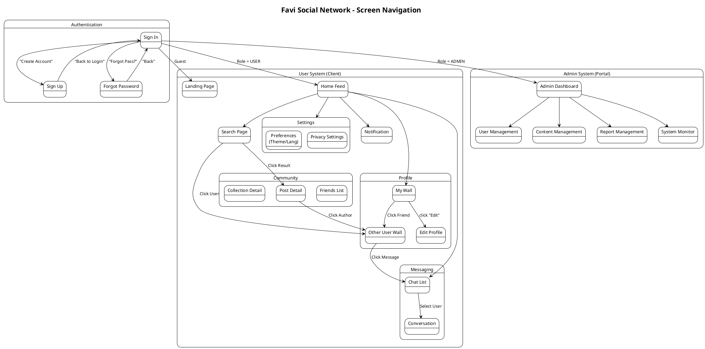

# Favi Screen Navigation

## 1. Biểu đồ điều hướng toàn hệ thống

Bên dưới là sơ đồ luồng mành hình (Screen Flow) cho cả hai phân hệ **User** và **Admin**, được phân tách rõ ràng.

## 2. Danh sách màn hình chi tiết

### 2.1. Phân hệ Admin System (Portal)

| STT | Màn hình | Loại màn hình | Chức năng |
| :-- | :--- | :--- | :--- |
| 1 | **Trang chủ Admin (Dashboard)** | Dashboard | Xem thống kê tổng quan: Số User mới, Post mới, Báo cáo chờ xử lý. |
| 2 | **Quản lý Người dùng (User Mgmt)** | List + Actions | Tìm kiếm User, Xem chi tiết, Khóa (Ban) hoặc Mở khóa tài khoản. |
| 3 | **Quản lý Nội dung (Content Mgmt)** | Grid/List | Duyệt danh sách bài viết, Xem ảnh bị AI Blur, Xóa bài viết vi phạm. |
| 4 | **Quản lý Báo cáo (Reports)** | List + Detail | Xem danh sách tố cáo, Chấp nhận (Xóa bài & Phạt) hoặc Bác bỏ báo cáo. |
| 5 | **Giám sát hệ thống (System Monitor)** | Dashboard/Log | Kiểm tra Health Check (DB, Redis), Xem Log lỗi (Error Logs). |

### 2.2. Phân hệ User & Authentication (Client)

| STT | Màn hình | Loại màn hình | Chức năng |
| :-- | :--- | :--- | :--- |
| 6 | **Đăng nhập (Sign In)** | Form | Nhập Email/Password, xác thực JWT, điều hướng theo Role (User/Admin). |
| 7 | **Đăng ký (Sign Up)** | Form/Wizard | Khách tạo tài khoản mới, xác thực Email, tạo hồ sơ (Profile) ban đầu. |
| 8 | **Quên mật khẩu (Recover Password)** | Form | Gửi email chứa link reset, đặt lại mật khẩu mới. |
| 9 | **Bảng tin (Newsfeed)** | Feed/List | Hiển thị bài viết từ bạn bè/người follow, tương tác (Like, Comment, Share). |
| 10 | **Chi tiết bài viết (Post Detail)** | Detail View | Xem nội dung đầy đủ của bài viết, danh sách bình luận (phân trang), phản hồi bình luận. |
| 11 | **Tạo bài viết mới (Create Post)** | Modal/Form | Upload ảnh/video, viết nội dung, gắn thẻ (Tag), chọn chế độ riêng tư, đăng bài. |
| 12 | **Tìm kiếm (Search Page)** | List + Filters | Tìm kiếm Người dùng, Bài viết, Hashtag. Lọc theo thời gian/độ phổ biến. |
| 13 | **Trang cá nhân của tôi (My Wall)** | Profile | Xem thông tin bản thân, danh sách bài đã đăng, Chỉnh sửa hồ sơ. |
| 14 | **Trang cá nhân người khác (User Wall)** | Profile | Xem thông tin người khác, nút Follow/Unfollow, nút Nhắn tin (Message). |
| 15 | **Chỉnh sửa hồ sơ (Edit Profile)** | Form | Cập nhật Avatar, Tên hiển thị, Bio, Link mạng xã hội. |
| 16 | **Danh sách bạn bè (Friends/Follows)** | List | Xem danh sách người đang theo dõi (Following) và người theo dõi mình (Followers). |
| 17 | **Chat - Danh sách (Conversations)** | List | Liệt kê các cuộc trò chuyện gần nhất, hiển thị tin nhắn cuối & trạng thái online. |
| 18 | **Chat - Hội thoại (Messaging)** | Chat UI | Gửi/Nhận tin nhắn thời gian thực, gửi ảnh, xem trạng thái đã xem (Seen). |
| 19 | **Thông báo (Notifications)** | List | Danh sách thông báo: Ai tương tác, ai follow, thông báo hệ thống. |
| 20 | **Cài đặt (Settings)** | Form/Tabs | Cài đặt Giao diện (Theme), Ngôn ngữ, Quyền riêng tư (Profile/Message). |
| 21 | **Bộ sưu tập (Collections)** | Grid | Xem danh sách các bài viết đã lưu (Saved Posts) theo Album. |
