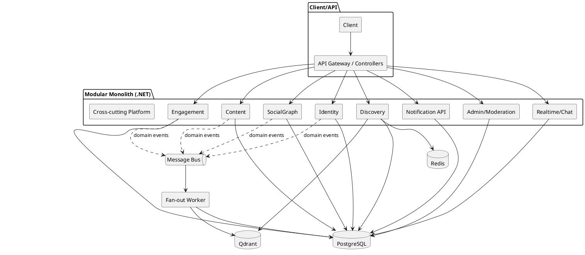
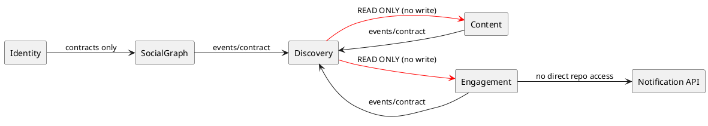

# Domain Boundary Map v1 (Current Codebase -> Target Modular Monolith)

Mục tiêu tài liệu: map rõ **ownership** theo domain/module, tránh tách sai ranh giới khi chuyển từ monolith sang modular monolith rồi microservice.

---

## Diagram A — Module boundary overview (PlantUML)

## Diagram B — Dependency rule (high-level)

---

## 1) Boundary map (module-level)

## 1.1 Identity Module
**Mục tiêu:** xác thực + hồ sơ + quyền truy cập hồ sơ cơ bản.

**Owns (business):**
- Login/Register/Refresh token
- Profile read/update cơ bản
- Social links
- Privacy profile-level policy (kết hợp `PrivacyGuard`)

**Controllers hiện tại liên quan:**
- `AuthController`
- `ProfilesController` (phần profile CRUD cơ bản)

**Services hiện tại liên quan:**
- `AuthService`
- `JwtService`
- `ProfileService`
- `PrivacyGuard` (shared policy)

**Repositories/Tables chính:**
- `Profiles` (`IProfileRepository`)
- `EmailAccounts` (`IEmailAccountRepository`)
- `SocialLinks` (`ISocialLinkRepository`)

**Public contracts chính (giữ ổn định qua gateway):**
- `/api/auth/*`
- `/api/profiles/{id}`
- `/api/profiles/me/links`, `/api/profiles/links/*`

---

## 1.2 SocialGraph Module
**Mục tiêu:** quan hệ follow/follower và propagation policy.

**Owns (business):**
- Follow/Unfollow
- Followers/Followings read
- Follow policy cho private/followers-only

**Controllers liên quan:**
- `ProfilesController` (follow/unfollow/followers/followings)

**Services liên quan:**
- `ProfileService` (phần graph)
- `PrivacyGuard` (follow list visibility)

**Repositories/Tables chính:**
- `Follows` (`IFollowRepository`)

**Public contracts:**
- `/api/profiles/follow/{targetId}`
- `/api/profiles/{id}/followers`
- `/api/profiles/{id}/followings`

---

## 1.3 Content Module
**Mục tiêu:** lifecycle nội dung gốc (post/media/repost/story/collection).

**Owns (business):**
- Post create/update/delete/archive/restore
- Media upload cho post
- Repost/share lifecycle
- Story lifecycle
- Collection lifecycle (nếu bật)

**Controllers liên quan:**
- `PostController`
- `StoriesController`
- `CollectionsController`
- `TagsController` (một phần thuộc Discovery cũng có thể dùng)

**Services liên quan:**
- `PostService`
- `StoryService`
- `CollectionService`
- `TagService`
- `CloudinaryService`
- `NSFWService` (side-effect)

**Repositories/Tables chính:**
- `Posts`, `PostMedias`, `Reposts`
- `Stories`, `StoryViews`
- `Collections`, `PostCollections`
- `Tags`, `PostTags`

**Public contracts:**
- `/api/posts/*` (write-heavy endpoints)
- `/api/stories/*`
- `/api/collections/*`

---

## 1.4 Engagement Module
**Mục tiêu:** tương tác user với content.

**Owns (business):**
- Reaction toggle/read reactors
- Comment create/update/delete/thread rules
- Share consistency hooks (qua repost)

**Controllers liên quan:**
- `PostController` (reaction/share endpoints)
- `CommentsController`

**Services liên quan:**
- `CommentService`
- `PostService` (reaction/share parts)

**Repositories/Tables chính:**
- `Reactions`
- `Comments`
- `Reposts` (shared with Content, cần ownership rule rõ)

**Public contracts:**
- `/api/posts/{id}/reactions`
- `/api/posts/{id}/reactors`
- `/api/comments/*`
- `/api/posts/{id}/share`

---

## 1.5 Discovery Module (Read-optimized)
**Mục tiêu:** query-side read endpoints cho feed/search/related/profile-feed.

**Owns (business):**
- Feed assembly/ranking query
- Explore/latest/guest-feed
- Related fallback (tag + semantic)
- Search orchestration

**Controllers liên quan:**
- `PostController` (feed/explore/latest/related/profile read paths)
- `SearchController`

**Services liên quan:**
- `SearchService`
- `PostService` (feed query part)
- `VectorIndexService` (HTTP to vector API)

**Stores phụ thuộc:**
- `PostgreSQL` read path
- `Redis` (target: business cache)
- `Qdrant` via vector service

**Public contracts:**
- `/api/posts/feed*`
- `/api/posts/latest`, `/api/posts/explore`, `/api/posts/guest-feed`
- `/api/posts/{id}/related`
- `/api/search/*`

---

## 1.6 Notification Module
**Mục tiêu:** notification query + state changes, tách rõ với fan-out worker.

**Owns (business):**
- Notification read/unread count/mark read/delete

**Controllers liên quan:**
- `NotificationsController`

**Services liên quan:**
- `NotificationService`

**Repositories/Tables chính:**
- `Notifications`

**Public contracts:**
- `/api/notifications/*`

---

## 1.7 Moderation/Admin Module
**Mục tiêu:** nghiệp vụ quản trị, audit, analytics, reports.

**Controllers liên quan:**
- `AdminAnalyticsController`
- `AdminAuditController`
- `AdminBulkController`
- `AdminCommentsController`
- `AdminContentController`
- `AdminExportController`
- `AdminHealthController`
- `AdminReportsController`
- `AdminUsersController`
- `ReportsController`

**Services liên quan:**
- `AnalyticsService`, `AuditService`, `BulkActionService`, `ExportService`, `ReportService`, `UserModerationService`

**Repositories/Tables chính:**
- `Reports`, `AdminActions`, `UserModerations`

---

## 1.8 Realtime/Chat Module
**Mục tiêu:** messaging + hub realtime.

**Controllers/Hubs liên quan:**
- `ChatController`
- `ChatHub`

**Services liên quan:**
- `ChatService`
- `ChatRealtimeService`

**Repositories/Tables chính:**
- `Conversations`, `Messages`, `UserConversations`

---

## 1.9 Cross-cutting Platform Module
**Không phải domain**, nhưng bắt buộc có boundary kỹ thuật:
- `IUnitOfWork` / transaction policy
- `PrivacyGuard`
- Health checks (`Redis`, `Qdrant`, vector index, DB)
- Background hosted services:
  - `PostCleanupService`
  - `StoryExpirationService`
- Observability/metrics

---

## 2) Dependency rules (enforced)

1. `Discovery` chỉ đọc; không ghi domain tables.
2. `Content/Engagement/SocialGraph/Identity` là command owners.
3. `Notification` query tách khỏi `Fan-out worker` (worker chỉ xử lý async side-effects).
4. Không cho module gọi repository của module khác trực tiếp.
5. Giao tiếp liên module qua:
   - application contracts (sync)
   - events (async)

---

## 3) Event ownership map (v1)

**Produced by command-side modules:**
- `Identity`: `UserRegistered.v1`, `ProfilePrivacyChanged.v1`
- `SocialGraph`: `FollowCreated.v1`, `FollowRemoved.v1`
- `Content`: `PostCreated.v1`, `PostUpdated.v1`, `PostArchived.v1`, `PostDeleted.v1`, `RepostCreated.v1`, `RepostRemoved.v1`
- `Engagement`: `ReactionToggled.v1`, `CommentCreated.v1`, `CommentDeleted.v1`

**Consumed by:**
- `Discovery` (projection/cache updates)
- `Notification worker` (fan-out)
- `Vector indexing worker`

---

## 4) Boundary gaps trong sơ đồ hiện tại (cần bổ sung)

1. Thiếu `Moderation/Admin` module.
2. Thiếu `Realtime/Chat` module.
3. Thiếu `Story` và `Collection` trong Content ownership.
4. Thiếu tách rõ `Notification API` vs `Fan-out worker`.
5. Thiếu `Cross-cutting` layer (PrivacyGuard, UnitOfWork policy, HostedServices, HealthChecks).
6. Thiếu ownership map cho tables + event producers/consumers.

---

## 5) Quy tắc thực thi khi tách boundary

- Bước 1: tách namespace + folder theo module ngay trong monolith.
- Bước 2: tạo `module contracts` và cấm direct repo access chéo module.
- Bước 3: tách phần query (`Discovery`) khỏi command logic.
- Bước 4: đưa side-effects sang worker qua event.
- Bước 5: mới bắt đầu extract service theo thứ tự: `Worker -> Read API -> Write API`.
