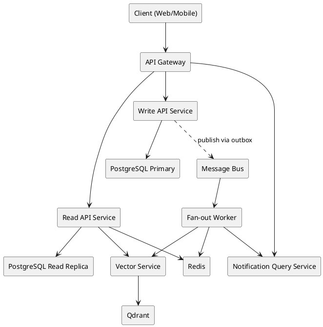
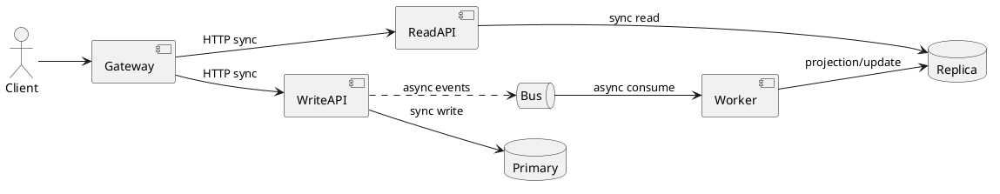

# Domain Boundary Split Plan v1 (Detailed, Codebase-specific)

Tài liệu này mô tả **bản tách boundary chi tiết** từ hệ thống hiện tại sang kiến trúc mục tiêu, theo hướng:  
`Current Monolith -> Modular Monolith -> Microservices`

---

## Diagram 1 — Target split topology (PlantUML)



## Diagram 2 — Phase extraction roadmap (PlantUML)

```plantuml
@startuml
[*] --> "Phase A\nBoundary hardening in monolith"
"Phase A\nBoundary hardening in monolith" --> "Phase B\nOutbox + Event backbone"
"Phase B\nOutbox + Event backbone" --> "Phase C1\nExtract Fan-out Worker"
"Phase C1\nExtract Fan-out Worker" --> "Phase C2\nExtract Read API"
"Phase C2\nExtract Read API" --> "Phase C3\nExtract Write API"
"Phase C3\nExtract Write API" --> "Phase D\nScale hardening"
"Phase D\nScale hardening" --> [*]
@enduml
```

## Diagram 3 — Sync vs Async boundaries (PlantUML)



---

## 1) Bản tách boundary đề xuất (final target)

## 1.1 API Gateway Layer
**Chức năng:**
- Single entry point cho Web/Mobile.
- Route by intent:
  - `/read/*` -> Read API service
  - `/write/*` -> Write API service
  - `/notify/*` hoặc internal -> notification/query service
- Auth propagation + correlation-id + rate limit.

**Không chứa business logic.**

---

## 1.2 Write API Service (Command service)

**Nhận toàn bộ nghiệp vụ ghi:**
- Auth command (`login`, `refresh`, `logout`) nếu bạn muốn tách Identity thành service con.
- Post command: create/update/delete/archive/restore/upload.
- Reaction command: toggle reaction.
- Comment command: create/update/delete.
- Follow command: follow/unfollow.
- Share command: share/unshare.
- Story/Collection command.

**Từ code hiện tại map vào:**
- `AuthService`, `PostService`, `CommentService`, `ProfileService` (follow commands), `StoryService`, `CollectionService`, `CloudinaryService`, `NSFWService`.

**Data ownership (write):**
- `Profiles`, `EmailAccounts`
- `Follows`
- `Posts`, `PostMedias`, `Reposts`
- `Comments`, `Reactions`
- `Stories`, `StoryViews`
- `Collections`, `PostCollections`

**Bắt buộc:**
- Outbox publish events cho mọi thay đổi nghiệp vụ quan trọng.
- Idempotent-safe cho command dễ race (`reaction toggle`, `follow`, `share`).

---

## 1.3 Read API Service (Query service)

**Nhận toàn bộ nghiệp vụ đọc:**
- Feed (`feed`, `guest-feed`, `latest`, `explore`, `feed-with-reposts`).
- Post detail read model.
- Profile feed/shares read.
- Search query orchestration + related fallback.

**Từ code hiện tại map vào:**
- `PostService` phần query/feed.
- `SearchService`.
- `VectorIndexService` query path.

**Data sources:**
- PG read replica.
- Redis cache (feed page cache/counters).
- Qdrant qua vector service.

**Không ghi command tables.**

---

## 1.4 Notification Query Service + Fan-out Worker (tách rõ)

### A) Notification Query Service
- API: get list, unread count, mark read, mark all read, delete.
- Map từ `NotificationsController` + `NotificationService`.

### B) Fan-out Worker
- Consume events từ bus.
- Tạo notification từ `comment/reaction/follow/repost` events.
- Update async projections/counters nếu cần.
- Update vector index side-effects (hoặc tách worker vector riêng).

**Vì sao phải tách:**
- Query service = synchronous read API.
- Worker = asynchronous side effects / throughput-oriented.

---

## 1.5 Support Services (phase sau, không cần extract ngay)

1. `Admin/Moderation Service`
- Admin controllers + services + reports/audit/analytics.

2. `Realtime/Chat Service`
- ChatController + ChatHub + Chat services.

3. `Search Vector Service` (đã external Python/FastAPI)
- giữ external process, chỉ chuẩn hoá contract/event-driven indexing.

---

## 2) Bản tách boundary ở mức Modular Monolith (intermediate)

Trước khi tách process, tách package/namespace trong cùng app:

- `Modules/Identity`
- `Modules/SocialGraph`
- `Modules/Content`
- `Modules/Engagement`
- `Modules/Discovery`
- `Modules/Notification`
- `Modules/AdminModeration`
- `Modules/RealtimeChat`
- `Modules/Platform` (cross-cutting)

Mỗi module có cấu trúc tối thiểu:
- `Application`
- `Domain`
- `Infrastructure`
- `Contracts`

Rule:
- Chỉ `Contracts` được module khác tham chiếu.
- Không cho tham chiếu repository trực tiếp chéo module.

---

## 3) Migration-by-phase (boundary-first)

## Phase A — Boundary hardening in monolith
1. Chuyển code vào module folders.
2. Tách command/query methods của `PostService` thành hai service nội bộ:
   - `PostCommandService`
   - `FeedQueryService`
3. Tách `Notification` query khỏi side-effects.
4. Thêm linter/rules để cấm dependency chéo không qua contracts.

Deliverable:
- Boundary matrix + dependency graph.

## Phase B — Event backbone
1. Outbox table + outbox publisher.
2. Event contracts v1.
3. Worker consumer (notification/vector).
4. Replay tool.

Deliverable:
- event catalog + retry/replay proof.

## Phase C — Extract processes theo thứ tự an toàn
1. Extract `Fan-out worker` trước.
2. Extract `Read API service`.
3. Extract `Write API service`.
4. Sau đó mới cân nhắc tách `Admin` và `Chat`.

Deliverable:
- gateway routing + k6 before/after deltas.

---

## 4) Table ownership matrix (v1)

| Table | Owner module/service | Read consumers |
|---|---|---|
| Profiles | Identity/Write | Read API, Notification |
| EmailAccounts | Identity/Write | Identity only |
| Follows | SocialGraph/Write | Read API, Notification |
| Posts | Content/Write | Read API, Search |
| PostMedias | Content/Write | Read API |
| Reposts | Content/Write | Read API, Notification |
| Comments | Engagement/Write | Read API, Notification |
| Reactions | Engagement/Write | Read API, Notification |
| Tags | Content or Discovery (choose one owner) | Read API/Search |
| PostTags | Content/Write | Read API/Search |
| Notifications | Notification module | Notification Query API |
| Conversations/Messages | RealtimeChat | Chat APIs |
| Stories/StoryViews | Content (or Story submodule) | Read API |

**Lưu ý quyết định kiến trúc:**
- `Tags` owner nên chốt sớm (Content hoặc Discovery). Khuyến nghị: Content owns write, Discovery consumes read.

---

## 5) Synchronous vs asynchronous boundaries

## Sync calls (HTTP/gRPC)
- Gateway -> Read API
- Gateway -> Write API
- Read API -> Vector service (query)

## Async calls (Bus)
- Write API -> Bus (domain events)
- Worker -> consume events (notification/index/projections)
- Read projection updater -> consume events

---

## 6) Missing pieces cần bổ sung ngay (theo codebase)

1. Reaction toggle idempotency under concurrency (đã thấy crash 23505).
2. Outbox/inbox chưa có.
3. Read/write separation chưa rõ trong services hiện tại.
4. Notification side-effects chưa tách hoàn toàn khỏi sync flow.
5. Background hosted services cần phân loại:
   - vẫn internal hay chuyển worker.
6. Admin/Chat boundaries chưa nằm trong sơ đồ cũ.

---

## 7) K6 migration impact sau boundary split

Khi split theo boundary này:
- `functional` + `integration-e2e`: giữ logic, chỉ cập nhật base URLs qua gateway.
- `load/stress-spike-soak`: thêm dashboard metrics per service (`read`, `write`, `worker`).
- Thêm assertion về queue lag/event delivery (không chỉ HTTP latency).

---

## 8) Definition of Done cho “tách boundary xong”

1. Mọi module có owner rõ (code + table + events).
2. Không còn direct dependency trái boundary.
3. Read/Write paths tách rõ ràng.
4. Notification side-effects chạy qua async worker.
5. K6 integration/e2e pass sau route qua gateway.
6. Benchmark before/after có thể so sánh công bằng (same seed/resource/scenario).
