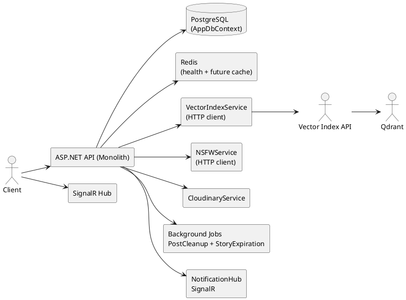
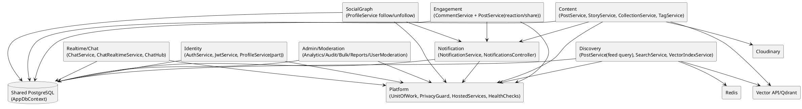

# Ultimate AS-IS Dependency Map (Current Monolith)

Tài liệu này là bản **duy nhất** để nhìn dependency hiện tại của codebase theo góc nhìn hệ thống.
Mục tiêu: chỉ rõ thành phần nào đang gọi thành phần nào, điểm coupling cao, và chỗ cần tách.

---

## 1) System context diagram (AS-IS)

---

## 2) Internal module dependency diagram (AS-IS, logical grouping)

---

## 3) Service-level call map (bám sát code hiện tại)

## 3.1 Auth + Identity
- `AuthService` -> `IEmailAccountRepository`, `IProfileRepository`, `IJwtService`, `IUnitOfWork`.
- `ProfileService` -> `IUnitOfWork` (`Profiles`, `Follows`, `EmailAccounts`, `SocialLinks`), `ICloudinaryService`, `INotificationService`.

## 3.2 Content + Engagement
- `PostService` -> `IUnitOfWork`, `ICloudinaryService`, `IPrivacyGuard`, `IVectorIndexService`, `INSFWService`, optional `INotificationService`, optional `IAuditService`.
- `CommentService` -> `IUnitOfWork`, optional `INotificationService`, optional `IAuditService`.

## 3.3 Discovery/Search
- `SearchService` -> `IUnitOfWork`, `IVectorIndexService`, `IPrivacyGuard`.
- Feed query hiện nằm trong `PostService` (chưa tách query service riêng).

## 3.4 Notification + Realtime
- `NotificationService` -> `IUnitOfWork` + `IHubContext<NotificationHub>` (SignalR push realtime).

## 3.5 Platform/Cross-cutting
- `UnitOfWork` expose gần như toàn bộ repository -> coupling cao.
- `Program.cs` đăng ký hosted services:
  - `PostCleanupService`
  - `StoryExpirationService`
- Health checks: DB, Memory, Redis, Qdrant, Vector API.

---

## 4) Coupling hotspots (nơi cần tách trước)

1. `PostService` vừa command vừa query (write + feed read + related/search fallback).
2. `ProfileService` gộp identity + social graph + notification side-effect.
3. `NotificationService` vừa persist vừa realtime push.
4. `UnitOfWork` shared cho mọi domain -> module boundary mờ.
5. Async side-effects (vector/nsfw/noti) chưa đi qua outbox/bus chuẩn hóa.

---

## 5) Đề xuất tách boundary từ AS-IS

Bước 1 (trong modular monolith):
- Tách `PostService` thành:
  - `PostCommandService`
  - `FeedQueryService`
- Tách `ProfileService` thành:
  - `IdentityProfileService`
  - `SocialGraphService`
- Tách `NotificationService` thành:
  - `NotificationQueryService` (API read/mark)
  - `NotificationFanoutHandler` (async side-effects)

Bước 2:
- Chuẩn hóa event contracts + outbox.
- Chỉ cho phép dependency chéo module qua contracts/events.

Bước 3:
- Extract process theo thứ tự:
  1) Worker
  2) Read API
  3) Write API
