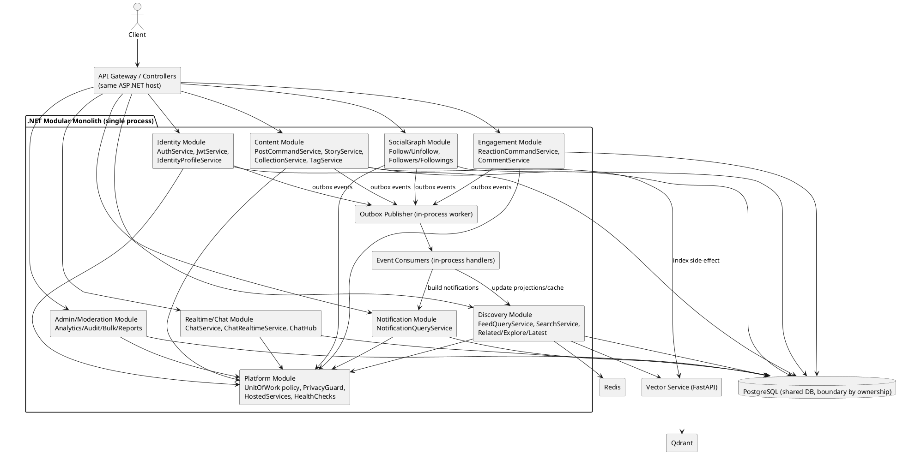

# Ultimate Intermediate Design — Monolith -> Modular Monolith (Pre-Microservice)

Tài liệu này mô tả **trạng thái trung gian bắt buộc**: hệ thống vẫn 1 process, 1 deploy, nhưng đã tách boundary rõ theo module trước khi extract thành microservice.

---

## 1) Diagram — Modular Monolith target (intermediate state)



---

## 2) Boundary rules trong trạng thái intermediate

1. `Discovery` chỉ query, không ghi domain tables.
2. `Content/Engagement/SocialGraph/Identity` là command owners.
3. Không gọi repository chéo module trực tiếp; chỉ qua module contracts.
4. Side-effects (`notification`, `vector update`) đi qua outbox + in-process consumers.
5. Shared DB vẫn dùng tạm, nhưng ownership theo module phải rõ.

---

## 3) Mapping từ code hiện tại -> module trung gian

- `AuthService`, `JwtService`, phần profile cơ bản -> `Identity`.
- Follow/follower trong `ProfileService` -> `SocialGraph`.
- `PostService` tách thành:
  - `PostCommandService` -> `Content`
  - `FeedQueryService` -> `Discovery`
- Reaction/comment từ `PostService` + `CommentService` -> `Engagement`.
- `SearchService` + related/feed read logic -> `Discovery`.
- `NotificationService` tách:
  - query API -> `Notification`
  - side-effects handler -> event consumer.
- `AnalyticsService`, `AuditService`, `BulkActionService`, `ReportService`, `UserModerationService` -> `Admin/Moderation`.
- `ChatService`, `ChatRealtimeService`, `ChatHub` -> `Realtime/Chat`.

---

## 4) Definition of Done cho intermediate state

- Module folders + namespaces tách rõ.
- Contract interfaces giữa module rõ ràng.
- Không còn dependency chéo module qua repository.
- Outbox + in-process event flow chạy ổn.
- Functional + Integration/E2E + Load regression pass trên cùng dataset/seed.

---

## 5) Khung triển khai chi tiết (cái sẽ implement)

## 5.1 Cấu trúc thư mục/namespace mục tiêu

```text
Favi-BE.API/
  Modules/
    Identity/
      Application/
      Domain/
      Infrastructure/
      Contracts/
    SocialGraph/
      Application/
      Domain/
      Infrastructure/
      Contracts/
    Content/
      Application/
      Domain/
      Infrastructure/
      Contracts/
    Engagement/
      Application/
      Domain/
      Infrastructure/
      Contracts/
    Discovery/
      Application/
      Domain/
      Infrastructure/
      Contracts/
    Notification/
      Application/
      Domain/
      Infrastructure/
      Contracts/
    AdminModeration/
    RealtimeChat/
    Platform/
      Outbox/
      Eventing/
      Policies/
```

## 5.2 Danh sách Command/Query services sẽ tách

### Identity Module
- **Commands**
  - `LoginCommandService`
  - `RegisterCommandService`
  - `RefreshTokenCommandService`
  - `UpdateProfileCommandService`
- **Queries**
  - `ProfileQueryService`
  - `SocialLinkQueryService`

### SocialGraph Module
- **Commands**
  - `FollowCommandService`
  - `UnfollowCommandService`
- **Queries**
  - `FollowerQueryService`
  - `FollowingQueryService`

### Content Module
- **Commands**
  - `PostCommandService` (create/update/delete/archive/restore)
  - `PostMediaCommandService` (upload/remove/reorder)
  - `RepostCommandService` (share/unshare)
  - `StoryCommandService`
  - `CollectionCommandService`
  - `TagCommandService`
- **Queries**
  - `PostDetailQueryService` (chỉ detail read thuộc content owner)

### Engagement Module
- **Commands**
  - `ReactionCommandService`
  - `CommentCommandService`
- **Queries**
  - `CommentQueryService`
  - `ReactionSummaryQueryService`

### Discovery Module (query-only)
- **Queries**
  - `FeedQueryService`
  - `ExploreQueryService`
  - `LatestQueryService`
  - `GuestFeedQueryService`
  - `ProfileFeedQueryService`
  - `RelatedQueryService`
  - `SearchQueryService`

### Notification Module
- **Commands**
  - `NotificationReadCommandService` (`mark read`, `mark all read`, `delete`)
- **Queries**
  - `NotificationQueryService` (`list`, `unread count`)

### Admin/Moderation Module
- Giữ services hiện tại nhưng gom boundary:
  - `AnalyticsService`, `AuditService`, `BulkActionService`, `ExportService`, `ReportService`, `UserModerationService`

### Realtime/Chat Module
- `ChatCommandService`, `ChatQueryService`, `ChatRealtimeService` (SignalR integration)

## 5.3 Thành phần mới cần thêm (bắt buộc)

1. `OutboxEvent` entity + table (Platform)
2. `IOutboxWriter` + `OutboxWriter`
3. `OutboxPublisherHostedService` (in-process)
4. `IDomainEventBus` (in-process event dispatcher trước khi tách MQ thật)
5. `IEventConsumer<TEvent>` handlers:
   - `NotificationFanoutHandler`
   - `DiscoveryProjectionHandler`
   - `VectorIndexUpdateHandler`
6. `Module contracts` (interface-only cross-module)
7. `Dependency guard` (kiểm tra module reference trái rule)

## 5.4 Event contracts sẽ tạo

- `UserRegisteredV1`
- `ProfilePrivacyChangedV1`
- `FollowCreatedV1`
- `FollowRemovedV1`
- `PostCreatedV1`
- `PostUpdatedV1`
- `PostDeletedV1`
- `RepostCreatedV1`
- `RepostRemovedV1`
- `ReactionToggledV1`
- `CommentCreatedV1`
- `CommentDeletedV1`

Mỗi event có tối thiểu: `EventId`, `EventType`, `OccurredAt`, `AggregateId`, `ActorId`, `Version`, `Payload`.

## 5.5 Mapping class hiện tại -> class mới

- `AuthService` -> `LoginCommandService`, `RegisterCommandService`, `RefreshTokenCommandService`
- `ProfileService` -> `UpdateProfileCommandService`, `ProfileQueryService`, `FollowCommandService`, `UnfollowCommandService`, `FollowerQueryService`, `FollowingQueryService`
- `PostService` -> `PostCommandService`, `PostMediaCommandService`, `RepostCommandService`, `PostDetailQueryService`, `FeedQueryService`, `ExploreQueryService`, `RelatedQueryService`
- `CommentService` -> `CommentCommandService`, `CommentQueryService`
- `SearchService` -> `SearchQueryService`
- `NotificationService` -> `NotificationQueryService`, `NotificationReadCommandService`, `NotificationFanoutHandler`

## 5.6 DI registration strategy (Program.cs)

Tách extension methods theo module:
- `AddIdentityModule(services, config)`
- `AddSocialGraphModule(...)`
- `AddContentModule(...)`
- `AddEngagementModule(...)`
- `AddDiscoveryModule(...)`
- `AddNotificationModule(...)`
- `AddPlatformModule(...)`

Mỗi module chỉ đăng ký implementation nội bộ của module đó + contracts export ra ngoài.

## 5.7 Quy tắc coding khi triển khai boundary

1. `Discovery` không được gọi repository write trực tiếp.
2. Không inject `IUnitOfWork` xuyên module tùy tiện; ưu tiên module-specific abstraction.
3. Mọi side-effect xuyên boundary dùng event (`Outbox + Consumer`).
4. Transaction command chỉ gói trong module owner.
5. Không tạo DTO dùng chung toàn hệ thống kiểu “god contract”; contract per module.

## 5.8 Thứ tự implement thực tế (không sót)

1. Tạo `Modules/*` + move namespace.
2. Tách `PostService` thành command/query trước (điểm nóng nhất).
3. Tách `ProfileService` thành Identity + SocialGraph.
4. Tạo Outbox infra + hosted publisher.
5. Tạo event contracts + consumer handlers (notification/discovery/vector).
6. Tách `NotificationService` thành query + read commands + fanout handler.
7. Chuẩn hóa DI theo extension methods module.
8. Chạy lại `functional` + `integration-e2e` + `load`.

## 5.9 Deliverables sau khi hoàn thành khung này

- Boundary matrix (module -> service -> table -> event).
- Dependency report trước/sau (số dependency chéo giảm).
- Danh sách services mới đã tách command/query.
- Outbox table + publisher logs + consumer logs.
- Regression test results (k6).
