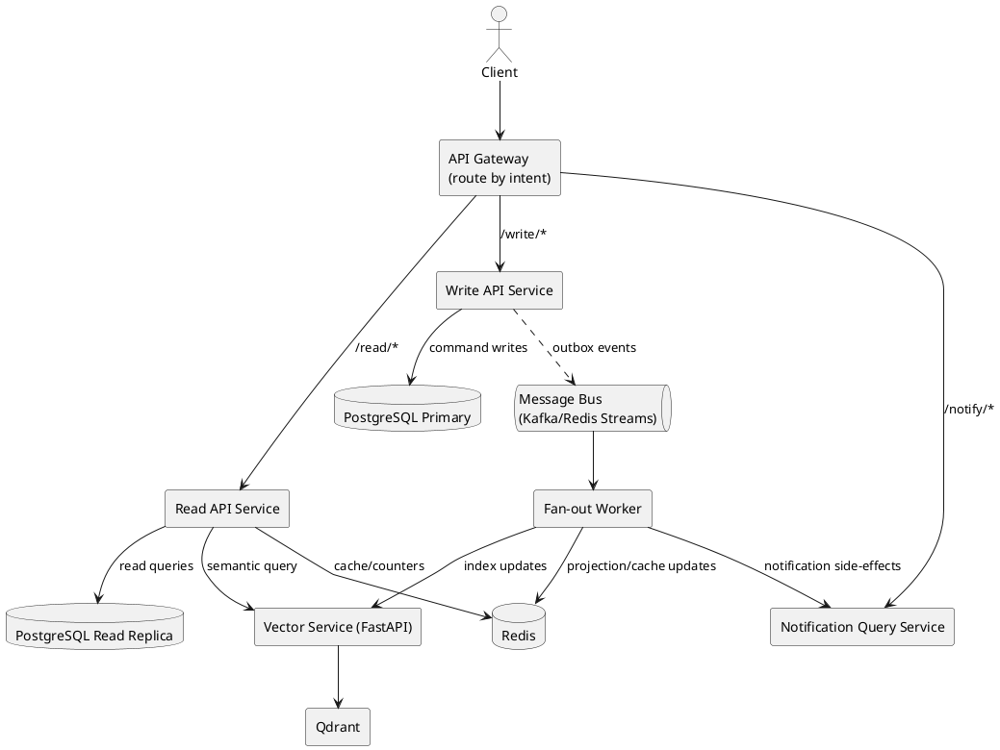
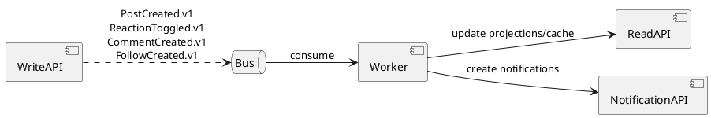

# Ultimate TO-BE Boundary Design (Modular Monolith -> Microservices)

Tài liệu này mô tả kiến trúc đích sau khi tách dependency rõ ràng theo domain boundary.

---

## 1) Target topology diagram (TO-BE)

---

## 2) Module-to-service boundary (TO-BE)

## 2.1 Write API Service (command owners)
- Identity command: login/register/refresh/logout.
- SocialGraph command: follow/unfollow.
- Content command: post/media/repost/story/collection writes.
- Engagement command: reaction/comment writes.

**Owns tables (write):**
`Profiles`, `EmailAccounts`, `Follows`, `Posts`, `PostMedias`, `Reposts`, `Comments`, `Reactions`, `Stories`, `StoryViews`, `Collections`, `PostCollections`, `Tags`, `PostTags`.

## 2.2 Read API Service (query owners)
- Feed, explore, latest, guest-feed, feed-with-reposts.
- Post detail read model.
- Profile read endpoints.
- Search orchestration (proxy to vector).

**Reads from:**
- PG read replica
- Redis
- Vector service

## 2.3 Notification Query Service
- Get notifications / unread count / mark read / mark all read / delete.
- Có storage riêng hoặc read projection riêng cho notifications.

## 2.4 Fan-out Worker
- Consume domain events.
- Generate notifications.
- Trigger vector indexing updates.
- Update read projections/caches.

---

## 3) Domain event flow diagram (TO-BE)

---

## 4) Dependency rules sau tách

1. Read API **không ghi** domain tables.
2. Write API là owner duy nhất của write tables.
3. Worker chỉ xử lý async side-effects, không expose public API.
4. Service khác không query chéo DB owner service khác trực tiếp.
5. Mọi cập nhật cross-boundary đi qua event bus (outbox + idempotent consumer).

---

## 5) Mapping từ code hiện tại sang TO-BE

## 5.1 Chuyển từ monolith services
- `PostService` -> tách thành `PostCommandService` (WRITE) + `FeedQueryService` (READ).
- `ProfileService` -> tách `IdentityProfileService` (WRITE/QUERY profile) + `SocialGraphService` (WRITE/QUERY follow).
- `NotificationService` -> tách `NotificationQueryService` + worker handlers.
- `SearchService` giữ ở READ, chỉ query path.
- `CloudinaryService`, `NSFWService` phục vụ WRITE hoặc worker side-effects.

## 5.2 Hosted services
- `PostCleanupService`, `StoryExpirationService`:
  - giữ nội bộ WRITE service hoặc tách worker định kỳ riêng tùy vận hành.

---

## 6) Extraction order (an toàn)

1. Boundary hardening trong monolith (namespace/contracts).
2. Outbox + bus + consumer idempotency.
3. Extract Fan-out Worker.
4. Extract Read API.
5. Extract Write API.
6. Extract Admin/Chat (phase sau).

---

## 7) Definition of Done (TO-BE boundary)

- Boundary rõ owner code/table/event.
- Không còn direct repo access chéo module/service.
- Read/Write tách rõ ở runtime.
- Async side-effects qua bus.
- k6 integration/e2e pass qua gateway.
- Performance report before/after có cải thiện đo được.
