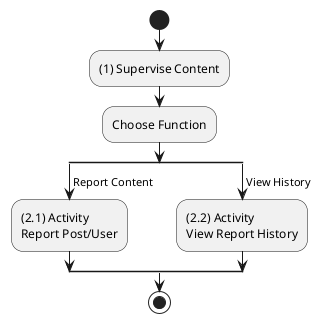
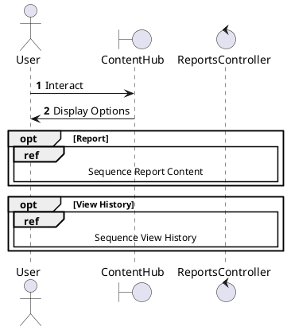
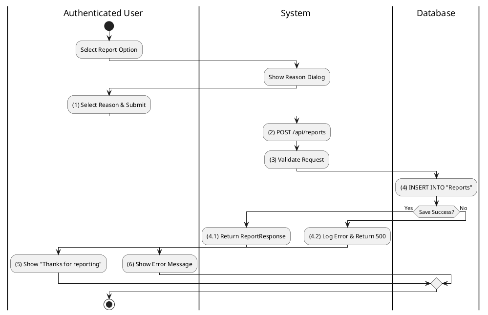
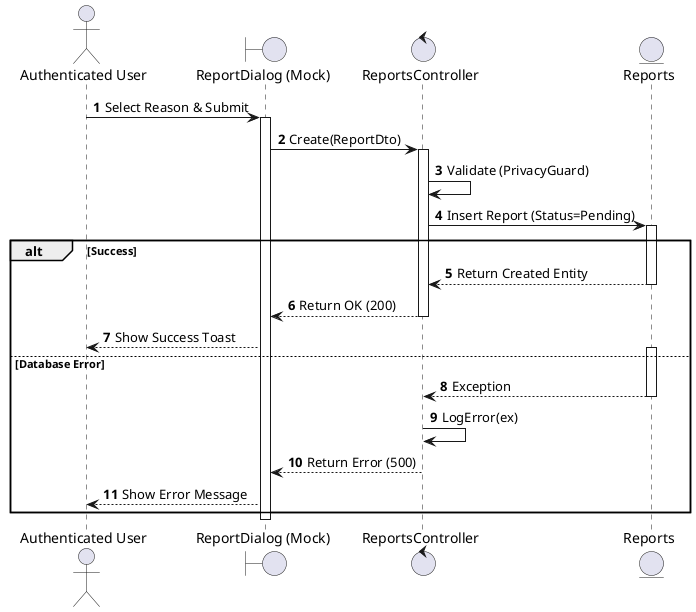
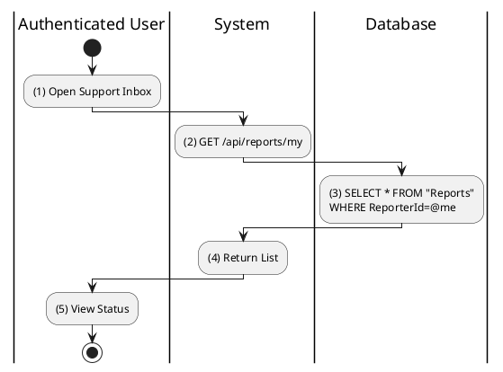
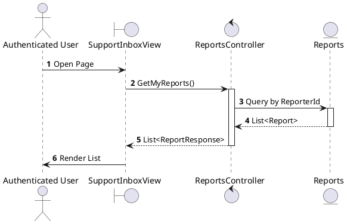

# Use Case 2.1.10: Supervise Content (Reporting)

**Module**: Supervision / Moderation
**Primary Actor**: Authenticated User
**Backend Controller**: `Favi_BE.API.Controllers.ReportsController`
**Database Tables**: `"Reports"`

---

## 2.1.10.1 Supervise Content (Overview)

### Use Case Description
| Attribute | Details |
| :--- | :--- |
| **Name** | **Supervise Content** |
| **Description** | Central hub for content moderation and reporting. |
| **Actor** | Authenticated User |
| **Trigger** | ❖ User accesses reporting functions or support center. |
| **Post-condition** | ❖ User submits reports or tracks report status. |

### Business Rules (BR)

| Activity | BR Code | Description |
| :---: | :---: | :--- |
| (1) | BR1 | **Initialization:** ❖ The **System** allows users to flag content for review. ❖ The **System** provides a history view of submitted reports. |

### Diagrams

**Activity Diagram**

**Sequence Diagram**

---

## 2.1.10.2 Report Post / Comment / User

### Use Case Description
| Attribute | Details |
| :--- | :--- |
| **Name** | **Report Post / Comment / User** |
| **Description** | Submit a report against a violation. |
| **Actor** | Authenticated User |
| **Trigger** | ❖ User clicks "Report" from the content options menu. |
| **Pre-condition** | ❖ Target content exists. ❖ User is allowed to view the content. |
| **Post-condition** | ❖ A "Report" record is created in the database. ❖ Admins are notified (if configured). |

### Business Rules (BR)

| Activity | BR Code | Description |
| :---: | :---: | :--- |
| (1) | BR1 | **Submission:** ❖ The **Frontend** shows a `ReportDialog` where the user selects a reason. ❖ Upon confirmation, it calls `reportApi.create({ targetId, targetType, reason })`. |
| (2)-(4) | BR2 | **Processing:** ❖ The **API** receives a `POST` request at `/api/reports`. ❖ The **Backend** `ReportsController.Create(dto)` first checks `_privacy.CanReport`. ❖ The **Database** inserts a new record into `Reports` with `ReporterId`, `TargetId`, `Reason`, and sets `Status='Pending'`. |
| (4.1)-(5) | BR3 | **Completion:** ❖ The **System** returns `201 Created`. ❖ The **Frontend** displays a "Report submitted" confirmation and closes the dialog. |
| (4.2)-(6) | BR_Error | **Error:** ❖ If request is **Invalid**, the **System** returns `400`. ❖ For **Server** errors, it returns `500`. |

### Diagrams

**Activity Diagram**

**Sequence Diagram**

---

## 2.1.10.3 View My Report History

### Use Case Description
| Attribute | Details |
| :--- | :--- |
| **Name** | **View My Report History** |
| **Description** | Track status of submitted reports. |
| **Actor** | Authenticated User |
| **Trigger** | ❖ User navigates to the Help/Support center. |
| **Pre-condition** | ❖ User has submitted reports previously. |
| **Post-condition** | ❖ System displays a list of reports with their current status. |

### Business Rules (BR)

| Activity | BR Code | Description |
| :---: | :---: | :--- |
| (2)-(3) | BR1 | **Query:** ❖ The **Frontend** `SupportCenter` calls `reportApi.getMyReports()`. ❖ The **API** receives `GET /api/reports/my`. ❖ The **Backend** `ReportsController.GetMyReports` executes the query. ❖ The **Database** selects all records from `Reports` where `ReporterId` matches the current user. |
| (4)-(5) | BR2 | **Display:** ❖ The **System** returns `200 OK` with the list. ❖ The **Frontend** renders the list using badges to indicate status (e.g., "Open" in Green, "Closed" in Gray). |
| (6) | BR_Error | **Error:** ❖ If a **Server** error occurs, the **System** returns `500` and logs it. |

### Diagrams

**Activity Diagram**

**Sequence Diagram**

