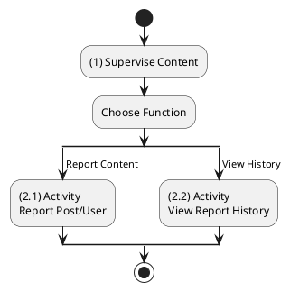
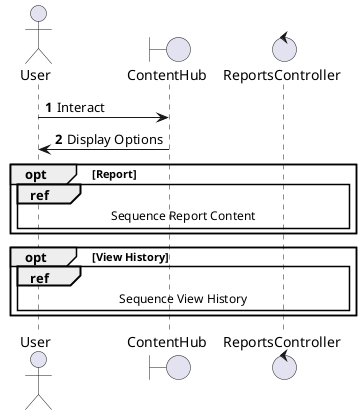
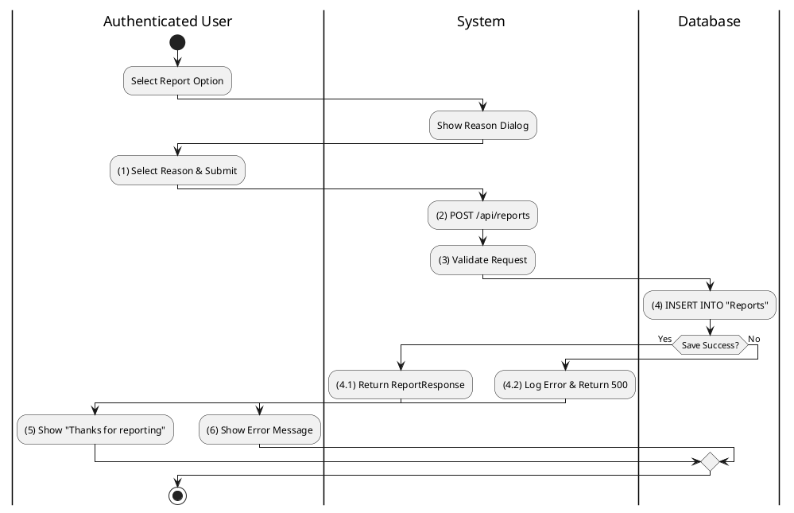
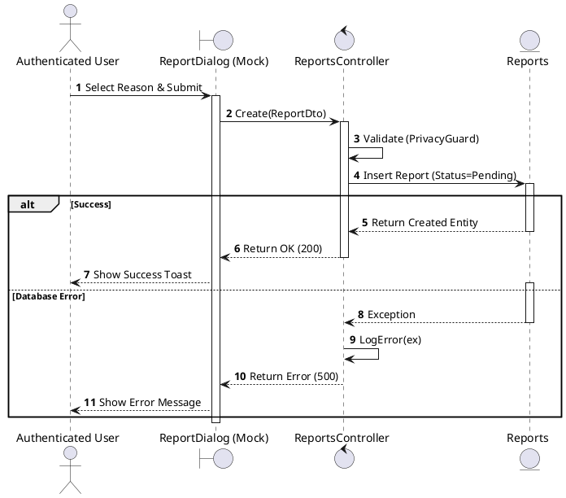
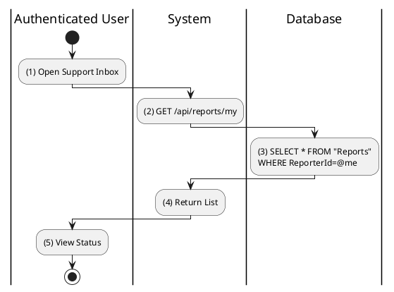
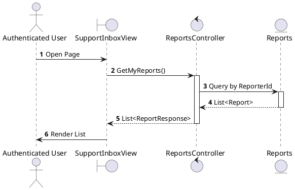

# Use Case 2.1.10: Supervise Content (Reporting)

**Module**: Supervision / Moderation
**Primary Actor**: Authenticated User
**Backend Controller**: `Favi_BE.API.Controllers.ReportsController`
**Database Tables**: `"Reports"`

---

## 2.1.10.1 Supervise Content (Overview)

### Use Case Description
| Attribute | Details |
| :--- | :--- |
| **Name** | **Supervise Content** |
| **Description** | Central hub for content moderation and reporting. |
| **Actor** | Authenticated User |
| **Trigger** | ❖ User accesses reporting functions or support center. |
| **Post-condition** | ❖ User submits reports or tracks report status. |

### Business Rules (BR)

| Activity | BR Code | Description |
| :---: | :---: | :--- |
| (1) | BR1 | **Initialization:** ❖ The System allows users to flag content for review. ❖ The System provides a history view of submitted reports. |

### Diagrams

**Activity Diagram**

**Sequence Diagram**

---

## 2.1.10.2 Report Post / Comment / User

### Use Case Description
| Attribute | Details |
| :--- | :--- |
| **Name** | **Report Post / Comment / User** |
| **Description** | Submit a report against a violation. |
| **Actor** | Authenticated User |
| **Trigger** | ❖ User clicks "Report" from the content options menu. |
| **Pre-condition** | ❖ Target content exists. ❖ User is allowed to view the content. |
| **Post-condition** | ❖ A "Report" record is created in the database. ❖ Admins are notified (if configured). |

### Business Rules (BR)

| Activity | BR Code | Description |
| :---: | :---: | :--- |
| (1) | BR1 | **Submitting Rules:** When the user selects a reason from the "Report" dialog and clicks "Submit", the system captures the input. |
| (2) | BR2 | **Processing Rules:** The system calls `ReportsController.Create` (`POST /api/reports`) with the `ReportDto` containing the target ID and reason. |
| (3) | BR3 | **Validation Rules:** The system validates the request (e.g., checking if the user is allowed to report this content via `PrivacyGuard`). |
| (4) | BR4 | **Storing Rules:** The database creates a new record in the `Reports` table with `Status = Pending` for admin review. |
| (4.1) | BR5 | **Displaying Rules:** The system returns the created `ReportResponse` object to the client (Step 4.1). |
| (5) | BR6 | **Displaying Rules:** The UI displays a "Thank you" toast message, informing the user that the report has been received (Step 5). |
| (4.2)-(6) | BR_Error | **Exception Handling Rules:** If a system failure occurs, the Global Exception Handler logs the error (Step 4.2) and returns a `500 Internal Server Error`. System shows error (Step 6). |

### Diagrams

**Activity Diagram**

**Sequence Diagram**

---

## 2.1.10.3 View My Report History

### Use Case Description
| Attribute | Details |
| :--- | :--- |
| **Name** | **View My Report History** |
| **Description** | Track status of submitted reports. |
| **Actor** | Authenticated User |
| **Trigger** | ❖ User navigates to the Help/Support center. |
| **Pre-condition** | ❖ User has submitted reports previously. |
| **Post-condition** | ❖ System displays a list of reports with their current status. |

### Business Rules (BR)

| Activity | BR Code | Description |
| :---: | :---: | :--- |
| (2)-(3) | BR1 | **Querying Rules:** ❖ System calls method `ReportsController.GetMyReports()`. ❖ System queries data in the table “Reports” in the database (Refer to “Reports” table in “DB Sheet” file) with syntax `SELECT * FROM Reports WHERE ReporterId = [User.ID]`. ❖ System includes Status information (Pending, Resolved). |
| (4)-(5) | BR2 | **Display Workflow:** ❖ System displays a “ReportList” screen (Refer to “ReportList” view in “View Description” file). ❖ System renders the items with status badges:  **Pending**: Displayed with "Open" badge (Refer to “BadgeOpen” style).  **Resolved**: Displayed with "Closed" badge (Refer to “BadgeClosed” style). |
| (6) | BR_Error | **Exception Handling Rules:** ❖ If a system failure occurs:  System logs the error.  System returns `500 Internal Server Error`. |

### Diagrams

**Activity Diagram**

**Sequence Diagram**

