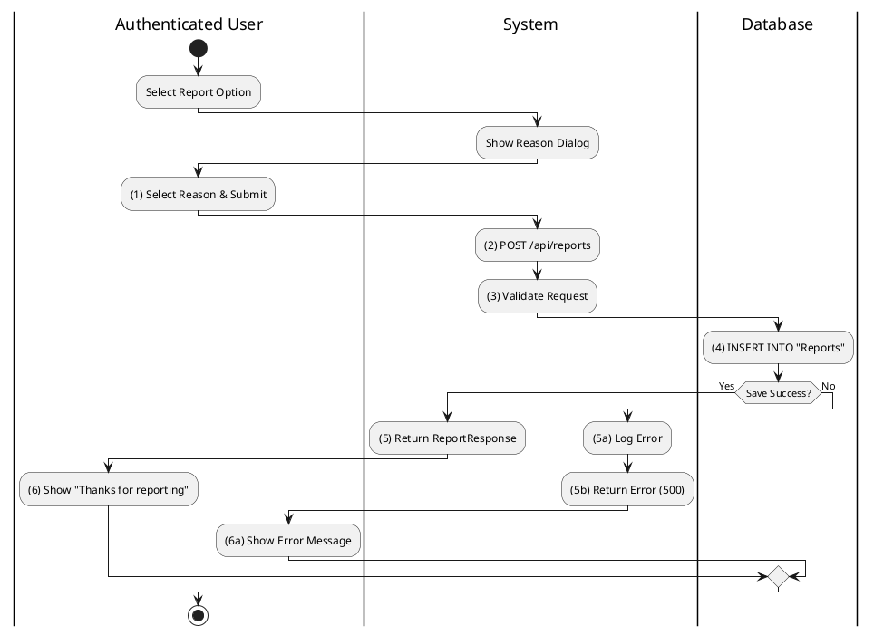
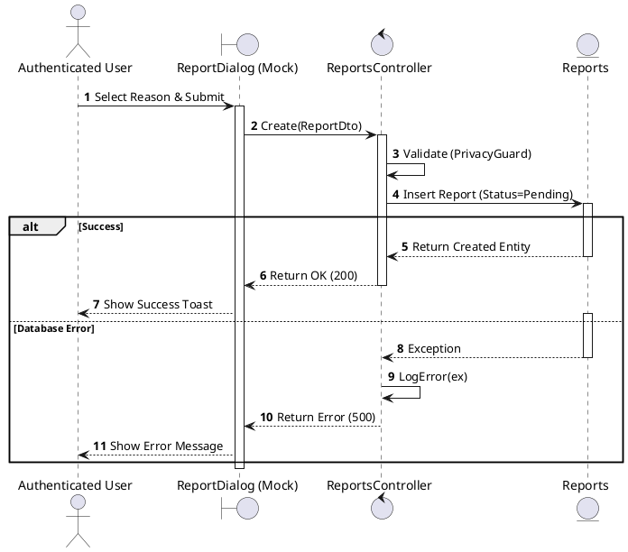
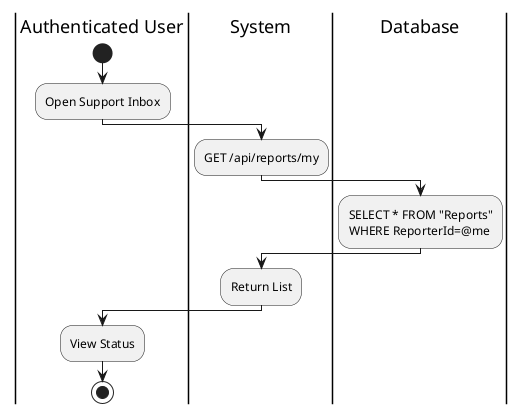
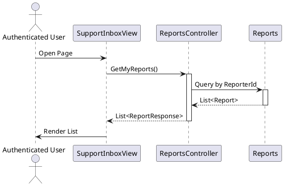

# Use Case 2.1.10: Supervise Content (Reporting)

**Module**: Supervision / Moderation
**Primary Actor**: Authenticated User
**Backend Controller**: `Favi_BE.API.Controllers.ReportsController`
**Database Tables**: `"Reports"`

---

## 2.1.10.2 Report Post / Comment / User

### Use Case Description
| Attribute | Details |
| :--- | :--- |
| **Name** | **Report Post / Comment / User** |
| **Description** | Submit a report against a violation. |
| **Actor** | Authenticated User |
| **Trigger** | ❖ User clicks "Report" from the content options menu. |
| **Pre-condition** | ❖ Target content exists. ❖ User is allowed to view the content. |
| **Post-condition** | ❖ A "Report" record is created in the database. ❖ Admins are notified (if configured). |

### Business Rules (BR)

| Activity | BR Code | Description |
| :---: | :---: | :--- |
| (1) | BR1 | **Submitting Rules:** When the user selects a reason from the "Report" dialog and clicks "Submit", the system captures the input. |
| (2) | BR2 | **Processing Rules:** The system calls `ReportsController.Create` (`POST /api/reports`) with the `ReportDto` containing the target ID and reason. |
| (3) | BR3 | **Validation Rules:** The system validates the request (e.g., checking if the user is allowed to report this content via `PrivacyGuard`). |
| (4) | BR4 | **Storing Rules:** The database creates a new record in the `Reports` table with `Status = Pending` for admin review. |
| (5) | BR5 | **Displaying Rules:** The system returns the created `ReportResponse` object to the client. |
| (6) | BR6 | **Displaying Rules:** The UI displays a "Thank you" toast message, informing the user that the report has been received. |
| (7) | BR_Error | **Exception Handling Rules:** If a system failure occurs, the Global Exception Handler logs the error and returns a `500 Internal Server Error`. |

### Diagrams

**Activity Diagram**

**Sequence Diagram**

---

## 2.1.10.3 View My Report History

### Use Case Description
| Attribute | Details |
| :--- | :--- |
| **Name** | **View My Report History** |
| **Description** | Track status of submitted reports. |
| **Actor** | Authenticated User |
| **Trigger** | ❖ User navigates to the Help/Support center. |
| **Pre-condition** | ❖ User has submitted reports previously. |
| **Post-condition** | ❖ System displays a list of reports with their current status. |

### Business Rules (BR)

| Activity | BR Code | Description |
| :---: | :---: | :--- |
| (1) | BR1 | **Selecting Rules:** User goes to Help Center -> "My Support Requests". |
| (2) | BR2 | **Querying Rules:** System calls `ReportsController.GetMyReports()`. SQL: `SELECT * FROM "Reports" WHERE "ReporterId" = @me`. |
| (3) | BR3 | **Displaying Rules:** System displays list. Items show Status (Pending/Resolved). |

### Diagrams

**Activity Diagram**

**Sequence Diagram**

