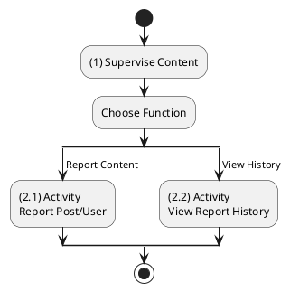
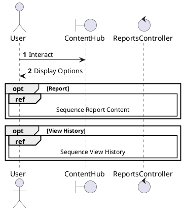
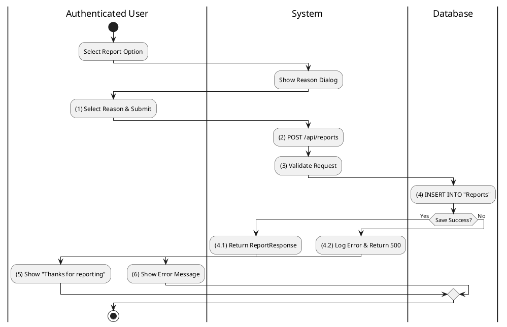
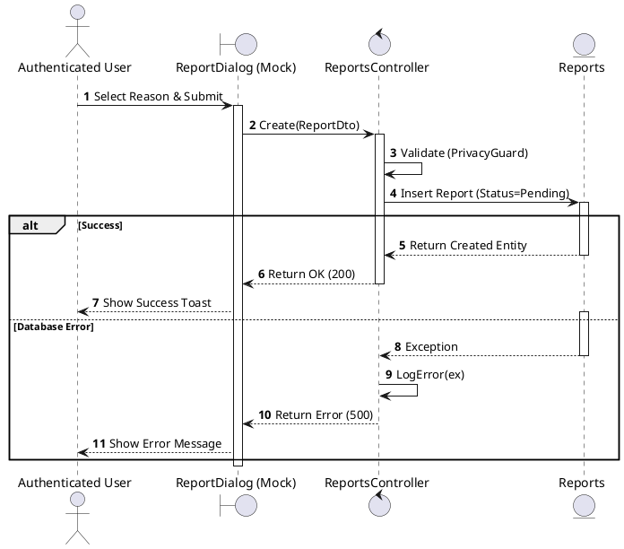
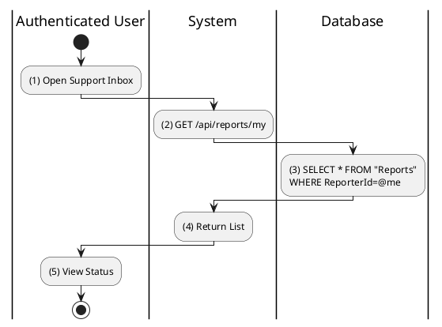
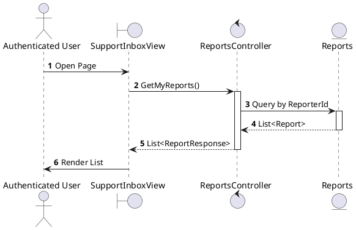

# Use Case 2.1.10: Supervise Content (Reporting)

**Module**: Supervision / Moderation
**Primary Actor**: Authenticated User
**Backend Controller**: `Favi_BE.API.Controllers.ReportsController`
**Database Tables**: `"Reports"`

---

## 2.1.10.1 Supervise Content (Overview)

### Use Case Description
| Attribute | Details |
| :--- | :--- |
| **Name** | **Supervise Content** |
| **Description** | Central hub for content moderation and reporting. |
| **Actor** | Authenticated User |
| **Trigger** | ❖ User accesses reporting functions or support center. |
| **Post-condition** | ❖ User submits reports or tracks report status. |

### Business Rules (BR)

| Activity | BR Code | Description |
| :---: | :---: | :--- |
| (1) | BR1 | **Initialization:** ❖ The System allows users to flag content for review. ❖ The System provides a history view of submitted reports. |

### Diagrams

**Activity Diagram**

**Sequence Diagram**

---

## 2.1.10.2 Report Post / Comment / User

### Use Case Description
| Attribute | Details |
| :--- | :--- |
| **Name** | **Report Post / Comment / User** |
| **Description** | Submit a report against a violation. |
| **Actor** | Authenticated User |
| **Trigger** | ❖ User clicks "Report" from the content options menu. |
| **Pre-condition** | ❖ Target content exists. ❖ User is allowed to view the content. |
| **Post-condition** | ❖ A "Report" record is created in the database. ❖ Admins are notified (if configured). |

### Business Rules (BR)

| Activity | BR Code | Description |
| :---: | :---: | :--- |
| (1) | BR1 | **Submission:** ❖ **Frontend**: `ReportDialog`. User selects reason. Calls `reportApi.create({ targetId, targetType, reason })`. |
| (2)-(4) | BR2 | **Processing:** ❖ **API**: `POST /api/reports`. ❖ **Backend**: `ReportsController.Create(dto)`. Checks `_privacy.CanReport`. ❖ **DB**: `INSERT INTO Reports (ReporterId, TargetId, Reason, Status='Pending')`. |
| (4.1)-(5) | BR3 | **Completion:** ❖ **Response**: `201 Created`. ❖ **Frontend**: Shows "Report submitted" confirmation. Dialog closes. |
| (4.2)-(6) | BR_Error | **Error:** ❖ **Invalid**: `400`. ❖ **Server**: `500`. |

### Diagrams

**Activity Diagram**

**Sequence Diagram**

---

## 2.1.10.3 View My Report History

### Use Case Description
| Attribute | Details |
| :--- | :--- |
| **Name** | **View My Report History** |
| **Description** | Track status of submitted reports. |
| **Actor** | Authenticated User |
| **Trigger** | ❖ User navigates to the Help/Support center. |
| **Pre-condition** | ❖ User has submitted reports previously. |
| **Post-condition** | ❖ System displays a list of reports with their current status. |

### Business Rules (BR)

| Activity | BR Code | Description |
| :---: | :---: | :--- |
| (2)-(3) | BR1 | **Query:** ❖ **Frontend**: `SupportCenter`. Calls `reportApi.getMyReports()`. ❖ **API**: `GET /api/reports/my`. ❖ **Backend**: `ReportsController.GetMyReports`. ❖ **DB**: `SELECT * FROM Reports WHERE ReporterId=@me`. |
| (4)-(5) | BR2 | **Display:** ❖ **Response**: `200 OK` (List). ❖ **Frontend**: Renders list using badges: "Open" (Green), "Closed" (Gray). |
| (6) | BR_Error | **Error:** ❖ **Server**: `500`. Logged. |

### Diagrams

**Activity Diagram**

**Sequence Diagram**

