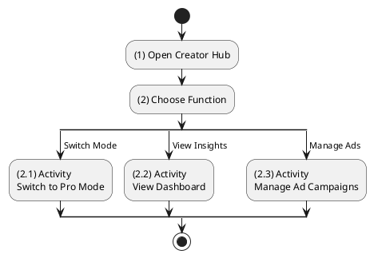
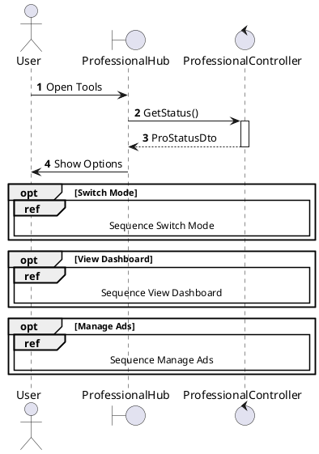
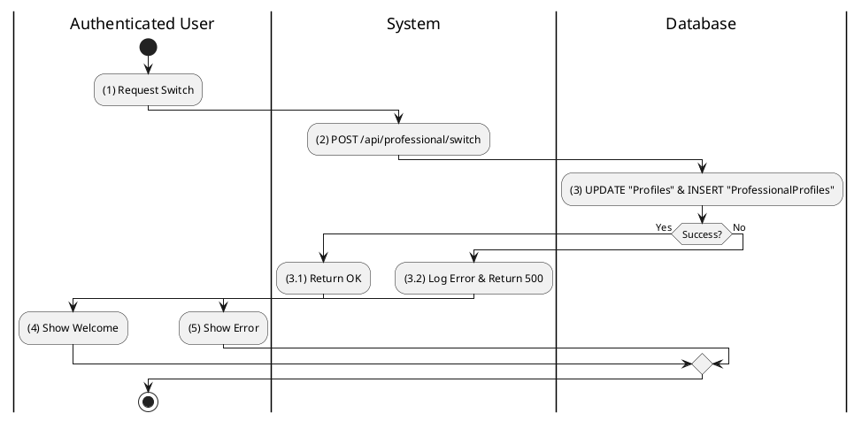
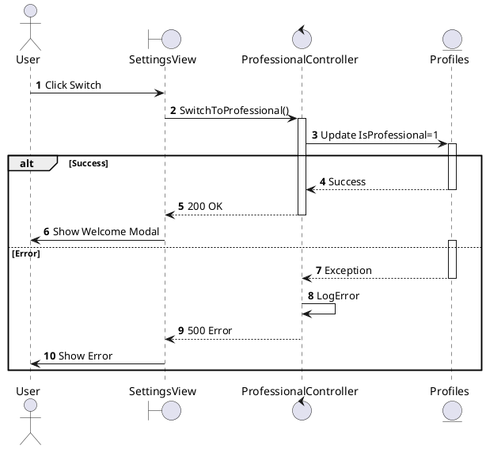
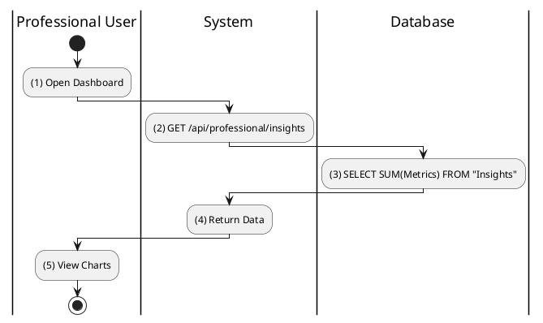
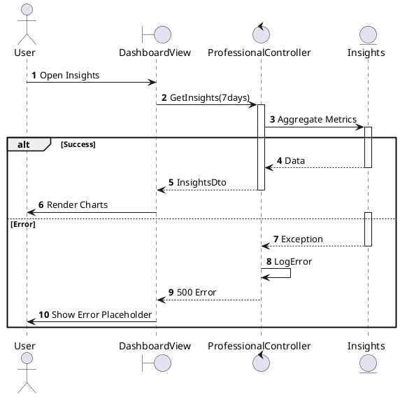
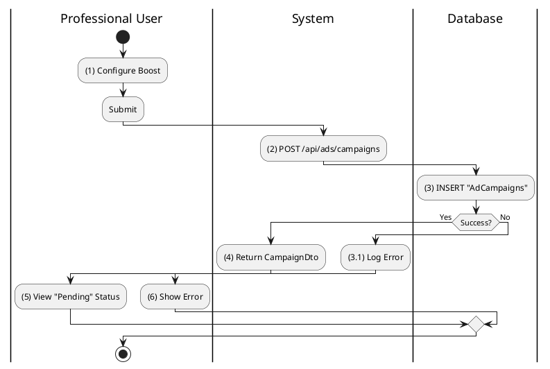
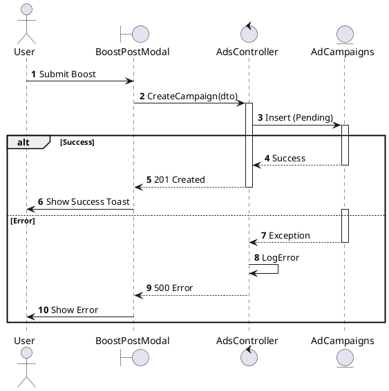

# Use Case 2.1.11: Adjust Professional Profile (Creator Tools)

**Module**: Professional Tools
**Primary Actor**: Authenticated User (Creator/Business)
**Backend Controller**: `ProfessionalController`
**Database Tables**: `ProfessionalProfiles`, `Insights`, `AdCampaigns`

---

## 2.1.11.1 Adjust Professional Profile (Overview)

### Use Case Description
| Attribute | Details |
| :--- | :--- |
| **Name** | **Adjust Professional Profile** |
| **Description** | Central hub for creators to manage professional tools, insights, and advertising. |
| **Actor** | Authenticated User |
| **Trigger** | ❖ User accesses the "Professional Dashboard" or "Creator Tools" section. |
| **Post-condition** | ❖ User views insights, manages ads, or toggles professional mode. |

### Business Rules (BR)

| Activity | BR Code | Description |
| :---: | :---: | :--- |
| (1) | BR1 | **Initialization:** ❖ The **System** displays the professional dashboard if the user has a Professional Profile. ❖ If not, it offers the option to "Switch to Professional Mode". |

### Diagrams

**Activity Diagram**

**Sequence Diagram**

---

## 2.1.11.2 Switch to Professional Mode

### Use Case Description
| Attribute | Details |
| :--- | :--- |
| **Name** | **Switch to Professional Mode** |
| **Description** | Convert a personal profile to a professional one to unlock insights and tools. |
| **Actor** | Authenticated User |
| **Trigger** | ❖ User clicks "Switch to Professional Mode" in settings. |
| **Pre-condition** | ❖ User has a standard personal profile. |
| **Post-condition** | ❖ User profile `IsProfessional` flag is set to True. ❖ `ProfessionalProfiles` record is initialized. |

### Business Rules (BR)

| Activity | BR Code | Description |
| :---: | :---: | :--- |
| (2)-(3) | BR1 | **Processing:** ❖ The **Frontend** `SwitchModeModal` prompts for confirmation and calls `proApi.switchMode()`. ❖ The **API** receives a `POST` request at `/api/professional/switch`. ❖ The **Backend** `ProfessionalController.SwitchToProfessional(userId)` executes the logic. ❖ The **Database** updates `Profiles` setting `IsProfessional=1` and inserts a new record into `ProfessionalProfiles` with `Category`. |
| (3.1) | BR2 | **Completion:** ❖ The **System** returns `200 OK`. ❖ The **Frontend** refreshes the user profile data, unlocks the "Dashboard" link in the sidebar, and shows a "Welcome" modal. |
| (3.2) | BR_Error | **Error:** ❖ **DB Error**: `500` is returned and logged. ❖ The **Frontend** displays "Failed to switch mode". |

### Diagrams

**Activity Diagram**

**Sequence Diagram**

---

## 2.1.11.3 View Professional Dashboard (Insights)

### Use Case Description
| Attribute | Details |
| :--- | :--- |
| **Name** | **View Professional Dashboard** |
| **Description** | View real-time reach, engagement, and follower growth metrics. |
| **Actor** | Professional User |
| **Trigger** | ❖ User clicks "Professional Dashboard". |
| **Pre-condition** | ❖ User is in Professional Mode. |
| **Post-condition** | ❖ System displays charts and key performance indicators (KPIs). |

### Business Rules (BR)

| Activity | BR Code | Description |
| :---: | :---: | :--- |
| (2)-(3) | BR1 | **Query:** ❖ The **Frontend** `ProDashboard` component calls `proApi.getInsights({ days: 7 })`. ❖ The **API** receives `GET /api/professional/insights?days=7`. ❖ The **Backend** `ProfessionalController.GetInsights` is invoked. ❖ The **Database** executes `SELECT SUM(Impressions), SUM(Reach)` from `Insights` where `ProfileId` matches the user and `Date` is within the range. |
| (4) | BR2 | **Rendering:** ❖ The **System** returns `200 OK` with the `InsightsDto`. ❖ The **Frontend** uses `Recharts` to render Line and Bar charts for Reach and Engagement. |
| (4.1) | BR_Error | **Error:** ❖ **Server**: `500`. ❖ The **Frontend** displays a "Data unavailable" placeholder. |

### Diagrams

**Activity Diagram**

**Sequence Diagram**

---

## 2.1.11.4 Manage Ad Campaigns (Boost Post)

### Use Case Description
| Attribute | Details |
| :--- | :--- |
| **Name** | **Manage Ad Campaigns** |
| **Description** | Create or monitor paid boosts for posts. |
| **Actor** | Professional User |
| **Trigger** | ❖ User clicks "Boost Post" on a specific post. |
| **Post-condition** | ❖ Ad Campaign created and submitted for review. |

### Business Rules (BR)

| Activity | BR Code | Description |
| :---: | :---: | :--- |
| (2)-(3) | BR1 | **Processing:** ❖ The **Frontend** `BoostPostModal` submits `adsApi.createCampaign({ postId, budget, duration })`. ❖ The **API** receives a `POST` request at `/api/ads/campaigns`. ❖ The **Backend** `AdsController.CreateCampaign` processes the request. ❖ The **Database** inserts `AdCampaigns` with `PostId`, `Budget`, and `Status='Pending'`. |
| (4) | BR2 | **Payment:** ❖ The **System** performs a mock payment authorization via `_paymentGateway.Authorize(amount)`. ❖ The **System** returns `201 Created`. ❖ The **Frontend** shows a toast "Boost submitted for review". |
| (5) | BR_Error | **Error:** ❖ **Payment Fail**: `402 Payment Required`. ❖ **Server**: `500`. |

### Diagrams

**Activity Diagram**

**Sequence Diagram**

