# Use Case 2.1.12: Adjust Community Group (Advanced Governance)

**Module**: Communities / Groups
**Primary Actor**: Authenticated User
**Backend Controller**: `GroupsController`
**Database Tables**: `Groups`, `GroupMembers`, `GroupPosts`, `GroupJoinRequests`

---

## 2.1.12.1 Adjust Group (Overview)

### Use Case Description
| Attribute | Details |
| :--- | :--- |
| **Name** | **Adjust Group** |
| **Description** | Central hub for interacting with community groups. |
| **Actor** | Authenticated User |
| **Trigger** | ❖ User enters a Group Page. |
| **Post-condition** | ❖ User views content, joins/leaves, or moderates the group. |

### Business Rules (BR)
| Activity | BR Code | Description |
| :---: | :---: | :--- |
| (1) | BR1 | **Initialization:** ❖ System loads Group details and permissions based on the user's role (Admin, Moderator, Member, Guest). ❖ System displays options relevant to the role (e.g., "Settings" for Admins). |

### Diagrams

**Activity Diagram**
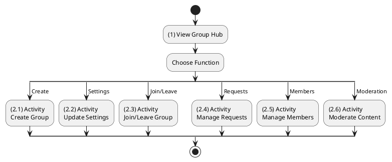

**Sequence Diagram**
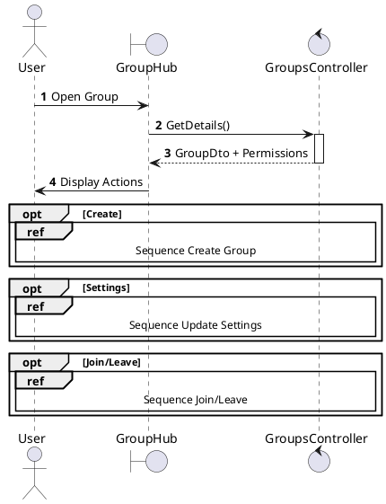

---

## 2.1.12.2 Create Group

### Use Case Description
| Attribute | Details |
| :--- | :--- |
| **Name** | **Create Group** |
| **Description** | Establish a new community. |
| **Actor** | Authenticated User |
| **Trigger** | ❖ User clicks "Create Group". |
| **Post-condition** | ❖ Group created, User becomes Admin. |

### Business Rules (BR)
| Activity | BR Code | Description |
| :---: | :---: | :--- |
| (2)-(3) | BR1 | **Creation:** ❖ System validates Name and Privacy (Public/Private) (Step 2). ❖ System inserts `Groups` record (Step 3). ❖ System adds the Creator to `GroupMembers` as ROLE_ADMIN. |
| (4) | BR_Error | **Exception:** ❖ Log Error, Return 500, Show Error. |

### Diagrams

**Activity Diagram**
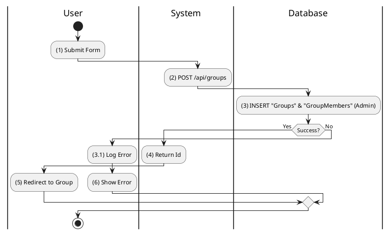

**Sequence Diagram**
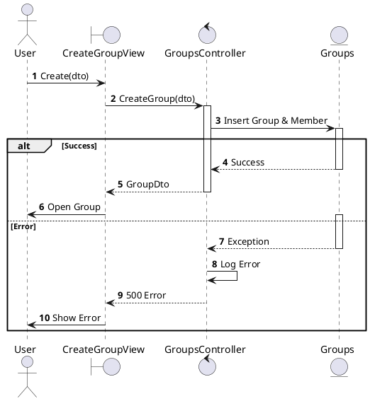

---

## 2.1.12.3 Update Group Settings (Rules, Privacy)

### Use Case Description
| Attribute | Details |
| :--- | :--- |
| **Name** | **Update Group Settings** |
| **Description** | Modify rules, privacy, or cover photo. |
| **Actor** | Group Admin |
| **Trigger** | ❖ Admin saves changes in Settings. |

### Business Rules (BR)
| Activity | BR Code | Description |
| :---: | :---: | :--- |
| (2)-(3) | BR1 | **Update Logic:** ❖ System checks Admin Permissions (Step 2). ❖ System updates `Groups` table (Step 3). |
| (4) | BR2 | **Display:** ❖ UI refreshes Group Info. |

### Diagrams

**Activity Diagram**
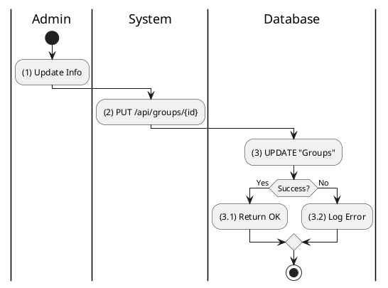

**Sequence Diagram**
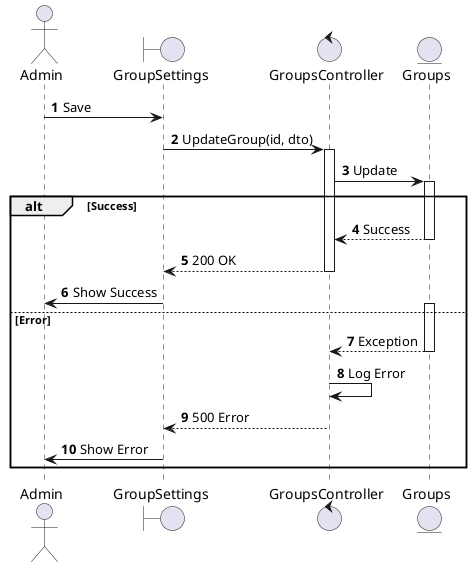

---

## 2.1.12.4 Join / Leave Group

### Use Case Description
| Attribute | Details |
| :--- | :--- |
| **Name** | **Join / Leave Group** |
| **Description** | Request access or exit a group. |
| **Actor** | Authenticated User |
| **Trigger** | ❖ User clicks Join or Leave. |

### Business Rules (BR)
| Activity | BR Code | Description |
| :---: | :---: | :--- |
| (2) | BR1 | **Type Check:** ❖ If Public: Add directly to `GroupMembers`. ❖ If Private: Add to `GroupJoinRequests`. |
| (3) | BR2 | **Leaving:** ❖ Remove from `GroupMembers`. |

### Diagrams

**Activity Diagram**
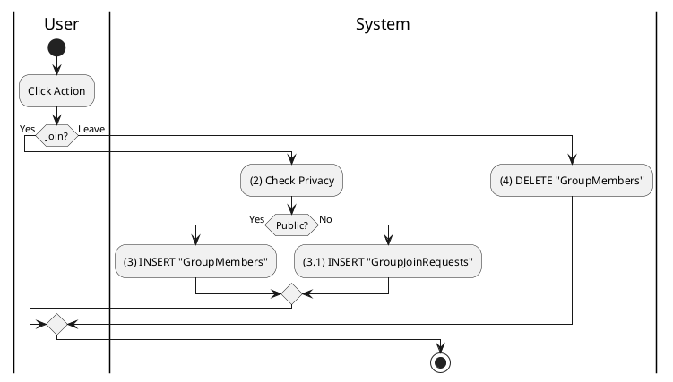

**Sequence Diagram**
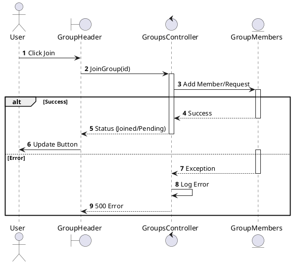

---

## 2.1.12.5 Manage Join Requests

### Use Case Description
| Attribute | Details |
| :--- | :--- |
| **Name** | **Manage Join Requests** |
| **Description** | Approve or Reject pending members. |
| **Actor** | Group Admin / Moderator |

### Business Rules (BR)
| Activity | BR Code | Description |
| :---: | :---: | :--- |
| (2)-(3) | BR1 | **Decision:** ❖ Approve: Move from `Requests` to `Members`. ❖ Reject: Delete from `Requests`. |

### Diagrams

**Activity Diagram**
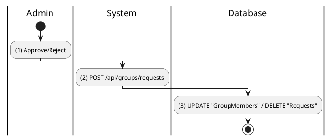

**Sequence Diagram**
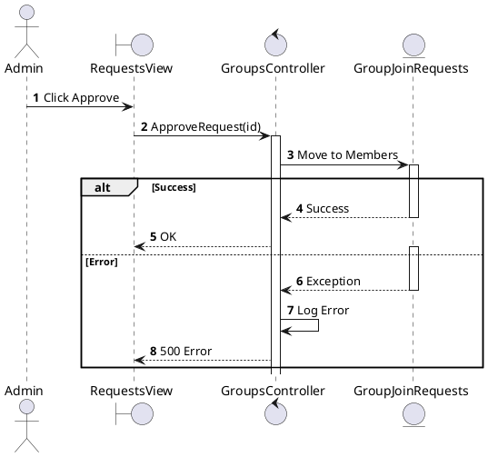

---

## 2.1.12.6 Manage Group Members (Ban/Mute)

### Use Case Description
| Attribute | Details |
| :--- | :--- |
| **Name** | **Manage Group Members** |
| **Description** | Kick, Ban, or Promote members. |
| **Actor** | Group Admin |

### Business Rules (BR)
| Activity | BR Code | Description |
| :---: | :---: | :--- |
| (1) | BR1 | **Action:** ❖ Admin selects member and action (Kick/Ban). ❖ System updates `GroupMembers` (Role or Status). |

### Diagrams

**Activity Diagram**
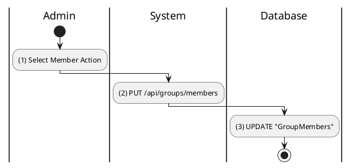

**Sequence Diagram**
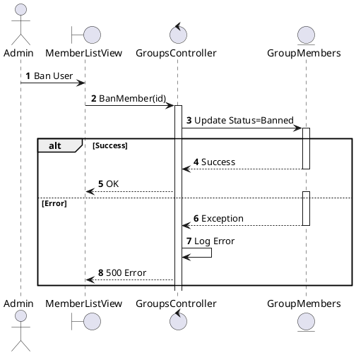

---

## 2.1.12.7 Moderate Group Content (Approve/Reject Queue)

### Use Case Description
| Attribute | Details |
| :--- | :--- |
| **Name** | **Moderate Group Content** |
| **Description** | Review posts held for moderation. |
| **Actor** | Group Admin / Moderator |

### Business Rules (BR)
| Activity | BR Code | Description |
| :---: | :---: | :--- |
| (1) | BR1 | **Review:** ❖ Admin views pending posts. ❖ Approve: `Posts.Status` = Active. ❖ Reject: `Posts.IsDeleted` = 1. |

### Diagrams

**Activity Diagram**
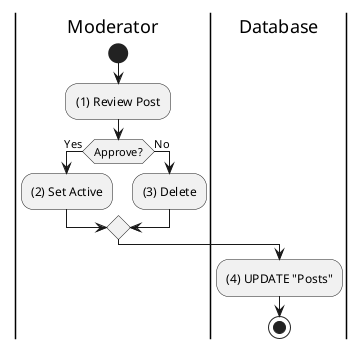

**Sequence Diagram**
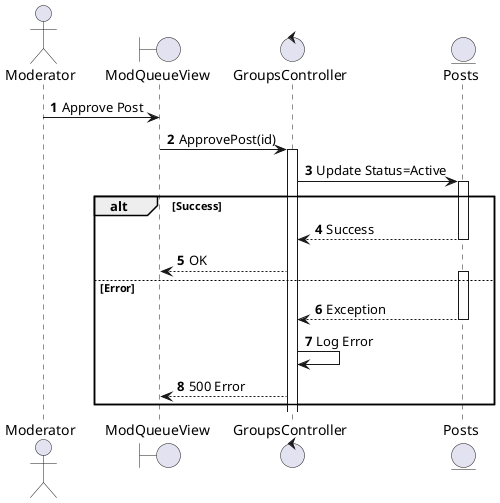
