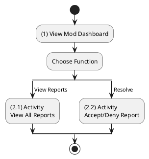
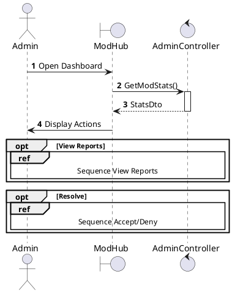
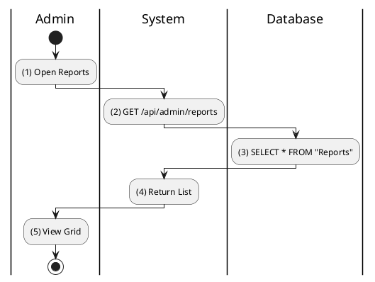
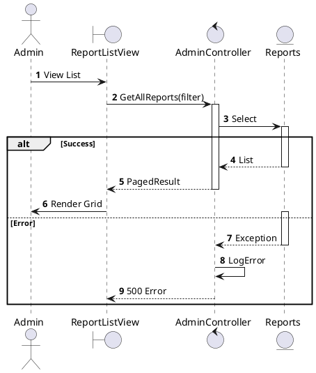
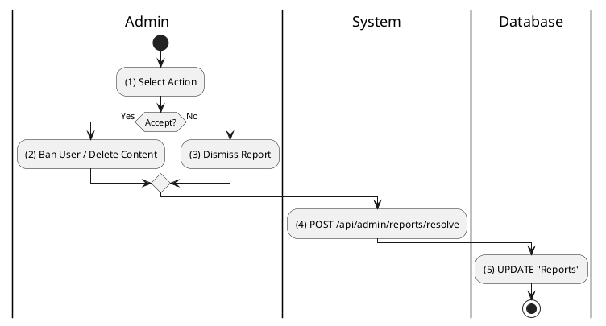
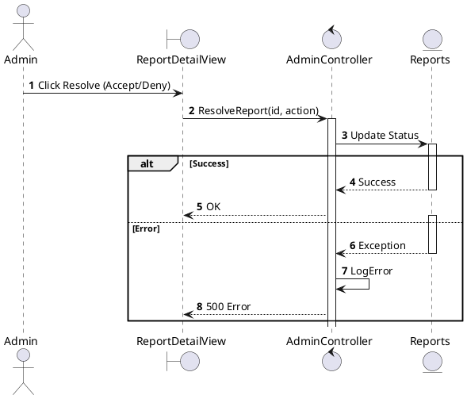

# Use Case 2.1.13: Admin User-Level Moderation

**Module**: Administration / Moderation
**Primary Actor**: System Administrator
**Backend Controller**: `AdminController`
**Database Tables**: `Reports`, `Profiles`

---

## 2.1.13.1 Admin Moderation (Overview)

### Use Case Description
| Attribute | Details |
| :--- | :--- |
| **Name** | **Admin Moderation** |
| **Description** | Central hub for reviewing and acting on user reports. |
| **Actor** | System Administrator |
| **Trigger** | ❖ Admin enters the "Moderation Dashboard". |
| **Post-condition** | ❖ Admin views pending reports or takes action. |

### Business Rules (BR)
| Activity | BR Code | Description |
| :---: | :---: | :--- |
| (1) | BR1 | **Initialization:** ❖ System loads list of relevant Reports (Status=Pending). ❖ System displays summary stats (Total Open, High Priority). |

### Diagrams

**Activity Diagram**

**Sequence Diagram**

---

## 2.1.13.2 View all user report

### Use Case Description
| Attribute | Details |
| :--- | :--- |
| **Name** | **View all user report** |
| **Description** | List all reports against users or content. |
| **Actor** | System Administrator |
| **Trigger** | ❖ Admin clicks "Reports" tab. |

### Business Rules (BR)
| Activity | BR Code | Description |
| :---: | :---: | :--- |
| (2)-(3) | BR1 | **Query:** ❖ **Frontend**: `AdminReports`. Calls `adminApi.getReports(filter)`. ❖ **API**: `GET /api/admin/reports`. ❖ **Backend**: `AdminController.GetReports`. ❖ **DB**: `SELECT * FROM Reports r JOIN Profiles p ON r.ReporterId = p.Id`. |

### Diagrams

**Activity Diagram**

**Sequence Diagram**

---

## 2.1.13.3 Accept/Deny user report

### Use Case Description
| Attribute | Details |
| :--- | :--- |
| **Name** | **Accept/Deny user report** |
| **Description** | Resolve a report by banning/warning (Accept) or dismissing (Deny). |
| **Actor** | System Administrator |
| **Trigger** | ❖ Admin selects action on a report. |

### Business Rules (BR)
| Activity | BR Code | Description |
| :---: | :---: | :--- |
| (1)-(2) | BR1 | **Process:** ❖ **Frontend**: Click "Ban User & Resolve". Calls `adminApi.resolve({ reportId, action: 'Ban' })`. ❖ **API**: `POST /api/admin/reports/{id}/resolve`. ❖ **Backend**: `AdminController.ResolveReport`. ❖ **DB**: Transaction:  1. `UPDATE Reports SET Status='Resolved'.`  2. `INSERT INTO UserModerations (Ban)...` |
| (3) | BR2 | **Audit:** ❖ `INSERT INTO AuditLogs (AdminId, Action, Timestamp)`. |

### Diagrams

**Activity Diagram**

**Sequence Diagram**

