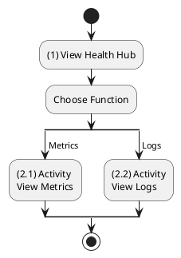
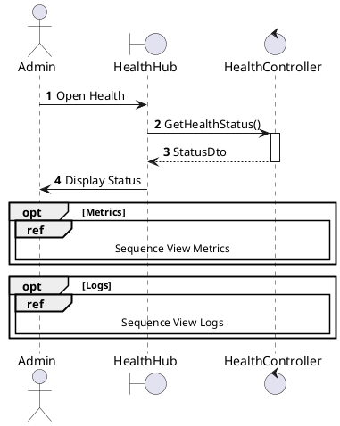
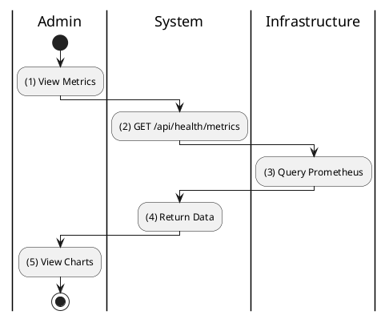
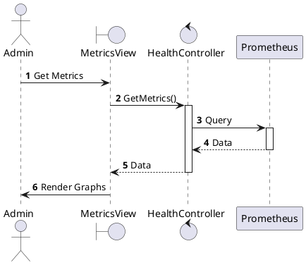
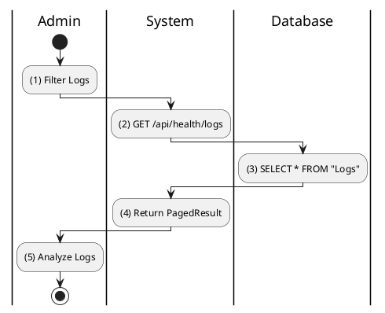
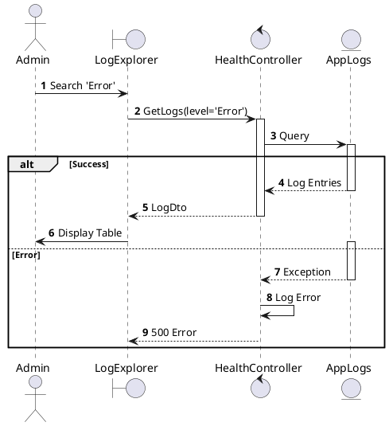

# Use Case 2.1.14: Monitor System Health

**Module**: System Administration
**Primary Actor**: System Administrator / DevOps
**Backend Controller**: `SystemHealthController`
**Infrastructure**: `Prometheus`, `Serilog`, `Seq`

---

## 2.1.14.1 Monitor System Health (Overview)

### Use Case Description
| Attribute | Details |
| :--- | :--- |
| **Name** | **Monitor System Health** |
| **Description** | Central hub for observing application performance and logs. |
| **Actor** | System Administrator |
| **Trigger** | ❖ Admin enters "System Health" section. |
| **Post-condition** | ❖ Admin views metrics or logs. |

### Business Rules (BR)
| Activity | BR Code | Description |
| :---: | :---: | :--- |
| (1) | BR1 | **Initialization:** ❖ System checks service statuses (DB, Cache, Storage). ❖ System displays "Health Status" (Green/Yellow/Red). |

### Diagrams

**Activity Diagram**

**Sequence Diagram**

---

## 2.1.14.2 View Real-time Metrics (CPU, RAM, API Latency)

### Use Case Description
| Attribute | Details |
| :--- | :--- |
| **Name** | **View Real-time Metrics** |
| **Description** | Monitor resource usage and performance. |
| **Actor** | Admin |
| **Trigger** | ❖ Admin clicks "Metrics". |

### Business Rules (BR)
| Activity | BR Code | Description |
| :---: | :---: | :--- |
| (2)-(3) | BR1 | **Data Retrieval:** ❖ **Frontend**: `MetricsDashboard`. Polls `healthApi.getMetrics()`. ❖ **API**: `GET /api/health/metrics`. ❖ **Backend**: `SystemHealthController.GetMetrics`. ❖ **Infrastructure**: Queries `Prometheus` HTTP API /metrics endpoint. |
| (3.1) | BR_Error | **Exception:** ❖ Returns `503 Service Unavailable` if Prometheus unreachable. |

### Diagrams

**Activity Diagram**

**Sequence Diagram**

---

## 2.1.14.3 View Application Logs (Error/Info/Warn)

### Use Case Description
| Attribute | Details |
| :--- | :--- |
| **Name** | **View Application Logs** |
| **Description** | Inspect system logs for troubleshooting. |
| **Actor** | Admin |
| **Trigger** | ❖ Admin clicks "Logs". |

### Business Rules (BR)
| Activity | BR Code | Description |
| :---: | :---: | :--- |
| (2)-(3) | BR1 | **Log Query:** ❖ **Frontend**: `LogExplorer`. Calls `healthApi.getLogs({ level: 'Error' })`. ❖ **API**: `GET /api/health/logs?level=Error`. ❖ **Backend**: `SystemHealthController.GetLogs`. ❖ **Infrastructure**: Queries `Seq` or `ElasticSearch` via HTTP Client. |

### Diagrams

**Activity Diagram**

**Sequence Diagram**

