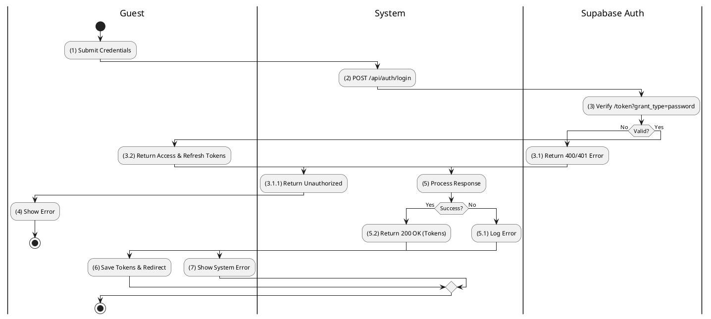
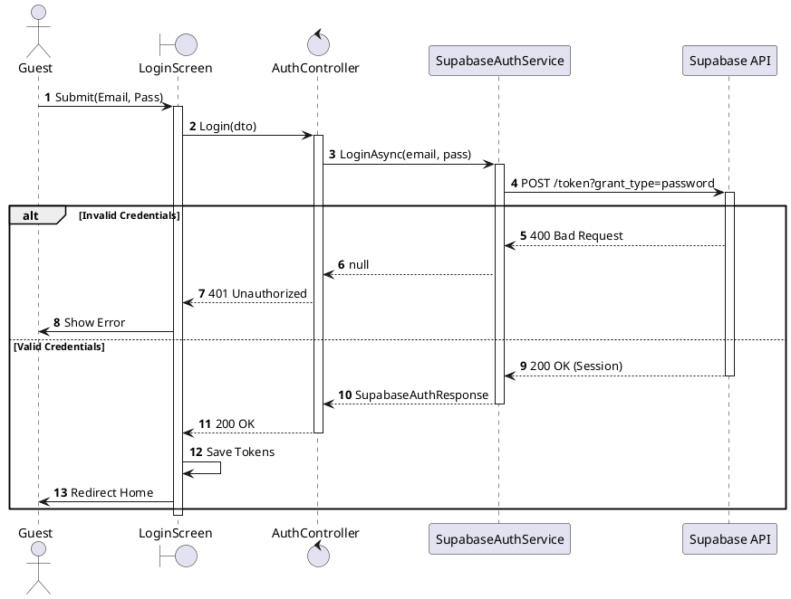
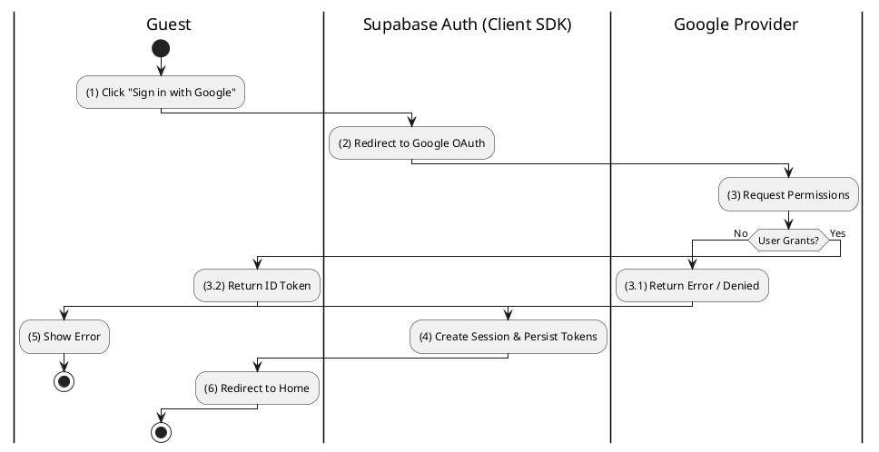
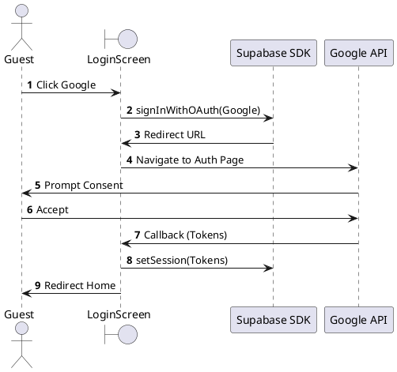
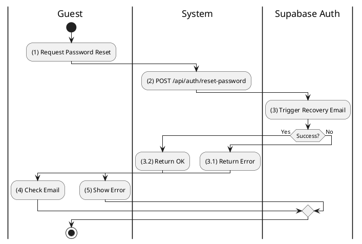
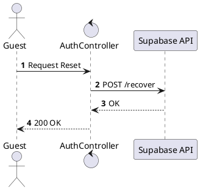
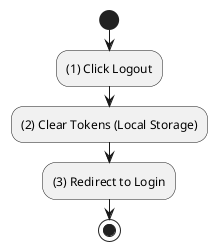
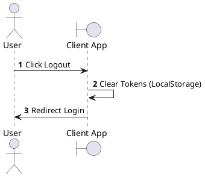

# Use Case 2.1.1: Sign In

**Module**: Authentication
**Primary Actor**: User (Guest / Authenticated)
**Backend Controller**: `AuthController`
**Database Tables**: `Profiles` (Read-Only via Sync), Supabase Auth (External)

---

## 2.1.1.1 Sign In (Email/Password)

### Use Case Description
| Attribute | Details |
| :--- | :--- |
| **Name** | **Sign In (Email/Password)** |
| **Description** | Authenticate user using Supabase credentials. |
| **Actor** | Guest |
| **Trigger** | ❖ User clicks [btnLogin] on the Login Screen. |
| **Pre-condition** | ❖ User account exists in Supabase. |
| **Post-condition** | ❖ System returns Supabase Access/Refresh Tokens. ❖ User is redirected to Home. |

### Business Rules (BR)

| Activity | BR Code | Description |
| :---: | :---: | :--- |
| (2)-(3) | BR1 | **Submission:** ❖ **Frontend**: `LoginForm` calls `authApi.login({email, password})`. ❖ **API Call**: `POST /api/auth/login` with Body: `LoginDto { Email, Password }`. ❖ **Backend**: `AuthController.Login(dto)` invokes `_supabase.LoginAsync(email, password)`. ❖ **Service**: `SupabaseAuthService` sends `POST /auth/v1/token?grant_type=password` to Supabase Auth Server. |
| (3.1)-(4) | BR2 | **Validation (External):** ❖ **Supabase**: Verifies credentials against `auth.users` table.  **Invalid**: Returns `400 Bad Request` ("invalid_grant").  **Valid**: Returns `200 OK` with `access_token`, `refresh_token`, `user` object. |
| (5.2)-(6) | BR3 | **Completion:** ❖ **Backend**: `SupabaseAuthService` deserializes JSON to `SupabaseAuthResponse`. ❖ **Controller**: Returns `200 OK (SupabaseAuthResponse)`. ❖ **Frontend**: `authSlice` stores tokens in `localStorage`/`Redux State`. Redirects to `/home`. |
| (5.1)-(7) | BR_Error | **Exception Handling:** ❖If Supabase returns `400`: `AuthController` returns `401 Unauthorized` `{ code: "INVALID_CREDENTIALS", message: "Email hoặc mật khẩu không đúng." }`. ❖ **Frontend**: Displays error message toast to user. |

### Diagrams

**Activity Diagram**

**Sequence Diagram**

---

## 2.1.1.2 Sign In (OAuth - Google)

### Use Case Description
| Attribute | Details |
| :--- | :--- |
| **Name** | **Sign In (OAuth - Google)** |
| **Description** | Authenticate via Google using Supabase Client SDK. |
| **Actor** | Guest |
| **Trigger** | ❖ User clicks [Sign in with Google]. |
| **Pre-condition** | ❖ Google Auth enabled in Supabase Project. |
| **Post-condition** | ❖ Supabase Session created. ❖ Webhook syncs Profile (if new). |

### Business Rules (BR)

| Activity | BR Code | Description |
| :---: | :---: | :--- |
| (1)-(3) | BR1 | **Initiation:** ❖ **Frontend**: `LoginScreen` calls `supabase.auth.signInWithOAuth({ provider: 'google' })`. ❖ **SDK**: Redirects browser to `https://<project-ref>.supabase.co/auth/v1/authorize?provider=google`. ❖ **User Action**: User consents on Google Consent Screen. |
| (3.2)-(4) | BR2 | **Callback & Sync:** ❖ **Supabase**: Redirects to `SiteURL` with `access_token` and `refresh_token` in URL fragment. ❖ **Frontend**: `SupabaseAuthProvider` detects `onAuthStateChange`. ❖ **Backend (Sync)**: Supabase Webhook triggers `POST /api/profilessync/sync` (if configured) or Client calls `POST /api/auth/sync` (optional fallback). ❖ **Web App**: Persists session to `localStorage`. |
| (3.1)-(5) | BR_Error | **Exception:** ❖ **Frontend**: If `error` param present in URL or user cancels, show "Login Cancelled" notification. |

### Diagrams

**Activity Diagram**

**Sequence Diagram**

---

## 2.1.1.4 Reset Password

### Use Case Description
| Attribute | Details |
| :--- | :--- |
| **Name** | **Reset Password (Creative)** |
| **Description** | Reset password via Supabase recovery flow. |
| **Actor** | Guest |
| **Trigger** | ❖ User clicks "Forgot Password". |
| **Pre-condition** | ❖ Email exists in Supabase. |
| **Post-condition** | ❖ Password updated. |

### Business Rules (BR)

| Activity | BR Code | Description |
| :---: | :---: | :--- |
| (2)-(3) | BR1 | **Request:** ❖ **Frontend**: `ForgotPasswordForm` calls `supabase.auth.resetPasswordForEmail(email, { redirectTo: '.../reset-password' })`. ❖ **Supabase**: Sends generic recovery email with Magic Link. ❖ **Note**: No Backend API call needed for this step (purely client-SDK mediated). |
| (4) | BR2 | **Completion:** ❖ **User Interaction**: Clicks link in email -> Redirects to App with `access_token` (type=recovery). ❖ **Frontend**: Detects `recovery` event. Shows `ResetPasswordScreen`. ❖ **Action**: User enters new password. Frontend calls `supabase.auth.updateUser({ password: newPassword })`. |

### Diagrams

**Activity Diagram**

**Sequence Diagram**

---

## 2.1.1.6 Logout

### Use Case Description
| Attribute | Details |
| :--- | :--- |
| **Name** | **Logout** |
| **Description** | Clear session. |
| **Actor** | Authenticated User |
| **Note** | **Client-Side Only**. No Backend Endpoint found in codebase. |

### Business Rules (BR)

| Activity | BR Code | Description |
| :---: | :---: | :--- |
| (1)-(2) | BR1 | **Action:** ❖ **Frontend**: User clicks Logout button. ❖ **SDK**: Calls `supabase.auth.signOut()`. ❖ **Cleanup**: Removes `sb-<ref>-auth-token` from LocalStorage. Clears Redux/Context state. |
| (3) | BR2 | **Redirect:** ❖ **Router**: Detects unauthenticated state. Redirects to `/login`. |

### Diagrams

**Activity Diagram**

**Sequence Diagram**

