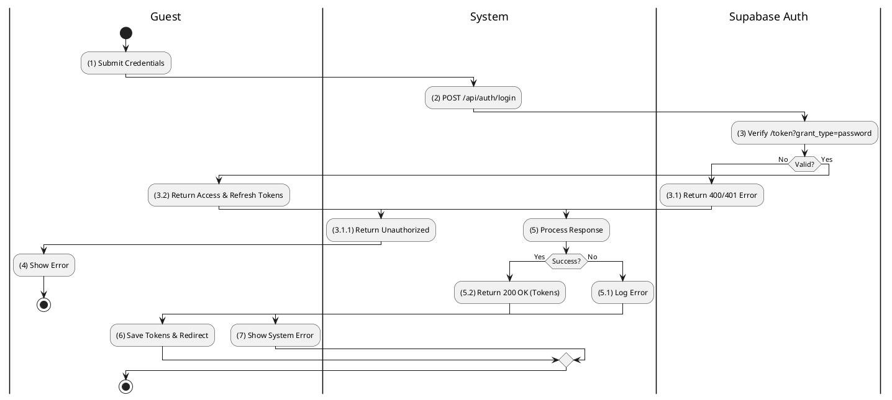
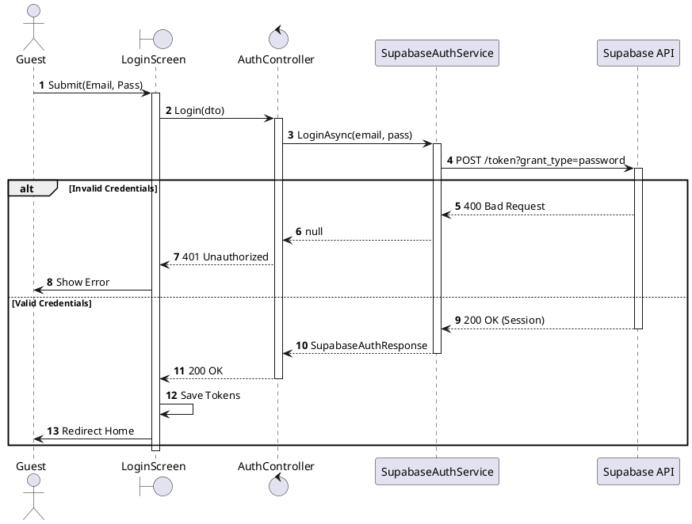
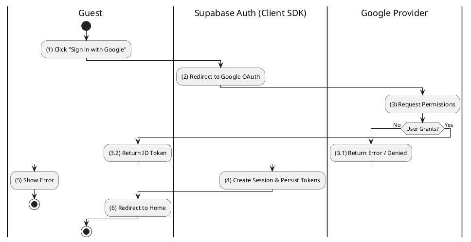
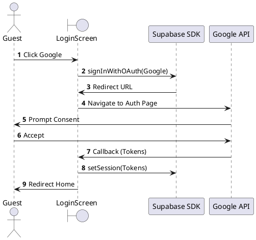
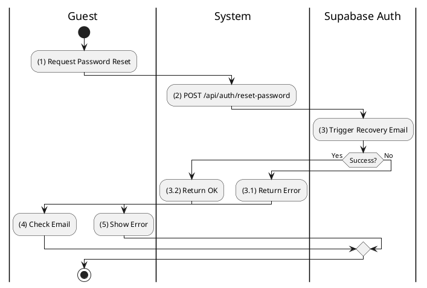
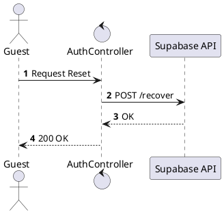
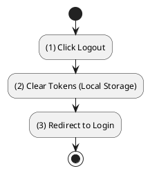
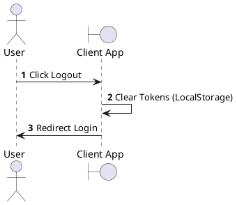

# Use Case 2.1.1: Sign In

**Module**: Authentication
**Primary Actor**: User (Guest / Authenticated)
**Backend Controller**: `AuthController`
**Database Tables**: `Profiles` (Read-Only via Sync), Supabase Auth (External)

---

## 2.1.1.1 Sign In (Email/Password)

### Use Case Description
| Attribute | Details |
| :--- | :--- |
| **Name** | **Sign In (Email/Password)** |
| **Description** | Authenticate user using Supabase credentials. |
| **Actor** | Guest |
| **Trigger** | ❖ User clicks [btnLogin] on the Login Screen. |
| **Pre-condition** | ❖ User account exists in Supabase. |
| **Post-condition** | ❖ System returns Supabase Access/Refresh Tokens. ❖ User is redirected to Home. |

### Business Rules (BR)

| Activity | BR Code | Description |
| :---: | :---: | :--- |
| (2)-(3) | BR1 | **Submission:** ❖ The **Frontend** `LoginForm` captures the credentials and initiates a call to `authApi.login({email, password})`. ❖ The **API** receives a `POST` request at `/api/auth/login` containing the `LoginDto` payload. ❖ The **Backend** method `AuthController.Login(dto)` delegates the authentication logic to `_supabase.LoginAsync(email, password)`. ❖ The `SupabaseAuthService` sends a `POST` request to the external Supabase Auth Server at `/auth/v1/token` with `grant_type=password`. |
| (3.1)-(4) | BR2 | **Validation (External):** ❖ **Supabase** verifies the provided credentials against its `auth.users` table.  If **Invalid**, Supabase returns `400 Bad Request` with the error "invalid_grant".  If **Valid**, Supabase returns `200 OK` containing the `access_token`, `refresh_token`, and the `user` object. |
| (5.2)-(6) | BR3 | **Completion:** ❖ The **Backend** service `SupabaseAuthService` deserializes the JSON response into a `SupabaseAuthResponse` object. ❖ The **Controller** returns a `200 OK` response wrapping the auth data. ❖ The **Frontend** `authSlice` securely stores the tokens in `localStorage` or `Redux State` and redirects the **User** to the `/home` page. |
| (5.1)-(7) | BR_Error | **Exception Handling:** ❖ If Supabase returns a `400` error, the `AuthController` translates this to a `401 Unauthorized` response with the message "Email hoặc mật khẩu không đúng.". ❖ The **Frontend** displays an error message toast to the **User**. |

### Diagrams

**Activity Diagram**

**Sequence Diagram**

---

## 2.1.1.2 Sign In (OAuth - Google)

### Use Case Description
| Attribute | Details |
| :--- | :--- |
| **Name** | **Sign In (OAuth - Google)** |
| **Description** | Authenticate via Google using Supabase Client SDK. |
| **Actor** | Guest |
| **Trigger** | ❖ User clicks [Sign in with Google]. |
| **Pre-condition** | ❖ Google Auth enabled in Supabase Project. |
| **Post-condition** | ❖ Supabase Session created. ❖ Webhook syncs Profile (if new). |

### Business Rules (BR)

| Activity | BR Code | Description |
| :---: | :---: | :--- |
| (1)-(3) | BR1 | **Initiation:** ❖ The **Frontend** `LoginScreen` calls the SDK method `supabase.auth.signInWithOAuth({ provider: 'google' })`. ❖ The **SDK** redirects the browser to the Supabase authorization endpoint `https://<project-ref>.supabase.co/auth/v1/authorize?provider=google`. ❖ The **User** consents to the login on the Google Consent Screen. |
| (3.2)-(4) | BR2 | **Callback & Sync:** ❖ Top completion, **Supabase** redirects back to the `SiteURL` with the `access_token` and `refresh_token` in the URL fragment. ❖ The **Frontend** `SupabaseAuthProvider` detects the session change via `onAuthStateChange`. ❖ The **Backend** receives a Supabase Webhook event to `POST /api/profilessync/sync` (if configured) or the Client manually calls `POST /api/auth/sync` as a fallback to sync the profile. ❖ The **Web App** persists the session to `localStorage`. |
| (3.1)-(5) | BR_Error | **Exception:** ❖ If the `error` parameter is present in the URL or the user cancels the operation, the **Frontend** displays a "Login Cancelled" notification. |

### Diagrams

**Activity Diagram**

**Sequence Diagram**

---

## 2.1.1.4 Reset Password

### Use Case Description
| Attribute | Details |
| :--- | :--- |
| **Name** | **Reset Password (Creative)** |
| **Description** | Reset password via Supabase recovery flow. |
| **Actor** | Guest |
| **Trigger** | ❖ User clicks "Forgot Password". |
| **Pre-condition** | ❖ Email exists in Supabase. |
| **Post-condition** | ❖ Password updated. |

### Business Rules (BR)

| Activity | BR Code | Description |
| :---: | :---: | :--- |
| (2)-(3) | BR1 | **Request:** ❖ The **Frontend** `ForgotPasswordForm` calls `supabase.auth.resetPasswordForEmail(email, { redirectTo: '.../reset-password' })`. ❖ **Supabase** sends a generic recovery email containing a Magic Link to the user. ❖ **Note**: No Backend API call is needed for this step as it is handled entirely by the Client SDK. |
| (4) | BR2 | **Completion:** ❖ The **User** clicks the link in the email and is redirected back to the App with an `access_token` (type=recovery). ❖ The **Frontend** detects the `recovery` event and displays the `ResetPasswordScreen`. ❖ After the **User** enters a new password, the **Frontend** calls `supabase.auth.updateUser({ password: newPassword })` to finalize the change. |

### Diagrams

**Activity Diagram**

**Sequence Diagram**

---

## 2.1.1.6 Logout

### Use Case Description
| Attribute | Details |
| :--- | :--- |
| **Name** | **Logout** |
| **Description** | Clear session. |
| **Actor** | Authenticated User |
| **Note** | **Client-Side Only**. No Backend Endpoint found in codebase. |

### Business Rules (BR)

| Activity | BR Code | Description |
| :---: | :---: | :--- |
| (1)-(2) | BR1 | **Action:** ❖ The **Frontend** detects the user clicking the Logout button and calls `supabase.auth.signOut()`. ❖ The **SDK** cleans up the session by removing the `sb-<ref>-auth-token` from `LocalStorage` and clearing the Redux/Context state. |
| (3) | BR2 | **Redirect:** ❖ The **Router** detects the unauthenticated state and redirects the **User** to the `/login` page. |

### Diagrams

**Activity Diagram**

**Sequence Diagram**

