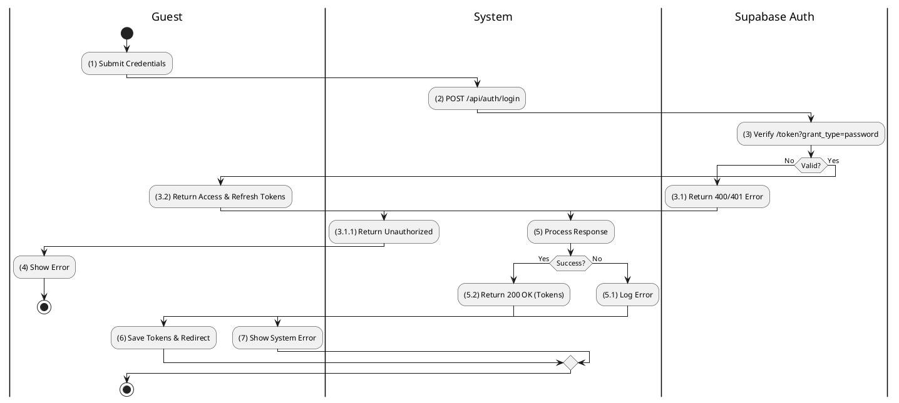
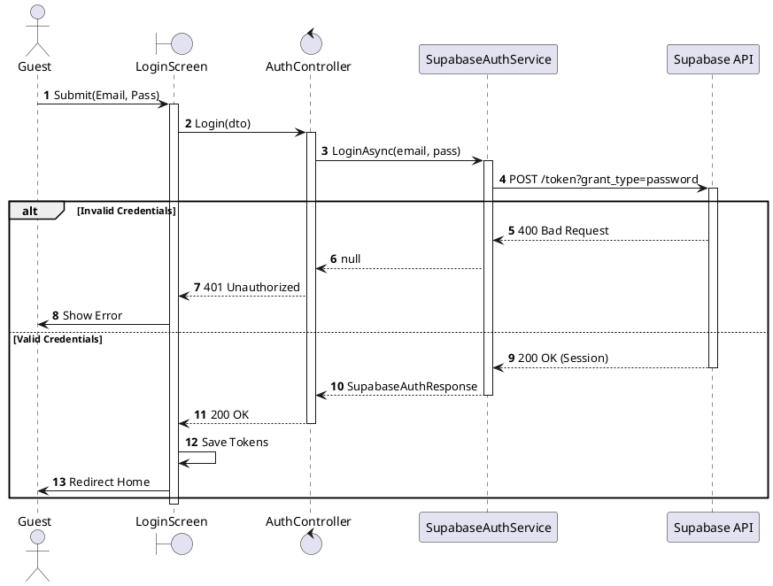
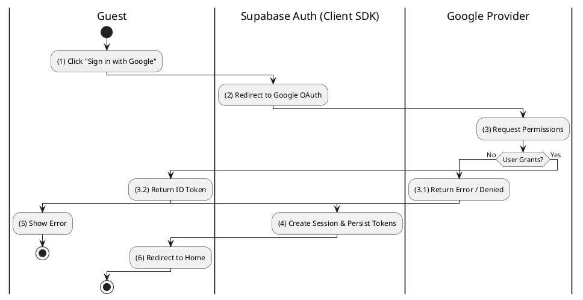
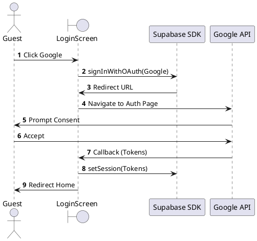
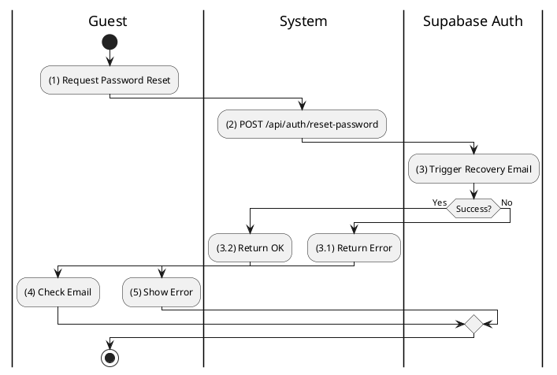
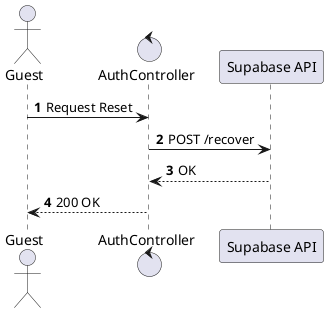
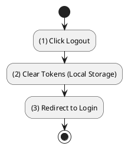
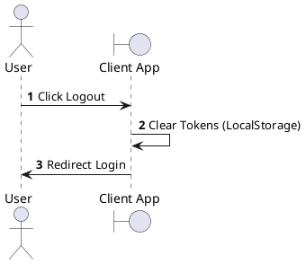

# Use Case 2.1.1: Sign In

**Module**: Authentication
**Primary Actor**: User (Guest / Authenticated)
**Backend Controller**: `Favi_BE.API.Controllers.AuthController`
**Database Tables**: `Profiles` (Read-Only via Sync), Supabase Auth (External)

---

## 2.1.1.1 Sign In (Email/Password)

### Use Case Description
| Attribute | Details |
| :--- | :--- |
| **Name** | **Sign In (Email/Password)** |
| **Description** | Authenticate user using Supabase credentials. |
| **Actor** | Guest |
| **Trigger** | ❖ User clicks [btnLogin] on the Login Screen. |
| **Pre-condition** | ❖ User account exists in Supabase. |
| **Post-condition** | ❖ System returns Supabase Access/Refresh Tokens. ❖ User is redirected to Home. |

### Business Rules (BR)

| Activity | BR Code | Description |
| :---: | :---: | :--- |
| (2)-(3) | BR1 | **Submission:** ❖ User submits credentials (Step 1). ❖ System calls `Login(LoginDto)` (Step 2). ❖ System forwards request to Supabase Auth (Step 3). |
| (3.1)-(4) | BR2 | **Validation (External):** ❖ Supabase verifies credentials (Step 3).  **Invalid**: Returns 400/401 (Step 3.1).  **Valid**: Returns Session/Tokens (Step 4). |
| (5.2)-(6) | BR3 | **Completion:** ❖ Backend returns `SupabaseAuthResponse` (Step 5.2). ❖ UI saves tokens (Step 6). |
| (5.1)-(7) | BR_Error | **Exception Handling:** If Supabase unavailable: Log Error (Step 5.1), Return 500, Show Error (Step 7). |

### Diagrams

**Activity Diagram**

**Sequence Diagram**

---

## 2.1.1.2 Sign In (OAuth - Google)

### Use Case Description
| Attribute | Details |
| :--- | :--- |
| **Name** | **Sign In (OAuth - Google)** |
| **Description** | Authenticate via Google using Supabase Client SDK. |
| **Actor** | Guest |
| **Trigger** | ❖ User clicks [Sign in with Google]. |
| **Pre-condition** | ❖ Google Auth enabled in Supabase Project. |
| **Post-condition** | ❖ Supabase Session created. ❖ Webhook syncs Profile (if new). |

### Business Rules (BR)

| Activity | BR Code | Description |
| :---: | :---: | :--- |
| (1)-(3) | BR1 | **Initiation:** ❖ User clicks Google Login (Step 1). ❖ Client SDK redirects to Supabase/Google (Step 2). ❖ User grants permission (Step 3). |
| (3.2)-(4) | BR2 | **Callback:** ❖ Google redirects back to App with Tokens (Step 3.2). ❖ Client SDK persists Session (Step 4). |
| (3.1)-(5) | BR_Error | **Exception:** If User denies/Provider fails: Log Error (Step 3.1). Show Error (Step 5). |

### Diagrams

**Activity Diagram**

**Sequence Diagram**

---

## 2.1.1.4 Reset Password

### Use Case Description
| Attribute | Details |
| :--- | :--- |
| **Name** | **Reset Password (Creative)** |
| **Description** | Reset password via Supabase recovery flow. |
| **Actor** | Guest |
| **Trigger** | ❖ User clicks "Forgot Password". |
| **Pre-condition** | ❖ Email exists in Supabase. |
| **Post-condition** | ❖ Password updated. |

### Business Rules (BR)

| Activity | BR Code | Description |
| :---: | :---: | :--- |
| (2)-(3) | BR1 | **Request:** ❖ User enters Email (Step 1). ❖ System calls `ResetPassword(email)` (Creative) (Step 2). ❖ Supabase sends email (Step 3). |
| (4) | BR2 | **Completion:** ❖ System returns OK (Step 4). |

### Diagrams

**Activity Diagram**

**Sequence Diagram**

---

## 2.1.1.6 Logout

### Use Case Description
| Attribute | Details |
| :--- | :--- |
| **Name** | **Logout** |
| **Description** | Clear session. |
| **Actor** | Authenticated User |
| **Note** | **Client-Side Only**. No Backend Endpoint found in codebase. |

### Business Rules (BR)

| Activity | BR Code | Description |
| :---: | :---: | :--- |
| (1) | BR1 | **Action:** User clicks Logout. |
| (2) | BR2 | **Cleanup:** Client clears LocalStorage/Cookies. Redirects to Login. |

### Diagrams

**Activity Diagram**

**Sequence Diagram**

