# Use Case 2.1.2: Adjust User Profile

**Module**: User Management
**Primary Actor**: User (Guest / Authenticated)
**Backend Controller**: `AuthController`, `ProfilesController`, `ProfilesSyncController`
**Database Tables**: `Profiles`, `Follows`, `Supabase Auth`

---

## 2.1.2.1 Adjust User Profile (Overview)

### Use Case Description
| Attribute | Details |
| :--- | :--- |
| **Name** | **Adjust User Profile** |
| **Description** | General profile management dashboard allows user to view their profile and trigger creation, updates, deletion, or privacy settings. |
| **Actor** | Authenticated User |
| **Trigger** | ❖ User navigates to "My Profile". |
| **Post-condition** | ❖ User performs one of the sub-actions. |

### Business Rules (BR)

| Activity | BR Code | Description |
| :---: | :---: | :--- |
| (1) | BR1 | **Display:** ❖ The **System** displays the full profile details to the **User**. ❖ The **System** presents relevant options such as Edit, Privacy, or Delete (for Authenticated Users), or Register (for Guests). |
| (2) | BR2 | **Routing:** ❖ Based on the **User's** specific selection, the **System** routes the request to and invokes the specific sub-use cases involved. |

### Diagrams

**Activity Diagram**
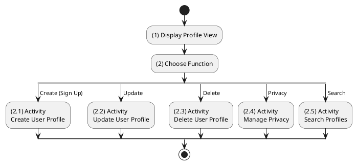

**Sequence Diagram**
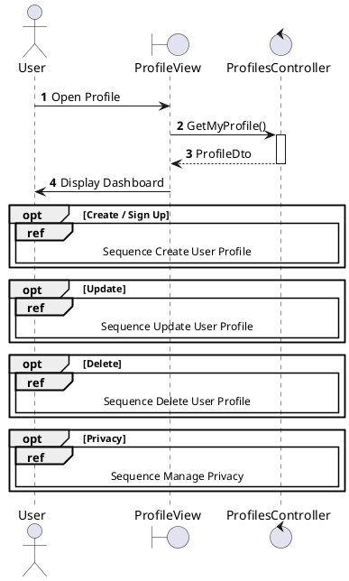

---

## 2.1.2.2 Create User Profile (Sign Up)

### Use Case Description
| Attribute | Details |
| :--- | :--- |
| **Name** | **Create User Profile (Sign Up)** |
| **Description** | Register a new account via Supabase (Backend Proxy). Profile is created via Webhook. |
| **Actor** | Guest |
| **Trigger** | ❖ User clicks [btnRegister] on the Sign Up Screen. |
| **Pre-condition** | ❖ Email must not already exist in Supabase. |
| **Post-condition** | ❖ User created in Supabase. ❖ Profile synced to local DB. ❖ User receives session tokens. |

### Business Rules (BR)

| Activity | BR Code | Description |
| :---: | :---: | :--- |
| (2)-(3) | BR1 | **Submission & Validation:** ❖ The **Frontend** component `RegisterForm` captures inputs and calls `authApi.register({email, password, username})`. ❖ The **Backend** `AuthController.Register(dto)` invokes `_profiles.CheckValidUsername(dto.Username)` to validate the input. ❖ The **Logic** verifies uniqueness by querying the `Profiles` table. If the username exists, the **System** returns a `409 Conflict` error. |
| (3.1)-(4) | BR2 | **Supabase Registration:** ❖ The **Service** `SupabaseAuthService` initiates a call to `POST /auth/v1/signup`, passing the payload `{email, password, data: {username}}`. ❖ **Supabase** creates the user in the `auth.users` table and returns `200 OK` with the User Object. ❖ If the operation fails, the **System** returns a `400 Bad Request` error. |
| (5) | BR3 | **Profile Sync (Webhook):** ❖ **Supabase** triggers a `POST` request to the configured Webhook URI `/api/profilessync/sync`. ❖ The **Backend** `ProfilesSyncController.SyncProfile(dto)` receives the `SupabaseUserCreatedDto` payload. ❖ The **Database** `ProfileService.CreateProfileAsync` inserts a new row into the `Profiles` table using `Id=user_id`, `Username`, and `DisplayName`. |
| (4.2.2)-(6) | BR4 | **Completion:** ❖ The **Backend** `AuthController` returns a `200 OK` response containing the `SupabaseAuthResponse`. ❖ The **Frontend** securely stores the session tokens and redirects the **User** to the `/home` page. |

### Diagrams

**Activity Diagram**
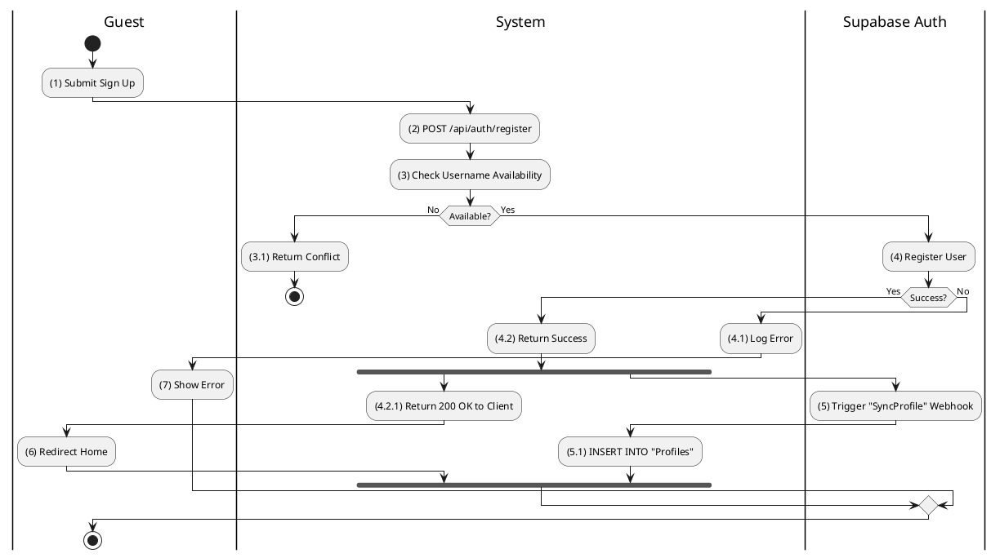

**Sequence Diagram**
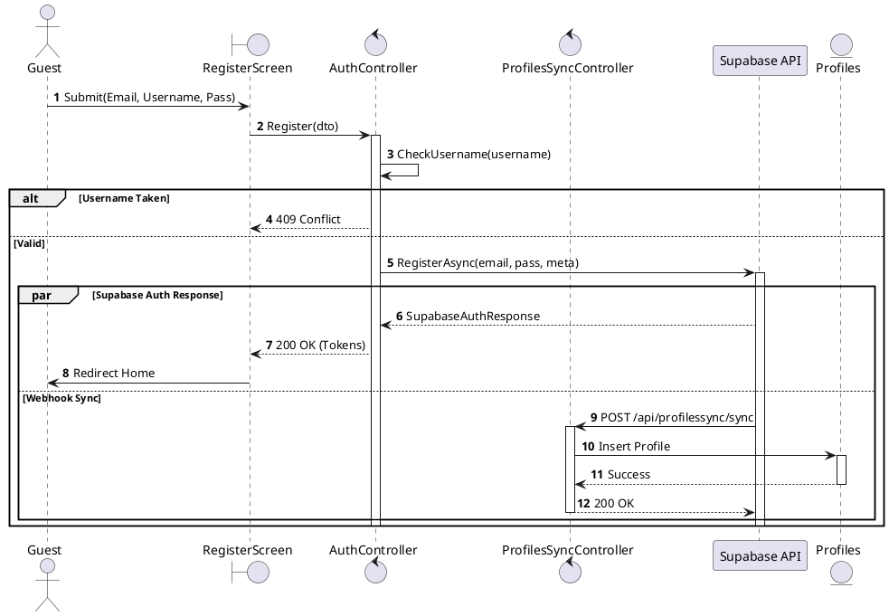

---

## 2.1.2.3 Update User Profile

### Use Case Description
| Attribute | Details |
| :--- | :--- |
| **Name** | **Update User Profile** |
| **Description** | Edit Avatar, Bio, or Cover Photo. |
| **Actor** | Authenticated User |
| **Trigger** | ❖ User clicks Save Changes in Edit Mode. |
| **Post-condition** | ❖ Profile updated in DB. |

### Business Rules (BR)

| Activity | BR Code | Description |
| :---: | :---: | :--- |
| (2)-(3) | BR1 | **Processing:** ❖ The **Frontend** initiates `profileApi.updateProfile({displayName, bio, ...})`. ❖ The **API** routes the `PUT` request to `/api/profiles`. ❖ The **Backend** controller `ProfilesController.Update` delegates the operation to `_profiles.UpdateAsync(userId, dto)`. |
| (3.2)-(4) | BR2 | **Storage:** ❖ The **Database** mechanism `UnitOfWork.Profiles.GetByIdAsync(id)` retrieves the entity, updates the specific fields, and calls `UnitOfWork.CompleteAsync()` to persist changes. ❖ The **System** automatically updates the `LastActiveAt` timestamp during this process. |
| (3.2.2)-(5) | BR3 | **Completion:** ❖ The **System** returns a `200 OK` response including the updated `ProfileResponse`. ❖ The **Frontend** updates the Redux store at `user/profile` and displays a success toast to the **User**. |
| (3.2.1)-(6) | BR_Error | **Exception:** ❖ If the Profile is not found (which is unlikely in this context), the **System** returns `404 NotFound`. ❖ If a database error occurs, the **System** returns `500 Internal Server Error`. |

### Diagrams

**Activity Diagram**
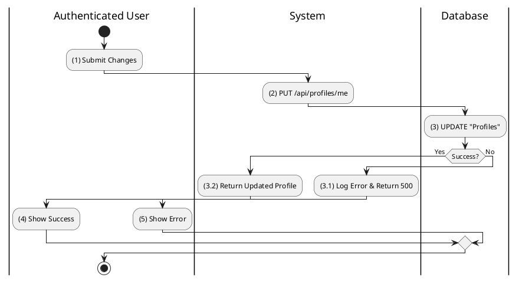

**Sequence Diagram**
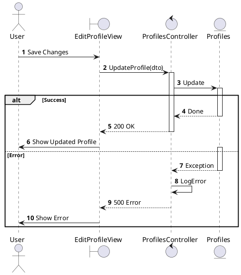

---

## 2.1.2.4 Delete User Profile

### Use Case Description
| Attribute | Details |
| :--- | :--- |
| **Name** | **Delete User Profile** |
| **Description** | Soft delete the user account. |
| **Actor** | Authenticated User |
| **Trigger** | ❖ User confirms "Deactivate Account". |
| **Post-condition** | ❖ `IsDeleted` = True in DB. ❖ Supabase User disabled/deleted. |

### Business Rules (BR)

| Activity | BR Code | Description |
| :---: | :---: | :--- |
| (2)-(3) | BR1 | **Confirmation:** ❖ The **Frontend** displays a confirmation modal asking "Are you sure?". ❖ Upon confirmation, the **API** receives a `DELETE` request at `/api/profiles`. |
| (3.2)-(4) | BR2 | **Processing:** ❖ The **Backend** controller `ProfilesController.Delete()` executes `_profiles.DeleteAsync(userId)`. ❖ The **Database** executes `UnitOfWork.Profiles.Remove(profile)`, which normally performs a hard delete unless Entity Framework is configured for Soft Deletes. |
| (3.2.1)-(5) | BR3 | **Completion:** ❖ The **System** responds with `200 OK` and the message "Đã xoá tài khoản.". ❖ The **Frontend** invokes the `logout()` function and redirects the **User** to the Login screen. |

### Diagrams

**Activity Diagram**
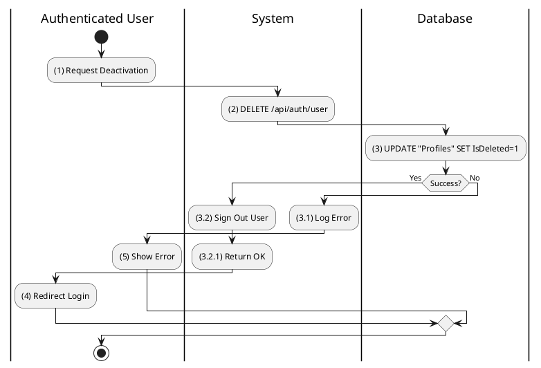

**Sequence Diagram**
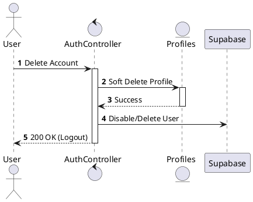

---

## 2.1.2.5 Search User Profile

### Use Case Description
| Attribute | Details |
| :--- | :--- |
| **Name** | **Search User Profile** |
| **Description** | Find users by name. |
| **Actor** | Authenticated User |
| **Trigger** | ❖ User types in search bar. |

### Business Rules (BR)

| Activity | BR Code | Description |
| :---: | :---: | :--- |
| (2)-(3) | BR1 | **Search:** ❖ The **Frontend** component `SearchInput` debounces the user input and calls `searchApi.search({ query, type: 'user' })`. ❖ The **API** receives a `POST` request at `/api/search` with the `SearchRequest` body. ❖ The **Backend** `SearchController.Search` calls `_search.SearchAsync`. ❖ The **Logic** in `SearchService` executes a query on `Profiles`, finding matches where (`Username` contains query OR `DisplayName` contains query). |
| (3.2)-(4) | BR2 | **Result:** ❖ The **System** returns a `200 OK` response containing a `SearchResult`, which is a list of Profiles. ❖ The **Frontend** renders the resulting list of `ProfileCard` components. |
| (3.1)-(5) | BR_Error | **Exception:** ❖ If the result is empty, the **System** returns `200 OK` with an empty list. If an error occurs, it returns `500`. |

### Diagrams

**Activity Diagram**
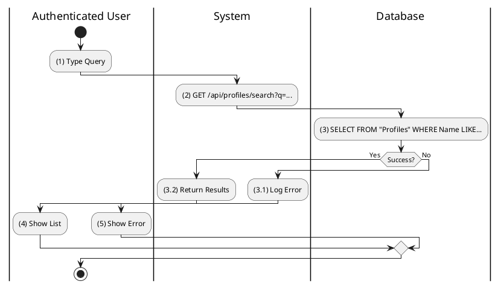

**Sequence Diagram**
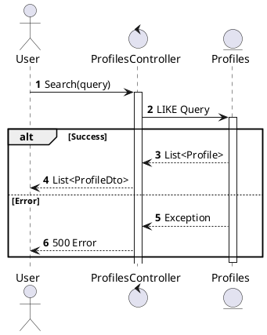

---

## 2.1.2.6 View Other User Profile

### Use Case Description
| Attribute | Details |
| :---: | :---: |
| **Name** | **View Other User Profile** |
| **Description** | View details of another user. |
| **Actor** | Authenticated User |
| **Trigger** | ❖ User clicks on a username/avatar. |
| **Pre-condition** | ❖ Target user exists. |
| **Post-condition** | ❖ Profile details displayed. |

### Business Rules (BR)

| Activity | BR Code | Description |
| :---: | :---: | :--- |
| (2)-(3) | BR1 | **Query:** ❖ The **API** receives a `GET` request at `/api/profiles/{id}`. ❖ The **Backend** controller `ProfilesController.GetById(id)` calls `_profiles.GetEntityByIdAsync(id)`. |
| (4)-(5) | BR2 | **Privacy & Relationships:** ❖ The **Privacy** guard `_privacy.CanViewProfileAsync(profile, viewerId)` checks the target's `PrivacyLevel` and the Follow status. ❖ The **Service** `_profiles.GetByIdAsync` fetches Follower/Following counts from the `Follows` table. ❖ The **System** returns a `200 OK` reply with the `ProfileResponse` data. |
| (5.1)-(6) | BR_Error | **Exception:** ❖ If the profile is null, the **System** returns `404 NotFound` with code `PROFILE_NOT_FOUND`. ❖ If access is restricted, the **System** returns `403 Forbidden` with code `PROFILE_FORBIDDEN`. |

### Diagrams

**Activity Diagram**
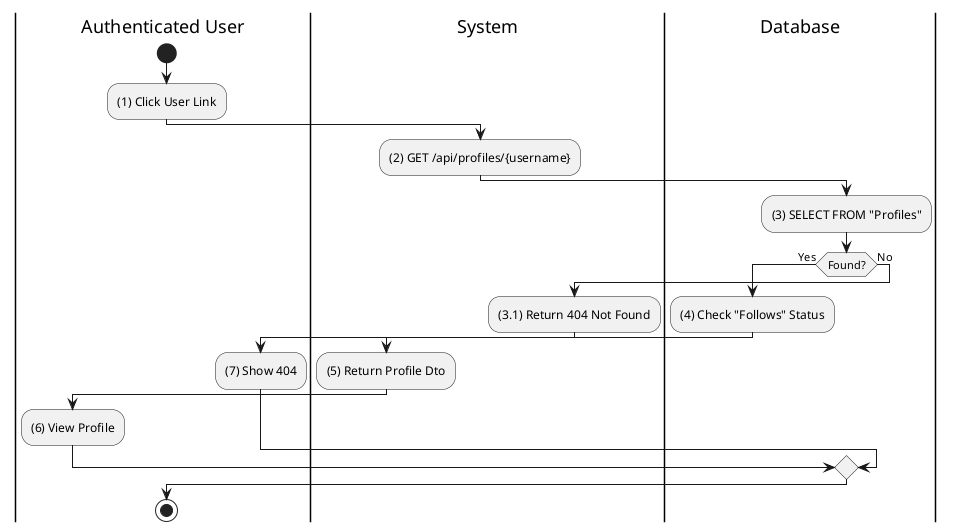

**Sequence Diagram**
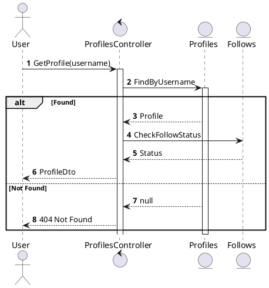

---

## 2.1.2.7 Manage Privacy Settings

### Use Case Description
| Attribute | Details |
| :---: | :---: |
| **Name** | **Manage Privacy Settings** |
| **Description** | Toggle Public/Private profile status. |
| **Actor** | Authenticated User |
| **Trigger** | ❖ User toggles privacy switch. |
| **Post-condition** | ❖ `IsPrivate` column updated. |

### Business Rules (BR)

| Activity | BR Code | Description |
| :---: | :---: | :--- |
| (2)-(3) | BR1 | **Processing:** ❖ The **Frontend** `PrivacySettings` component initiates `updateProfile({ privacyLevel: 'Private' })`. ❖ The **API** reuses the endpoint `PUT /api/profiles`. ❖ The **Backend** logic in `_profiles.UpdateAsync` maps the `PrivacyLevel` from the DTO to the Entity. |
| (3.2)-(4) | BR2 | **Completion:** ❖ The **Database** updates the `Profiles.PrivacyLevel` field. ❖ The **System** returns `200 OK` with the updated profile data. |

### Diagrams

**Activity Diagram**
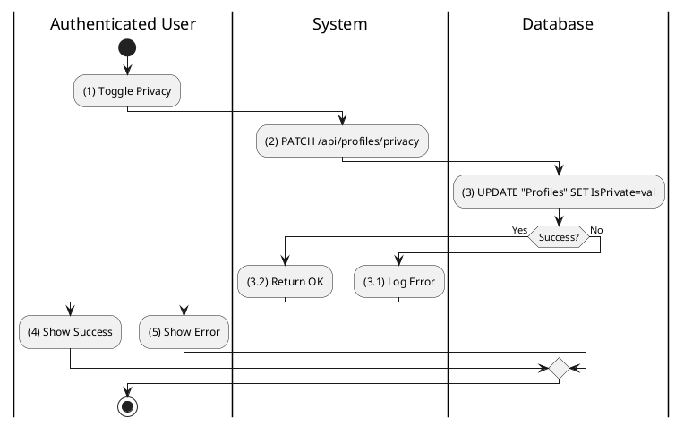

**Sequence Diagram**
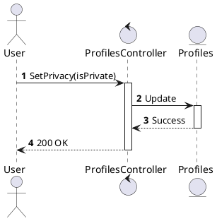
