# Use Case 2.1.2: Adjust User Profile

**Module**: User Management
**Primary Actor**: User (Guest / Authenticated)
**Backend Controller**: `AuthController`, `ProfilesController`, `ProfilesSyncController`
**Database Tables**: `Profiles`, `Follows`, `Supabase Auth`

---

## 2.1.2.1 Adjust User Profile (Overview)

### Use Case Description
| Attribute | Details |
| :--- | :--- |
| **Name** | **Adjust User Profile** |
| **Description** | General profile management dashboard allows user to view their profile and trigger creation, updates, deletion, or privacy settings. |
| **Actor** | Authenticated User |
| **Trigger** | ❖ User navigates to "My Profile". |
| **Post-condition** | ❖ User performs one of the sub-actions. |

### Business Rules (BR)

| Activity | BR Code | Description |
| :---: | :---: | :--- |
| (1) | BR1 | **Display:** ❖ System displays profile details. ❖ System presents options: Edit, Privacy, Delete (if Auth), or Register (if Guest). |
| (2) | BR2 | **Routing:** ❖ Based on user selection, system invokes specific sub-use cases. |

### Diagrams

**Activity Diagram**
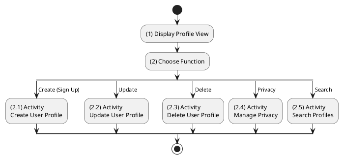

**Sequence Diagram**
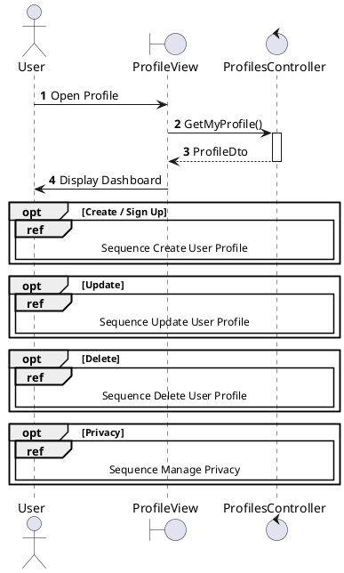

---

## 2.1.2.2 Create User Profile (Sign Up)

### Use Case Description
| Attribute | Details |
| :--- | :--- |
| **Name** | **Create User Profile (Sign Up)** |
| **Description** | Register a new account via Supabase (Backend Proxy). Profile is created via Webhook. |
| **Actor** | Guest |
| **Trigger** | ❖ User clicks [btnRegister] on the Sign Up Screen. |
| **Pre-condition** | ❖ Email must not already exist in Supabase. |
| **Post-condition** | ❖ User created in Supabase. ❖ Profile synced to local DB. ❖ User receives session tokens. |

### Business Rules (BR)

| Activity | BR Code | Description |
| :---: | :---: | :--- |
| (2)-(3) | BR1 | **Submission:** ❖ User submits registration form (Step 1). ❖ System calls `Register(RegisterDto)` (Step 2). ❖ System checks Username validity (Step 3). |
| (3.1)-(4) | BR2 | **Supabase Registration:** ❖ System calls `Supabase.RegisterAsync` (Step 4).  **Fail**: Return 400 (Step 4.1).  **Success**: Proceed to Step (4.2). |
| (5) | BR3 | **Profile Sync (Webhook):** ❖ Supabase triggers Webhook `SyncProfile` (Step 5). ❖ System creates `Profile` record (Step 5.1). |
| (4.2.2)-(6) | BR4 | **Completion:** ❖ Backend returns `SupabaseAuthResponse` (Step 4.2.2). ❖ Client redirects (Step 6). |
| (3.1)-(7) | BR_Error | **Exception:** If Registration fails: Log Error (Step 4.1). Show Error (Step 7). |

### Diagrams

**Activity Diagram**
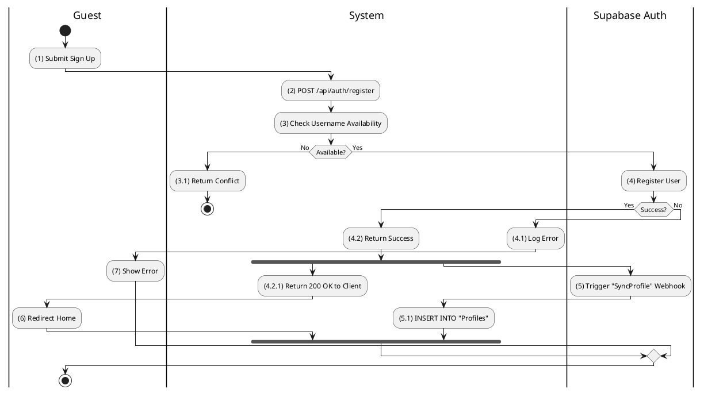

**Sequence Diagram**
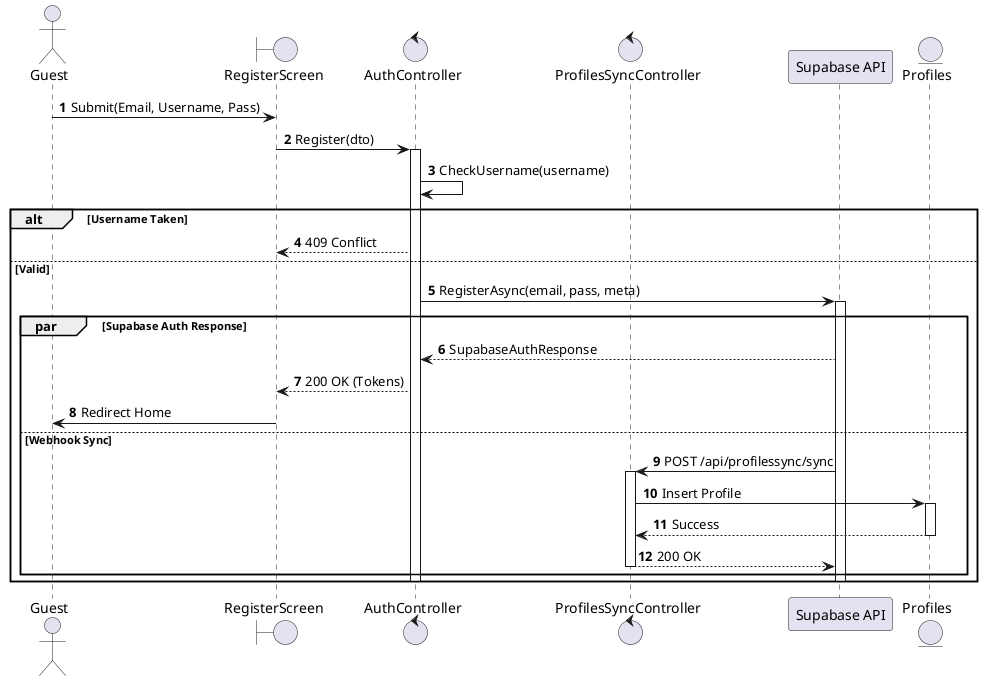

---

## 2.1.2.3 Update User Profile

### Use Case Description
| Attribute | Details |
| :--- | :--- |
| **Name** | **Update User Profile** |
| **Description** | Edit Avatar, Bio, or Cover Photo. |
| **Actor** | Authenticated User |
| **Trigger** | ❖ User clicks Save Changes in Edit Mode. |
| **Post-condition** | ❖ Profile updated in DB. |

### Business Rules (BR)

| Activity | BR Code | Description |
| :---: | :---: | :--- |
| (2)-(3) | BR1 | **Processing:** ❖ System calls `UpdateProfile(dto)` (Step 2). ❖ System validates input (Step 3). |
| (3.2)-(4) | BR2 | **Storage:** ❖ System updates `Profiles` table (Step 3.2). ❖ System changes `UpdatedAt` timestamp (Step 4). |
| (3.2.2)-(5) | BR3 | **Completion:** ❖ Return Updated Dto (Step 3.2.2). ❖ UI Reflects changes (Step 5). |
| (3.2.1)-(6) | BR_Error | **Exception:**  DB Error: Log (Step 3.2.1). Return 500. Show Error (Step 6). |

### Diagrams

**Activity Diagram**
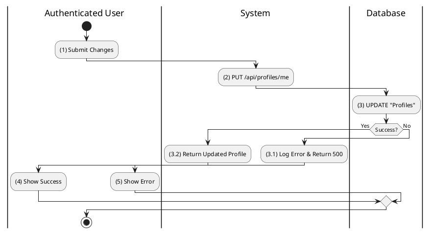

**Sequence Diagram**
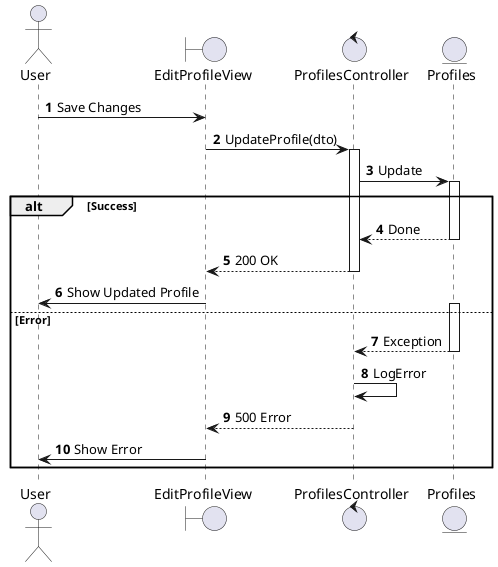

---

## 2.1.2.4 Delete User Profile

### Use Case Description
| Attribute | Details |
| :--- | :--- |
| **Name** | **Delete User Profile** |
| **Description** | Soft delete the user account. |
| **Actor** | Authenticated User |
| **Trigger** | ❖ User confirms "Deactivate Account". |
| **Post-condition** | ❖ `IsDeleted` = True in DB. ❖ Supabase User disabled/deleted. |

### Business Rules (BR)

| Activity | BR Code | Description |
| :---: | :---: | :--- |
| (2)-(3) | BR1 | **Confirmation:** ❖ User requests deletion (Step 1). ❖ System calls `Info` to confirm intent (Step 2). |
| (3.2)-(4) | BR2 | **Processing:** ❖ System calls `DeleteUser()` (Step 3.2). ❖ System updates `Profiles` -> `IsDeleted=1` (Step 4). |
| (3.2.1)-(5) | BR3 | **Completion:** ❖ System logs out user (Step 3.2.1). ❖ Redirect to Login (Step 5). |

### Diagrams

**Activity Diagram**
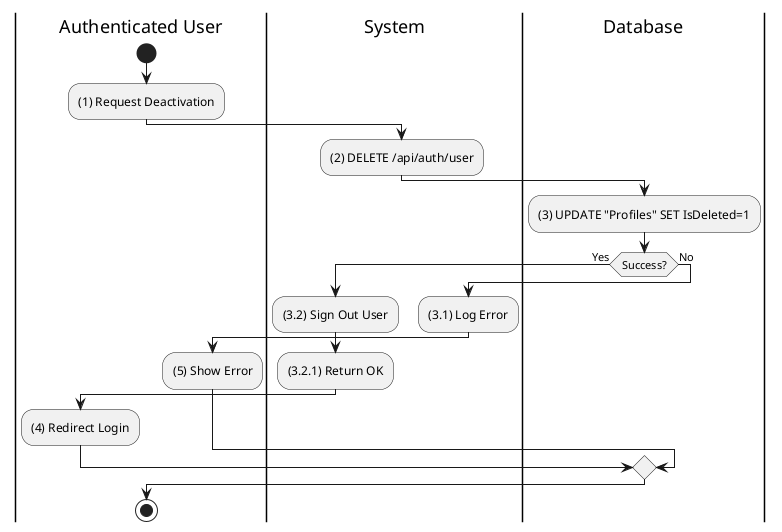

**Sequence Diagram**
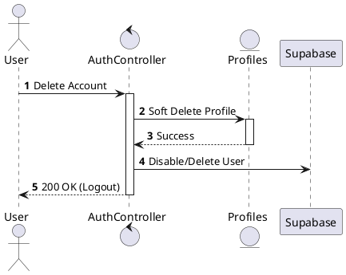

---

## 2.1.2.5 Search User Profile

### Use Case Description
| Attribute | Details |
| :--- | :--- |
| **Name** | **Search User Profile** |
| **Description** | Find users by name. |
| **Actor** | Authenticated User |
| **Trigger** | ❖ User types in search bar. |

### Business Rules (BR)

| Activity | BR Code | Description |
| :---: | :---: | :--- |
| (2)-(3) | BR1 | **Search:** ❖ System calls `SearchProfiles(query)` (Step 2). ❖ System executes LIKE query on “Profiles” (Step 3). |
| (3.2)-(4) | BR2 | **Result:** ❖ System returns List (Step 3.2). ❖ UI shows results (Step 4). |
| (3.1)-(5) | BR_Error | **Exception:** DB Error (Step 3): Log (Step 3.1). Show Error (Step 5). |

### Diagrams

**Activity Diagram**
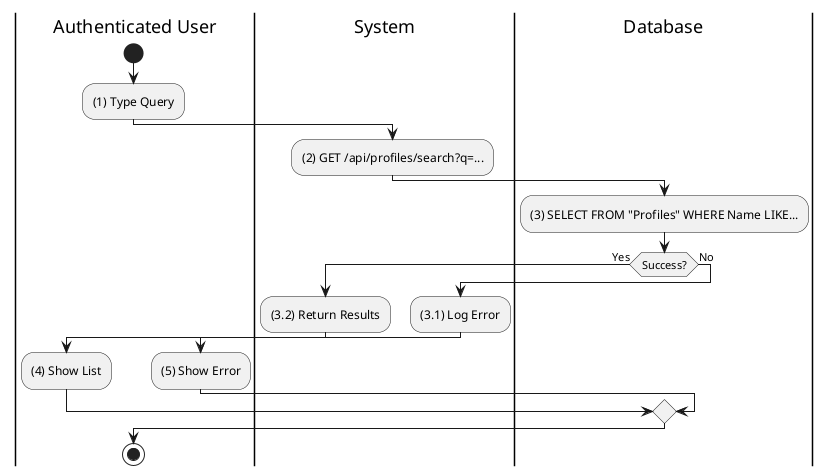

**Sequence Diagram**
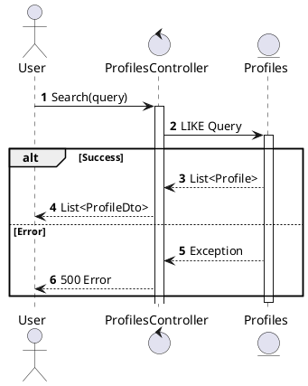

---

## 2.1.2.6 View Other User Profile

### Use Case Description
| Attribute | Details |
| :---: | :---: |
| **Name** | **View Other User Profile** |
| **Description** | View details of another user. |
| **Actor** | Authenticated User |
| **Trigger** | ❖ User clicks on a username/avatar. |
| **Pre-condition** | ❖ Target user exists. |
| **Post-condition** | ❖ Profile details displayed. |

### Business Rules (BR)

| Activity | BR Code | Description |
| :---: | :---: | :--- |
| (2)-(3) | BR1 | **Query:** ❖ System calls `GetProfile(username)` (Step 2). ❖ System queries “Profiles” table (Step 3). |
| (4)-(5) | BR2 | **Relationships:** ❖ System checks “Follows” table (Step 4). ❖ System returns Dto (Step 5). |
| (5.1)-(6) | BR_Error | **Exception:** If DB Fail (Step 3): Log (Step 3.1). Return 500. Show Error (Step 6). |

### Diagrams

**Activity Diagram**
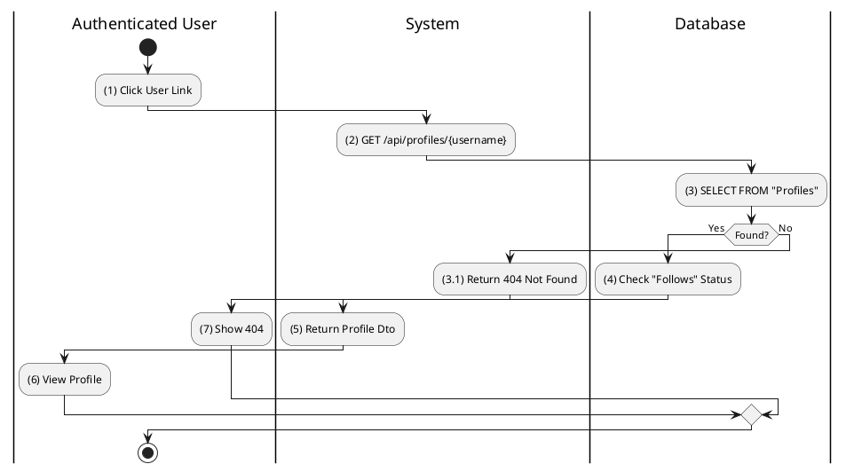

**Sequence Diagram**
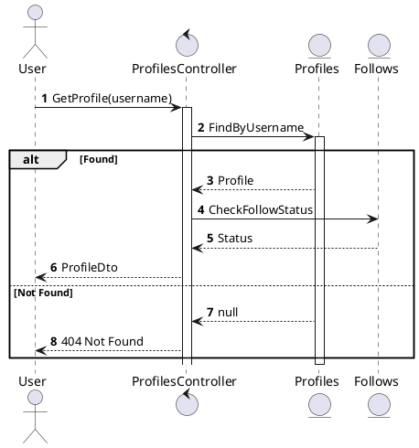

---

## 2.1.2.7 Manage Privacy Settings

### Use Case Description
| Attribute | Details |
| :---: | :---: |
| **Name** | **Manage Privacy Settings** |
| **Description** | Toggle Public/Private profile status. |
| **Actor** | Authenticated User |
| **Trigger** | ❖ User toggles privacy switch. |
| **Post-condition** | ❖ `IsPrivate` column updated. |

### Business Rules (BR)

| Activity | BR Code | Description |
| :---: | :---: | :--- |
| (2)-(3) | BR1 | **Processing:** ❖ User toggles switch (Step 1). ❖ System calls `UpdatePrivacy(bool)` (Step 2). ❖ System Updates DB (Step 3). |
| (3.2)-(4) | BR2 | **Completion:** ❖ Return OK (Step 3.2). ❖ Show Toast (Step 4). |

### Diagrams

**Activity Diagram**
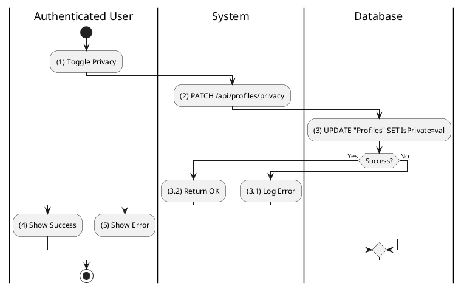

**Sequence Diagram**
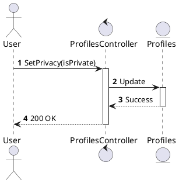
