# Use Case 2.1.3: Adjust Post

**Module**: Content Management
**Primary Actor**: Authenticated User
**Backend Controller**: `PostController`
**Database Tables**: `Posts`, `PostMedia`, `Follows`, `HiddenPosts`

---

## 2.1.3.1 Adjust Post (Overview)

### Use Case Description
| Attribute | Details |
| :--- | :--- |
| **Name** | **Adjust Post** |
| **Description** | Central hub for post interactions. |
| **Actor** | Authenticated User |
| **Trigger** | ❖ User interacts with a Post or Newsfeed. |
| **Post-condition** | ❖ User triggers specific sub-actions. |

### Business Rules (BR)

| Activity | BR Code | Description |
| :---: | :---: | :--- |
| (1) | BR1 | **Display:**<br>❖ System displays Post Interface.<br>❖ Options enabled based on Ownership/Context. |

### Diagrams

**Activity Diagram**
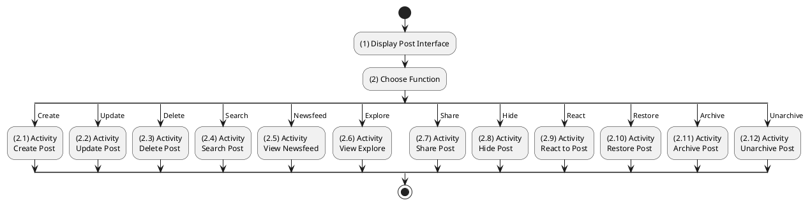

**Sequence Diagram**
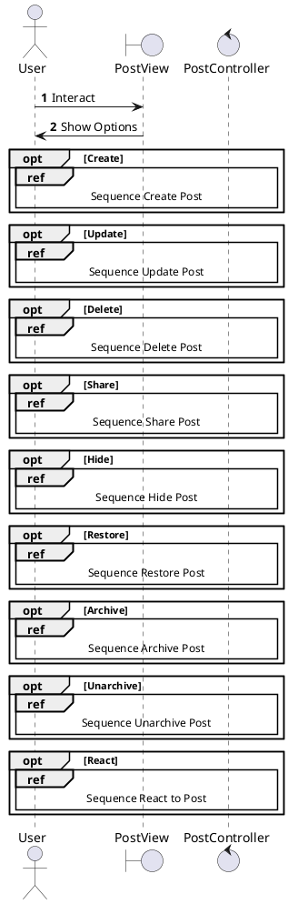

---

## 2.1.3.2 Create Post

### Use Case Description
| Attribute | Details |
| :--- | :--- |
| **Name** | **Create Post** |
| **Description** | Publish new content (Text, Image, Video). |
| **Actor** | Authenticated User |
| **Trigger** | ❖ User clicks [Post] button. |
| **Pre-condition** | ❖ Content exists. |
| **Post-condition** | ❖ Post created in DB. |

### Business Rules (BR)

| Activity | BR Code | Description |
| :---: | :---: | :--- |
| (2)-(3) | BR1 | **Submission:**<br>❖ User submits data (Step 1).<br>❖ System calls `CreatePost(dto)` (Step 2).<br>❖ System validates Media/Text (Step 3). |
| (3.2)-(4) | BR2 | **Persistence:**<br>❖ System inserts `Posts` (Step 3.2).<br>❖ System inserts `PostMedia` (Step 4). |
| (4.2)-(5) | BR3 | **Completion:**<br>❖ Return Created Dto (Step 4.2).<br>❖ UI updates Feed (Step 5). |
| (4.1)-(6) | BR_Error | **Exception:**<br> DB Error: Log (Step 4.1). Return 500. Show Error (Step 6). |

### Diagrams

**Activity Diagram**
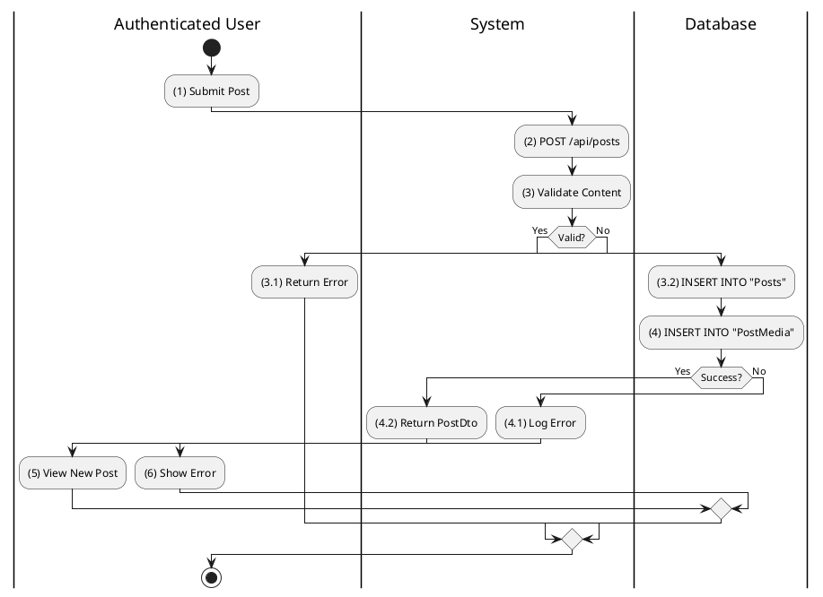

**Sequence Diagram**
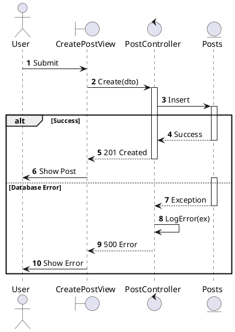

---

## 2.1.3.3 Update Post

### Use Case Description
| Attribute | Details |
| :--- | :--- |
| **Name** | **Update Post** |
| **Description** | Edit caption, privacy, or media. |
| **Actor** | Authenticated User (Author) |
| **Trigger** | ❖ User clicks Edit. |
| **Post-condition** | ❖ Post updated in DB. |

### Business Rules (BR)

| Activity | BR Code | Description |
| :---: | :---: | :--- |
| (2)-(3) | BR1 | **Processing:**<br>❖ System calls `UpdatePost(id, dto)` (Step 2).<br>❖ System checks Ownership (Step 3). |
| (3.2)-(4) | BR2 | **Update:**<br>❖ System updates `Posts` table (Step 3.2).<br>❖ System returns Updated Dto (Step 3.2.2). |
| (3.2.1)-(5) | BR_Error | **Exception:**<br> DB Fail: Log (Step 3.2.1). Show Error (Step 5). |

### Diagrams

**Activity Diagram**
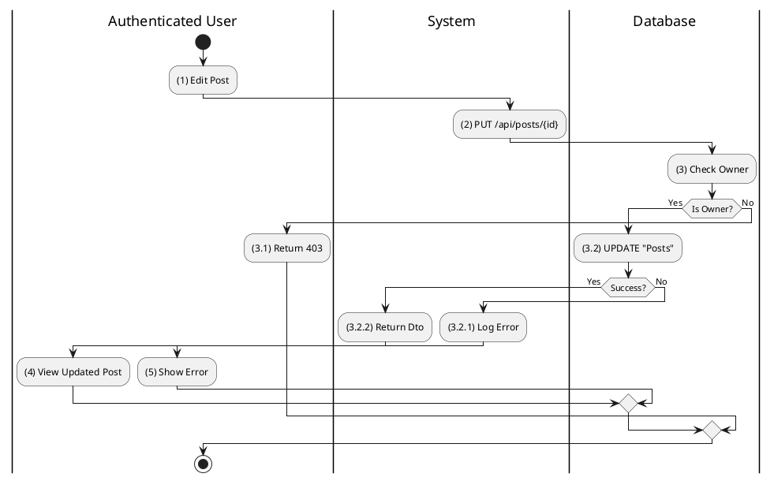

**Sequence Diagram**
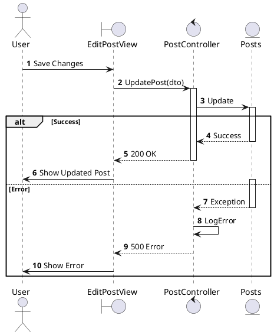

---

## 2.1.3.4 Delete Post

### Use Case Description
| Attribute | Details |
| :--- | :--- |
| **Name** | **Delete Post** |
| **Description** | Soft delete a post. |
| **Actor** | Authenticated User (Author) |
| **Trigger** | ❖ User clicks Delete. |
| **Post-condition** | ❖ `IsDeleted` = 1. |

### Business Rules (BR)

| Activity | BR Code | Description |
| :---: | :---: | :--- |
| (2)-(3) | BR1 | **Cleanup:**<br>❖ System calls `DeletePost(id)` (Step 2).<br>❖ System updates `IsDeleted` (Step 3). |
| (3.2)-(4) | BR2 | **Success:**<br>❖ Return OK (Step 3.2).<br>❖ Remove from UI (Step 4). |

### Diagrams

**Activity Diagram**
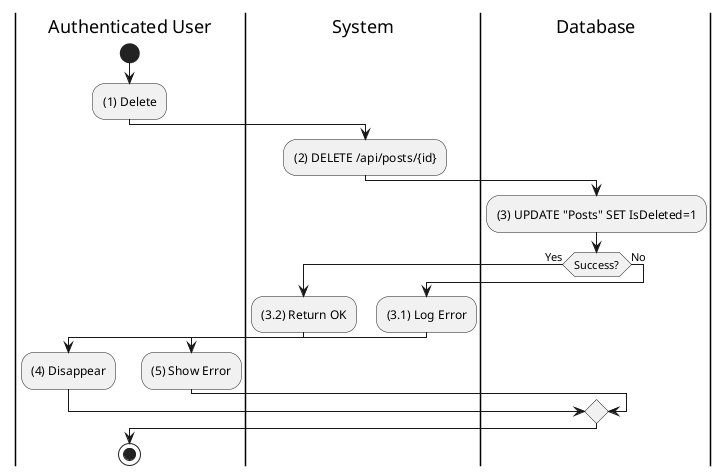

**Sequence Diagram**
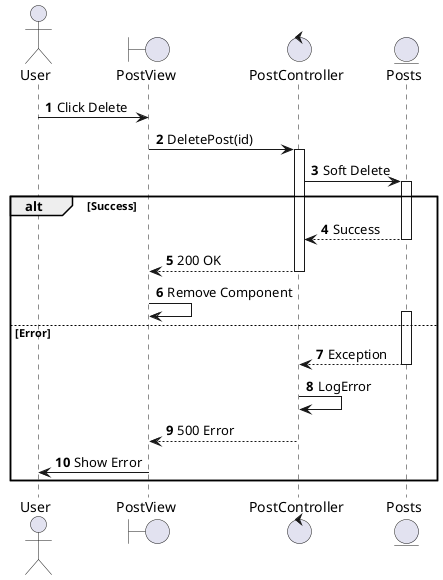

---

## 2.1.3.5 Search Post

### Use Case Description
| Attribute | Details |
| :--- | :--- |
| **Name** | **Search Post** |
| **Description** | Search by keyword or AI Semantic meaning. |
| **Actor** | Authenticated User |
| **Trigger** | ❖ User enters query in Search Bar. |

### Business Rules (BR)

| Activity | BR Code | Description |
| :---: | :---: | :--- |
| (2)-(3) | BR1 | **Keyword Search Logic:**<br>❖ The System receives the search query from the user (Step 2).<br>❖ Standard keyword search: The system executes a PostgreSQL `ILIKE` query against the `Posts.Caption` column to find partial string matches (Step 3).|
| (4) | BR2 | **AI Semantic Search (Optional):**<br>❖ If AI Mode is enabled, the System converts the user's query into a vector embedding using an external embedding service (e.g., OpenAI/HuggingFace).<br>❖ The System performs a Vector Similarity Search using `pgvector` to find posts with semantically similar content, even if keywords do not match exactly (Step 4). |
| (5) | BR3 | **Result Aggregation:**<br>❖ The System combines results from both Keyword and Semantic searches, potentially re-ranking them by relevance score.<br>❖ The aggregated list of `PostDto` objects is returned to the user (Step 5). |
| (5.1) | BR_Error | **Exception Handling:**<br>❖ If the database query fails or the embedding service is unavailable:<br> Log the specific error details.<br> Return an empty list or a user-friendly error message indicating search unavailability (Step 5.1). |

### Diagrams

**Activity Diagram**
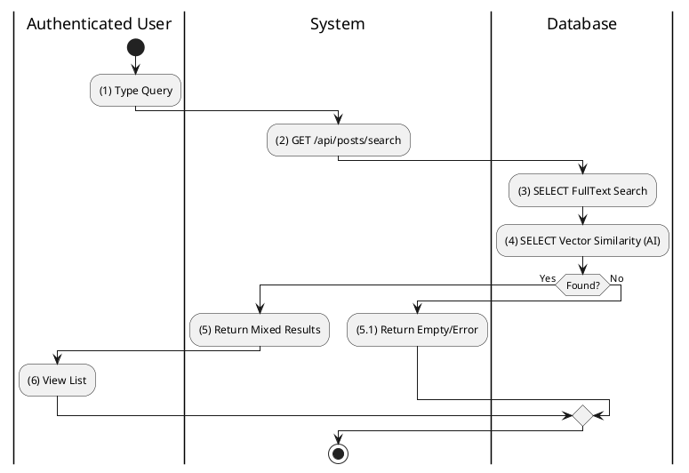

**Sequence Diagram**
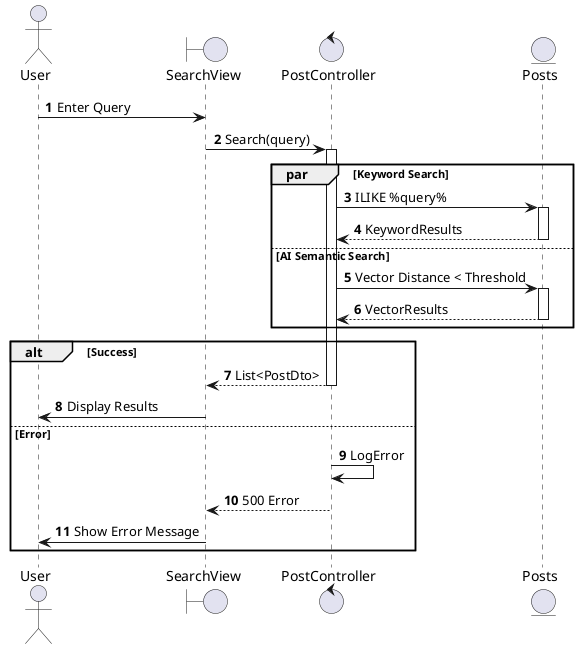

---

## 2.1.3.6 View Post Newsfeed

### Use Case Description
| Attribute | Details |
| :--- | :--- |
| **Name** | **View Post Newsfeed** |
| **Description** | View stream of posts (Personalized Timeline or Public Feed). |
| **Actor** | Authenticated User / Guest |
| **Trigger** | ❖ Open Home Page / Feed. |

### Business Rules (BR)

| Activity | BR Code | Description |
| :---: | :---: | :--- |
| (2)-(3) | BR1 | **Context Identification:**<br>❖ System identifies if Viewer is Authenticated or Guest.<br>❖ If Authenticated: Fetch posts from Followed Authors.<br>❖ If Guest: Fetch global/public posts (or restricted view). |
| (4) | BR2 | **Privacy Guard Enforcement:**<br>❖ **Privacy Guard** filters the raw list based on Post visibility settings:<br> **Public**: Visible to All.<br> **Friends Only**: Visible only if Viewer is Friend of Author.<br> **Private**: Visible only to Author.<br>❖ System removes inaccessible items from the result set (Step 4). |
| (5) | BR3 | **Ordering & Display:**<br>❖ Order by `CreatedAt` DESC.<br>❖ Return filtered list to UI (Step 5). |
| (4.1) | BR_Error | **Exception:**<br>Log error and return 500 if Query or Privacy Check fails. |

### Diagrams

**Activity Diagram**
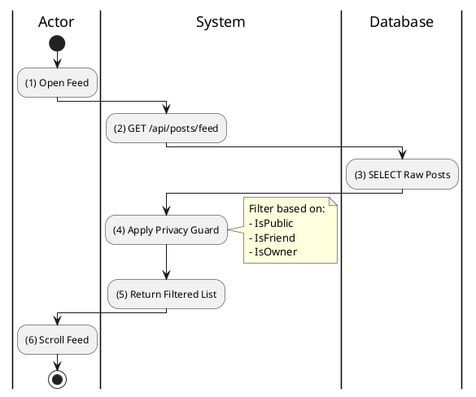

**Sequence Diagram**
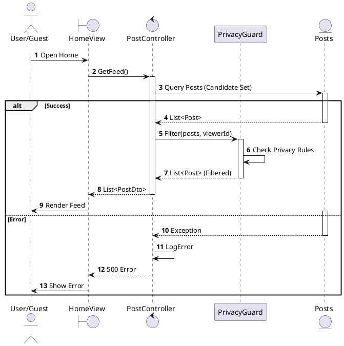

---

## 2.1.3.7 View Explore Feed

### Use Case Description
| Attribute | Details |
| :--- | :--- |
| **Name** | **View Explore Feed** |
| **Description** | View trending content. |
| **Actor** | Authenticated User |
| **Trigger** | ❖ Click Explore Tab. |

### Business Rules (BR)

| Activity | BR Code | Description |
| :---: | :---: | :--- |
| (2)-(3) | BR1 | **Trending Algorithm:**<br>❖ The System queries the `Posts` table to identify high-engagement content.<br>❖ Selection criteria: Posts where `LikeCount` + `CommentCount` exceeds the defined threshold (Step 3).<br>❖ Results are ordered by a concise "Popularity Score" (Recent activity weight + Total interactions). |
| (3.1) | BR_Error | **Exception Handling:**<br>❖ If the analytical query fails due to load or connection issues:<br> Log the error.<br> Return a simpler fallback list (e.g., most recent public posts) or an error state to the UI. |

### Diagrams

**Activity Diagram**
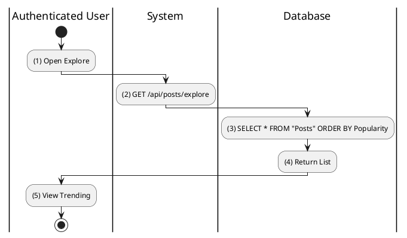

**Sequence Diagram**
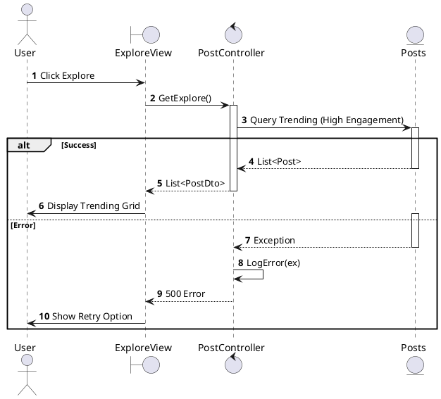

---

## 2.1.3.8 Share Post

### Use Case Description
| Attribute | Details |
| :--- | :--- |
| **Name** | **Share Post** |
| **Description** | Share internally (Repost) or externally. |
| **Actor** | Authenticated User |
| **Trigger** | ❖ Click Share. |

### Business Rules (BR)

| Activity | BR Code | Description |
| :---: | :---: | :--- |
| (2)-(3) | BR1 | **Internal Repost Logic:**<br>❖ The user selects "Repost" within the app.<br>❖ The System creates a new record in the `Posts` table where `SharedPostId` links to the original post ID (Step 3).<br>❖ If the original post is deleted, the share remains but content may be hidden (depending on policy). |
| (2.1) | BR2 | **External Share Logic:**<br>❖ The user selects "Share Link".<br>❖ The System generates a deep link (e.g., `favi.app/posts/{id}`) pointing to the content.<br>❖ The System returns the URL for the client to copy to the clipboard (Step 2.1). |
| (3.1) | BR_Error | **Failure Scenarios:**<br>❖ If Database Insertion fails (Internal Share): Log error, Return 500, Show "Failed to Repost". |

### Diagrams

**Activity Diagram**
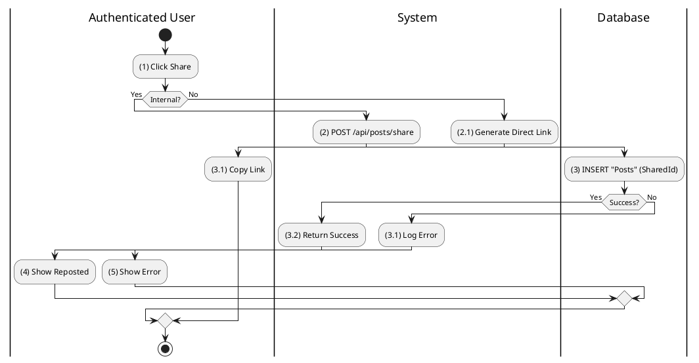

**Sequence Diagram**
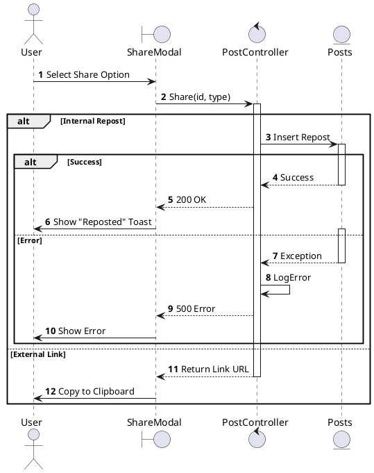

---

## 2.1.3.9 Hide Post

### Use Case Description
| Attribute | Details |
| :--- | :--- |
| **Name** | **Hide Post** |
| **Description** | See less content like this. |
| **Actor** | Authenticated User |
| **Trigger** | ❖ Click "Hide this post". |

### Business Rules (BR)

| Activity | BR Code | Description |
| :---: | :---: | :--- |
| (2)-(3) | BR1 | **Hiding Logic:**<br>❖ The user indicates they want to hide a specific post.<br>❖ The System invokes the `HidePost` endpoint (Step 2).<br>❖ The System inserts a record into the `HiddenPosts` table linking `UserId` and `PostId` (Step 3).<br>❖ Future feed queries will exclude this Post ID. |
| (4) | BR2 | **UI Feedback:**<br>❖ Upon successful server response, the UI immediately removes the post card from the current view (Step 4) and displays a confirmation toast. |
| (5) | BR_Error | **Error Handling:**<br>❖ If the operation fails: Log the error, notify the user, and do not remove the post from the view (Step 5). |

### Diagrams

**Activity Diagram**
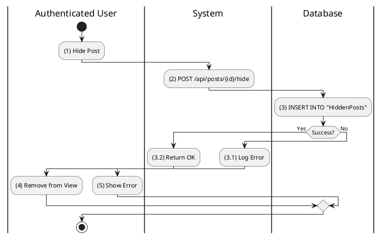

**Sequence Diagram**
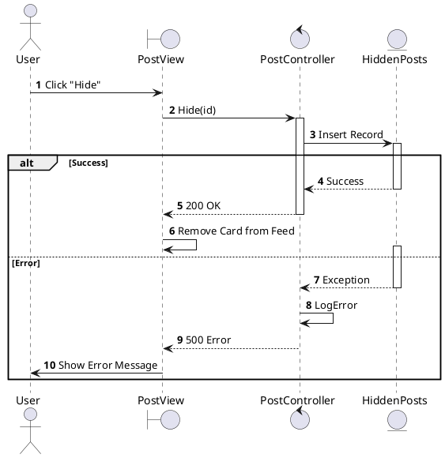

### Use Case Description
| Attribute | Details |
| :--- | :--- |
| **Name** | **Search Post** |
| **Description** | Search by keyword or AI Semantic meaning. |
| **Actor** | Authenticated User |
| **Trigger** | ❖ User enters query in Search Bar. |

### Business Rules (BR)

| Activity | BR Code | Description |
| :---: | :---: | :--- |
| (2)-(3) | BR1 | **Keyword Search:**<br>❖ System executes LIKE query (Step 3). |
| (4) | BR2 | **AI Search (Optional):**<br>❖ System converts query to Vector Embedding.<br>❖ System performs Vector Similarity Search (pgvector) (Step 4). |
| (5) | BR3 | **Result:**<br>❖ System merges and returns results (Step 5). |

### Diagrams

**Activity Diagram**
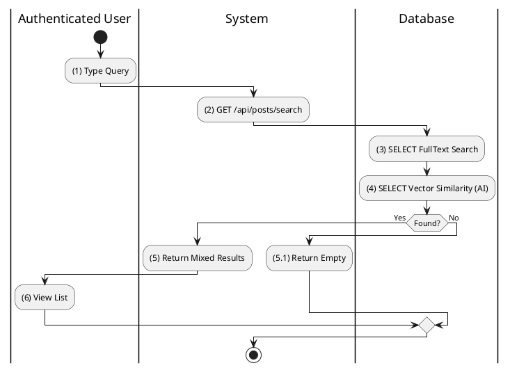

**Sequence Diagram**
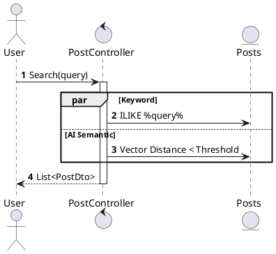

---

## 2.1.3.6 View Post Newsfeed

### Use Case Description
| Attribute | Details |
| :--- | :--- |
| **Name** | **View Post Newsfeed** |
| **Description** | View personalized feed from followed users. |
| **Actor** | Authenticated User |
| **Trigger** | ❖ Open Home. |

### Business Rules (BR)

| Activity | BR Code | Description |
| :---: | :---: | :--- |
| (2)-(3) | BR1 | **Query:**<br>❖ Query Posts where `AuthorId` IN `FollowedIds`. |
| (4) | BR2 | **Ordering:**<br>❖ Order by `CreatedAt` DESC (Step 4). |

### Diagrams

**Activity Diagram**
```plantuml
@startuml
|Authenticated User|
start
:(1) Open Home;
|System|
:(2) GET /api/posts/feed;
|Database|
:(3) SELECT Posts JOIN Follows;
:(4) Return List;
|Authenticated User|
:(5) Scroll Feed;
stop
@enduml
```

**Sequence Diagram**
```plantuml
@startuml
autonumber
actor "User" as User
control "PostController" as Controller
entity "Posts" as DB

User -> Controller: GetFeed()
activate Controller
Controller -> DB: Query Followed
activate DB
DB --> Controller: Results
deactivate DB
Controller --> User: List<PostDto>
deactivate Controller
@enduml
```

---

## 2.1.3.7 View Explore Feed

### Use Case Description
| Attribute | Details |
| :--- | :--- |
| **Name** | **View Explore Feed** |
| **Description** | View trending content. |
| **Actor** | Authenticated User |
| **Trigger** | ❖ Click Explore Tab. |

### Business Rules (BR)

| Activity | BR Code | Description |
| :---: | :---: | :--- |
| (2)-(3) | BR1 | **Algorithm:**<br>❖ System Selects Posts where `LikeCount` > Threshold (Step 3).<br>❖ Ordered by recent popularity. |

### Diagrams

**Activity Diagram**
```plantuml
@startuml
|Authenticated User|
start
:(1) Open Explore;
|System|
:(2) GET /api/posts/explore;
|Database|
:(3) SELECT * FROM "Posts" ORDER BY Popularity;
:(4) Return List;
|Authenticated User|
:(5) View Trending;
stop
@enduml
```

**Sequence Diagram**
```plantuml
@startuml
autonumber
actor "User" as User
control "PostController" as Controller
entity "Posts" as DB

User -> Controller: GetExplore()
Controller -> DB: Query Trending
DB --> Controller: Results
Controller --> User: List<PostDto>
@enduml
```

---

## 2.1.3.8 Share Post

### Use Case Description
| Attribute | Details |
| :--- | :--- |
| **Name** | **Share Post** |
| **Description** | Share internally (Repost) or externally. |
| **Actor** | Authenticated User |
| **Trigger** | ❖ Click Share. |

### Business Rules (BR)

| Activity | BR Code | Description |
| :---: | :---: | :--- |
| (2)-(3) | BR1 | **Internal Repost:**<br>❖ System creates new Post with `SharedPostId` (Step 3). |
| (2.1) | BR2 | **External:**<br>❖ System generates link (Step 2.1).<br>❖ User copies to clipboard. |

### Diagrams

**Activity Diagram**
```plantuml
@startuml
|Authenticated User|
start
:(1) Click Share;
if (Internal?) then (Yes)
  |System|
  :(2) POST /api/posts/share;
  |Database|
  :(3) INSERT "Posts" (SharedId);
  :(4) Return Success;
else (No)
  |System|
  :(2.1) Generate Direct Link;
  |Authenticated User|
  :(3.1) Copy Link;
endif
stop
@enduml
```

**Sequence Diagram**
```plantuml
@startuml
autonumber
actor "User" as User
control "PostController" as Controller
entity "Posts" as DB

User -> Controller: Share(id, type)
alt Internal
    Controller -> DB: Insert Repost
    DB --> Controller: OK
    Controller --> User: Success
else External
    Controller --> User: Link URL
end
@enduml
```

---

## 2.1.3.9 Hide Post

### Use Case Description
| Attribute | Details |
| :--- | :--- |
| **Name** | **Hide Post** |
| **Description** | See less content like this. |
| **Actor** | Authenticated User |
| **Trigger** | ❖ Click "Hide this post". |

### Business Rules (BR)

| Activity | BR Code | Description |
| :---: | :---: | :--- |
| (2)-(3) | BR1 | **Processing:**<br>❖ System calls `HidePost(id)` (Step 2).<br>❖ System adds to `HiddenPosts` table (Step 3). |
| (4) | BR2 | **Display:**<br>❖ UI removes post from feed (Step 4). |

### Diagrams

**Activity Diagram**
```plantuml
@startuml
|Authenticated User|
start
:(1) Hide Post;
|System|
:(2) POST /api/posts/{id}/hide;
|Database|
:(3) INSERT INTO "HiddenPosts";
if (Success?) then (Yes)
  |System|
  :(3.2) Return OK;
  |Authenticated User|
  :(4) Remove from View;
else (No)
  |System|
  :(3.1) Log Error;
  |Authenticated User|
  :(5) Show Error;
endif
stop
@enduml
```

**Sequence Diagram**
```plantuml
@startuml
autonumber
actor "User" as User
boundary "PostView" as View
control "PostController" as Controller
entity "HiddenPosts" as DB

User -> View: Click "Hide"
View -> Controller: HidePost(id)
activate Controller
Controller -> DB: Insert Record
activate DB
alt Success
    DB --> Controller: Success
    deactivate DB
    Controller --> View: 200 OK
    deactivate Controller
    View -> View: Remove Card
else Error
    activate DB
@enduml
```

---

## 2.1.3.10 Restore Post

### Use Case Description
| Attribute | Details |
| :--- | :--- |
| **Name** | **Restore Post** |
| **Description** | Recover a deleted post from the Trash. |
| **Actor** | Authenticated User (Author) |
| **Trigger** | ❖ User clicks Restore in Trash/Archived view. |

### Business Rules (BR)

| Activity | BR Code | Description |
| :---: | :---: | :--- |
| (2)-(3) | BR1 | **Restoration Logic:**<br>❖ The System receives the restore request for a specific Post ID.<br>❖ The System verifies adherence to ownership rules (only the Author can restore).<br>❖ The System executes a database update, setting the `IsDeleted` flag from `1` back to `0` in the `Posts` table, effectively making the content visible again (Step 3). |
| (4) | BR2 | **UI State Synchronization:**<br>❖ Upon receiving a successful response (200 OK), the UI dynamically removes the post from the "Trash/Deleted" view.<br>❖ The post is immediately re-injected into the "Active" Profile or Newsfeed view without checking for a page reload (Step 4). |
| (3.1) | BR_Error | **Exception Determination:**<br>❖ If the database update fails (e.g., record locked or ID not found):<br> The System logs the full exception stack trace.<br> The System returns a 500 status code.<br> The UI displays a "Restoration Failed" error toast (Step 5). |

### Diagrams

**Activity Diagram**
```plantuml
@startuml
|Authenticated User|
start
:(1) Click Restore;
|System|
:(2) POST /api/posts/{id}/restore;
|Database|
:(3) UPDATE "Posts" SET IsDeleted=0;
if (Success?) then (Yes)
  |System|
  :(3.2) Return OK;
  |Authenticated User|
  :(4) Post Restored;
else (No)
  |System|
  :(3.1) Log Error;
  |Authenticated User|
  :(5) Show Error;
endif
stop
@enduml
```

**Sequence Diagram**
```plantuml
@startuml
autonumber
actor "User" as User
boundary "TrashView" as View
control "PostController" as Controller
entity "Posts" as DB

User -> View: Click Restore
View -> Controller: RestorePost(id)
activate Controller
Controller -> DB: Update IsDeleted=0
activate DB
alt Success
    DB --> Controller: Success
    deactivate DB
    Controller --> View: 200 OK
    deactivate Controller
    View -> View: Remove from Trash
else Error
    activate DB
    DB --> Controller: Exception
    deactivate DB
    Controller -> Controller: LogError
    Controller --> View: 500 Error
    View -> User: Show Error
end
@enduml
```

---

## 2.1.3.11 Archive Post

### Use Case Description
| Attribute | Details |
| :--- | :--- |
| **Name** | **Archive Post** |
| **Description** | Hide post from public/friends but keep it personal (not deleted). |
| **Actor** | Authenticated User (Author) |
| **Trigger** | ❖ User clicks Archive. |

### Business Rules (BR)

| Activity | BR Code | Description |
| :---: | :---: | :--- |
| (2)-(3) | BR1 | **Archival Logic:**<br>❖ The System processes the archive request for the target Post ID.<br>❖ The System updates the `IsArchived` column to `1` in the `Posts` table.<br>❖ This state change immediately hides the post from all Public and Friend streams, restricting visibility exclusively to the Author's "Archived" collection (Step 3). |
| (4) | BR2 | **View Transition:**<br>❖ The UI instantly removes the Post Card from the current Feed/Profile view to reflect its non-public status.<br>❖ The post is added to the local cache of the "Archived" tab to ensure immediate availability (Step 4). |
| (3.1) | BR_Error | **Failure Handling:**<br>❖ If the database operation encounters an error:<br> The System logs the error details.<br> The System returns an error response.<br> The UI notifies the user that the post could not be archived and retains it in the current view (Step 5). |

### Diagrams

**Activity Diagram**
```plantuml
@startuml
|Authenticated User|
start
:(1) Click Archive;
|System|
:(2) POST /api/posts/{id}/archive;
|Database|
:(3) UPDATE "Posts" SET IsArchived=1;
if (Success?) then (Yes)
  |System|
  :(3.2) Return OK;
  |Authenticated User|
  :(4) Post Archived;
else (No)
  |System|
  :(3.1) Log Error;
  |Authenticated User|
  :(5) Show Error;
endif
stop
@enduml
```

**Sequence Diagram**
```plantuml
@startuml
autonumber
actor "User" as User
boundary "PostView" as View
control "PostController" as Controller
entity "Posts" as DB

User -> View: Select Archive
View -> Controller: ArchivePost(id)
activate Controller
Controller -> DB: Update IsArchived=1
activate DB
alt Success
    DB --> Controller: Success
    deactivate DB
    Controller --> View: 200 OK
    deactivate Controller
    View -> View: Move to Archive
else Error
    activate DB
    DB --> Controller: Exception
    deactivate DB
    Controller -> Controller: LogError
    Controller --> View: 500 Error
    View -> User: Show Error
end
@enduml
```

---

## 2.1.3.12 Unarchive Post

### Use Case Description
| Attribute | Details |
| :--- | :--- |
| **Name** | **Unarchive Post** |
| **Description** | Restore archived post to public/friends view. |
| **Actor** | Authenticated User (Author) |
| **Trigger** | ❖ User clicks Unarchive in Archive Tab. |

### Business Rules (BR)

| Activity | BR Code | Description |
| :---: | :---: | :--- |
| (2)-(3) | BR1 | **Unarchive Logic:**<br>❖ The System receives the request to revert the archival status.<br>❖ The System updates the `IsArchived` flag from `1` to `0` in the `Posts` table.<br>❖ This action restores the post's visibility permissions, allowing it to appear on the Public Newsfeed and Friends' Timelines based on its original privacy settings (Step 3). |
| (4) | BR2 | **UI Restoration:**<br>❖ The post is removed from the "Archived" view.<br>❖ The post is restored to its original chronological position in the Profile or Newsfeed, preserving its original timestamp and engagement metrics (Step 4). |
| (3.1) | BR_Error | **Exception Handling:**<br>❖ In case of a system failure during the update:<br> Log the specific error.<br> Alert the user via a UI notification.<br> Maintain the post in the "Archived" state to prevent data inconsistency (Step 5). |

### Diagrams

**Activity Diagram**
```plantuml
@startuml
|Authenticated User|
start
:(1) Click Unarchive;
|System|
:(2) POST /api/posts/{id}/unarchive;
|Database|
:(3) UPDATE "Posts" SET IsArchived=0;
if (Success?) then (Yes)
  |System|
  :(3.2) Return OK;
  |Authenticated User|
  :(4) Post Active;
else (No)
  |System|
  :(3.1) Log Error;
  |Authenticated User|
  :(5) Show Error;
endif
stop
@enduml
```

**Sequence Diagram**
```plantuml
@startuml
autonumber
actor "User" as User
boundary "ArchiveView" as View
control "PostController" as Controller
entity "Posts" as DB

User -> View: Click Unarchive
View -> Controller: UnarchivePost(id)
activate Controller
Controller -> DB: Update IsArchived=0
activate DB
alt Success
    DB --> Controller: Success
    deactivate DB
    Controller --> View: 200 OK
    deactivate Controller
    View -> View: Move to Feed
else Error
    activate DB
    DB --> Controller: Exception
    deactivate DB
    Controller -> Controller: LogError
    Controller --> View: 500 Error
    View -> User: Show Error
end
@enduml
```

---

## 2.1.3.13 React to Post

### Use Case Description
| Attribute | Details |
| :--- | :--- |
| **Name** | **React to Post** |
| **Description** | Express emotion (Like, Love, Haha, etc.) on a post. |
| **Actor** | Authenticated User |
| **Trigger** | ❖ User clicks the React button/icon. |
| **Post-condition** | ❖ Reaction recorded, counters updated. |

### Business Rules (BR)

| Activity | BR Code | Description |
| :---: | :---: | :--- |
| (2)-(3) | BR1 | **Reaction Logic:**<br>❖ User toggles a reaction.<br>❖ System checks if reaction exists.<br> **If New**: Insert record into `PostReactions`. Increment Post's `ReactCount`.<br> **If Exists (Same)**: Delete record (Remove Reaction). Decrement count.<br> **If Exists (Different)**: Update record to new type (Change Reaction). Count remains same. |
| (5) | BR2 | **Notifications:**<br>❖ If a new reaction is added, System sends a notification to the Post Author (unless Author is self) (Step 5). |
| (5.1) | BR_Error | **Error Handling:**<br>❖ Log error and return 500 if database fails. UI reverts the optimistic update. |

### Diagrams

**Activity Diagram**
```plantuml
@startuml
|Authenticated User|
start
:(1) Click React;
|System|
:(2) POST /api/posts/{id}/react;
|Database|
:(3) Check Existing;
if (Exists?) then (No)
  :(4) INSERT "PostReactions";
  :(5) UPDATE "Posts" (Count++);
else (Yes)
  if (Same Type?) then (Yes)
    :(4.1) DELETE "PostReactions";
    :(5.1) UPDATE "Posts" (Count--);
  else (No)
    :(4.2) UPDATE "PostReactions" (Type);
  endif
endif
if (Success?) then (Yes)
  |System|
  :(6) Return Summary;
  |Authenticated User|
  :(7) View Updated Count;
else (No)
  |System|
  :(3.1) Log Error;
  |Authenticated User|
  :(8) Show Error;
endif
stop
@enduml
```

**Sequence Diagram**
```plantuml
@startuml
autonumber
actor "User" as User
boundary "PostView" as View
control "PostController" as Controller
entity "PostReactions" as DB

User -> View: Click Like
View -> View: Optimistic Update
View -> Controller: React(id, type)
activate Controller
Controller -> DB: Toggle Reaction
activate DB
alt Success
    DB --> Controller: Success
    deactivate DB
    Controller --> View: 200 OK
    deactivate Controller
    View -> View: Confirm State
else Error
    activate DB
    DB --> Controller: Exception
    deactivate DB
    Controller -> Controller: LogError
    Controller --> View: 500 Error
    View -> User: Revert State
end
@enduml
```
