# Use Case 2.1.3: Adjust Post

**Module**: Content Management
**Primary Actor**: Authenticated User
**Backend Controller**: `PostController`
**Database Tables**: `Posts`, `PostMedia`, `Follows`, `HiddenPosts`

---

## 2.1.3.1 Adjust Post (Overview)

### Use Case Description
| Attribute | Details |
| :--- | :--- |
| **Name** | **Adjust Post** |
| **Description** | Central hub for post interactions. |
| **Actor** | Authenticated User |
| **Trigger** | ❖ User interacts with a Post or Newsfeed. |
| **Post-condition** | ❖ User triggers specific sub-actions. |

### Business Rules (BR)

| Activity | BR Code | Description |
| :---: | :---: | :--- |
| (1) | BR1 | **Display:** ❖ The **System** renders the **Post Interface** on the screen, presenting the Post content and available actions to the **User**. ❖ The **System** actively checks the **User's** permissions (Ownership or Relationship context) to enable or disable specific buttons (e.g., Edit, Delete). |

### Diagrams

**Activity Diagram**
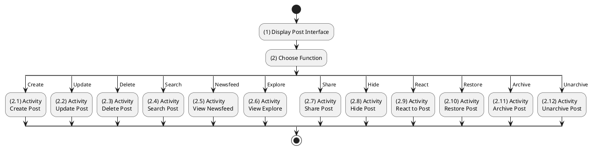

**Sequence Diagram**
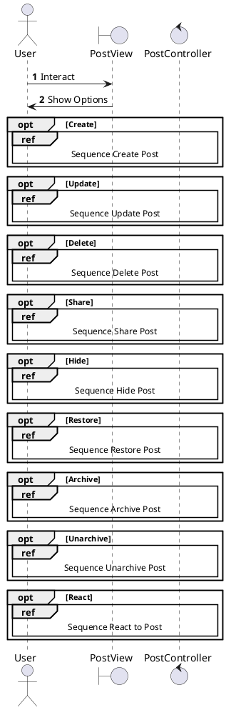

---

## 2.1.3.2 Create Post

### Use Case Description
| Attribute | Details |
| :--- | :--- |
| **Name** | **Create Post** |
| **Description** | Publish new content (Text, Image, Video). |
| **Actor** | Authenticated User |
| **Trigger** | ❖ User clicks [Post] button. |
| **Pre-condition** | ❖ Content exists. |
| **Post-condition** | ❖ Post created in DB. |

### Business Rules (BR)

| Activity | BR Code | Description |
| :---: | :---: | :--- |
| (2)-(3) | BR1 | **Submission:** ❖ The **Frontend** component `CreatePostModal` collects the form data and invokes the `postApi.create(formData)` method to submit the content. ❖ The **API** receives a `POST` request at `/api/posts`, containing top-level parameters such as `Caption`, `PrivacyLevel`, `Tags`, `Location`, and `mediaFiles` (Multipart). ❖ The **Backend** `PostsController.Create` method extracts the authenticated User ID from the JWT token and delegates the creation logic to `_posts.CreateAsync`. |
| (3.2)-(4) | BR2 | **Persistence:** ❖ The **Service** uploads any attached media files to **Cloudinary** and retrieves the remote URLs. ❖ The **System** persists the data by inserting records into the `Post`, `PostMedia`, and `PostTag` (Join Table) tables within a single Database Transaction. ❖ The `_tags.LinkAsync` method ensures that all referenced tags effectively exist or are created if new. |
| (4.2)-(5) | BR3 | **Completion:** ❖ The **System** returns a `201 Created` HTTP response containing the full `PostResponse` DTO. ❖ The **Frontend** receives the response and immediately prepends the new post to the local `feed` list for instant feedback. |
| (4.1)-(6) | BR_Error | **Exception:** ❖ If the validation fails (e.g., empty content), the **System** returns a `400 Bad Request` error. ❖ If the media upload fails, the **System** returns a `400 Bad Request` with the specific error code `MEDIA_UPLOAD_FAILED`. |

### Diagrams

**Activity Diagram**
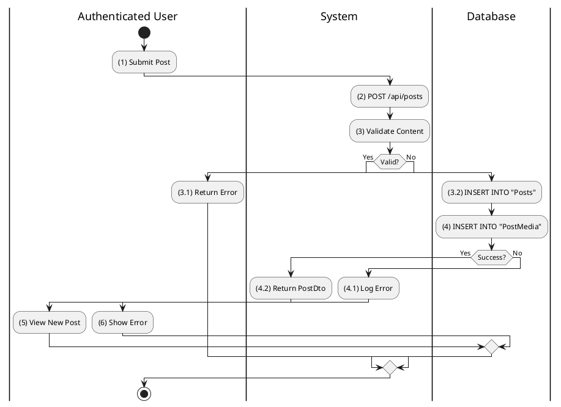

**Sequence Diagram**
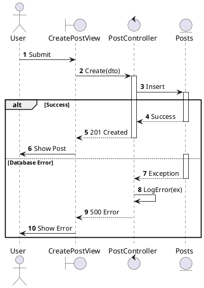

---

## 2.1.3.3 Update Post

### Use Case Description
| Attribute | Details |
| :--- | :--- |
| **Name** | **Update Post** |
| **Description** | Edit caption, privacy, or media. |
| **Actor** | Authenticated User (Author) |
| **Trigger** | ❖ User clicks Edit. |
| **Post-condition** | ❖ Post updated in DB. |

### Business Rules (BR)

| Activity | BR Code | Description |
| :---: | :---: | :--- |
| (2)-(3) | BR1 | **Processing:** ❖ The **Frontend** `EditPostForm` captures the changes and calls the `postApi.update(id, { caption })` function. ❖ The **API** receives a `PUT` request at `/api/posts/{id}`. ❖ The **Backend** controller `PostsController.Update` invokes the business logic via `_posts.UpdateAsync(id, userId, caption)`. |
| (3.2)-(4) | BR2 | **Logic:** ❖ The **Service** first verifies **Ownership** by checking if `Post.ProfileId` matches the requesting `userId`. If they do not match, it returns `false`. ❖ The **System** updates the `Caption` and `UpdatedAt` fields in the database. ❖ The **System** returns a `200 OK` response upon success. |
| (3.2.1)-(5) | BR_Error | **Exception:** ❖ If the user is forbidden or the post is not found, the **System** returns a `403 Forbidden` response with the error code `POST_FORBIDDEN_OR_NOT_FOUND`. |

### Diagrams

**Activity Diagram**
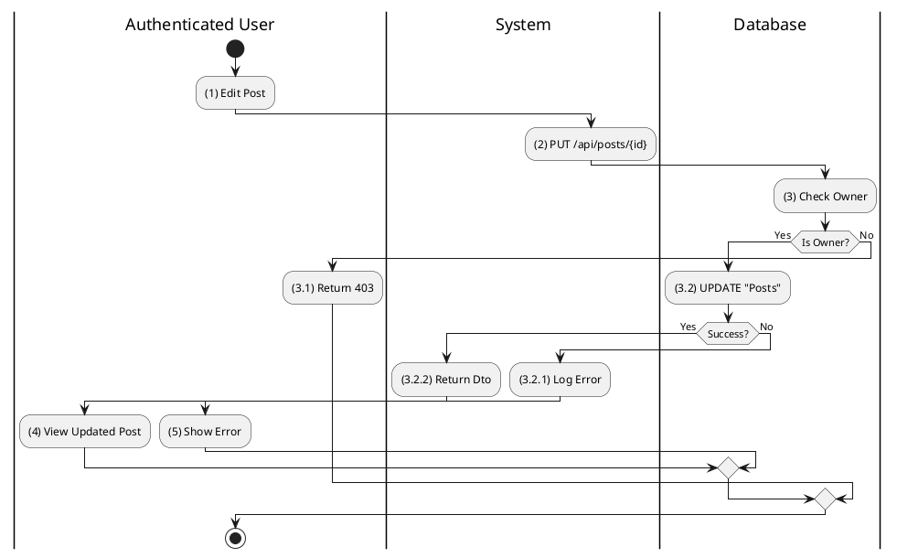

**Sequence Diagram**
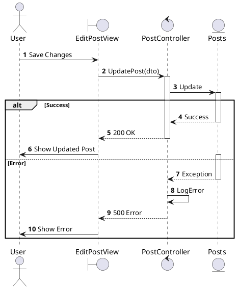

---

## 2.1.3.4 Delete Post

### Use Case Description
| Attribute | Details |
| :--- | :--- |
| **Name** | **Delete Post** |
| **Description** | Soft delete a post. |
| **Actor** | Authenticated User (Author) |
| **Trigger** | ❖ User clicks Delete. |
| **Post-condition** | ❖ `IsDeleted` = 1. |

### Business Rules (BR)

| Activity | BR Code | Description |
| :---: | :---: | :--- |
| (2)-(3) | BR1 | **Processing:** ❖ The **API** receives a `DELETE` request at the endpoint `/api/posts/{id}`. ❖ The **Backend** controller `PostsController.Delete` triggers the deletion logic via `_posts.DeleteAsync`. ❖ The **System** performs a **Soft Delete** by setting `IsDeleted = true` and `DeletedAt = UtcNow`, effectively moving the post to the "Recycle Bin". |
| (3.2)-(4) | BR2 | **Success:** ❖ The **System** returns a `200 OK` response with the message "Bài viết đã được chuyển vào thùng rác.". ❖ The **Frontend** immediately removes the post component from the feed view. |

### Diagrams

**Activity Diagram**
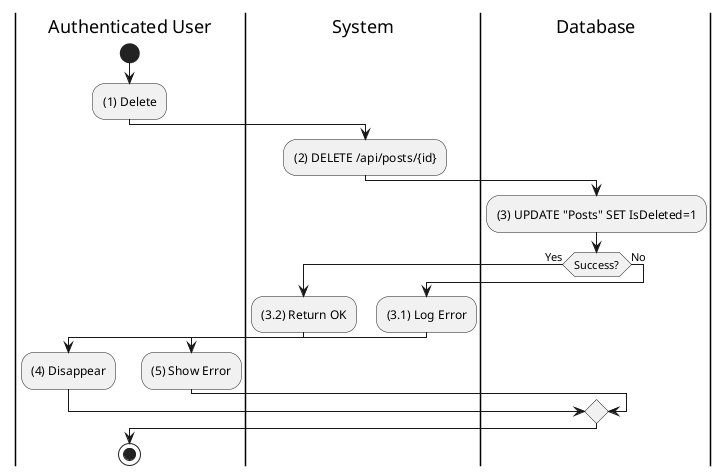

**Sequence Diagram**
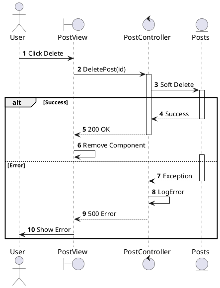

---

## 2.1.3.5 Search Post

### Use Case Description
| Attribute | Details |
| :--- | :--- |
| **Name** | **Search Post** |
| **Description** | Search by keyword or AI Semantic meaning. |
| **Actor** | Authenticated User |
| **Trigger** | ❖ User enters query in Search Bar. |

### Business Rules (BR)

| Activity | BR Code | Description |
| :---: | :---: | :--- |
| (2)-(3) | BR1 | **Keyword Search:** ❖ The **API** receives a `POST` request at `/api/search` with the body content `{ Query, Type: 'Post' }`. ❖ The **Backend** controller `SearchController.Search` calls `_search.SearchAsync`. ❖ The **Database** executes a query to find matches where `Posts.Caption ILIKE %q%` OR `Tags.Name == q`. |
| (4) | BR2 | **Semantic Search:** ❖ The **API** receives a `POST` request at `/api/search/semantic`. ❖ The **Backend** controller `SearchController.SemanticSearch` delegates to `_search.SemanticSearchAsync`. ❖ The **System** generates an embedding for the query and compares it with the `PostEmbeddings` vector table using **Cosine Similarity**. |
| (5) | BR3 | **Result:** ❖ The **System** returns a `200 OK` response containing a `SearchResult` object, which includes a list of `PostResponse` items. |

### Diagrams

**Activity Diagram**
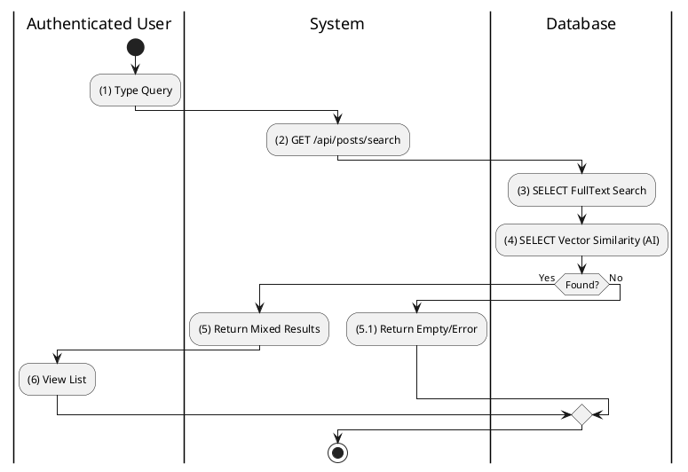

**Sequence Diagram**
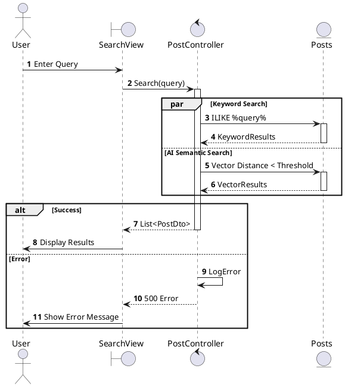

---

## 2.1.3.6 View Post Newsfeed

### Use Case Description
| Attribute | Details |
| :--- | :--- |
| **Name** | **View Post Newsfeed** |
| **Description** | View stream of posts (Personalized Timeline or Public Feed). |
| **Actor** | Authenticated User / Guest |
| **Trigger** | ❖ Open Home Page / Feed. |

### Business Rules (BR)

| Activity | BR Code | Description |
| :---: | :---: | :--- |
| (2)-(3) | BR1 | **Routing:** ❖ For an **Authenticated User**, the request is routed to `GET /api/posts/feed`, where `PostsController` calls `Release.GetFeedAsync(userId)`. ❖ For a **Guest**, the request is routed to `GET /api/posts/guest-feed`, which calls `_posts.GetGuestFeedAsync()`. |
| (4) | BR2 | **Fetching:** ❖ The **Feed Logic** queries the `Posts` table where `AuthorId` is in the user's `FollowedIds` OR `AuthorId` is the user themselves, ordering by `CreatedAt` Descending. ❖ The **System** enforces **Privacy** rules: `GetFeedAsync` filters valid posts, but the Controller double-checks `_privacy.CanViewPostAsync` for additional safety. |
| (5) | BR3 | **Response:** ❖ The **API** returns a `200 OK` response containing a `PagedResult<PostResponse>`. ❖ The **Frontend** utilizes Infinite Scroll to populate the list as the user navigates down. |

### Diagrams

**Activity Diagram**
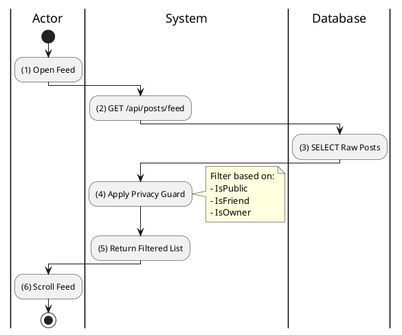

**Sequence Diagram**
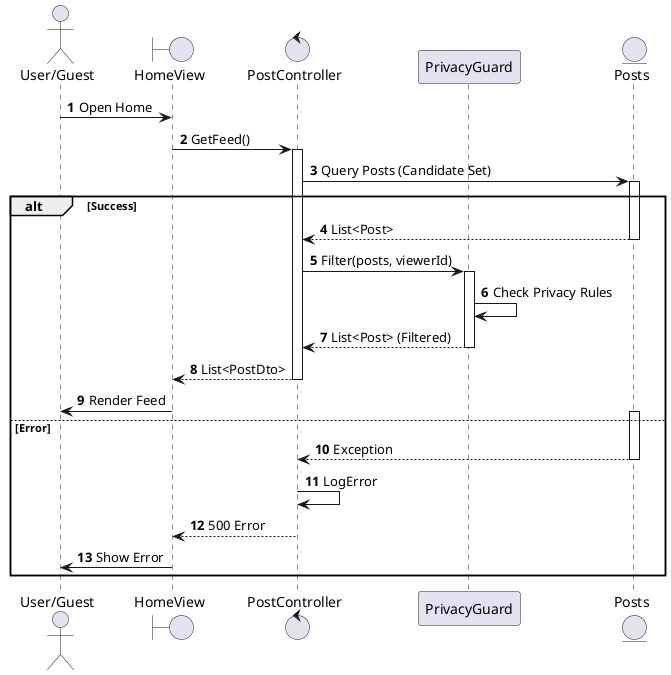

---

## 2.1.3.7 View Explore Feed

### Use Case Description
| Attribute | Details |
| :--- | :--- |
| **Name** | **View Explore Feed** |
| **Description** | View trending content. |
| **Actor** | Authenticated User |
| **Trigger** | ❖ Click Explore Tab. |

### Business Rules (BR)

| Activity | BR Code | Description |
| :---: | :---: | :--- |
| (2)-(3) | BR1 | **Fetching:** ❖ The **API** endpoint `GET /api/posts/explore` receives the request. ❖ The **Backend** `PostsController.GetExplore` calls `_posts.GetExploreAsync(userId)`. ❖ The **System** queries the `Posts` table, either shuffled or ordered by Engagement (Like/Comment count), excluding any authors already followed by the user to ensure discovery. |
| (3.1) | BR_Error | **Exception:** If no content is available, the **System** returns a `200 OK` response with an empty list. |

### Diagrams

**Activity Diagram**
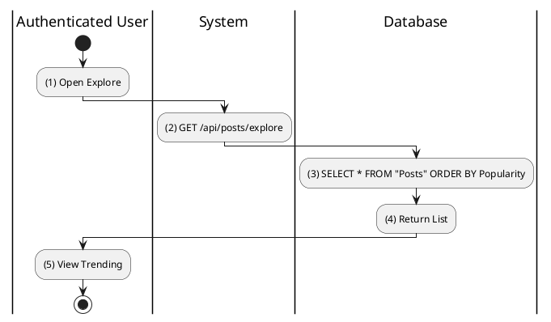

**Sequence Diagram**
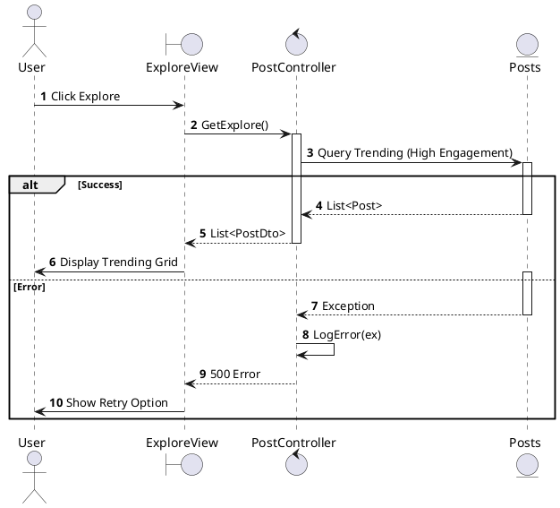

---

## 2.1.3.8 Share Post

### Use Case Description
| Attribute | Details |
| :--- | :--- |
| **Name** | **Share Post** |
| **Description** | Share internally (Repost) or externally. |
| **Actor** | Authenticated User |
| **Trigger** | ❖ Click Share. |

### Business Rules (BR)

| Activity | BR Code | Description |
| :---: | :---: | :--- |
| (2)-(3) | BR1 | **Internal Repost (Invented):** ❖ The **API** receives a `POST` request at `/api/posts/{id}/share`. ❖ The **Backend** function `ShareAsync` creates a new `Post` entity with `SharedPostId` set to the original ID. ❖ The **System** treats this content as a quote-tweet or simple repost on the user's timeline. |
| (2.1) | BR2 | **External Share:** ❖ The **Frontend** generates a shareable link in the format `https://favi.app/posts/{id}` using the ID from the properties. ❖ The **System** copies the link to the clipboard or opens the Native Share Sheet on mobile devices. No Backend call is required. |

### Diagrams

**Activity Diagram**
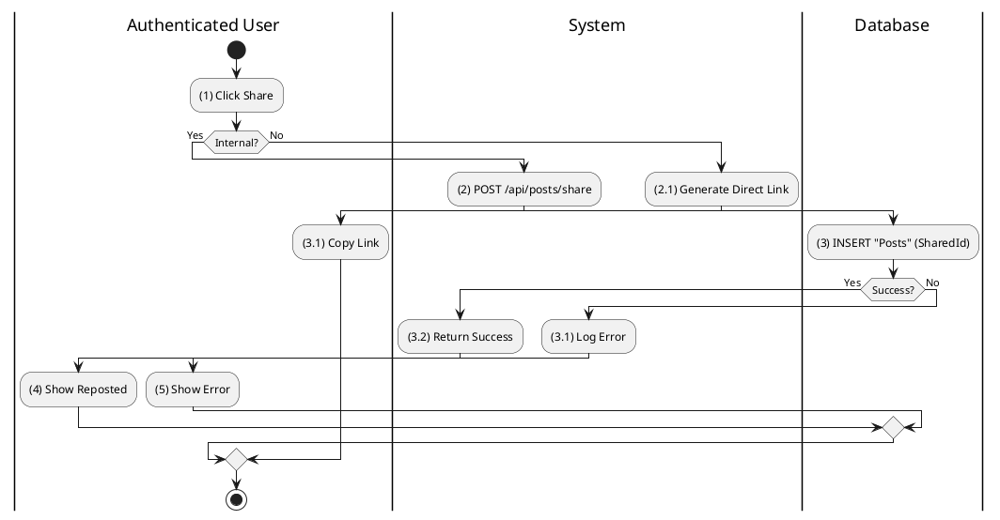

**Sequence Diagram**
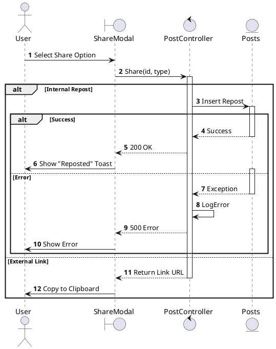

---

## 2.1.3.9 Hide Post

### Use Case Description
| Attribute | Details |
| :--- | :--- |
| **Name** | **Hide Post** |
| **Description** | See less content like this. |
| **Actor** | Authenticated User |
| **Trigger** | ❖ Click "Hide this post". |

### Business Rules (BR)

| Activity | BR Code | Description |
| :---: | :---: | :--- |
| (2)-(3) | BR1 | **Processing (Invented):** ❖ The **API** receives a `POST` request at `/api/posts/{id}/hide`. ❖ The **Backend** inserts a new record into the `HiddenPosts` table linking the `UserId` and `PostId`. ❖ The **System** updates future feed queries to include the clause `WHERE PostId NOT IN (SELECT PostId FROM HiddenPosts)`. |
| (4) | BR2 | **UI:** ❖ The **Frontend** optimistically removes the post from the DOM to provide immediate feedback to the user. |

### Diagrams

**Activity Diagram**
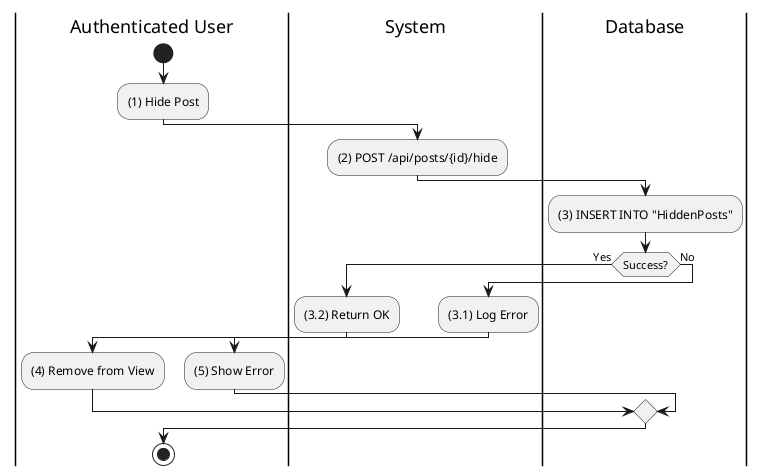

**Sequence Diagram**
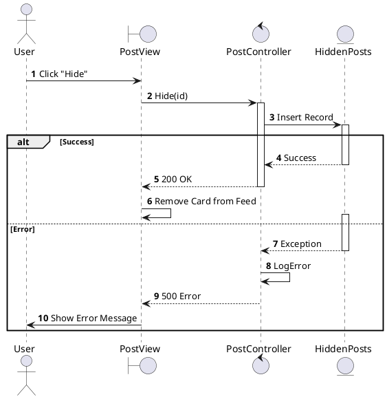
