# Use Case 2.1.3: Adjust Post

**Module**: Content Management
**Primary Actor**: Authenticated User
**Backend Controller**: `PostController`
**Database Tables**: `Posts`, `PostMedia`, `Follows`, `HiddenPosts`

---

## 2.1.3.1 Adjust Post (Overview)

### Use Case Description
| Attribute | Details |
| :--- | :--- |
| **Name** | **Adjust Post** |
| **Description** | Central hub for post interactions. |
| **Actor** | Authenticated User |
| **Trigger** | ❖ User interacts with a Post or Newsfeed. |
| **Post-condition** | ❖ User triggers specific sub-actions. |

### Business Rules (BR)

| Activity | BR Code | Description |
| :---: | :---: | :--- |
| (1) | BR1 | **Display:** ❖ System displays Post Interface. ❖ Options enabled based on Ownership/Context. |

### Diagrams

**Activity Diagram**
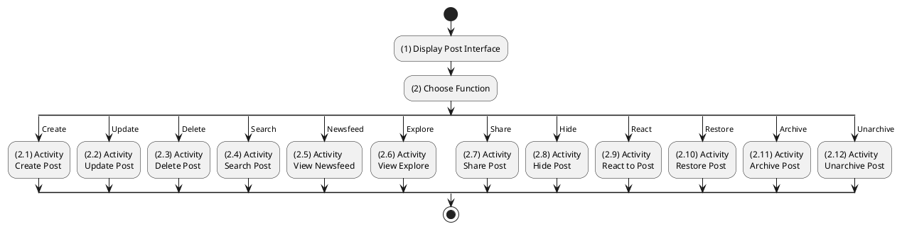

**Sequence Diagram**
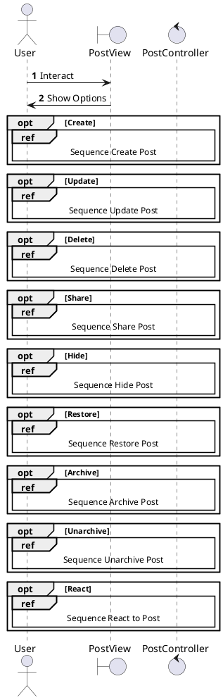

---

## 2.1.3.2 Create Post

### Use Case Description
| Attribute | Details |
| :--- | :--- |
| **Name** | **Create Post** |
| **Description** | Publish new content (Text, Image, Video). |
| **Actor** | Authenticated User |
| **Trigger** | ❖ User clicks [Post] button. |
| **Pre-condition** | ❖ Content exists. |
| **Post-condition** | ❖ Post created in DB. |

### Business Rules (BR)

| Activity | BR Code | Description |
| :---: | :---: | :--- |
| (2)-(3) | BR1 | **Submission:** ❖ **Frontend**: `CreatePostModal` calls `postApi.create(formData)`. ❖ **API**: `POST /api/posts`. Top-level params: `Caption`, `PrivacyLevel`, `Tags`, `Location`, `mediaFiles` (Multipart). ❖ **Backend**: `PostsController.Create` extracts User ID from JWT. Calls `_posts.CreateAsync`. |
| (3.2)-(4) | BR2 | **Persistence:** ❖ **Service**: Uploads media to Cloudinary (if any). ❖ **DB**: Inserts `Post`, `PostMedia`, `PostTag` (Join Table) in a Transaction. ❖ **Tags**: `_tags.LinkAsync` ensures tags exist or created. |
| (4.2)-(5) | BR3 | **Completion:** ❖ **Response**: `201 Created` with `PostResponse`. ❖ **Frontend**: Prepend new post to `feed` list. |
| (4.1)-(6) | BR_Error | **Exception:** ❖ Validation Error (Empty content): `400 Bad Request`. ❖ Upload Fail: `400 Bad Request` { code: "MEDIA_UPLOAD_FAILED" }. |

### Diagrams

**Activity Diagram**
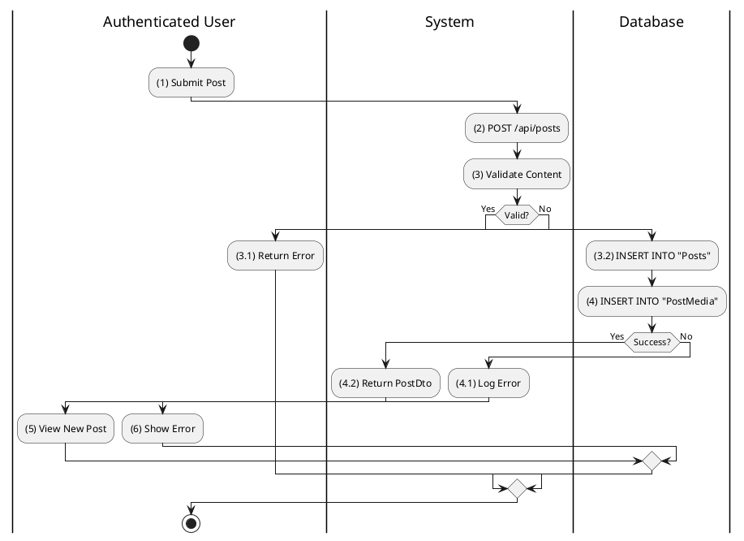

**Sequence Diagram**
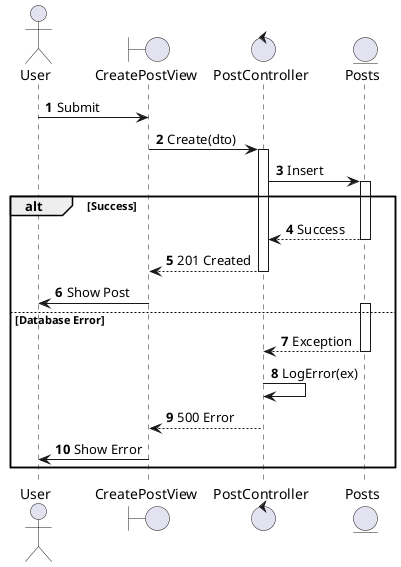

---

## 2.1.3.3 Update Post

### Use Case Description
| Attribute | Details |
| :--- | :--- |
| **Name** | **Update Post** |
| **Description** | Edit caption, privacy, or media. |
| **Actor** | Authenticated User (Author) |
| **Trigger** | ❖ User clicks Edit. |
| **Post-condition** | ❖ Post updated in DB. |

### Business Rules (BR)

| Activity | BR Code | Description |
| :---: | :---: | :--- |
| (2)-(3) | BR1 | **Processing:** ❖ **Frontend**: `EditPostForm` calls `postApi.update(id, { caption })`. ❖ **API**: `PUT /api/posts/{id}`. ❖ **Backend**: `PostsController.Update` calls `_posts.UpdateAsync(id, userId, caption)`. |
| (3.2)-(4) | BR2 | **Logic:** ❖ **Ownership**: Service checks if `Post.ProfileId == userId`. If not -> `false`. ❖ **Update**: Modifies `Caption`, `UpdatedAt`. ❖ **Response**: `200 OK`. |
| (3.2.1)-(5) | BR_Error | **Exception:** ❖ Forbidden/Not Found: Returns `403 Forbidden` { code: "POST_FORBIDDEN_OR_NOT_FOUND" }. |

### Diagrams

**Activity Diagram**
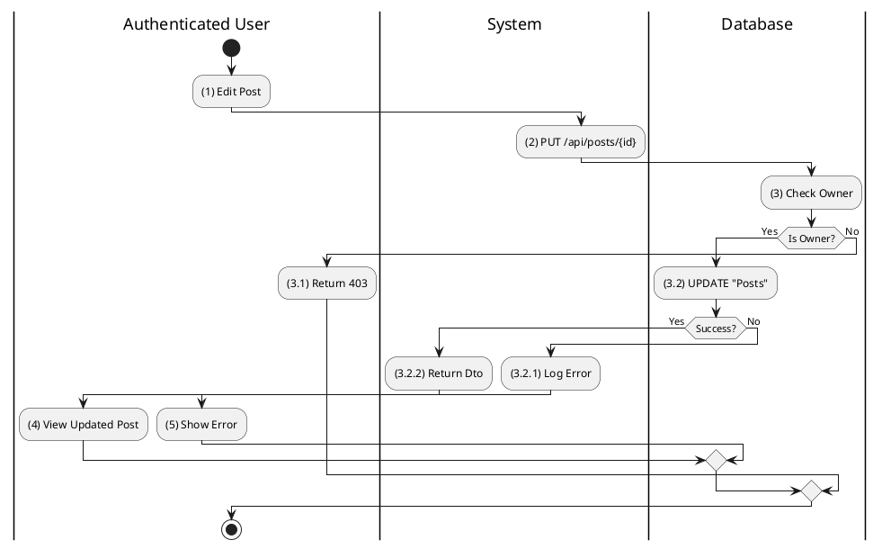

**Sequence Diagram**
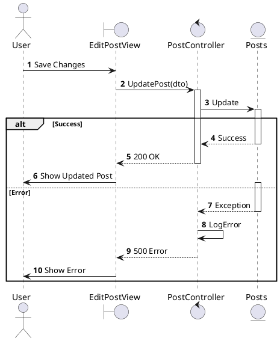

---

## 2.1.3.4 Delete Post

### Use Case Description
| Attribute | Details |
| :--- | :--- |
| **Name** | **Delete Post** |
| **Description** | Soft delete a post. |
| **Actor** | Authenticated User (Author) |
| **Trigger** | ❖ User clicks Delete. |
| **Post-condition** | ❖ `IsDeleted` = 1. |

### Business Rules (BR)

| Activity | BR Code | Description |
| :---: | :---: | :--- |
| (2)-(3) | BR1 | **Processing:** ❖ **API**: `DELETE /api/posts/{id}`. ❖ **Backend**: `PostsController.Delete` calls `_posts.DeleteAsync`. ❖ **Logic**: Sets `IsDeleted = true`, `DeletedAt = UtcNow`. Moves to "Recycle Bin". |
| (3.2)-(4) | BR2 | **Success:** ❖ **Response**: `200 OK` { message: "Bài viết đã được chuyển vào thùng rác." }. ❖ **Frontend**: Removes post from feed instantly. |

### Diagrams

**Activity Diagram**
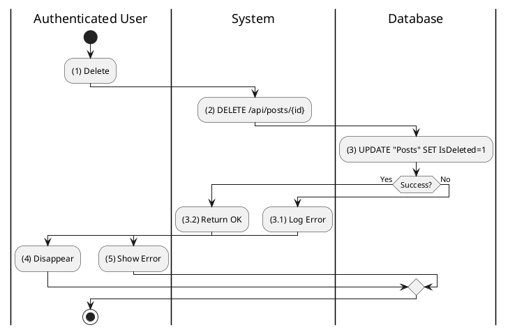

**Sequence Diagram**
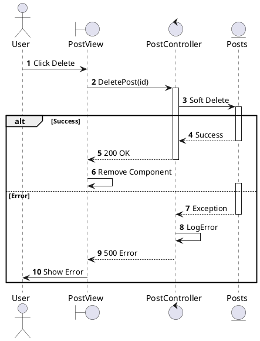

---

## 2.1.3.5 Search Post

### Use Case Description
| Attribute | Details |
| :--- | :--- |
| **Name** | **Search Post** |
| **Description** | Search by keyword or AI Semantic meaning. |
| **Actor** | Authenticated User |
| **Trigger** | ❖ User enters query in Search Bar. |

### Business Rules (BR)

| Activity | BR Code | Description |
| :---: | :---: | :--- |
| (2)-(3) | BR1 | **Keyword Search:** ❖ **API**: `POST /api/search` { `Query`, `Type`: `Post` }. ❖ **Backend**: `SearchController.Search` -> `_search.SearchAsync`. ❖ **DB**: `Posts.Caption ILIKE %q%` OR `Tags.Name == q`. |
| (4) | BR2 | **Semantic Search:** ❖ **API**: `POST /api/search/semantic`. ❖ **Backend**: `SearchController.SemanticSearch` -> `_search.SemanticSearchAsync`. ❖ **Logic**: Generates embedding for query, compares with `PostEmbeddings` vector table using Cosine Similarity. |
| (5) | BR3 | **Result:** ❖ **Response**: `200 OK` with `SearchResult` (List of PostResponse). |

### Diagrams

**Activity Diagram**
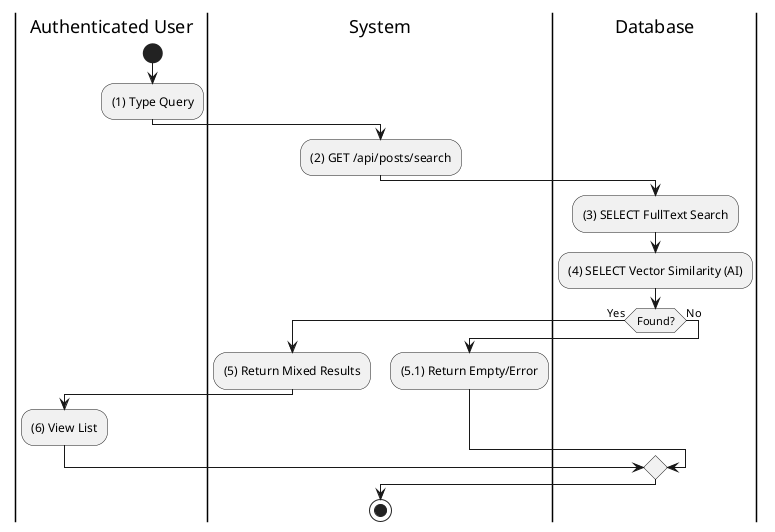

**Sequence Diagram**
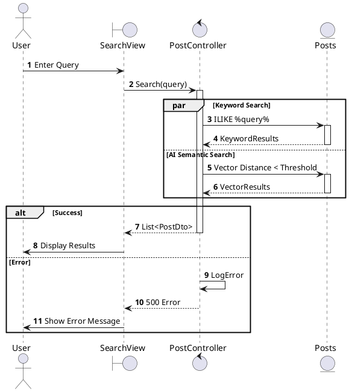

---

## 2.1.3.6 View Post Newsfeed

### Use Case Description
| Attribute | Details |
| :--- | :--- |
| **Name** | **View Post Newsfeed** |
| **Description** | View stream of posts (Personalized Timeline or Public Feed). |
| **Actor** | Authenticated User / Guest |
| **Trigger** | ❖ Open Home Page / Feed. |

### Business Rules (BR)

| Activity | BR Code | Description |
| :---: | :---: | :--- |
| (2)-(3) | BR1 | **Routing:** ❖ **Authenticated**: `GET /api/posts/feed`. `PostsController` calls `Release.GetFeedAsync(userId)`. ❖ **Guest**: `GET /api/posts/guest-feed`. Calls `_posts.GetGuestFeedAsync()`. |
| (4) | BR2 | **Fetching:** ❖ **Feed Logic**: Queries `Posts` where `AuthorId` IN (FollowedIds) OR `AuthorId` == Me. Ordered by `CreatedAt` Desc. ❖ **Privacy**: `GetFeedAsync` already filters visible posts, but Controller double-checks `_privacy.CanViewPostAsync` for safety. |
| (5) | BR3 | **Response:** ❖ **API**: `200 OK` with `PagedResult<PostResponse>`. ❖ **Frontend**: Infinite scroll populates list. |

### Diagrams

**Activity Diagram**
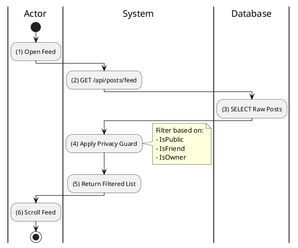

**Sequence Diagram**
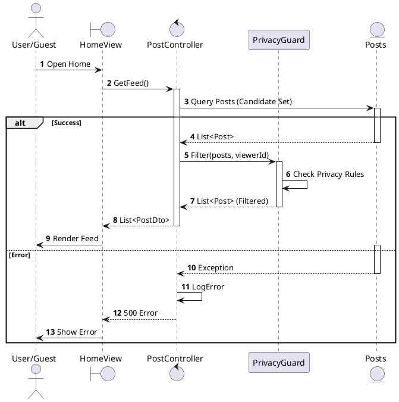

---

## 2.1.3.7 View Explore Feed

### Use Case Description
| Attribute | Details |
| :--- | :--- |
| **Name** | **View Explore Feed** |
| **Description** | View trending content. |
| **Actor** | Authenticated User |
| **Trigger** | ❖ Click Explore Tab. |

### Business Rules (BR)

| Activity | BR Code | Description |
| :---: | :---: | :--- |
| (2)-(3) | BR1 | **Fetching:** ❖ **API**: `GET /api/posts/explore`. ❖ **Backend**: `PostsController.GetExplore` calls `_posts.GetExploreAsync(userId)`. ❖ **Logic**: Queries `Posts` shuffled or ordered by Engagement (Like/Comment count), excluding Followed authors (discovery purpose). |
| (3.1) | BR_Error | **Exception:** Returns `200 OK` (Empty) if no content. |

### Diagrams

**Activity Diagram**
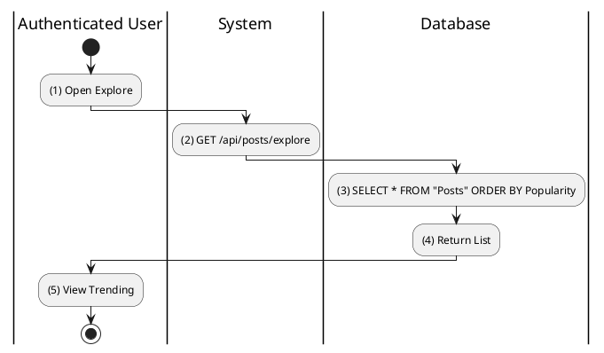

**Sequence Diagram**
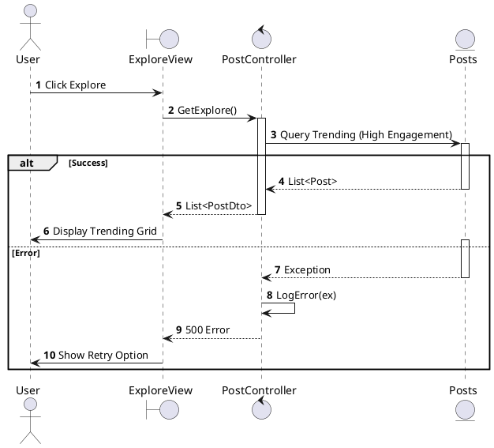

---

## 2.1.3.8 Share Post

### Use Case Description
| Attribute | Details |
| :--- | :--- |
| **Name** | **Share Post** |
| **Description** | Share internally (Repost) or externally. |
| **Actor** | Authenticated User |
| **Trigger** | ❖ Click Share. |

### Business Rules (BR)

| Activity | BR Code | Description |
| :---: | :---: | :--- |
| (2)-(3) | BR1 | **Internal Repost (Invented):** ❖ **API**: `POST /api/posts/{id}/share`. ❖ **Backend**: `ShareAsync` creates a new Post with `SharedPostId = originId`. ❖ **Content**: Acts as a quote-tweet or simple repost. |
| (2.1) | BR2 | **External Share:** ❖ **Frontend**: Generates link `https://favi.app/posts/{id}` using the ID from props. ❖ **Action**: Copies to clipboard or opens Native Share Sheet (Mobile). No Backend call required. |

### Diagrams

**Activity Diagram**
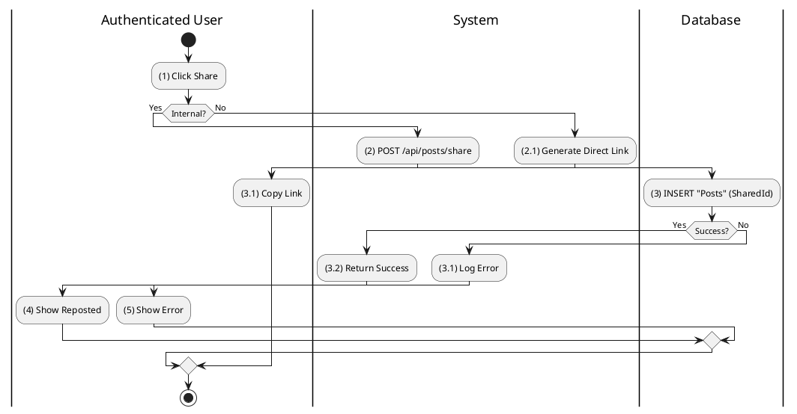

**Sequence Diagram**
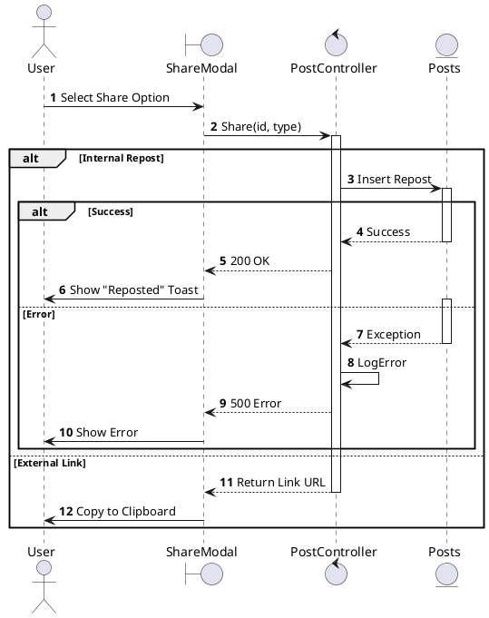

---

## 2.1.3.9 Hide Post

### Use Case Description
| Attribute | Details |
| :--- | :--- |
| **Name** | **Hide Post** |
| **Description** | See less content like this. |
| **Actor** | Authenticated User |
| **Trigger** | ❖ Click "Hide this post". |

### Business Rules (BR)

| Activity | BR Code | Description |
| :---: | :---: | :--- |
| (2)-(3) | BR1 | **Processing (Invented):** ❖ **API**: `POST /api/posts/{id}/hide`. ❖ **Backend**: Inserts into `HiddenPosts` table (UserId, PostId). ❖ **Feed**: Future feed queries: `WHERE PostId NOT IN (SELECT PostId FROM HiddenPosts)`. |
| (4) | BR2 | **UI:** ❖ **Frontend**: Optimistically removes post from DOM. |

### Diagrams

**Activity Diagram**
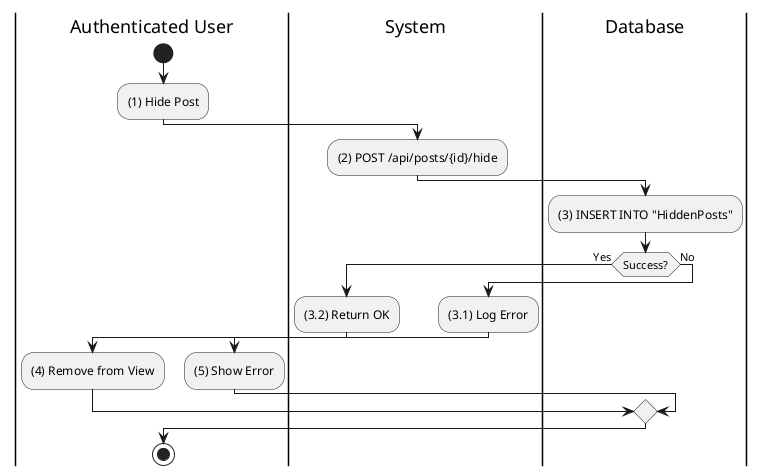

**Sequence Diagram**
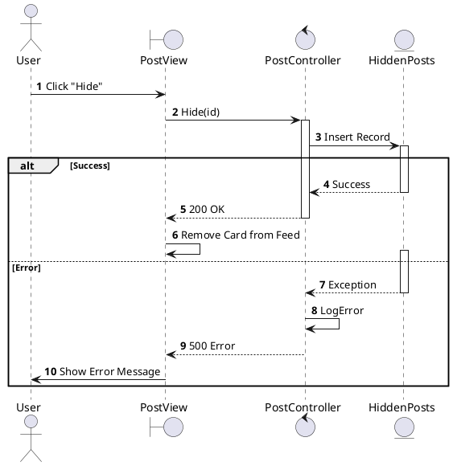

