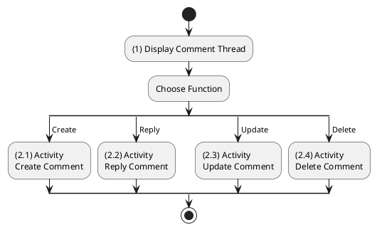
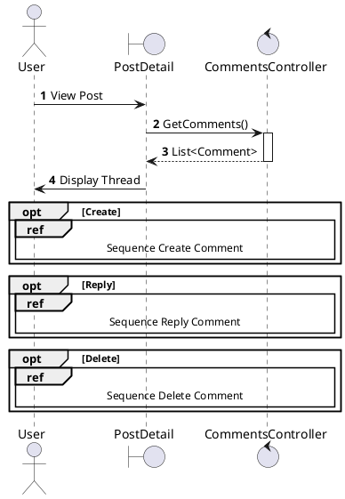
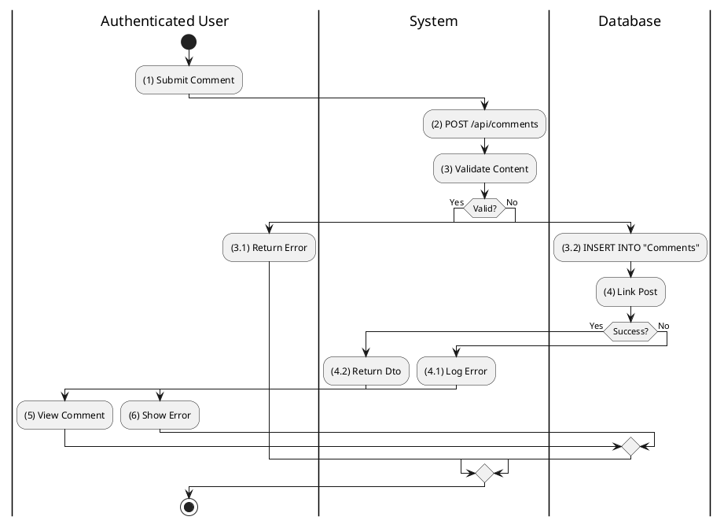
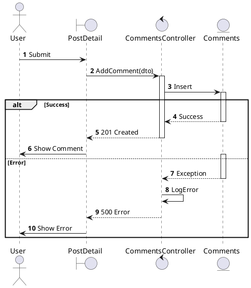
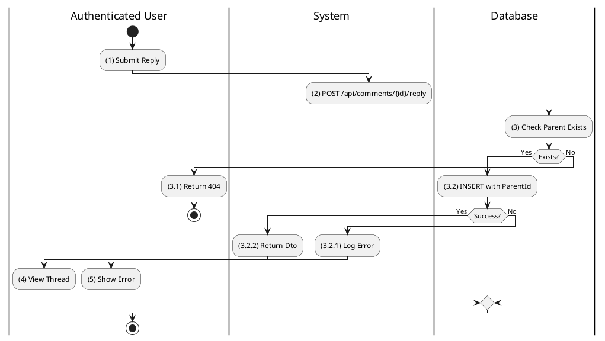
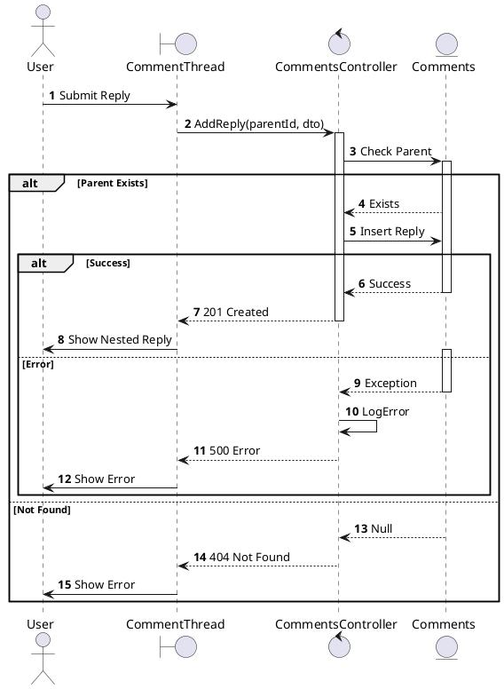
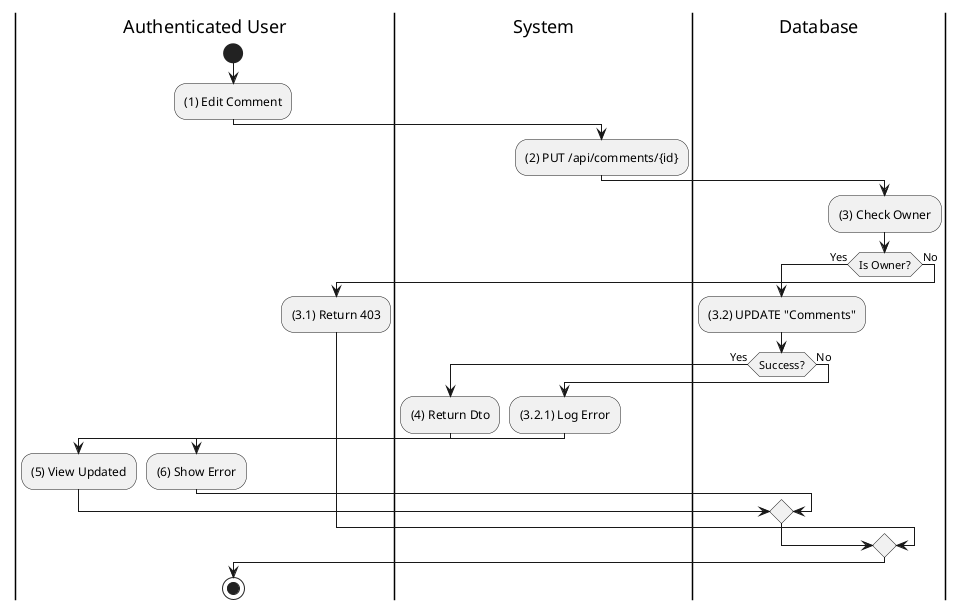
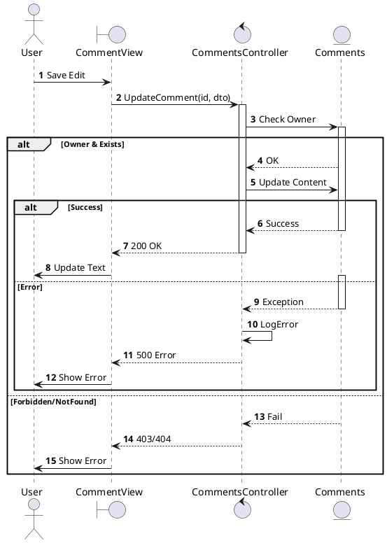
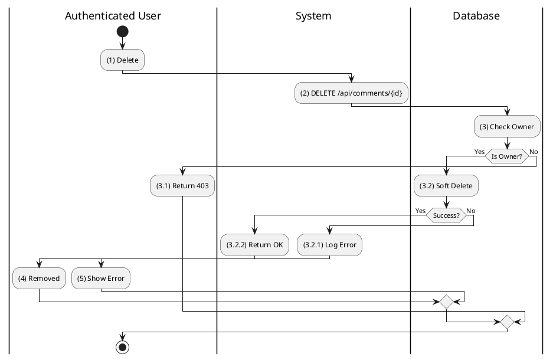
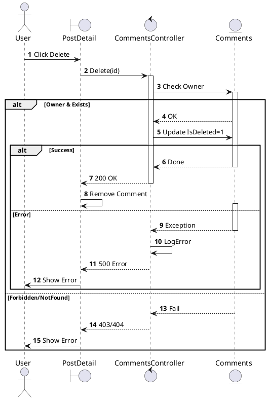

# Use Case 2.1.4: Adjust Comment

**Module**: Interaction / Engagement
**Primary Actor**: Authenticated User
**Backend Controller**: `CommentsController`
**Database Tables**: `"Comments"`

---

## 2.1.4.1 Adjust Comment (View Comment)

### Use Case Description
| Attribute | Details |
| :--- | :--- |
| **Name** | **Adjust Comment** |
| **Description** | View/Manage a specific comment item. |
| **Actor** | Authenticated User |
| **Trigger** | ❖ User views a comment in a thread. |
| **Post-condition** | ❖ Comment is displayed with Reply/Like/Delete options. |

### Business Rules (BR)

| Activity | BR Code | Description |
| :---: | :---: | :--- |
| (1) | BR1 | **Display Logic:** ❖ The **System** renders the Comment Thread component as part of the Post Detail view. ❖ The **System** evaluates the current **User's** permissions (Author/Admin) to dynamically enable or disable action buttons (Reply, Edit, Delete) for each comment. |

### Diagrams

**Activity Diagram**

**Sequence Diagram**

---

## 2.1.4.2 Create Comment

### Use Case Description
| Attribute | Details |
| :--- | :--- |
| **Name** | **Create Comment** |
| **Description** | Add a comment to a post. |
| **Actor** | Authenticated User |
| **Trigger** | ❖ User types text and clicks Send. |
| **Pre-condition** | ❖ Post exists and accepts comments. |
| **Post-condition** | ❖ Comment record created. |

### Business Rules (BR)

| Activity | BR Code | Description |
| :---: | :---: | :--- |
| (2)-(3) | BR1 | **Submission:** ❖ The **Frontend** `CommentInput` component captures the text and calls `commentApi.create({ postId, content })`. ❖ The **API** receives a `POST` request at `/api/comments` with the `CreateCommentRequest` body. ❖ The **Backend** `CommentsController.Create` validates the request and invokes `_comments.CreateAsync`. |
| (3.2)-(4) | BR2 | **Persistence:** ❖ The **Database** inserts a new record into the `Comments` table with `ParentId` set to NULL. ❖ The **NotificationService** triggers a notification if the **Author** is different from the Post Owner. |
| (4.2)-(5) | BR3 | **Completion:** ❖ The **System** returns a `200 OK` response containing the `CommentResponse`. ❖ The **Frontend** immediately appends the new comment to the list for display. |
| (4.1)-(6) | BR_Error | **Exception:** ❖ If validation fails (e.g., empty content), the **System** returns `400 Bad Request`. If a Database error occurs, it returns `500`. |

### Diagrams

**Activity Diagram**

**Sequence Diagram**

---

## 2.1.4.3 Reply to Comment

### Use Case Description
| Attribute | Details |
| :--- | :--- |
| **Name** | **Reply to Comment** |
| **Description** | Respond to an existing comment. |
| **Actor** | Authenticated User |
| **Trigger** | ❖ User clicks Reply on a specific comment. |
| **Post-condition** | ❖ New Comment created with `ParentCommentId`. |

### Business Rules (BR)

| Activity | BR Code | Description |
| :---: | :---: | :--- |
| (2)-(3) | BR1 | **Submission:** ❖ The **Frontend** calls `commentApi.create({ postId, content, parentCommentId })` with the target Parent ID. ❖ The **API** request is handled by `POST /api/comments` (Reused endpoint). ❖ The **Backend** explicitly verifies the existence of the `ParentCommentId`. |
| (3.2) | BR2 | **Persistence:** ❖ The **Database** inserts the `Comment` record with the `ParentId` populated. ❖ The **Logic** supports nested threading (depending on UI implementation) or single-level nesting. |
| (3.2.2)-(4) | BR3 | **Completion:** ❖ The **System** returns `200 OK` with the `CommentResponse`. ❖ The **Frontend** inserts the new reply under the parent comment in the thread. |

### Diagrams

**Activity Diagram**

**Sequence Diagram**

---

## 2.1.4.4 Update Comment

### Use Case Description
| Attribute | Details |
| :--- | :--- |
| **Name** | **Update Comment** |
| **Description** | Edit the content of an existing comment. |
| **Actor** | Authenticated User (Author) |
| **Trigger** | ❖ User clicks Edit on their comment. |
| **Post-condition** | ❖ Comment text updated. |

### Business Rules (BR)

| Activity | BR Code | Description |
| :---: | :---: | :--- |
| (2)-(3) | BR1 | **Processing:** ❖ The **API** receives a `PUT` request at `/api/comments/{id}`. ❖ The **Backend** `CommentsController.Update` calls `_comments.UpdateAsync`. ❖ The **Logic** strictly verifies that `AuthorId` matches the `UserId` of the requester. It then updates the Content. |
| (3.2)-(4) | BR2 | **Persistence:** ❖ The **Database** updates the `Comments` table record. ❖ The **System** returns `200 OK` with the updated DTO. |
| (3.2.1) | BR_Error | **Exception:** ❖ If the comment is Not Found or the user is Forbidden, the **System** returns `404 Not Found` (merged error code for security). |

### Diagrams

**Activity Diagram**

**Sequence Diagram**

---

## 2.1.4.5 Delete Comment

### Use Case Description
| Attribute | Details |
| :--- | :--- |
| **Name** | **Delete Comment** |
| **Description** | Remove a comment. |
| **Actor** | Authenticated User (Author/Admin) |
| **Trigger** | ❖ User clicks Delete. |
| **Post-condition** | ❖ Comment deleted (Soft). |

### Business Rules (BR)

| Activity | BR Code | Description |
| :---: | :---: | :--- |
| (2)-(3) | BR1 | **Processing:** ❖ The **API** receives a `DELETE` request at `/api/comments/{id}`. ❖ The **Backend** `CommentsController.Delete` invokes `_comments.DeleteAsync`. ❖ The **Logic** verifies that the user is the Owner. |
| (3.2) | BR2 | **Persistence:** ❖ The **Database** performs a Soft Delete by setting `IsDeleted = 1`. ❖ The **System** returns `200 OK` with the message "Đã xoá bình luận.". |
| (3.2.2)-(4) | BR3 | **UI:** ❖ The **Frontend** removes the comment element from the DOM. |

### Diagrams

**Activity Diagram**

**Sequence Diagram**

