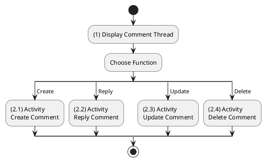
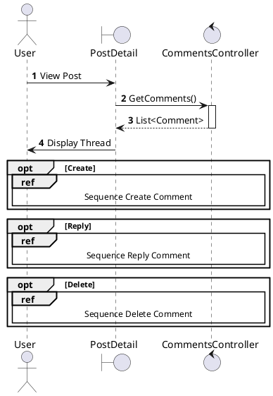
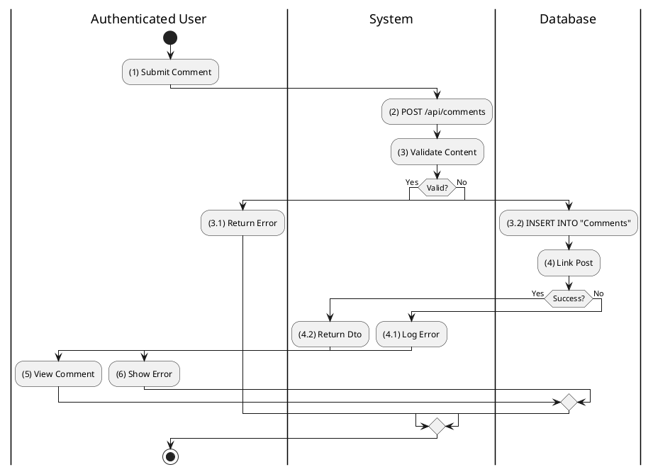
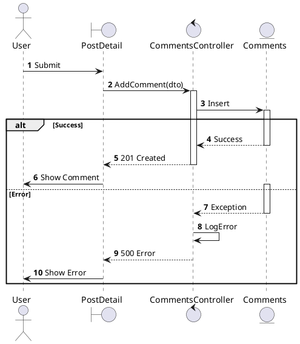
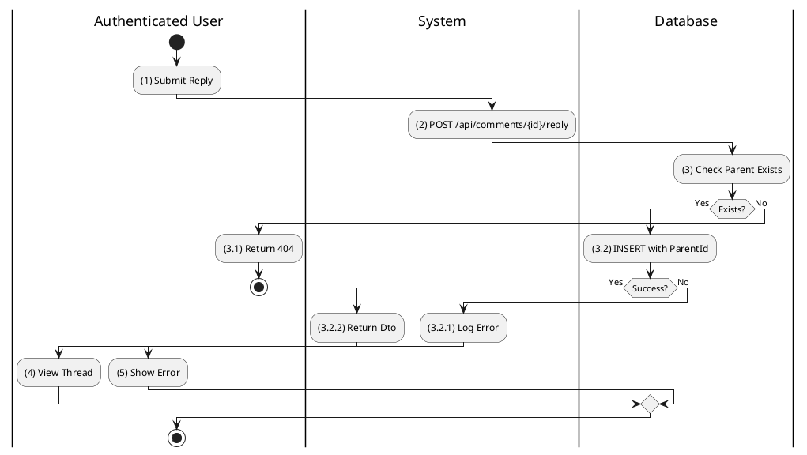
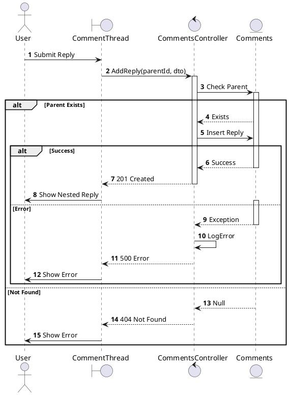
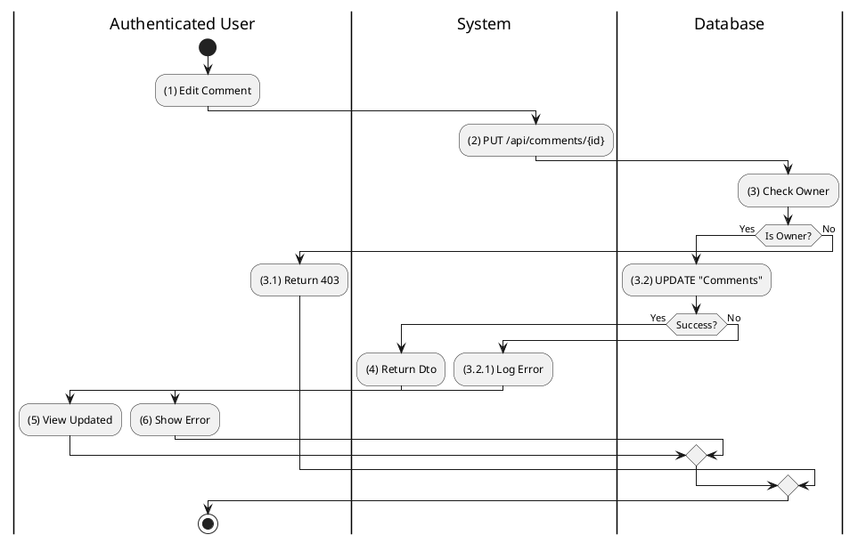
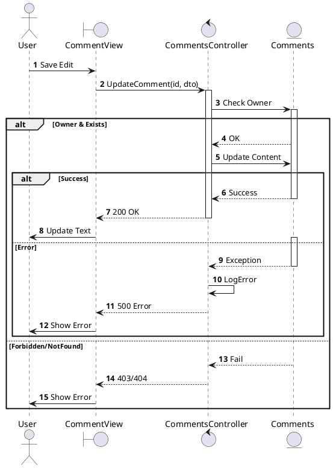
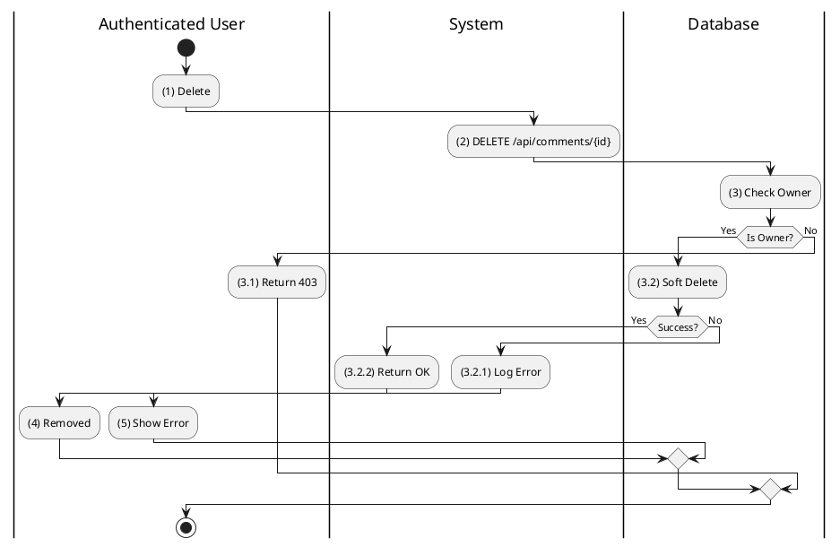
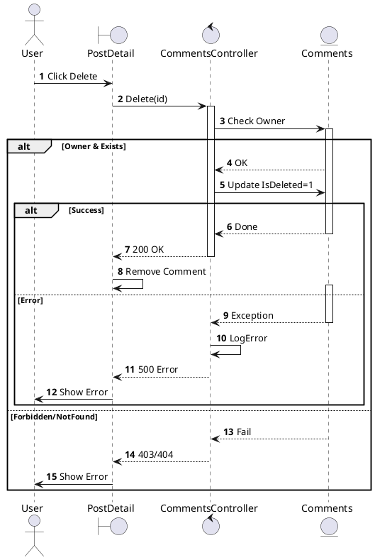

# Use Case 2.1.4: Adjust Comment

**Module**: Interaction / Engagement
**Primary Actor**: Authenticated User
**Backend Controller**: `Favi_BE.API.Controllers.CommentsController`
**Database Tables**: `"Comments"`

---

## 2.1.4.1 Adjust Comment (View Comment)

### Use Case Description
| Attribute | Details |
| :--- | :--- |
| **Name** | **Adjust Comment** |
| **Description** | View/Manage a specific comment item. |
| **Actor** | Authenticated User |
| **Trigger** | ❖ User views a comment in a thread. |
| **Post-condition** | ❖ Comment is displayed with Reply/Like/Delete options. |

### Business Rules (BR)

| Activity | BR Code | Description |
| :---: | :---: | :--- |
| (1) | BR1 | **Display Logic:** ❖ The System renders the Comment Thread component as part of the Post Detail view. ❖ The System evaluates the current user's permissions (Author/Admin) to dynamically enable or disable action buttons (Reply, Edit, Delete) for each comment. |

### Diagrams

### Diagrams

**Activity Diagram**

**Sequence Diagram**

---

## 2.1.4.2 Create Comment

### Use Case Description
| Attribute | Details |
| :--- | :--- |
| **Name** | **Create Comment** |
| **Description** | Add a comment to a post. |
| **Actor** | Authenticated User |
| **Trigger** | ❖ User types text and clicks Send. |
| **Pre-condition** | ❖ Post exists and accepts comments. |
| **Post-condition** | ❖ Comment record created. |

### Business Rules (BR)

| Activity | BR Code | Description |
| :---: | :---: | :--- |
| (2)-(3) | BR1 | **Submission & Validation:** ❖ The User submits the comment text via the input field (Step 1). ❖ The System receives the `CreateCommentDto` containing the text and `PostId`. ❖ The System validates that the content is not empty and does not exceed the maximum character limit (Step 3). |
| (3.2)-(4) | BR2 | **Persistence & Linking:** ❖ The System creates a new record in the `Comments` table with the current timestamp. ❖ The System establishes a foreign key link to the target `PostId` and `UserId` (Step 4). |
| (4.2)-(5) | BR3 | **UI Update:** ❖ Upon success, the System returns the full `CommentDto` including the new ID and Author info. ❖ The UI appends the new comment to the bottom of the list without refreshing the page (Step 5). |
| (4.1)-(6) | BR_Error | **Exception Handling:** ❖ If the database insert fails (Step 4):  The System logs the exception details.  The System returns a 500 Internal Server Error.  The UI displays a toast message "Failed to post comment" (Step 6). |

### Diagrams

**Activity Diagram**

**Sequence Diagram**

---

## 2.1.4.3 Reply to Comment

### Use Case Description
| Attribute | Details |
| :--- | :--- |
| **Name** | **Reply to Comment** |
| **Description** | Respond to an existing comment. |
| **Actor** | Authenticated User |
| **Trigger** | ❖ User clicks Reply on a specific comment. |
| **Post-condition** | ❖ New Comment created with `ParentCommentId`. |

### Business Rules (BR)

| Activity | BR Code | Description |
| :---: | :---: | :--- |
| (2)-(3) | BR1 | **Reply Processing:** ❖ The System receives the reply request targeting a specific `ParentCommentId`. ❖ The System verifies that the Parent Comment exists and is not deleted (Step 3). |
| (3.2) | BR2 | **Hierarchical Storage:** ❖ The System inserts a new record into the `Comments` table, populating the `ParentId` column to establish the threading relationship (Step 3.2). |
| (3.2.2)-(4) | BR3 | **Threaded Display:** ❖ The System returns the created `CommentDto`. ❖ The UI renders the new comment indented or nested immediately under the parent comment to visualize the conversation flow (Step 4). |
| (3.2.1)-(5) | BR_Error | **Exception Handling:** ❖ If the database operation fails:  Log the error stack trace.  Return a 500 error.  Show a "Reply failed" notification to the User (Step 5). |

### Diagrams

**Activity Diagram**

**Sequence Diagram**

---

## 2.1.4.4 Update Comment

### Use Case Description
| Attribute | Details |
| :--- | :--- |
| **Name** | **Update Comment** |
| **Description** | Edit the content of an existing comment. |
| **Actor** | Authenticated User (Author) |
| **Trigger** | ❖ User clicks Edit on their comment. |
| **Post-condition** | ❖ Comment text updated. |

### Business Rules (BR)

| Activity | BR Code | Description |
| :---: | :---: | :--- |
| (2)-(3) | BR1 | **Update Logic:** ❖ The System receives the edited text and the Comment ID. ❖ The System performs a strict ownership check to ensure only the original Author (or Admin) can modify the content (Step 3). |
| (3.2)-(4) | BR2 | **Persistence:** ❖ The System executes an `UPDATE` command on the `Comments` table to modify the `Content` column and update the `UpdatedAt` timestamp (Step 3.2). ❖ The System returns the updated `CommentDto` (Step 4). |
| (3.2.1) | BR_Error | **Exception Handling:** ❖ If the database update fails:  Log the error.  Return a 500 error.  The UI notifies the user and retains the edit mode/old content (Step 3.2.1). |

### Diagrams

**Activity Diagram**

**Sequence Diagram**

---

## 2.1.4.5 Delete Comment

### Use Case Description
| Attribute | Details |
| :--- | :--- |
| **Name** | **Delete Comment** |
| **Description** | Remove a comment. |
| **Actor** | Authenticated User (Author/Admin) |
| **Trigger** | ❖ User clicks Delete. |
| **Post-condition** | ❖ Comment deleted (Soft). |

### Business Rules (BR)

| Activity | BR Code | Description |
| :---: | :---: | :--- |
| (2)-(3) | BR1 | **Deletion Logic:** ❖ The System receives a DELETE request for a specific Comment ID. ❖ The System validates that the requester is the owner of the comment or an Administrator (Step 3). |
| (3.2) | BR2 | **Soft Deletion:** ❖ Unlike a hard delete, the System updates the `IsDeleted` flag to `1` in the `Comments` table to preserve history (Step 3.2). |
| (3.2.2)-(4) | BR3 | **UI Removal:** ❖ Upon success (200 OK), the UI removes the comment node (and potentially its children) from the DOM immediately (Step 4). |
| (3.2.1)-(5) | BR_Error | **Exception Handling:** ❖ If the operation fails:  Log the error.  Return 500.  Show "Delete failed" error to the User (Step 5). |

### Diagrams

**Activity Diagram**

**Sequence Diagram**

