# Use Case 2.1.5: Adjust Collection

**Module**: User Lists / Bookmarks
**Primary Actor**: Authenticated User
**Backend Controller**: `CollectionsController`
**Database Tables**: `"Collections"`, `"CollectionItems"`, `"CollectionReactions"`

---

## 2.1.5.1 Adjust Collection (Overview)

### Use Case Description
| Attribute | Details |
| :--- | :--- |
| **Name** | **Adjust Collection** |
| **Description** | Central hub for managing personal saved lists. |
| **Actor** | Authenticated User |
| **Trigger** | ❖ User enters the "Saved" or "Collections" section. |
| **Post-condition** | ❖ User manages collections or items within them. |

### Business Rules (BR)

| Activity | BR Code | Description |
| :---: | :---: | :--- |
| (1) | BR1 | **Initialization Logic:** ❖ The **System** retrieves all collections owned by the **Authenticated User**, as well as any collections they are following or have reacted to. ❖ The **System** evaluates the ownership permissions for each collection card to dynamically enable or disable specific management actions (e.g., Create, Update, Delete are restricted to Owners). |

### Diagrams

**Activity Diagram**
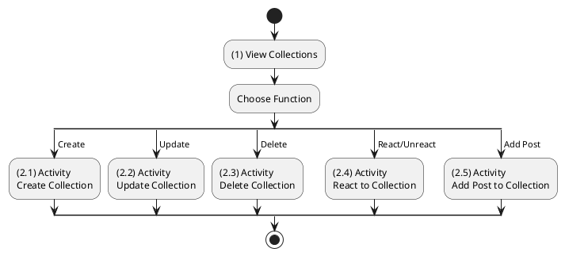

**Sequence Diagram**
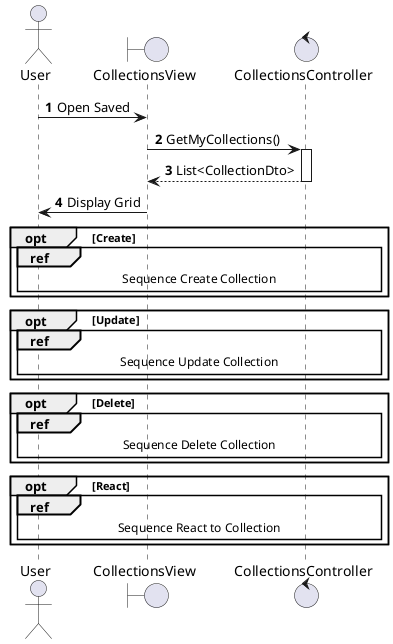

---

## 2.1.5.2 Create Collection

### Use Case Description
| Attribute | Details |
| :--- | :--- |
| **Name** | **Create Collection** |
| **Description** | Create a new list with optional cover image. |
| **Actor** | Authenticated User |
| **Trigger** | ❖ User clicks "New Collection". |
| **Pre-condition** | ❖ Name is provided. |
| **Post-condition** | ❖ Collection Created with Image URL. |

### Business Rules (BR)

| Activity | BR Code | Description |
| :---: | :---: | :--- |
| (2)-(3) | BR1 | **Submission:** ❖ The **Frontend** `CreateCollectionModal` calls `collectionApi.create(formData)` to submit the new collection. ❖ The **API** receives a `POST` request at `/api/collections`. ❖ The **Backend** controller `CollectionsController.Create` handles the request. |
| (3.1) | BR2 | **Upload:** ❖ The **Service** `_collections.CreateAsync` calls `_cloudinary.TryUploadAsync` if a cover image is provided. ❖ The **Logic** waits for the upload to complete and returns the resulting URL. |
| (4) | BR3 | **Persistence:** ❖ The **Database** inserts a new `Collection` record with `OwnerId`, `Name`, `CoverUrl`, and default `IsPrivate=true`. ❖ The **System** returns a `200 OK` response with the `CollectionResponse`. |
| (4.1) | BR_Error | **Exception:** ❖ If the upload fails, the **System** returns `400 Bad Request`. If a Database error occurs, it returns `500`. |

### Diagrams

**Activity Diagram**
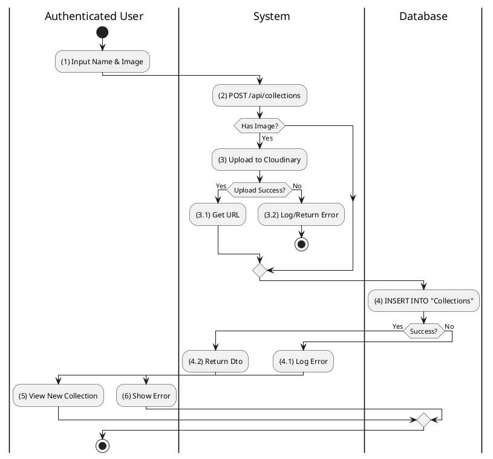

**Sequence Diagram**
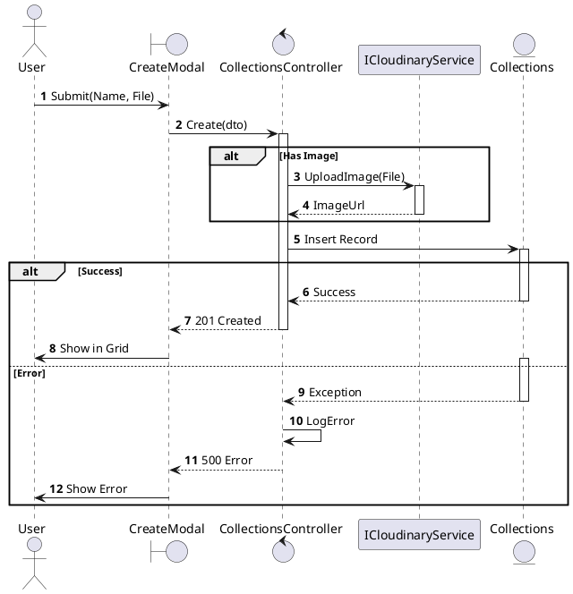

---

## 2.1.5.3 Update Collection

### Use Case Description
| Attribute | Details |
| :--- | :--- |
| **Name** | **Update Collection** |
| **Description** | Edit name, privacy, or cover image. |
| **Actor** | Authenticated User (Owner) |
| **Trigger** | ❖ User clicks Edit on generic collection settings. |

### Business Rules (BR)

| Activity | BR Code | Description |
| :---: | :---: | :--- |
| (2)-(3) | BR1 | **Processing:** ❖ The **API** receives a `PUT` request at `/api/collections/{id}`. ❖ The **Backend** `CollectionsController.Update` calls `_collections.UpdateAsync`. ❖ The **Logic** validates that the requester is the Owner and uploads a new image if one is provided. |
| (4) | BR2 | **Persistence:** ❖ The **Database** updates the `Collections` table. ❖ The **System** returns `200 OK` with the updated details. |
| (4.1) | BR_Error | **Exception:** ❖ If the collection is Not Found or the user is Forbidden, the **System** returns `404 Not Found`. |

### Diagrams

**Activity Diagram**
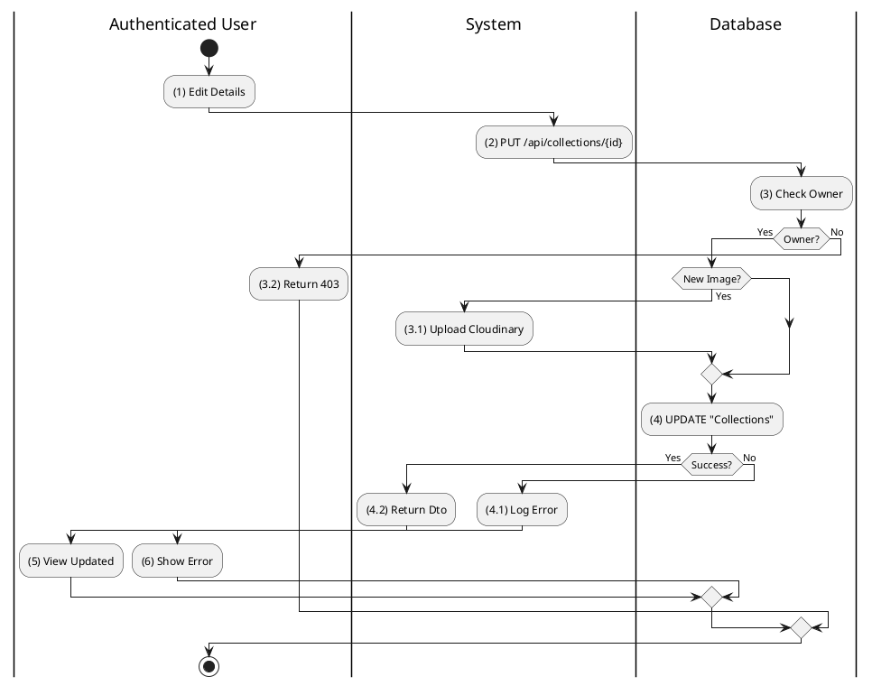

**Sequence Diagram**
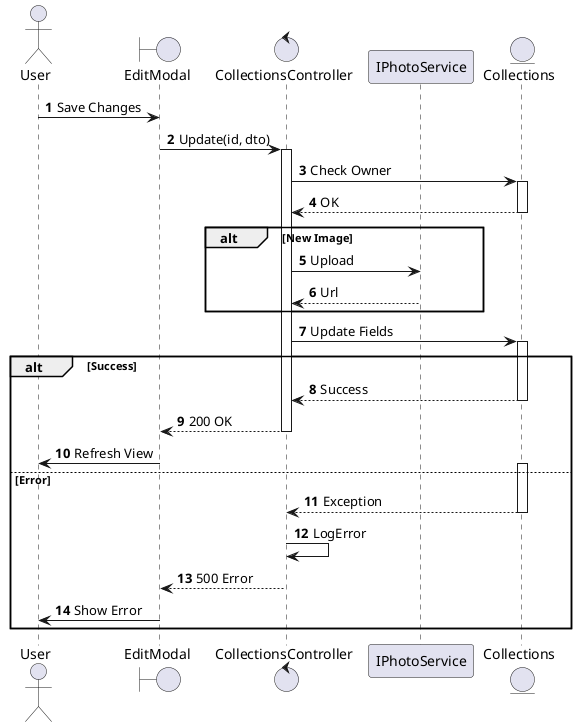

---

## 2.1.5.4 Delete Collection

### Use Case Description
| Attribute | Details |
| :--- | :--- |
| **Name** | **Delete Collection** |
| **Description** | Remove a collection (Soft Delete). |
| **Actor** | Authenticated User (Owner) |
| **Trigger** | ❖ User clicks Delete. |

### Business Rules (BR)

| Activity | BR Code | Description |
| :---: | :---: | :--- |
| (2)-(3) | BR1 | **Processing:** ❖ The **API** receives a `DELETE` request at `/api/collections/{id}`. ❖ The **Backend** `CollectionsController.Delete` executes logic to verify Ownership. |
| (4) | BR2 | **Persistence:** ❖ The **Database** executes `_uow.Collections.Remove(collection)`. ❖ The **System** returns `204 No Content` indicating success. |
| (3.1) | BR_Error | **Exception:** ❖ If the user is not the owner, the **System** returns `403 Forbidden` with the message "NOT_OWNER". |

### Diagrams

**Activity Diagram**
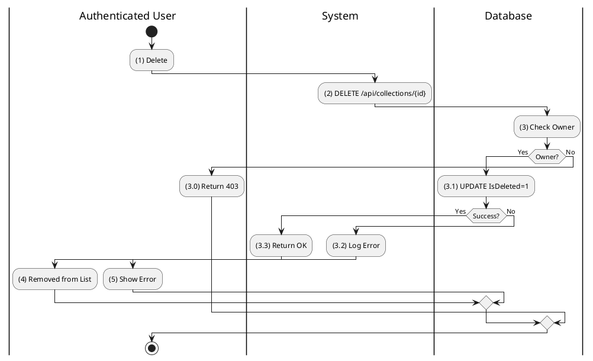

**Sequence Diagram**
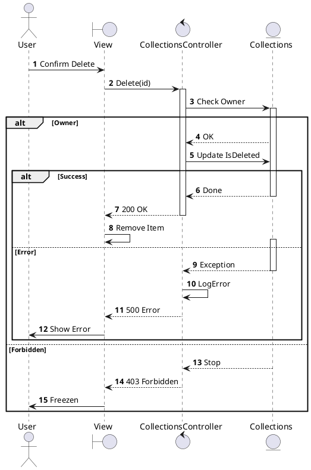

---

## 2.1.5.5 React to Collection

### Use Case Description
| Attribute | Details |
| :--- | :--- |
| **Name** | **React to Collection** |
| **Description** | Like/Follow a public collection. |
| **Actor** | Authenticated User |
| **Trigger** | ❖ User clicks Heart icon. |

### Business Rules (BR)
| Activity | BR Code | Description |
| :---: | :---: | :--- |
| (2)-(3) | BR1 | **Processing:** ❖ The **API** receives a `POST` request at `/api/collections/{id}/reactions` with the reaction type. ❖ The **Backend** calls `ToggleReactionAsync`. ❖ The **Logic** checks if the Reaction already exists. |
| (4) | BR2 | **Toggle:** ❖ The **Database**: If it exists -> Remove it. If it is new -> Add it. ❖ The **System** returns `200 OK` with the status `{ removed: bool, type: string }`. |

### Diagrams

**Activity Diagram**
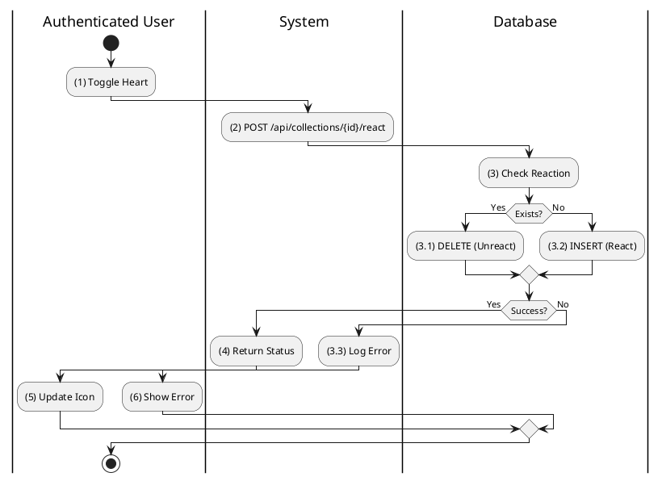

**Sequence Diagram**
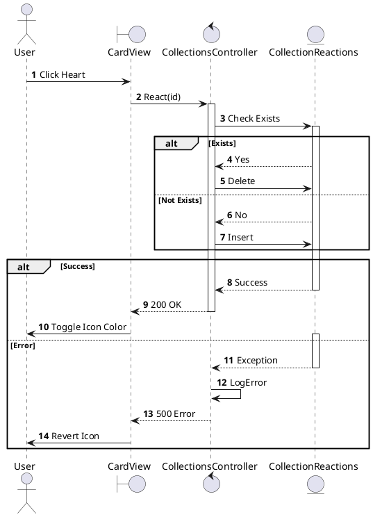

---

## 2.1.5.6 Add Post to Collection

### Use Case Description
| Attribute | Details |
| :--- | :--- |
| **Name** | **Add Post to Collection** |
| **Description** | Save a post to a specific collection. |
| **Actor** | Authenticated User |
| **Trigger** | ❖ User clicks Save on a post and selects collection. |

### Business Rules (BR)

| Activity | BR Code | Description |
| :---: | :---: | :--- |
| (2)-(3) | BR1 | **Processing:** ❖ The **API** receives a `POST` request at `/api/collections/{id}/posts/{postId}`. ❖ The **Backend** `CollectionsController.AddPost` calls `_collections.AddPostAsync`. ❖ The **Logic** checks that the user is the Owner of the collection. |
| (3.2) | BR2 | **Persistence:** ❖ The **Database** inserts the `CollectionItems` record with `CollectionId` and `PostId`. ❖ **Check**: If the item already exists, the **System** skips or returns success. ❖ The **System** returns `200 OK`. |
| (3.1) | BR_Error | **Exception:** ❖ If user is Not Owner or the input is Invalid, the **System** returns `403 Forbidden`. |

### Diagrams

**Activity Diagram**
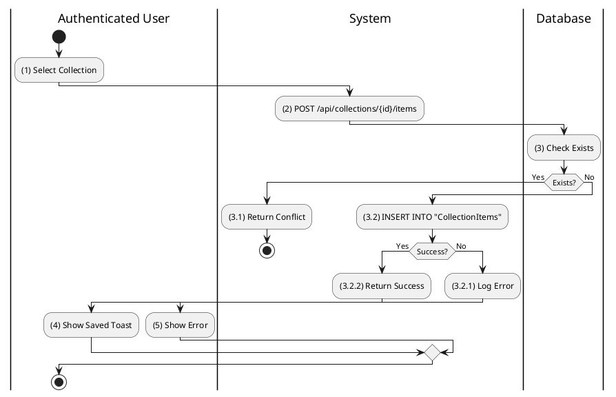

**Sequence Diagram**
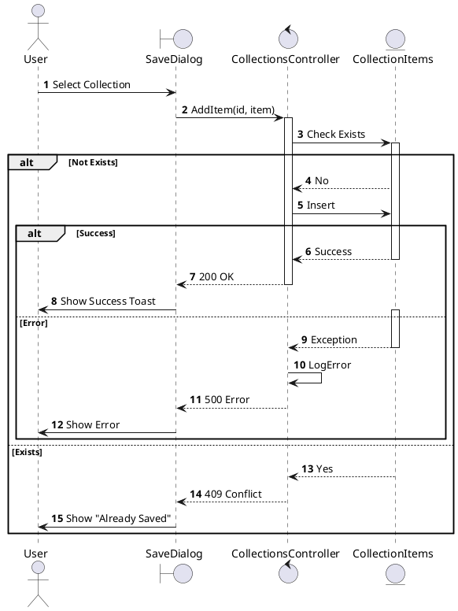
