# Use Case 2.1.5: Adjust Collection

**Module**: User Lists / Bookmarks
**Primary Actor**: Authenticated User
**Backend Controller**: `Favi_BE.API.Controllers.CollectionsController`
**Database Tables**: `"Collections"`, `"CollectionItems"`, `"CollectionReactions"`

---

## 2.1.5.1 Adjust Collection (Overview)

### Use Case Description
| Attribute | Details |
| :--- | :--- |
| **Name** | **Adjust Collection** |
| **Description** | Central hub for managing personal saved lists. |
| **Actor** | Authenticated User |
| **Trigger** | ❖ User enters the "Saved" or "Collections" section. |
| **Post-condition** | ❖ User manages collections or items within them. |

### Business Rules (BR)

| Activity | BR Code | Description |
| :---: | :---: | :--- |
| (1) | BR1 | **Initialization Logic:** ❖ The System retrieves all collections owned by the Authenticated User, as well as collections they are following or have reacted to. ❖ The UI evaluates ownership permissions for each collection card to enable or disable specific management actions (Create, Update, Delete are restricted to Owners). |

### Diagrams

**Activity Diagram**
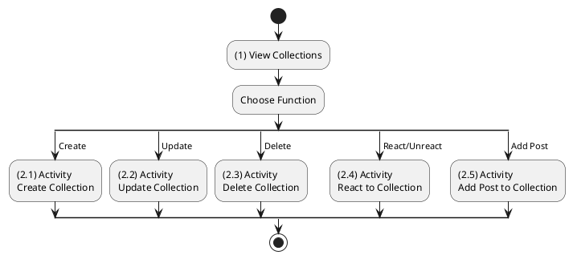

**Sequence Diagram**
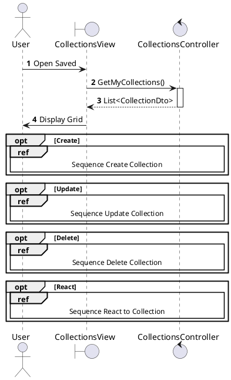

---

## 2.1.5.2 Create Collection

### Use Case Description
| Attribute | Details |
| :--- | :--- |
| **Name** | **Create Collection** |
| **Description** | Create a new list with optional cover image. |
| **Actor** | Authenticated User |
| **Trigger** | ❖ User clicks "New Collection". |
| **Pre-condition** | ❖ Name is provided. |
| **Post-condition** | ❖ Collection Created with Image URL. |

### Business Rules (BR)

| Activity | BR Code | Description |
| :---: | :---: | :--- |
| (2)-(3) | BR1 | **Validation & Upload Process:** ❖ The System receives the collection name and an optional cover image file from the User. ❖ If an image file is present, the System authenticates with the Cloudinary service and uploads the file to a designated container. ❖ The System retrieves the secure, persistent URL of the uploaded image for storage (Step 3). |
| (4) | BR2 | **Persistence & Default Privacy:** ❖ The System inserts a new record into the `Collections` table, storing the Name, the secure Image URL (if any), and the `OwnerId`. ❖ The System sets the default visibility `IsPrivate` to `true`, ensuring the collection is personal by default unless changed (Step 4). |
| (5) | BR3 | **UI Real-time Update:** ❖ Upon successful creation, the System returns the complete `CollectionDto`. ❖ The UI immediately prepends the new collection card to the top of the grid view without requiring a full page reload (Step 5). |
| (4.1) | BR_Error | **Exception Handling:** ❖ If the Cloudinary upload fails: The System logs the vendor-specific error and aborts the creation process. ❖ If the Database insert fails: The System logs the SQL exception and returns a 500 status code. ❖ The UI displays a distinct error message advising the user to retry or check their connection (Step 6). |

### Diagrams

**Activity Diagram**
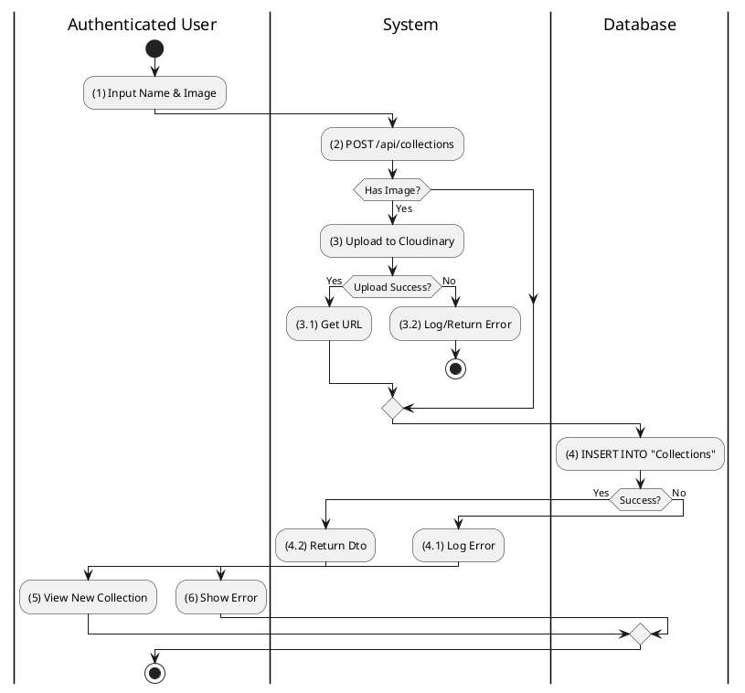

**Sequence Diagram**
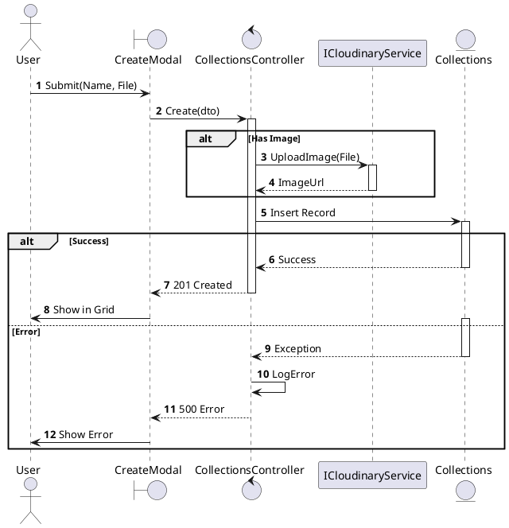

---

## 2.1.5.3 Update Collection

### Use Case Description
| Attribute | Details |
| :--- | :--- |
| **Name** | **Update Collection** |
| **Description** | Edit name, privacy, or cover image. |
| **Actor** | Authenticated User (Owner) |
| **Trigger** | ❖ User clicks Edit on generic collection settings. |

### Business Rules (BR)

| Activity | BR Code | Description |
| :---: | :---: | :--- |
| (2)-(3) | BR1 | **Validation & Ownership Verification:** ❖ The System verifies that the requesting User is the legitimate Owner of the target collection. ❖ If a new cover image is uploaded, the System performs the Cloudinary upload process similar to creation (Step 3). |
| (4) | BR2 | **Update Logic:** ❖ The System executes an update on the `Collections` table, modifying only the changed fields (`Name`, `Privacy`, or `CoverImageUrl`). ❖ The System updates the `UpdatedAt` timestamp to reflect the modification (Step 4). |
| (5) | BR3 | **UI Synchronization:** ❖ The UI receives the updated DTO and immediately refreshes the collection card's visual elements (Name, Image) to reflect the changes (Step 5). |
| (4.1) | BR_Error | **Exception Handling:** ❖ If any step fails (Auth, Upload, or DB):  The System logs the complete stack trace.  The System returns a 500 error.  The UI notifies the user that the update could not be saved (Step 6). |

### Diagrams

**Activity Diagram**
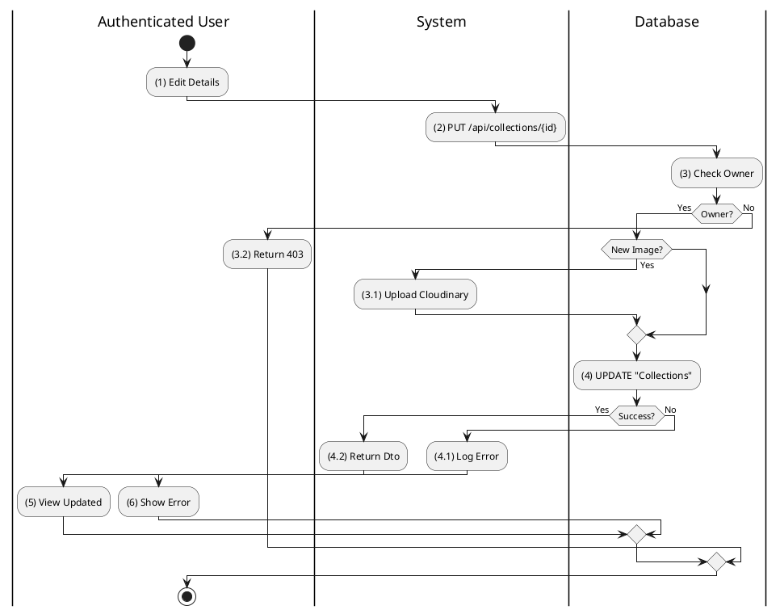

**Sequence Diagram**
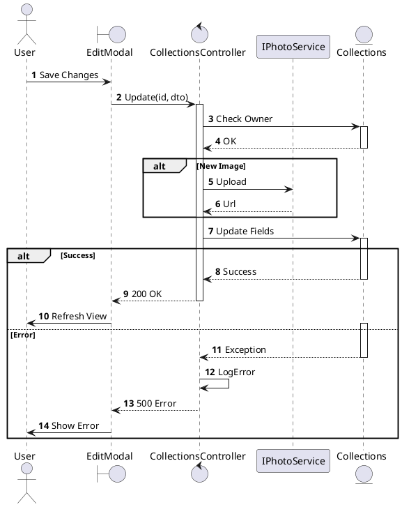

---

## 2.1.5.4 Delete Collection

### Use Case Description
| Attribute | Details |
| :--- | :--- |
| **Name** | **Delete Collection** |
| **Description** | Remove a collection (Soft Delete). |
| **Actor** | Authenticated User (Owner) |
| **Trigger** | ❖ User clicks Delete. |

### Business Rules (BR)

| Activity | BR Code | Description |
| :---: | :---: | :--- |
| (2)-(3) | BR1 | **Safe Deletion Protocol:** ❖ The System performs a strict ownership check to ensure unauthorized users cannot delete collections. ❖ Instead of a physical delete, the System performs a "Service Soft Delete" by setting `IsDeleted = 1` in the `Collections` table (Step 3). |
| (4) | BR2 | **UI Feedback:** ❖ Upon receiving a plain 200 OK success response, the UI utilizes a client-side filter to permanently remove the deleted item from the DOM (Step 4). |
| (3.1) | BR_Error | **Exception Reporting:** ❖ The System captures any database constraints or connection errors. ❖ The System logs the error with high severity. ❖ The UI presents a clear "Delete Failed" message to the User (Step 5). |

### Diagrams

**Activity Diagram**
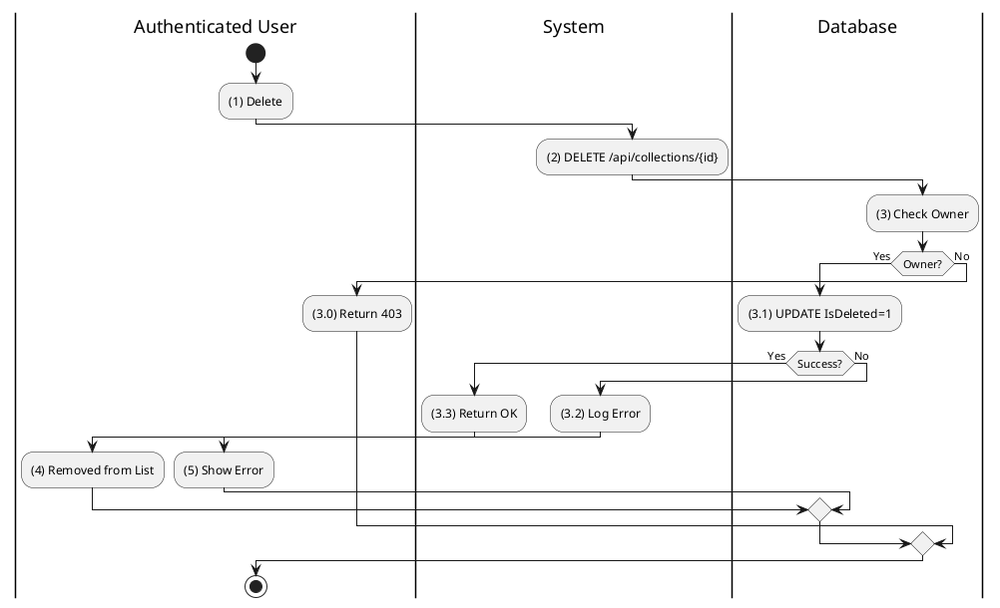

**Sequence Diagram**
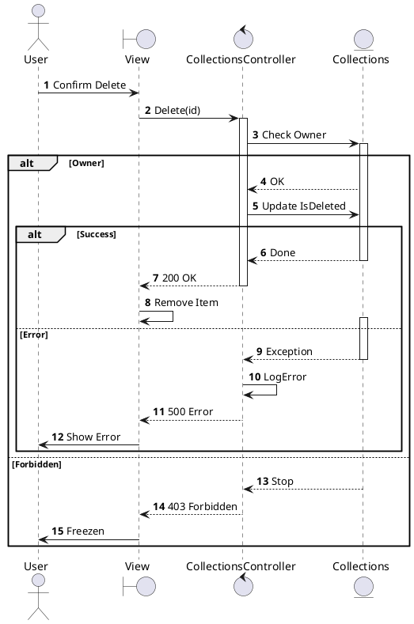

---

## 2.1.5.5 React to Collection

### Use Case Description
| Attribute | Details |
| :--- | :--- |
| **Name** | **React to Collection** |
| **Description** | Like/Follow a public collection. |
| **Actor** | Authenticated User |
| **Trigger** | ❖ User clicks Heart icon. |

### Business Rules (BR)

| Activity | BR Code | Description |
| :---: | :---: | :--- |
| (2)-(3) | BR1 | **Reaction Toggling Logic:** ❖ The System receives the toggle request. ❖ The System checks the `CollectionReactions` table for an existing record matching UserID and CollectionID. ❖ **If Exists:** The System deletes the record (Unreact). ❖ **If Not Exists:** The System inserts a new record (React) (Step 3). |
| (4) | BR2 | **Count & State Synchronization:** ❖ The System recalculates (or increments/decrements) the cached `ReactionCount` for the Collection. ❖ The UI toggles the heart icon's visual state (Active Red vs Inactive Grey) to provide instant feedback (Step 4). |
| (3.1) | BR_Error | **Failure Recovery:** ❖ If the database transaction fails:  The System logs the error.  The UI actively reverts the heart icon to its previous state to ensure data consistency (Step 6). |

### Diagrams

**Activity Diagram**
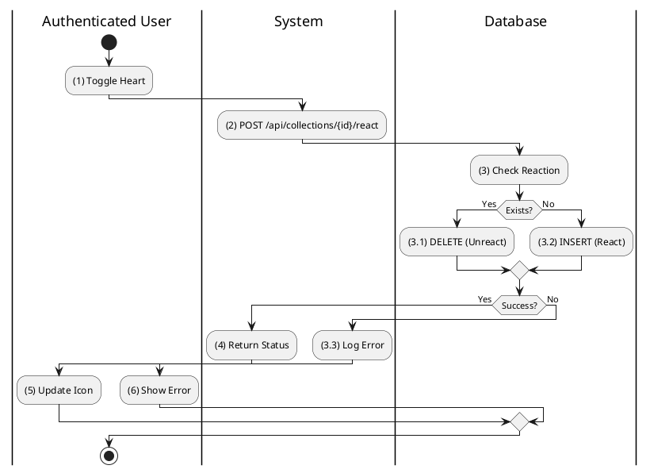

**Sequence Diagram**
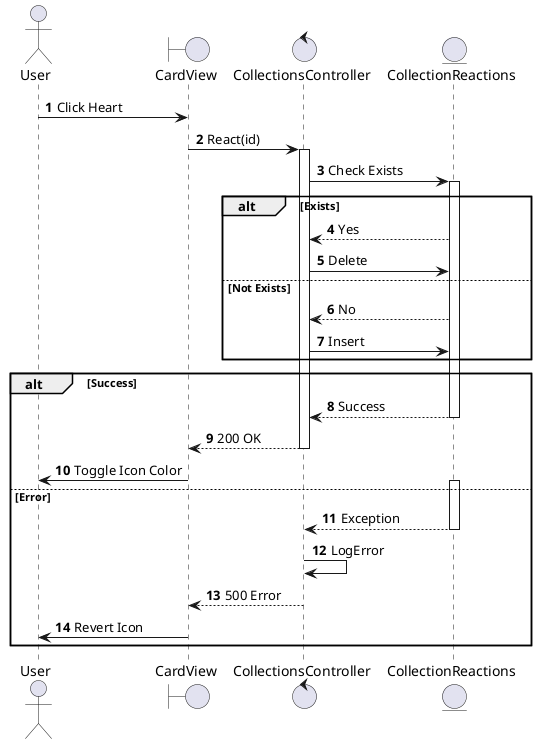

---

## 2.1.5.6 Add Post to Collection

### Use Case Description
| Attribute | Details |
| :--- | :--- |
| **Name** | **Add Post to Collection** |
| **Description** | Save a post to a specific collection. |
| **Actor** | Authenticated User |
| **Trigger** | ❖ User clicks Save on a post and selects collection. |

### Business Rules (BR)

| Activity | BR Code | Description |
| :---: | :---: | :--- |
| (2)-(3) | BR1 | **Item Linkage Logic:** ❖ The System accepts the request to link a specific Post ID to a Collection ID. ❖ The System strictly verifies that the Authenticated User is the Owner of the target Collection. ❖ The System inserts a unique record into `CollectionItems` (Step 3). |
| (3.2) | BR2 | **Duplicate Prevention:** ❖ The System pre-checks for existing links. If the Post is already in the Collection, the System returns a 409 Conflict (or 200 OK with no-op) to prevent duplicate entries (Step 3.2). |
| (4) | BR3 | **User Confirmation:** ❖ The UI displays a temporary toast notification "Saved to [Collection Name]" confirming the action was successful (Step 4). |
| (3.1) | BR_Error | **Exception Handling:** ❖ If the operation fails: The System logs the specific error code and the UI displays a generic "Save Failed" alert (Step 5). |

### Diagrams

**Activity Diagram**
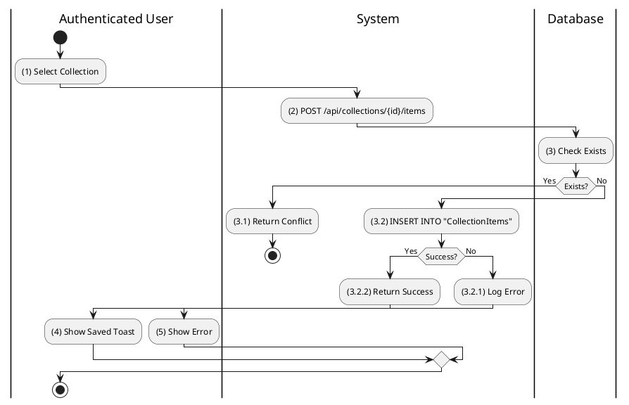

**Sequence Diagram**
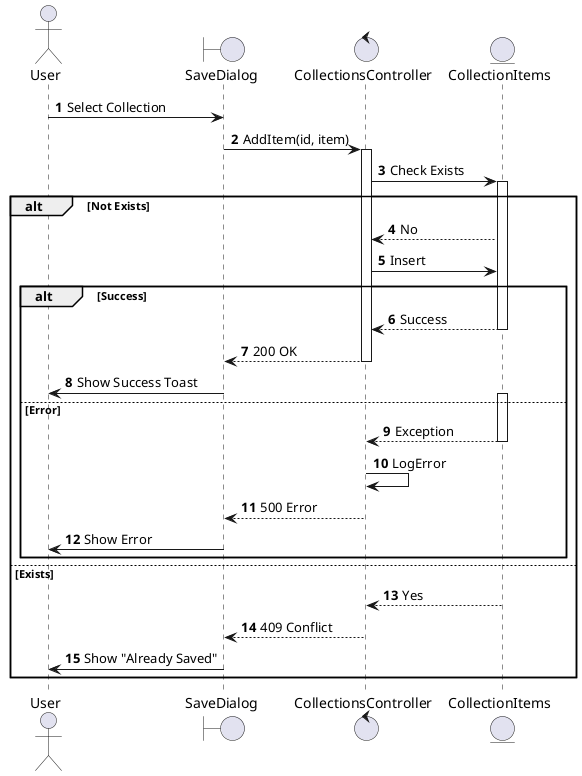
