# Use Case 2.1.6: Adjust Friend (Connections)

**Module**: Connections / Social Graph
**Primary Actor**: Authenticated User
**Backend Controller**: `Favi_BE.API.Controllers.ProfilesController`
**Database Tables**: `"Follows"`, `"Profiles"`, `"UserModerations"`

---

## 2.1.6.1 Adjust Friend (Overview)

### Use Case Description
| Attribute | Details |
| :--- | :--- |
| **Name** | **Adjust Friend** |
| **Description** | Central hub for managing social connections (Followers, Followings, Suggestions, Blocked Users). |
| **Actor** | Authenticated User |
| **Trigger** | ❖ User enters the "Friends" or "Network" section. |
| **Post-condition** | ❖ User Views lists or executes management actions. |

### Business Rules (BR)

| Activity | BR Code | Description |
| :---: | :---: | :--- |
| (1) | BR1 | **Initialization & Navigation:** ❖ The System loads the default connection list (usually "Followers" or "Following"). ❖ The User can switch tabs to view differents lists (Suggestions, Blocked). ❖ The System enables actions (Follow, Unfollow, Block) based on the context of each profile card. |

### Diagrams

**Activity Diagram**
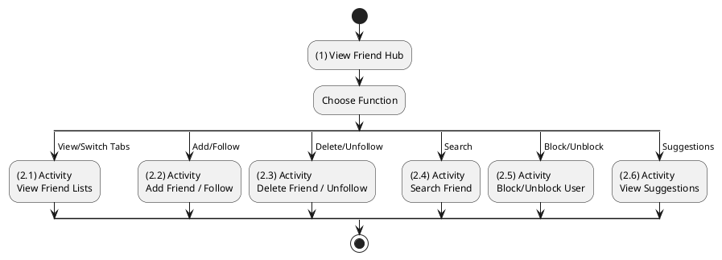

**Sequence Diagram**
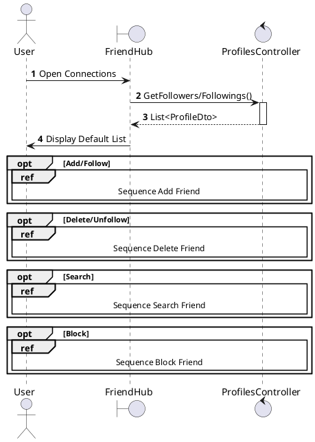

---

## 2.1.6.2 Add Friend / Follow User

### Use Case Description
| Attribute | Details |
| :--- | :--- |
| **Name** | **Add Friend / Follow User** |
| **Description** | The Authenticated User initiates a connection with another user. |
| **Actor** | Authenticated User |
| **Trigger** | ❖ User navigates to another user's profile. ❖ User clicks the [btnFollow] button. |
| **Pre-condition** | ❖ User is logged in. ❖ Target user is not blocked by the actor. |
| **Post-condition** | ❖ A new record is added to the "Follows" table. ❖ The button state changes to "Following" or "Requested". |

### Business Rules (BR)

| Activity | BR Code | Description |
| :---: | :---: | :--- |
| (2)-(3) | BR1 | **Validation Workflow:** ❖ The selected data will be checked by table “UserModerations” and corresponding “Permissions” in the database (Refer to “UserModerations” table in “DB Sheet” file) to check if there are any constraints (e.g., Blocked users). ❖ System calls method `PrivacyGuard.CanFollowAsync(followerId, followeeId)`.  If the action is **Allowed**: System moves to step (4).  If the action is **Forbidden**: System moves to step (3.1) to return `403 Forbidden`. System displays an error message (Refer to MSG_ERR_BLOCKED or MSG_ERR_FORBIDDEN) (Step 3.2). |
| (3.2) | BR2 | **Storing Rules:** ❖ When the validations pass, System will move to step (4) to send data to database by method `Follow(targetId)`. ❖ System stores connection information in table “Follows” in the database (Refer to “Follows” table in “DB Sheet” file) with `FollowerId` = [User.ID] and `FolloweeId` = [Target.ID]. |
| (3.2.1)-(5) | BR3 | **Displaying Rules:** ❖ System returns a `200 OK` success status (Step 4.1). ❖ System displays a successful notification (Refer to MSG_SUCCESS_FOLLOW) and updates the button state. ❖ The UI button changes to “Following” to reflect the new association (Step 5). |
| (3.2.4.2)-(6) | BR_Error | **Exception Handling Rules:** ❖ If a system failure occurs:  System logs the error (Step 4.2).  System returns `500 Internal Server Error`.  System displays "Follow Failed" message (Step 6). |

### Diagrams

**Activity Diagram**
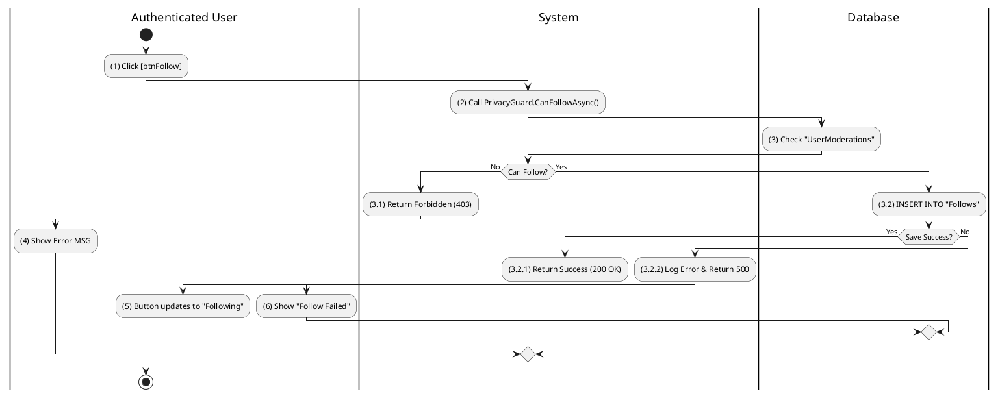

**Sequence Diagram**
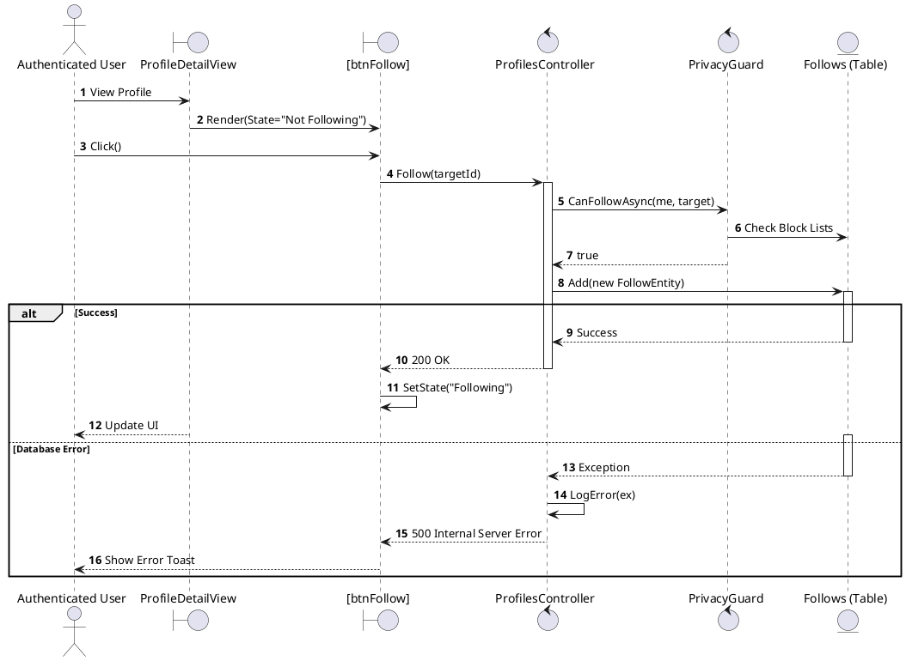

---

## 2.1.6.3 Delete Friend (Unfriend) / Unfollow

### Use Case Description
| Attribute | Details |
| :--- | :--- |
| **Name** | **Delete Friend (Unfriend) / Unfollow** |
| **Description** | The Authenticated User removes an existing connection. |
| **Actor** | Authenticated User |
| **Trigger** | ❖ User clicks the "Following" button or "Unfollow" option on a target profile. |
| **Pre-condition** | ❖ User is currently following the target user. |
| **Post-condition** | ❖ The record is removed from the "Follows" table. ❖ The button state reverts to "Follow". |

### Business Rules (BR)

| Activity | BR Code | Description |
| :---: | :---: | :--- |
| (1)-(2) | BR1 | **Confirmation Logic:** ❖ When the user clicks "Unfollow" (Step 1), System displays a Confirmation Dialog (Refer to “ConfirmationModal” view in “View Description” file) asking user to confirm (Step 2).  **On Cancel**: The user clicks "Cancel" (Step 2.1). The dialog closes, and the system moves to end state (Flow stops).  **On Confirm**: The user clicks "Confirm" (Step 2.2). System moves to step (3) to execute removal. |
| (3)-(5) | BR2 | **Processing & Storing Rules:** ❖ System calls method `ProfilesController.Unfollow(targetId)` (Step 3). ❖ The input data will be checked by table “Follows” in the database (Refer to “Follows” table in “DB Sheet” file) (Step 4). ❖ System deletes the corresponding records from table “Follows” where `FollowerId` matches current user and `FolloweeId` matches target (Step 5). |
| (5.1)-(6) | BR3 | **Displaying Rules:** ❖ After deleting data, System returns Success (Step 5.1). ❖ System displays a successful notification (Refer to MSG_SUCCESS_UNFOLLOW). ❖ The UI resets the button state from “Following” back to “Follow” (Step 6). |
| (5.2)-(7) | BR_Error | **Exception Handling Rules:** ❖ If a system failure occurs:  System logs the error and returns 500 (Step 5.2).  System displays "Unfollow Failed" message (Step 7). |

### Diagrams

**Activity Diagram**
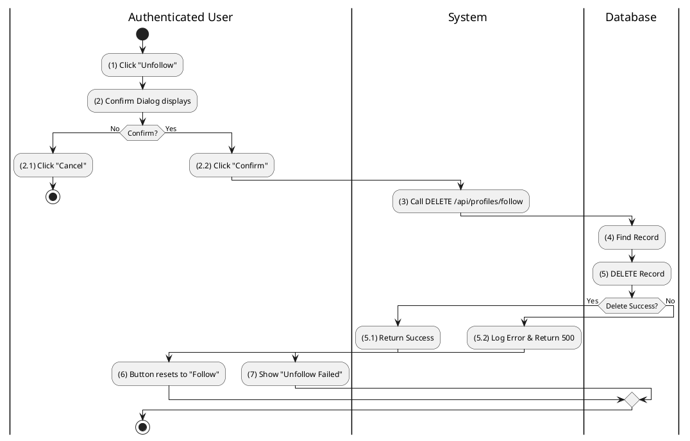

**Sequence Diagram**
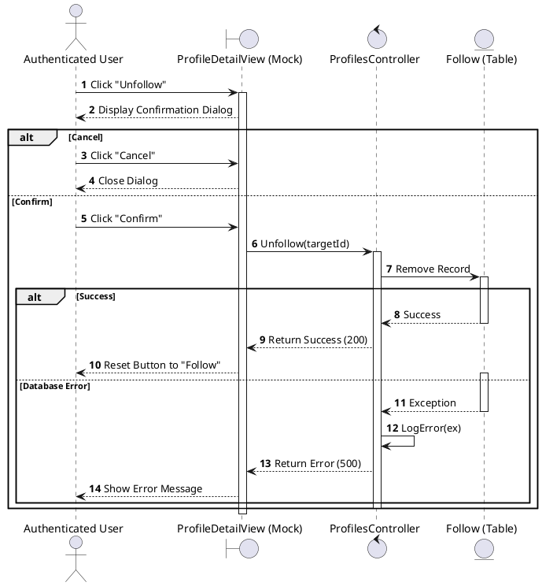

---

## 2.1.6.4 Search Friend

### Use Case Description
| Attribute | Details |
| :--- | :--- |
| **Name** | **Search Friend** |
| **Description** | The user searches specifically within their network or globally. |
| **Actor** | Authenticated User |
| **Trigger** | ❖ User focuses on the [txtSearch] input field. ❖ User types a keyword (name or username). |
| **Pre-condition** | ❖ User is on the "Friends" screen or Navigation bar. |
| **Post-condition** | ❖ System displays a list of profiles matching the search query. |

### Business Rules (BR)

| Activity | BR Code | Description |
| :---: | :---: | :--- |
| (2) | BR1 | **Validation Logic:** ❖ The input data from `[txtSearch]` is validated.  **Invalid (Empty/Null)**: If input length is 0, the system ignores the request or displays a tooltip (Refer to MSG_WARN_EMPTY_SEARCH).  **Valid**: If input is valid, System moves to step (3). |
| (2.2)-(3) | BR2 | **Querying Rules:** ❖ System calls method `SearchController.SearchPeople(query)`. ❖ System queries data in the table “Profiles” in the database (Refer to “Profiles” table in “DB Sheet” file) with syntax `SELECT * FROM Profiles WHERE Name LIKE %[query]%`. |
| (4)-(5) | BR3 | **Displaying Rules:** ❖ After getting matched data, system displays a “SearchResults” list (Refer to “SearchResults” view in “View Description” file). ❖ The system renders a list of `ProfileDto` objects for the user to select. |

### Diagrams

**Activity Diagram**
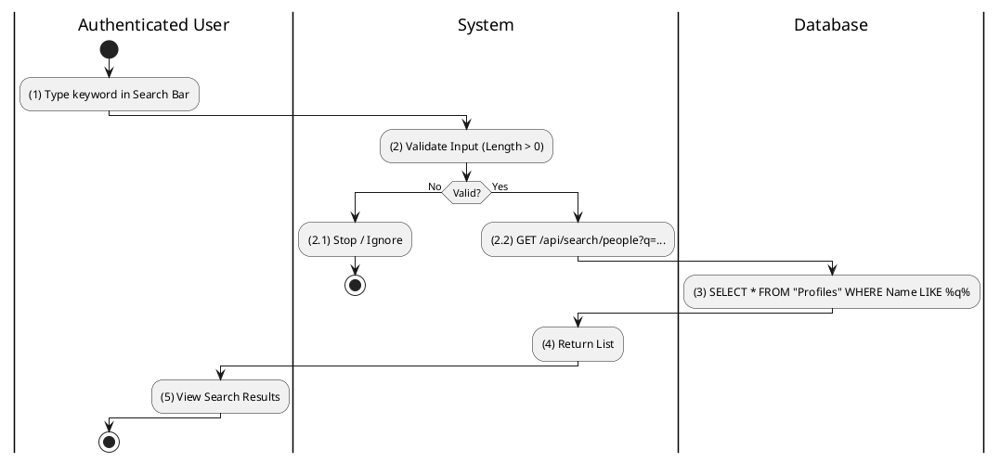

**Sequence Diagram**
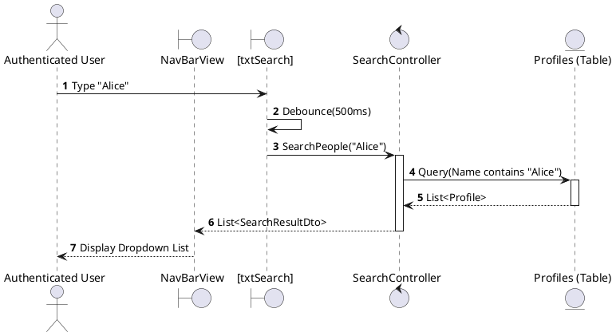

---

## 2.1.6.5 Block Friend / User

### Use Case Description
| Attribute | Details |
| :--- | :--- |
| **Name** | **Block Friend / User** |
| **Description** | Block a user to prevent all interaction. |
| **Actor** | Authenticated User |
| **Trigger** | ❖ User selects "Block" from the profile options menu. |
| **Pre-condition** | ❖ Target user is not already blocked. |
| **Post-condition** | ❖ A "Block" record is added to "UserModerations". ❖ Any existing "Follows" relationships are deleted. |

### Business Rules (BR)

| Activity | BR Code | Description |
| :---: | :---: | :--- |
| (1)-(3) | BR1 | **Selecting Rules & Confirmation:** ❖ User invokes the "Block" command from the profile menu (Step 1). ❖ System displays a Warning Dialog (Refer to MSG_CONFIRM_BLOCK) (Step 2).  **Confirmed**: User clicks Confirm (Step 3). System moves to step (4). |
| (4)-(6) | BR2 | **Processing & Storing Rules:** ❖ System calls method `BlockUser(targetId)` (Step 4). ❖ System stores block information in table “UserModerations” in the database (Refer to “UserModerations” table in “DB Sheet” file) with Type='Block' (Step 5). ❖ System deletes any related records in table “Follows” (Refer to “Follows” table in “DB Sheet” file) to ensure no connection remains (Step 6). |
| (6.1)-(7) | BR3 | **Displaying Rules:** ❖ After processing, System returns Success (Step 6.1). ❖ System displays a successful notification (Refer to MSG_SUCCESS_BLOCK). ❖ System redirects the user to the Home Screen or updates the view to hide the content (Refer to “Home” view in “View Description” file) (Step 7). |
| (6.2)-(8) | BR_Error | **Exception Handling Rules:** ❖ If a system failure occurs:  System logs the error and returns 500 (Step 6.2).  System displays Error message (Step 8). |

### Diagrams

**Activity Diagram**
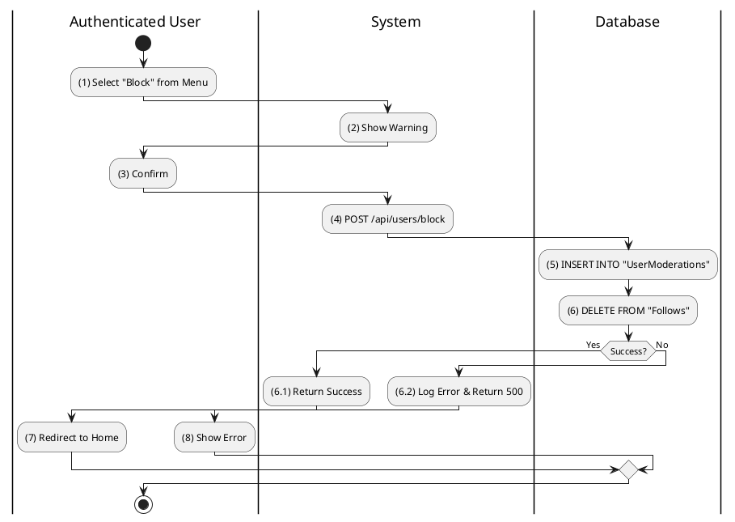

**Sequence Diagram**
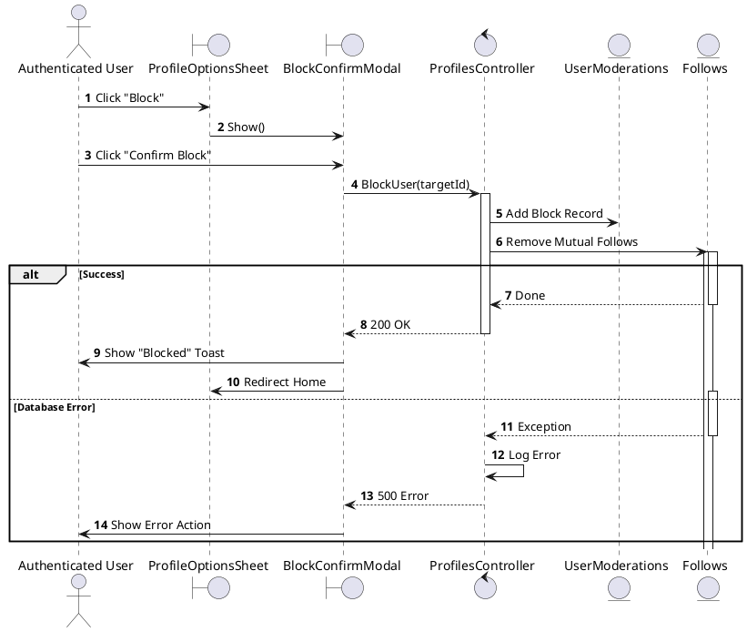

---

## 2.1.6.6 Unblock User

### Use Case Description
| Attribute | Details |
| :--- | :--- |
| **Name** | **Unblock User** |
| **Description** | Restore ability to interact. |
| **Actor** | Authenticated User |
| **Trigger** | ❖ User clicks [btnUnblock] in the Blocked Users list. |
| **Pre-condition** | ❖ Target user is currently in the blocked list. |
| **Post-condition** | ❖ The "Block" record is removed from "UserModerations". ❖ User disappears from the blocked list. |

### Business Rules (BR)

| Activity | BR Code | Description |
| :---: | :---: | :--- |
| (2)-(3) | BR1 | **Processing & Storing Rules:** ❖ System calls method `UnblockUser(targetId)` (Step 2). ❖ System deletes the corresponding "Block" record from table “UserModerations” in the database (Refer to “UserModerations” table in “DB Sheet” file) matched by `[User.ID]` and `[Target.ID]` (Step 3). |
| (3.1)-(4) | BR2 | **Displaying Rules:** ❖ After deleting the block record, System returns Success (Step 3.1). ❖ System displays a successful notification (Refer to MSG_SUCCESS_UNBLOCK). ❖ System updates the "Blocked Users" list view (Refer to “BlockedList” view in “View Description” file) by removing the unblocked user item (Step 4). |
| (3.2)-(5) | BR_Error | **Exception Handling Rules:** ❖ If a system failure occurs:  System logs the error and returns 500 (Step 3.2).  System displays Error message (Step 5). |

### Diagrams

**Activity Diagram**
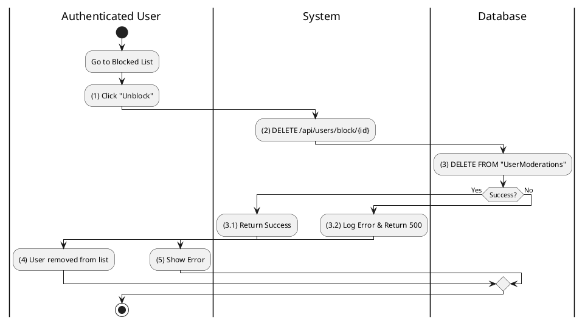

**Sequence Diagram**
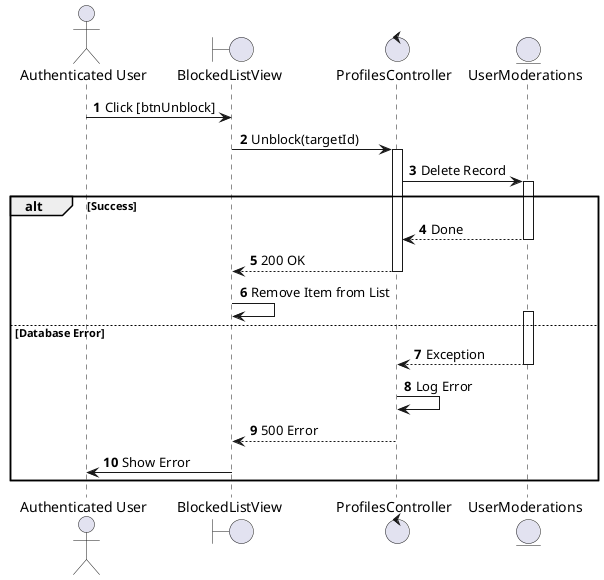

---

## 2.1.6.7 View Friend Suggestions

### Use Case Description
| Attribute | Details |
| :--- | :--- |
| **Name** | **View Friend Suggestions** |
| **Description** | System recommends users to follow. |
| **Actor** | Authenticated User |
| **Trigger** | ❖ User visits the Feed or Friends tab. ❖ System identifies low connection count or relevant signals. |
| **Pre-condition** | ❖ User is logged in. |
| **Post-condition** | ❖ a list of suggested profiles is displayed to the user. |

### Business Rules (BR)

| Activity | BR Code | Description |
| :---: | :---: | :--- |
| (2)-(4) | BR1 | **Querying Rules:** ❖ System calls method `ProfilesController.GetRecommendations()` (Step 2). ❖ System queries data in the table “Profiles” in the database (Step 3). ❖ System filters out users already in “Follows” table (Step 4). ❖ System orders the results by [Strategy: MutualFriends/Random]. |
| (5)-(7) | BR2 | **Displaying Rules:** ❖ System processes data (Randomize/Rank) (Step 5). ❖ System returns list (Step 6). ❖ System displays a “Suggestions” widget (Refer to “Suggestions” view in “View Description” file) filled with candidate profiles (Step 7). |

### Diagrams

**Activity Diagram**
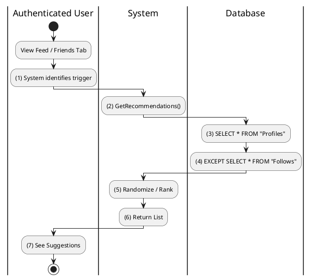

**Sequence Diagram**
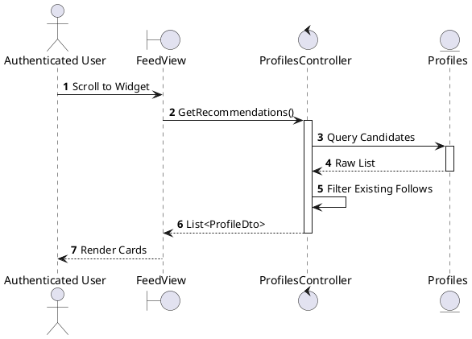
