# Use Case 2.1.6: Adjust Friend (Connections)

**Module**: Connections / Social Graph
**Primary Actor**: Authenticated User
**Backend Controller**: `Favi_BE.API.Controllers.ProfilesController`
**Database Tables**: `"Follows"`, `"Profiles"`, `"UserModerations"`

---

## 2.1.6.1 Adjust Friend (View Friend List)

### Use Case Description
| Attribute | Details |
| :--- | :--- |
| **Name** | **Adjust Friend (View Friend List)** |
| **Description** | The Authenticated User views their list of connections (Followers or Followings). In Favi, "Friend" relationships are represented as Mutual Follows or simply directional Follows. |
| **Actor** | Authenticated User |
| **Trigger** | ❖ User clicks on the "Friends" tab in the navigation bar.<br>❖ User clicks on "Followers" or "Following" count on their profile. |
| **Pre-condition** | ❖ User is logged in to the system.<br>❖ Device is connected to the internet. |
| **Post-condition** | ❖ System displays the list of users following or being followed by the actor. |

### Business Rules (BR)

| Activity | BR Code | Description |
| :---: | :---: | :--- |
| (1) | BR1 | **Displaying Rules:**<br>When the user selects the "Friends" tab, the system initializes the `FriendListView` and moves to step (2) to load data. |
| (2) | BR2 | **Querying Rules:**<br>The system calls the backend API method `ProfilesController.Followers` (`GET /api/profiles/{id}/followers`) to retrieve the list of users who follow the current user. |
| (3) | BR3 | **Querying Rules:**<br>The database services execute a `SELECT` query on the `Follows` table, filtering records where `FolloweeId` matches the current user's ID. |
| (4) | BR4 | **Processing Rules:**<br>The system joins the result with the `Profiles` table to populate details (Name, Avatar) for each follower. |
| (5) | BR5 | **Displaying Rules:**<br>The system returns a list of `ProfileDto` objects and displays them in the "Followers" list on the UI. |
| (5.1) | BR5.1 | **Selecting Rules:**<br>If the user clicks on the "Following" tab, the system triggers the process to load the list of users the current user is following. |
| (6) | BR6 | **Querying Rules:**<br>The system calls the backend API method `ProfilesController.Followings` (`GET /api/profiles/{id}/followings`). |
| (7) | BR7 | **Querying Rules:**<br>The database executes a `SELECT` query on the `Follows` table, filtering records where `FollowerId` matches the current user's ID. |
| (8) | BR8 | **Displaying Rules:**<br>The system returns the list of `ProfileDto` objects and renders them in the "Following" list view. |
| (9) | BR_Error | **Exception Handling Rules:**<br>If a system failure occurs (e.g., Database connection), the Global Exception Handler logs the error details and returns a `500 Internal Server Error`. |

### Diagrams

**Activity Diagram**
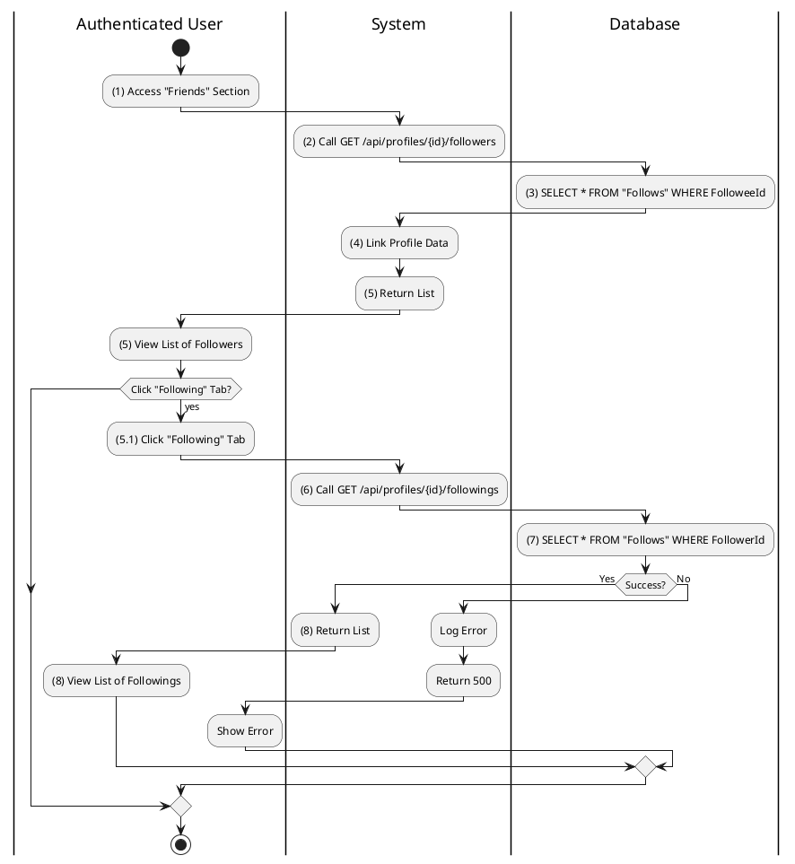

**Sequence Diagram**
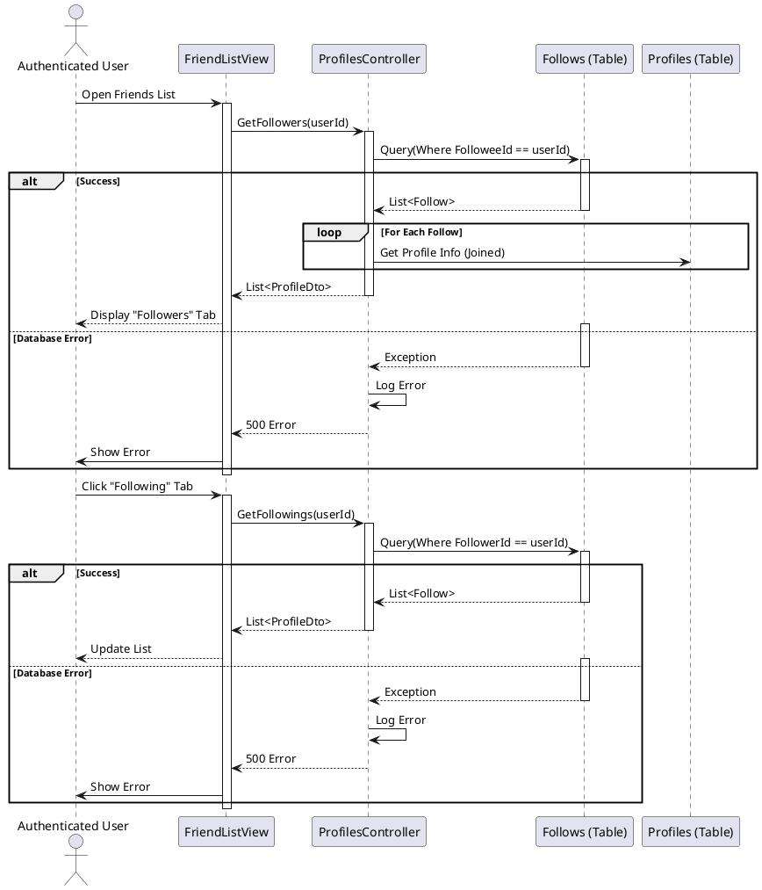

---

## 2.1.6.2 Add Friend / Follow User

### Use Case Description
| Attribute | Details |
| :--- | :--- |
| **Name** | **Add Friend / Follow User** |
| **Description** | The Authenticated User initiates a connection with another user. |
| **Actor** | Authenticated User |
| **Trigger** | ❖ User navigates to another user's profile.<br>❖ User clicks the [btnFollow] button. |
| **Pre-condition** | ❖ User is logged in.<br>❖ Target user is not blocked by the actor. |
| **Post-condition** | ❖ A new record is added to the "Follows" table.<br>❖ The button state changes to "Following" or "Requested". |

### Business Rules (BR)

| Activity | BR Code | Description |
| :---: | :---: | :--- |
| (1) | BR1 | **Selecting Rules:**<br>When the user clicks the `[btnFollow]` button on another user's profile, the system initiates the follow request. |
| (2) | BR2 | **Validation Rules:**<br>The system calls `PrivacyGuard.CanFollowAsync` to verify if the action is allowed (e.g., checking if the user is not blocked). |
| (3) | BR3 | **Querying Rules:**<br>The database checks the `UserModerations` table for any "Block" relationships between the two users. |
| (3.1) | BR3.1 | **Displaying Rules (Invalid):**<br>If the validation fails (e.g., user is blocked), the system returns a `403 Forbidden` status and displays the error message: *"You cannot follow this user."* |
| (4) | BR4 | **Storing Rules:**<br>If valid, the database inserts a new record into the `Follows` table with `FollowerId` (current user) and `FolloweeId` (target user). |
| (5) | BR5 | **Displaying Rules:**<br>The system returns a `200 OK` success response to the client. |
| (6) | BR6 | **Displaying Rules:**<br>The UI updates the `[btnFollow]` button state to "Following" to reflect the new relationship. |
| (7) | BR_Error | **Exception Handling Rules:**<br>If a system failure occurs, the Global Exception Handler logs the error and returns a `500 Internal Server Error`. |

### Diagrams

**Activity Diagram**
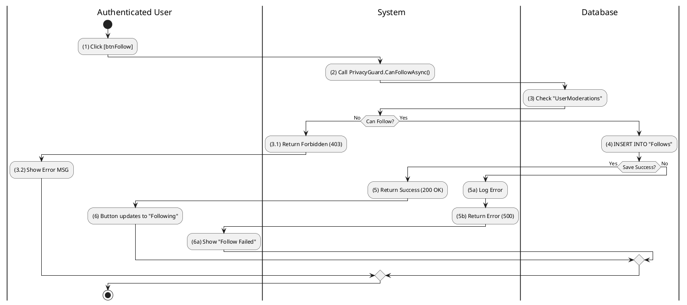

**Sequence Diagram**
```plantuml
@startuml
actor "Authenticated User" as User
participant "ProfileDetailView" as View
participant "[btnFollow]" as Button
participant "ProfilesController" as Controller
participant "PrivacyGuard" as Service
participant "Follows (Table)" as DB

User -> View: View Profile
View -> Button: Render(State="Not Following")
User -> Button: Click()
Button -> Controller: Follow(targetId)
activate Controller
Controller -> Service: CanFollowAsync(me, target)
Service -> DB: Check Block Lists
Service --> Controller: true
Controller -> DB: Add(new FollowEntity)
activate DB
alt Success
    DB --> Controller: Success
    deactivate DB
    Controller --> Button: 200 OK
    deactivate Controller
    Button -> Button: SetState("Following")
    View --> User: Update UI
else Database Error
    activate DB
    DB --> Controller: Exception
    deactivate DB
    Controller -> Controller: LogError(ex)
    Controller --> Button: 500 Internal Server Error
    deactivate Controller // Ensure Controller is deactivated in error path too if confusing
    Button --> User: Show Error Toast
end
@enduml
```

---

## 2.1.6.3 Delete Friend (Unfriend) / Unfollow

### Use Case Description
| Attribute | Details |
| :--- | :--- |
| **Name** | **Delete Friend (Unfriend) / Unfollow** |
| **Description** | The Authenticated User removes an existing connection. |
| **Actor** | Authenticated User |
| **Trigger** | ❖ User clicks the "Following" button or "Unfollow" option on a target profile. |
| **Pre-condition** | ❖ User is currently following the target user. |
| **Post-condition** | ❖ The record is removed from the "Follows" table.<br>❖ The button state reverts to "Follow". |

### Business Rules (BR)

| Activity | BR Code | Description |
| :---: | :---: | :--- |
| (1) | BR1 | **Selecting Rules:**<br>When the user clicks the `[btnFollowing]` (or "Unfollow") button, the system triggers the unfollow flow. |
| (2) | BR2 | **Displaying Rules:**<br>The system displays a Confirmation Dialog asking: *"Are you sure you want to unfollow this user?"* |
| (2.1) | BR2.1 | **Choosing Rules (Cancel):**<br>If the user clicks "Cancel", the dialog closes, and no further action is taken (Flow stops). |
| (2.2) | BR2.2 | **Choosing Rules (Confirm):**<br>If the user clicks "Confirm", the system proceeds to step (3) to execute the removal. |
| (3) | BR3 | **Processing Rules:**<br>The system calls `ProfilesController.Unfollow` (`DELETE /api/profiles/follow/{targetId}`). |
| (4) | BR4 | **Querying Rules:**<br>The database locates the specific record in the `Follows` table matching the `FollowerId` and `FolloweeId`. |
| (5) | BR5 | **Storing Rules:**<br>The database deletes the identified record from the `Follows` table. |
| (6) | BR6 | **Displaying Rules:**<br>The system returns a success message indicating the user has been unfollowed. |
| (7) | BR7 | **Displaying Rules:**<br>The UI resets the button state from "Following" back to "Follow". |
| (8) | BR_Error | **Exception Handling Rules:**<br>If a system failure occurs, the Global Exception Handler logs the error and returns a `500 Internal Server Error`. |

### Diagrams

**Activity Diagram**
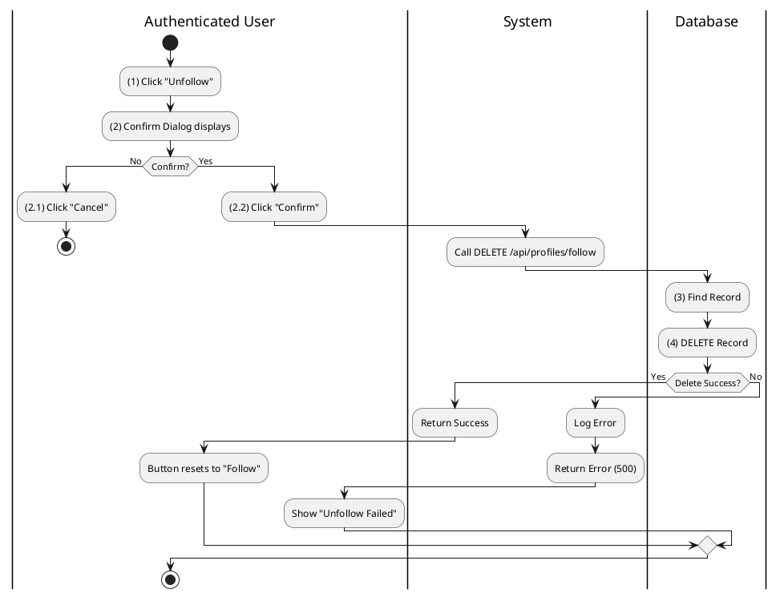

**Sequence Diagram**
```plantuml
@startuml
autonumber
actor "Authenticated User" as User
boundary "ProfileDetailView (Mock)" as View
control "ProfilesController" as Controller
entity "Follow (Table)" as Entity

User -> View: Click "Unfollow"
activate View
View --> User: Display Confirmation Dialog

alt Cancel
    User -> View: Click "Cancel"
    View --> User: Close Dialog
else Confirm
    User -> View: Click "Confirm"
    View -> Controller: Unfollow(targetId)
    activate Controller
    Controller -> Entity: Remove Record
    activate Entity
    
    alt Success
        Entity --> Controller: Success
        deactivate Entity
        Controller --> View: Return Success (200)
        View --> User: Reset Button to "Follow"
    else Database Error
        activate Entity
        Entity --> Controller: Exception
        deactivate Entity
        Controller -> Controller: LogError(ex)
        Controller --> View: Return Error (500)
        View --> User: Show Error Message
    end
    deactivate Controller // Deactivates controller after logic
end
deactivate View
@enduml
```

---

## 2.1.6.4 Search Friend

### Use Case Description
| Attribute | Details |
| :--- | :--- |
| **Name** | **Search Friend** |
| **Description** | The user searches specifically within their network or globally. |
| **Actor** | Authenticated User |
| **Trigger** | ❖ User focuses on the [txtSearch] input field.<br>❖ User types a keyword (name or username). |
| **Pre-condition** | ❖ User is on the "Friends" screen or Navigation bar. |
| **Post-condition** | ❖ System displays a list of profiles matching the search query. |

### Business Rules (BR)

| Activity | BR Code | Description |
| :---: | :---: | :--- |
| (1) | BR1 | **Selecting Rules:**<br>When the user types keywords into the global Search Bar and presses Enter, the search process begins. |
| (2) | BR2 | **Validation Rules:**<br>The system checks if the input length is greater than 0 characters. |
| (2.1) | BR2.1 | **Displaying Rules (Invalid):**<br>If the input is empty or invalid, the system ignores the request or shows a validation tooltip (Optional). |
| (3) | BR3 | **Querying Rules:**<br>If valid, the system calls `SearchController.SearchPeople` (`GET /api/search/people?query=...`) with the user's input. |
| (4) | BR4 | **Querying Rules:**<br>The database executes a `SELECT` query on the `Profiles` table, utilizing a `LIKE %query%` condition to match Names or Usernames. |
| (5) | BR5 | **Displaying Rules:**<br>The system returns a list of matching `ProfileDto` objects. |
| (6) | BR6 | **Displaying Rules:**<br>The UI renders the search results in a list or dropdown for the user to select. |

### Diagrams

**Activity Diagram**


**Sequence Diagram**
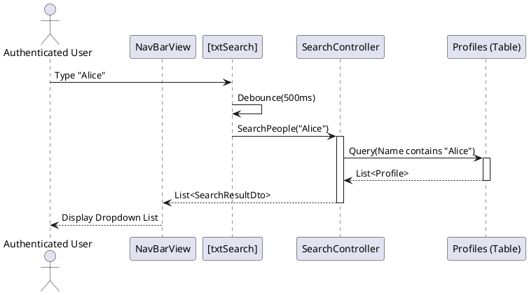

---

## 2.1.6.5 Block Friend / User

### Use Case Description
| Attribute | Details |
| :--- | :--- |
| **Name** | **Block Friend / User** |
| **Description** | Block a user to prevent all interaction. |
| **Actor** | Authenticated User |
| **Trigger** | ❖ User selects "Block" from the profile options menu. |
| **Pre-condition** | ❖ Target user is not already blocked. |
| **Post-condition** | ❖ A "Block" record is added to "UserModerations".<br>❖ Any existing "Follows" relationships are deleted. |

### Business Rules (BR)

| Activity | BR Code | Description |
| :---: | :---: | :--- |
| (1) | BR1 | **Selecting Rules:**<br>When the user selects the "Block" option from the profile menu, the system initiates the block request. |
| (2) | BR2 | **Displaying Rules:**<br>The system displays a Warning Dialog: *"Block this user? They will not be able to find your profile, posts or story."* |
| (3) | BR3 | **Submitting Rules:**<br>When the user confirms the action, the system calls the `BlockUser` endpoint (Note: Currently **Hallucinated/Non-Existent** in backend). |
| (4) | BR4 | **Processing Rules:**<br>The system attempts to call the backend API (e.g., `POST /api/users/block`). |
| (5) | BR5 | **Storing Rules:**<br>The database creates a record in the `UserModerations` table with type 'Block'. |
| (6) | BR6 | **Storing Rules:**<br>The database deletes any existing records in the `Follows` table (both directions) to sever connections. |
| (7) | BR7 | **Displaying Rules:**<br>The system returns a success status. |
| (8) | BR8 | **Displaying Rules:**<br>The UI redirects the user to the Home Screen or updates the view to hide the blocked profile. |
| (9) | BR_Error | **Exception Handling Rules:**<br>If a system failure occurs, the Global Exception Handler logs the error and returns a `500 Internal Server Error`. |

### Diagrams

**Activity Diagram**
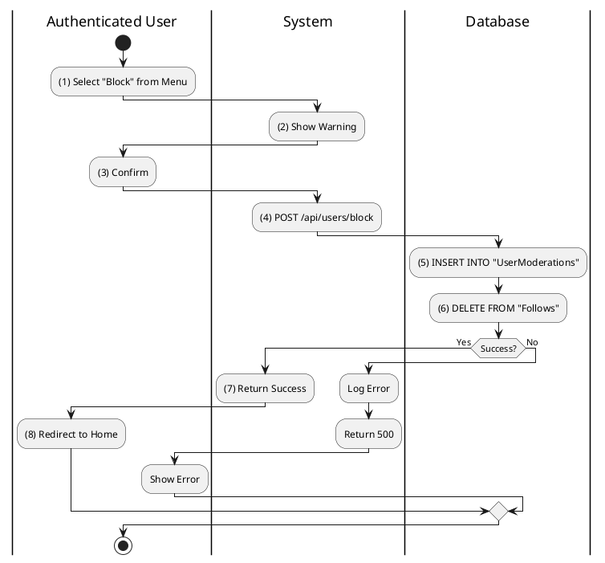

**Sequence Diagram**
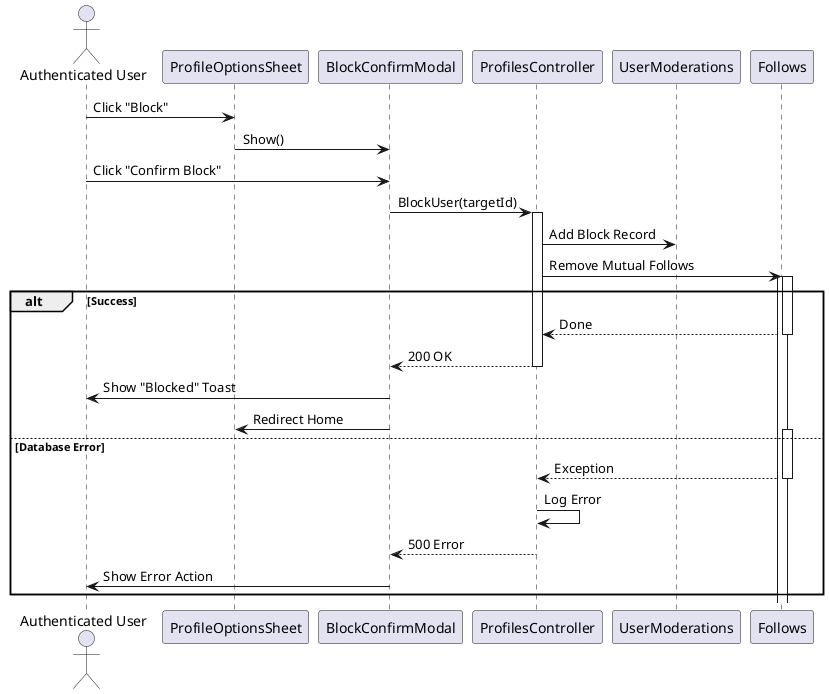

---

## 2.1.6.6 Unblock User

### Use Case Description
| Attribute | Details |
| :--- | :--- |
| **Name** | **Unblock User** |
| **Description** | Restore ability to interact. |
| **Actor** | Authenticated User |
| **Trigger** | ❖ User clicks [btnUnblock] in the Blocked Users list. |
| **Pre-condition** | ❖ Target user is currently in the blocked list. |
| **Post-condition** | ❖ The "Block" record is removed from "UserModerations".<br>❖ User disappears from the blocked list. |

### Business Rules (BR)

| Activity | BR Code | Description |
| :---: | :---: | :--- |
| (1) | BR1 | **Selecting Rules:**<br>When the user clicks "Unblock" next to a user in the Blocked List, the system initiates the request. |
| (2) | BR2 | **Submitting Rules:**<br>The system calls the `Unblock` endpoint (Note: Currently **Hallucinated/Non-Existent**). |
| (3) | BR3 | **Storing Rules:**<br>The database deletes the corresponding record from the `UserModerations` table. |
| (4) | BR4 | **Displaying Rules:**<br>The system returns a success confirmaton (200 OK). |
| (5) | BR5 | **Displaying Rules:**<br>The UI removes the unblocked user from the displayed list immediately. |
| (6) | BR_Error | **Exception Handling Rules:**<br>If a system failure occurs, the Global Exception Handler logs the error and returns a `500 Internal Server Error`. |

### Diagrams

**Activity Diagram**
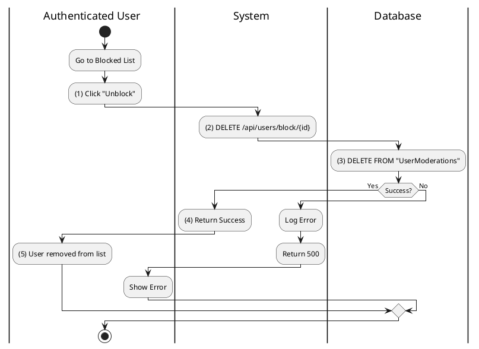

**Sequence Diagram**
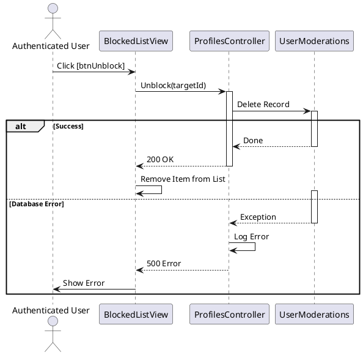

---

## 2.1.6.7 View Friend Suggestions

### Use Case Description
| Attribute | Details |
| :--- | :--- |
| **Name** | **View Friend Suggestions** |
| **Description** | System recommends users to follow. |
| **Actor** | Authenticated User |
| **Trigger** | ❖ User visits the Feed or Friends tab.<br>❖ System identifies low connection count or relevant signals. |
| **Pre-condition** | ❖ User is logged in. |
| **Post-condition** | ❖ a list of suggested profiles is displayed to the user. |

### Business Rules (BR)

| Activity | BR Code | Description |
| :---: | :---: | :--- |
| (1) | BR1 | **Displaying Rules:**<br>System shows "People You May Know" widget in the Feed or Friends Screen. |
| (2) | BR2 | **Querying Rules:**<br>System calls `ProfilesController.GetRecommendations()`. |
| (3) | BR3 | **Searching Rules:**<br>Logic searches for Profiles that:<br>- Are NOT currently followed by Actor (Check `"Follows"`).<br>- Have mutual connections (Optional connection rule).<br>- Ordered by popularity or randomness. |

### Diagrams

**Activity Diagram**
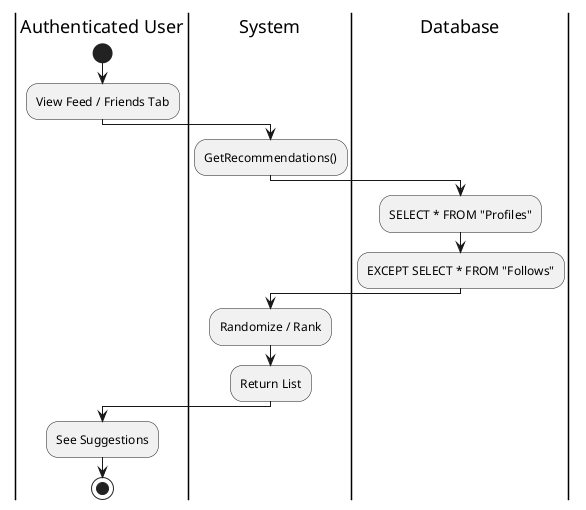

**Sequence Diagram**
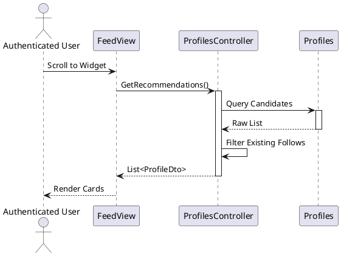
