# Use Case 2.1.6: Adjust Friend (Connections)

**Module**: Connections / Social Graph
**Primary Actor**: Authenticated User
**Backend Controller**: `Favi_BE.API.Controllers.ProfilesController`
**Database Tables**: `"Follows"`, `"Profiles"`, `"UserModerations"`

---

## 2.1.6.1 Adjust Friend (Overview)

### Use Case Description
| Attribute | Details |
| :--- | :--- |
| **Name** | **Adjust Friend** |
| **Description** | Central hub for managing social connections (Followers, Followings, Suggestions, Blocked Users). |
| **Actor** | Authenticated User |
| **Trigger** | ❖ User enters the "Friends" or "Network" section. |
| **Post-condition** | ❖ User Views lists or executes management actions. |

### Business Rules (BR)

| Activity | BR Code | Description |
| :---: | :---: | :--- |
| (1) | BR1 | **Initialization & Navigation:** ❖ The **System** loads the default connection list (typically "Followers" or "Following"). ❖ The **User** can switch tabs to view different lists, such as Suggestions or Blocked Users. ❖ The **System** enables context-sensitive actions (Follow, Unfollow, Block) based on the relationship state of each profile card. |

### Diagrams

**Activity Diagram**
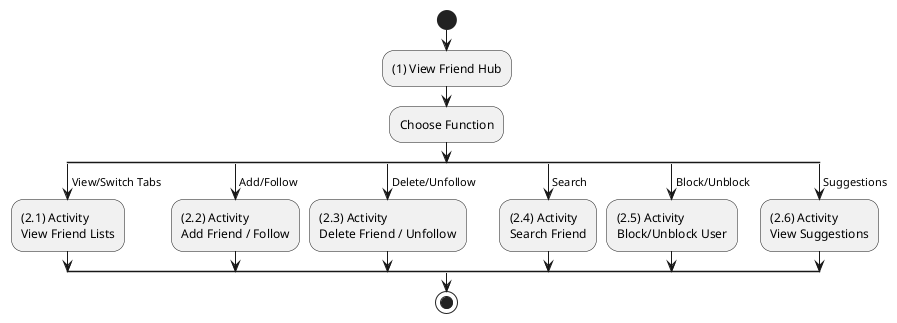

**Sequence Diagram**
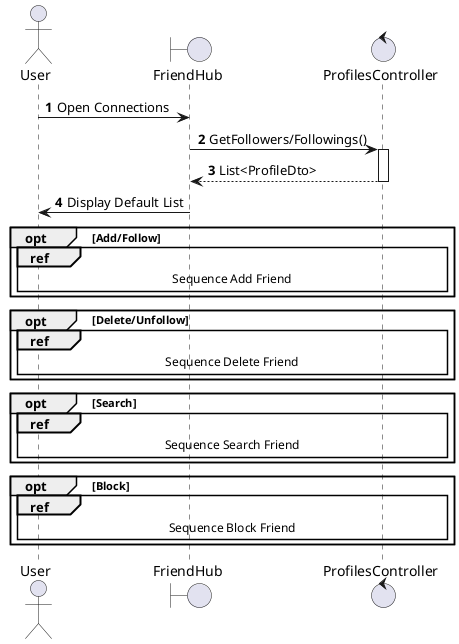

---

## 2.1.6.2 Add Friend / Follow User

### Use Case Description
| Attribute | Details |
| :--- | :--- |
| **Name** | **Add Friend / Follow User** |
| **Description** | The Authenticated User initiates a connection with another user. |
| **Actor** | Authenticated User |
| **Trigger** | ❖ User navigates to another user's profile. ❖ User clicks the [btnFollow] button. |
| **Pre-condition** | ❖ User is logged in. ❖ Target user is not blocked by the actor. |
| **Post-condition** | ❖ A new record is added to the "Follows" table. ❖ The button state changes to "Following" or "Requested". |

### Business Rules (BR)

| Activity | BR Code | Description |
| :---: | :---: | :--- |
| (2)-(3) | BR1 | **Validation Workflow:** ❖ The **Frontend** `ProfileHeader` checks the local state (isBlocked/isFollowing) and calls `profileApi.follow(targetId)`. ❖ The **API** receives a `POST` request at `/api/profiles/follow/{targetId}`. ❖ The **Backend** `ProfilesController.Follow(targetId)` invokes `_privacy.CanFollowAsync(followerId, followeeId)`. ❖ The **Logic** checks the `UserModerations` table for any 'Block' relationship.  If blocked, the **System** throws a `FriendshipException` ("Cannot follow blocked user") and returns `403 Forbidden`.  If allowed, the **System** proceeds to storage operation. |
| (3.2) | BR2 | **Storage:** ❖ The **Backend** executes `_profiles.FollowAsync(followerId, targetId)`. ❖ The **Database** inserts a new record into `Follows` table with `FollowerId`, `FolloweeId`, and `CreatedAt` timestamp. ❖ The **NotificationService** triggers a notification via `_notificationService.NotifyFollow(targetId, followerId)`, inserting a record into the `Notifications` table. |
| (3.2.1)-(5) | BR3 | **Completion:** ❖ The **System** returns a `200 OK` response. ❖ The **Frontend** updates the `isFollowing` state to `true`, changes the button text to "Following", and displays a success toast (MSG_SUCCESS_FOLLOW). |
| (3.2.4.2)-(6) | BR_Error | **Exception Handling:** ❖ If a Database error occurs (e.g., UniqueConstraint), the **System** returns `409 Conflict`. ❖ For generic errors, the **System** returns `500 Internal Server Error`. ❖ The **Frontend** catches the error, reverts the button state, and displays a "Follow Failed" toast. |

### Diagrams

**Activity Diagram**
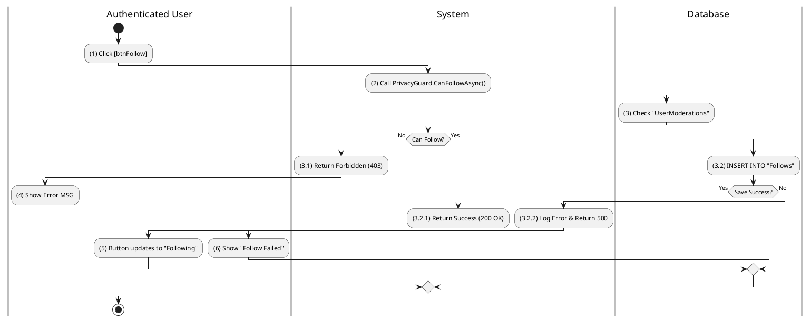

**Sequence Diagram**
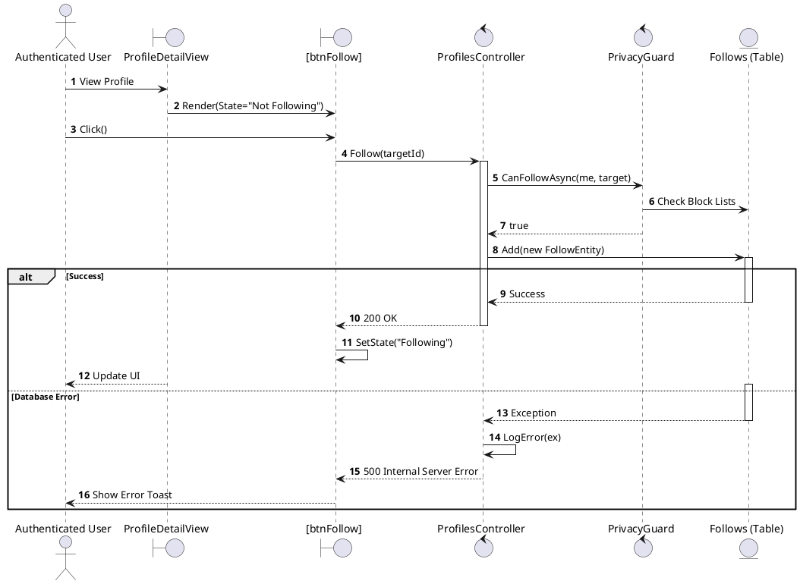

---

## 2.1.6.3 Delete Friend (Unfriend) / Unfollow

### Use Case Description
| Attribute | Details |
| :--- | :--- |
| **Name** | **Delete Friend (Unfriend) / Unfollow** |
| **Description** | The Authenticated User removes an existing connection. |
| **Actor** | Authenticated User |
| **Trigger** | ❖ User clicks the "Following" button or "Unfollow" option on a target profile. |
| **Pre-condition** | ❖ User is currently following the target user. |
| **Post-condition** | ❖ The record is removed from the "Follows" table. ❖ The button state reverts to "Follow". |

### Business Rules (BR)

| Activity | BR Code | Description |
| :---: | :---: | :--- |
| (1)-(2) | BR1 | **Confirmation:** ❖ The **Frontend** displays a `ConfirmationModal` ("Are you sure you want to unfollow?") when the user clicks "Unfollow". ❖ Upon confirmation, the **Frontend** initiates a call to `profileApi.unfollow(targetId)`. |
| (3)-(5) | BR2 | **Processing:** ❖ The **API** receives a `DELETE` request at `/api/profiles/follow/{targetId}`. ❖ The **Backend** `ProfilesController.Unfollow(targetId)` invokes `_profiles.UnfollowAsync(currentUserId, targetId)`. ❖ The **Database** executes a deletion against the `Follows` table where `FollowerId` and `FolloweeId` match the request. ❖ The **Logic** verifies the record exists before attempting deletion. |
| (5.1)-(6) | BR3 | **Completion:** ❖ The **System** returns `200 OK` on success. ❖ The **Frontend** dispatches the `unfollowSuccess` Redux action, reverts the button state to "Follow", and displays a success message (MSG_SUCCESS_UNFOLLOW). |
| (5.2)-(7) | BR_Error | **Error Handling:** ❖ If the relationship is not found, the **System** returns `404 Not Found`. ❖ For server-side errors, the **System** returns `500` and logs nature of the failure via `Serilog`. ❖ The **Frontend** displays an "Unfollow Failed" toast notification. |

### Diagrams

**Activity Diagram**
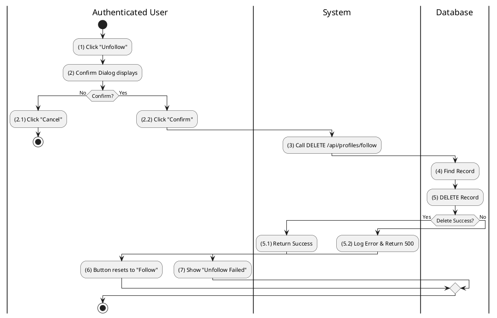

**Sequence Diagram**
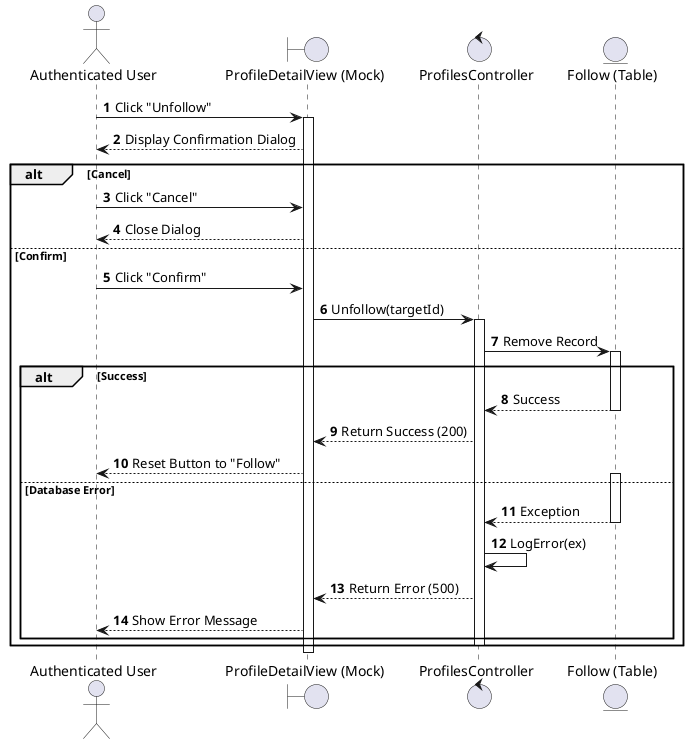

---

## 2.1.6.4 Search Friend

### Use Case Description
| Attribute | Details |
| :--- | :--- |
| **Name** | **Search Friend** |
| **Description** | The user searches specifically within their network or globally. |
| **Actor** | Authenticated User |
| **Trigger** | ❖ User focuses on the [txtSearch] input field. ❖ User types a keyword (name or username). |
| **Pre-condition** | ❖ User is on the "Friends" screen or Navigation bar. |
| **Post-condition** | ❖ System displays a list of profiles matching the search query. |

### Business Rules (BR)

| Activity | BR Code | Description |
| :---: | :---: | :--- |
| (2) | BR1 | **Frontend Validation:** ❖ The **Frontend** `FriendSearchInput` component applies a 500ms debounce to the input. ❖ If the query length is less than 2 characters, the **System** abuts the request. ❖ Otherwise, it dispatches `searchUser(query)`. |
| (2.2)-(3) | BR2 | **Processing:** ❖ The **API** processes a `POST` request to `/api/search` with the body `{ query: "abc", type: "User" }`. ❖ The **Backend** `SearchController.Search(dto)` invokes `_searchService.SearchUsersAsync(query)`. ❖ The **Database** executes a query `SELECT * FROM Profiles` matching `DisplayName` or `Username`. ❖ The **Logic** refines the results by filtering out blocked users via a check against `UserModerations`. |
| (4)-(5) | BR3 | **Result:** ❖ The **System** returns `200 OK` with a `PagedResult<ProfileDto>`. ❖ The **Frontend** updates the `searchResults` state and renders the `UserList`. ❖ If no matches are found, the **Frontend** displays a "No users found" message. |

### Diagrams

**Activity Diagram**
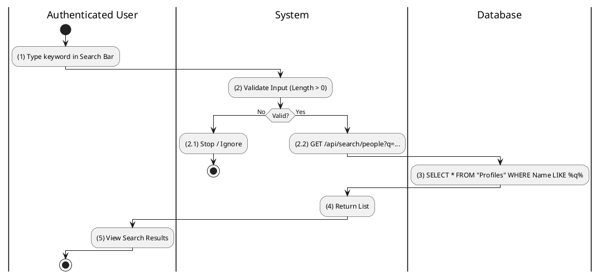

**Sequence Diagram**
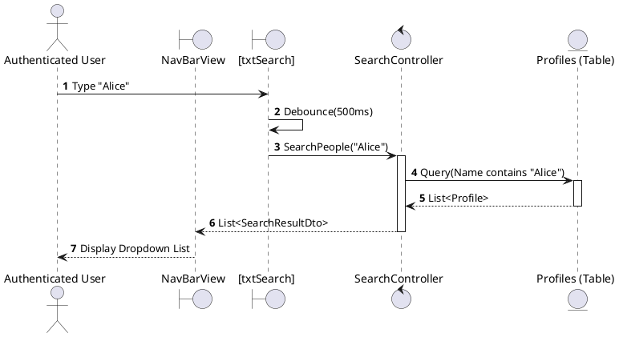

---

## 2.1.6.5 Block Friend / User

### Use Case Description
| Attribute | Details |
| :--- | :--- |
| **Name** | **Block Friend / User** |
| **Description** | Block a user to prevent all interaction. |
| **Actor** | Authenticated User |
| **Trigger** | ❖ User selects "Block" from the profile options menu. |
| **Pre-condition** | ❖ Target user is not already blocked. |
| **Post-condition** | ❖ A "Block" record is added to "UserModerations". ❖ Any existing "Follows" relationships are deleted. |

### Business Rules (BR)

| Activity | BR Code | Description |
| :---: | :---: | :--- |
| (1)-(3) | BR1 | **Confirmation:** ❖ The **Frontend** displays a `BlockWarningModal` when the user selects "Block" from the `UserProfileMenu`. ❖ Upon explicit confirmation ("Confirm Block"), the **Frontend** calls `profileApi.blockUser(targetId)`. |
| (4)-(6) | BR2 | **Processing:** ❖ The **API** receives a `POST` request at `/api/user-moderation/block` with the `{ targetId }`. ❖ The **Backend** `UserModerationController.Block(dto)` invokes `_moderation.BlockAsync(userId, targetId)`. ❖ The **Database** performs two operations:   1. `INSERT INTO UserModerations` with `Type='Block'`.  2. `DELETE FROM Follows` to remove any mutual follow status. |
| (6.1)-(7) | BR3 | **Completion:** ❖ The **System** returns `200 OK`. ❖ The **Frontend** immediately redirects the user to Home (if on the profile page) or hides the user's content. ❖ The **System** invalidates specific user cache keys. |
| (6.2)-(8) | BR_Error | **Exception:** ❖ If the user is already blocked, the **System** returns `409 Conflict`. ❖ For server warnings, it returns `500`. ❖ The **Frontend** displays an error toast. |

### Diagrams

**Activity Diagram**
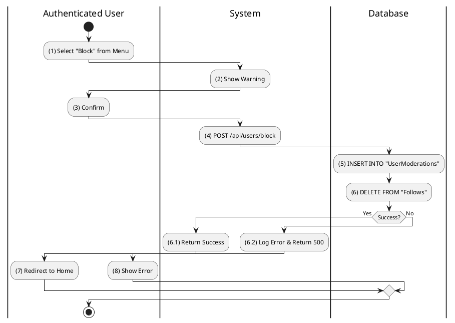

**Sequence Diagram**
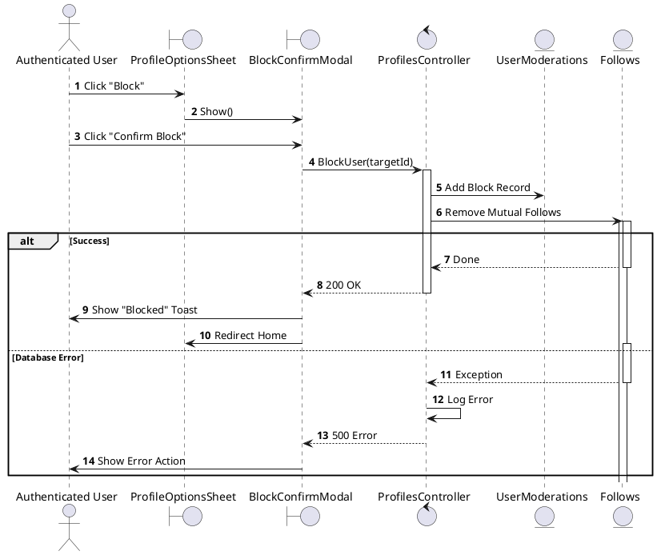

---

## 2.1.6.6 Unblock User

### Use Case Description
| Attribute | Details |
| :--- | :--- |
| **Name** | **Unblock User** |
| **Description** | Restore ability to interact. |
| **Actor** | Authenticated User |
| **Trigger** | ❖ User clicks [btnUnblock] in the Blocked Users list. |
| **Pre-condition** | ❖ Target user is currently in the blocked list. |
| **Post-condition** | ❖ The "Block" record is removed from "UserModerations". ❖ User disappears from the blocked list. |

### Business Rules (BR)

| Activity | BR Code | Description |
| :---: | :---: | :--- |
| (2)-(3) | BR1 | **Processing:** ❖ The **Frontend** `BlockedUsersList` initiates a call to `profileApi.unblock(targetId)` upon clicking "Unblock". ❖ The **API** request goes to `DELETE /api/user-moderation/block/{targetId}`. ❖ The **Backend** `UserModerationController.Unblock` calls `_moderation.UnblockAsync`. ❖ The **Database** deletes the matching record from `UserModerations` where `Type='Block'`. |
| (3.1)-(4) | BR2 | **Completion:** ❖ The **System** returns `200 OK`. ❖ The **Frontend** optimistically removes the user from the `BlockedUsersList` and displays a "User unblocked" toast. |
| (3.2)-(5) | BR_Error | **Exception:** ❖ If the block record is not found, the **System** returns `404 Not Found`. ❖ For generic failures, it returns `500`. |

### Diagrams

**Activity Diagram**
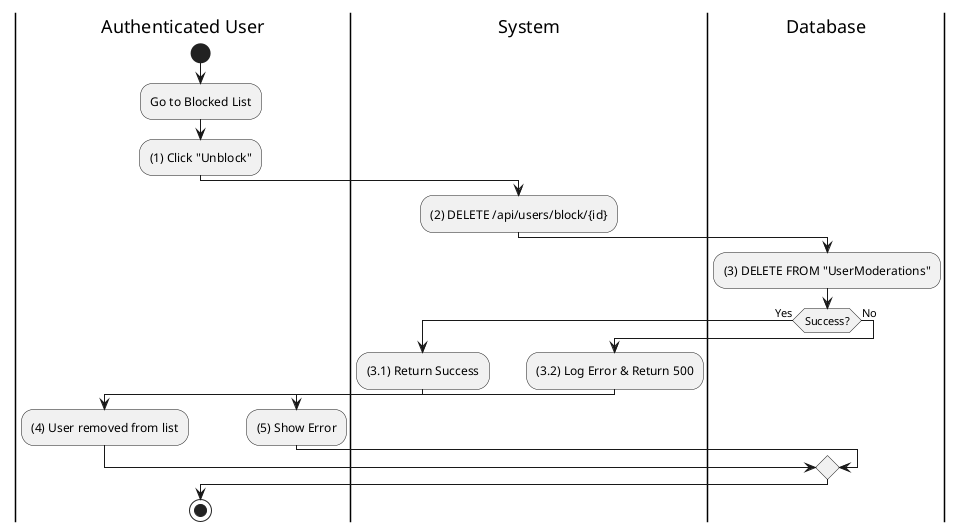

**Sequence Diagram**
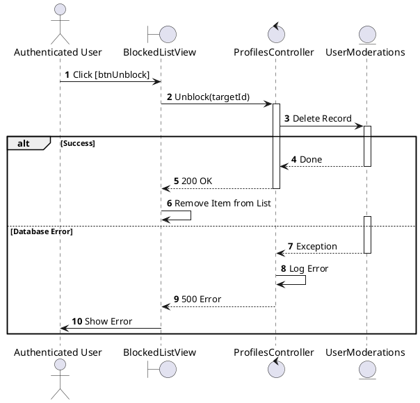

---

## 2.1.6.7 View Friend Suggestions

### Use Case Description
| Attribute | Details |
| :--- | :--- |
| **Name** | **View Friend Suggestions** |
| **Description** | System recommends users to follow. |
| **Actor** | Authenticated User |
| **Trigger** | ❖ User visits the Feed or Friends tab. ❖ System identifies low connection count or relevant signals. |
| **Pre-condition** | ❖ User is logged in. |
| **Post-condition** | ❖ a list of suggested profiles is displayed to the user. |

### Business Rules (BR)

| Activity | BR Code | Description |
| :---: | :---: | :--- |
| (2)-(4) | BR1 | **Data Fetching:** ❖ The **Frontend** `RightSidebar` component calls `profileApi.getRecommendations()` when mounted. ❖ The **API** receives a `GET` request at `/api/profiles/recommendations?limit=5`. ❖ The **Backend** `ProfilesController.GetRecommendations` delegates to `_recommendationEngine.GetSuggestedUsersAsync`. ❖ The **Database** executes a query to `SELECT` random profiles not already followed by the user. |
| (5)-(7) | BR2 | **Rendering:** ❖ The **System** returns `200 OK` containing a list of `ProfileDto`. ❖ The **Frontend** renders `SuggestionCard` components for each user in the list. |

### Diagrams

**Activity Diagram**
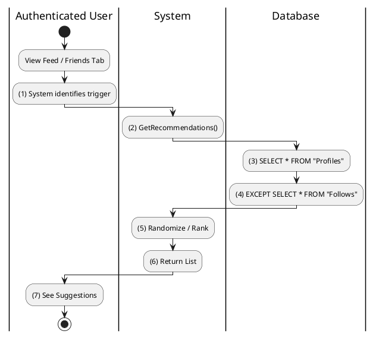

**Sequence Diagram**
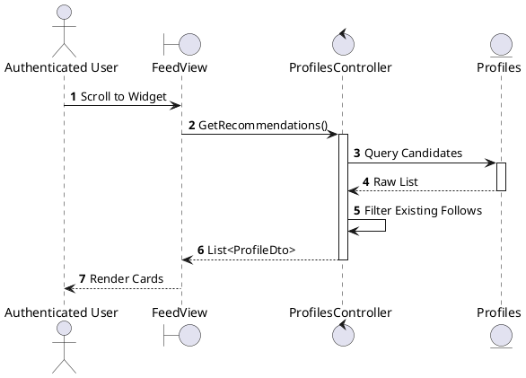
