# Use Case 2.1.7: Chat (Communication)

**Module**: Communication
**Primary Actor**: Authenticated User
**Backend Controller**: `Favi_BE.API.Controllers.ChatController`
**Database Tables**: `"Conversations"`, `"UserConversations"`, `"Messages"`

---

## 2.1.7.1 Chat (Overview)

### Use Case Description
| Attribute | Details |
| :--- | :--- |
| **Name** | **Chat Overview** |
| **Description** | Central hub for real-time communication (Inbox, Direct Messages, Group Chats). |
| **Actor** | Authenticated User |
| **Trigger** | ❖ User clicks the "Chat" icon. |
| **Post-condition** | ❖ User manages conversations or messages. |

### Business Rules (BR)

| Activity | BR Code | Description |
| :---: | :---: | :--- |
| (1) | BR1 | **Initialization:** ❖ The System fetches the user's active conversations sorted by recent activity. ❖ The System connects to the Real-time SignalR Hub to receive live updates. |

### Diagrams

**Activity Diagram**
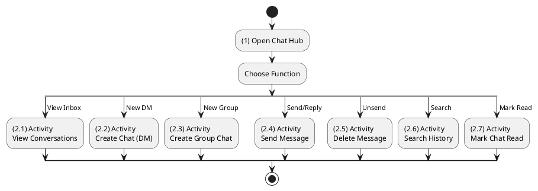

**Sequence Diagram**
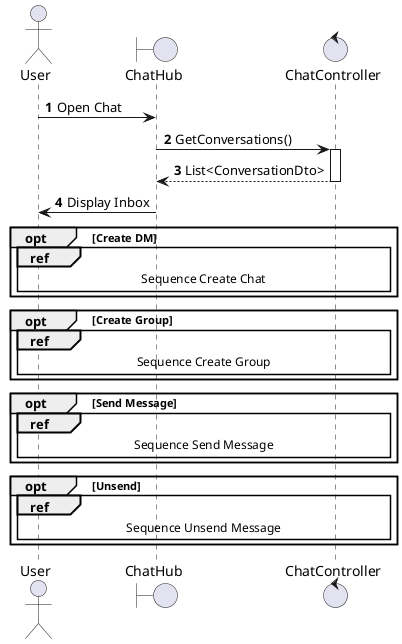

---

## 2.1.7.2 Create Chat (Direct Message)

### Use Case Description
| Attribute | Details |
| :--- | :--- |
| **Name** | **Create Chat (Direct Message)** |
| **Description** | Start a new 1-on-1 chat. |
| **Actor** | Authenticated User |
| **Trigger** | ❖ User clicks the [btnMessage] on another user's profile. |
| **Pre-condition** | ❖ Target user accepts messages (privacy settings allow). |
| **Post-condition** | ❖ A new conversation is created (or existing one retrieved). ❖ System navigates to the Chat Window. |

### Business Rules (BR)

| Activity | BR Code | Description |
| :---: | :---: | :--- |
| Activity | BR Code | Description |
| :---: | :---: | :--- |
| (2)-(3) | BR1 | **Discovery & Creation:** ❖ **Frontend**: User clicks "Message" on Profile. Calls `chatApi.createDm(targetId)`. ❖ **API**: `POST /api/chat/dm` Body: `{ targetId }`. ❖ **Backend**: `ChatController.GetOrCreateDm` calls `_chatService.GetDmByParticipants(userId, targetId)`. ❖ **DB**: `SELECT ConversationId FROM UserConversations WHERE UserId IN (@user, @target) GROUP BY ConversationId HAVING COUNT(*)=2`.  **If Exists**: Returns existing `ConversationDto`.  **If New**: `INSERT INTO Conversations (Type=DM)`; `INSERT INTO UserConversations` for both users. |
| (5.1)-(6) | BR2 | **Navigation:** ❖ **Response**: `200 OK` (ConversationDto). ❖ **Frontend**: Redirects to `/messages/{conversationId}`. ❖ **SignalR**: Client invokes `Hub.JoinGroup(conversationId)` for real-time events. |
| (5.2) | BR_Error | **Exception:** ❖ **Error**: `500 Server Error`. ❖ **Frontend**: Show error toast. |

### Diagrams

**Activity Diagram**
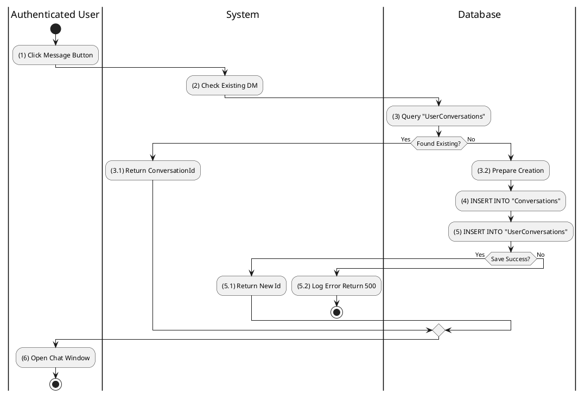

**Sequence Diagram**
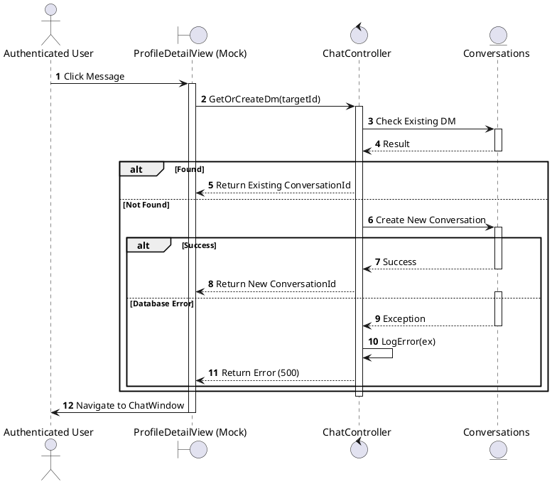

---

## 2.1.7.3 Create Group Chat

### Use Case Description
| Attribute | Details |
| :--- | :--- |
| **Name** | **Create Group Chat** |
| **Description** | Create a room with multiple users. |
| **Actor** | Authenticated User |
| **Trigger** | ❖ User initiates "New Group" and selects members. |
| **Pre-condition** | ❖ At least 2 other users are selected. |
| **Post-condition** | ❖ A group conversation record is created. ❖ All selected users are added as participants. |

### Business Rules (BR)

| Activity | BR Code | Description |
| :---: | :---: | :--- |
| (1)-(3) | BR1 | **Submission:** ❖ **Frontend**: `CreateGroupModal`. User selects >1 friend. Clicks "Create". ❖ **Validation**: Local check: `selected.length >= 2`. ❖ **API**: `POST /api/chat/group` Body: `{ name: "Team", memberIds: [1, 2] }`. |
| (3.2)-(5) | BR2 | **Processing:** ❖ **Backend**: `ChatController.CreateGroup(dto)` calls `_chatService.CreateGroupAsync`. ❖ **DB**:   1. `INSERT INTO Conversations (Type=Group, Name=...)` -> Get `Id`.  2. `INSERT INTO UserConversations` for Creator (Role=Admin) and Members (Role=Member). |
| (5.1)-(6) | BR3 | **Completion & Notify:** ❖ **Response**: `201 Created` (ConversationDto). ❖ **SignalR**: Backend broadcasts `ReceiveNewConversation` to all members via `IHubContext`. ❖ **Frontend**: Creator navigates to new chat. Members see new chat appear in sidebar. |
| (5.2)-(7) | BR_Error | **Exception:** ❖ **Validation**: If < 2 members, API returns `400 Bad Request`. ❖ **Frontend**: Displays "Select at least 2 members". |

### Diagrams

**Activity Diagram**
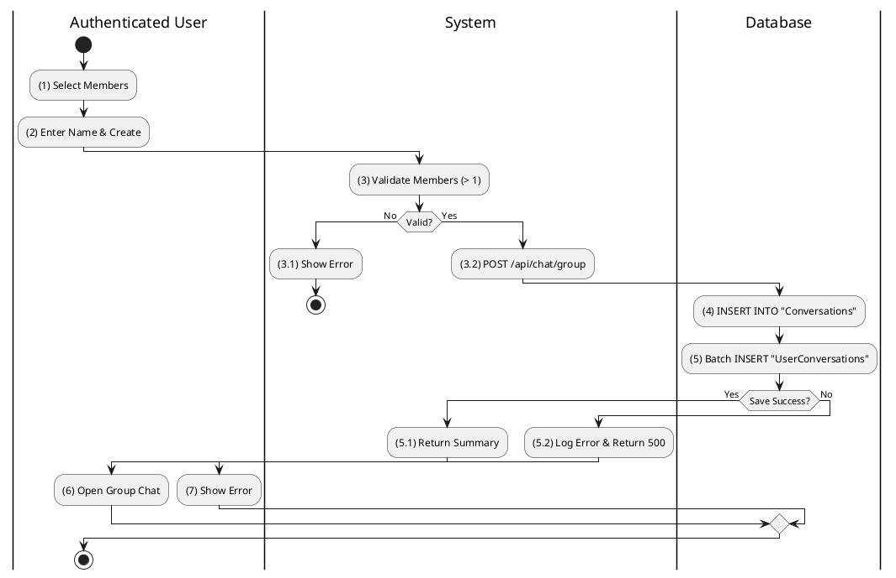

**Sequence Diagram**
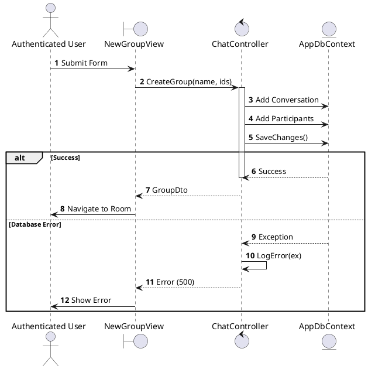

---

## 2.1.7.4 Reply Message / Send Message

### Use Case Description
| Attribute | Details |
| :--- | :--- |
| **Name** | **Reply Message / Send Message** |
| **Description** | Sending a text message. |
| **Actor** | Authenticated User |
| **Trigger** | ❖ User types text and clicks [btnSend] inside a chat window. |
| **Pre-condition** | ❖ Conversation exists. ❖ User is a participant of the conversation. |
| **Post-condition** | ❖ Message is saved to database. ❖ Other participants receive the message (Real-time). |

### Business Rules (BR)

| Activity | BR Code | Description |
| :---: | :---: | :--- |
| Activity | BR Code | Description |
| :---: | :---: | :--- |
| (1)-(2) | BR1 | **Optimistic Sending:** ❖ **Frontend**: `MessageInput`. User hits Enter. ❖ **Local State**: Adds temporary message object (`status='sending'`) to list. ❖ **API**: `POST /api/chat/messages` Body: `{ conversationId, content }`. |
| (3)-(5) | BR2 | **Processing:** ❖ **Backend**: `ChatController.SendMessage` calls `_chatService.SendMessageAsync`. ❖ **DB**: `INSERT INTO Messages (ConversationId, SenderId, Content)`. Updates `Conversations.LastMessageAt`. ❖ **Real-time**: Calls `_hubContext.Clients.Group(convId).SendAsync("ReceiveMessage", msgDto)`. |
| (5.1)-(6) | BR3 | **Confirmation:** ❖ **Response**: `201 Created` (MessageDto). ❖ **Frontend**: Replaces temporary object with real `MessageDto` (`status='sent'`). |
| (5.2)-(7) | BR_Error | **Error:** ❖ **Frontend**: Fails? Set message status to `failed` (Red retry icon). ❖ **Retry Logic**: User can click to retry API call. |

### Diagrams

**Activity Diagram**
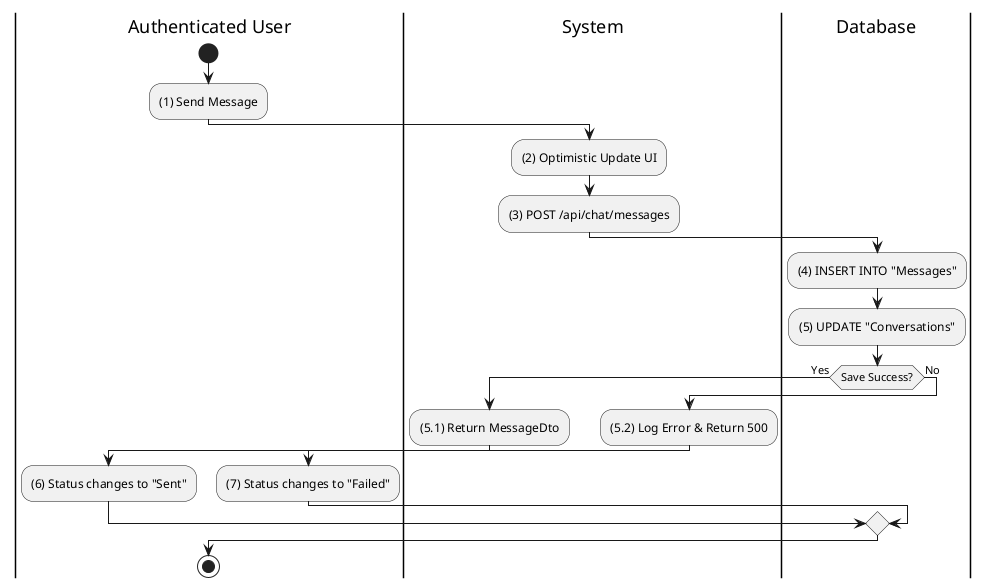

**Sequence Diagram**
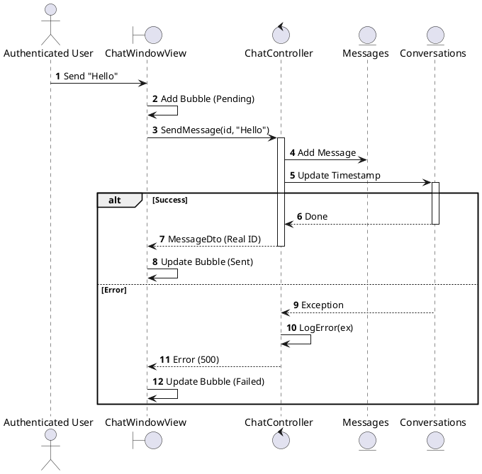

---

## 2.1.7.5 Delete Chat / Message (Unsend)

### Use Case Description
| Attribute | Details |
| :--- | :--- |
| **Name** | **Delete Chat / Message (Unsend)** |
| **Description** | Unsend a specific message. |
| **Actor** | Authenticated User |
| **Trigger** | ❖ User long-presses a message and selects "Unsend". |
| **Pre-condition** | ❖ Message was sent by the user. ❖ Time elapsed is within the allowable limit (e.g., 15 mins). |
| **Post-condition** | ❖ Message content is removed or marked as deleted in the database. |

### Business Rules (BR)

| Activity | BR Code | Description |
| :---: | :---: | :--- |
| (2) | BR1 | **Validation:** ❖ **Frontend**: Checks `msg.sentAt`. If > 15 mins, "Unsend" option hidden/disabled. ❖ **Action**: `chatApi.unsendMessage(msgId)`. |
| (2.2)-(3) | BR2 | **Processing:** ❖ **API**: `DELETE /api/chat/messages/{id}`. ❖ **Backend**: `ChatController.DeleteMessage`. Verifies `SenderId == CurrentUserId`. Check Timestamp. ❖ **DB**: `UPDATE Messages SET IsDeleted=1, Content=NULL WHERE Id=@id`. ❖ **Real-time**: Broadcasts `MessageDeleted` event via SignalR. |
| (3.1)-(4) | BR3 | **UI Update:** ❖ **Frontend**: Receives `MessageDeleted` event or API success. ❖ **Action**: Replaces content with "Message unsent" italic text. |
| (3.2)-(5) | BR_Error | **Exception:** ❖ **Timeout**: If backend check fails (>15m), return `400 Bad Request`. ❖ **Frontend**: Show "Cannot unsend old messages". |

### Diagrams

**Activity Diagram**
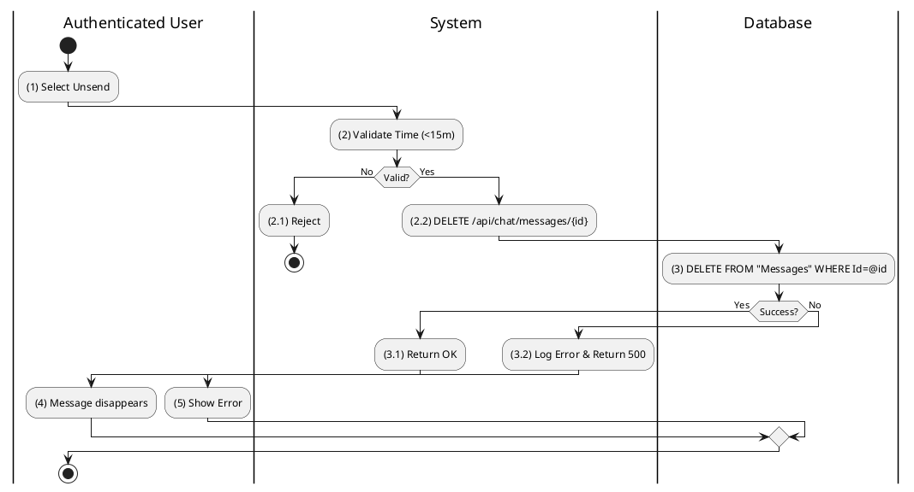

**Sequence Diagram**
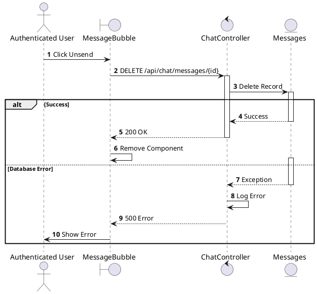

---

## 2.1.7.6 Search Chat History

### Use Case Description
| Attribute | Details |
| :--- | :--- |
| **Name** | **Search Chat History** |
| **Description** | Search within conversations. |
| **Actor** | Authenticated User |
| **Trigger** | ❖ User types a keyword in the chat search bar. |
| **Pre-condition** | ❖ User has existing conversations. |
| **Post-condition** | ❖ System displays messages matching the keyword. |

### Business Rules (BR)

| Activity | BR Code | Description |
| :---: | :---: | :--- |
| (2)-(4) | BR1 | **Search:** ❖ **Frontend**: `ChatSidebar` search input. Calls `chatApi.searchMessages(query)`. ❖ **API**: `GET /api/chat/search?q={query}`. ❖ **Backend**: `ChatController.Search`. ❖ **DB**: `SELECT * FROM Messages m JOIN UserConversations uc ON m.ConversationId = uc.ConversationId WHERE uc.UserId = @me AND m.Content LIKE %query%`. |
| (5)-(6) | BR2 | **Result:** ❖ **Response**: `200 OK` (List of MessageDto). ❖ **Frontend**: Displays results grouped by Conversation. Clicking jumps to message context. |

### Diagrams

**Activity Diagram**
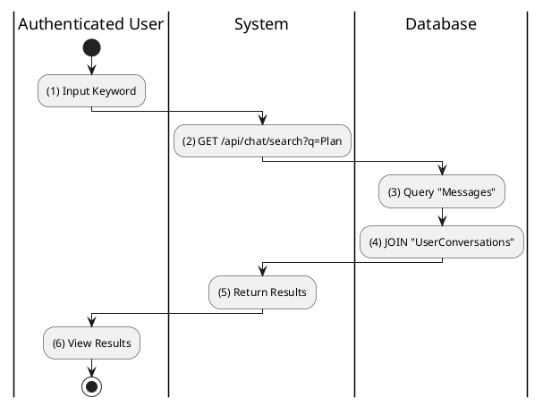

**Sequence Diagram**
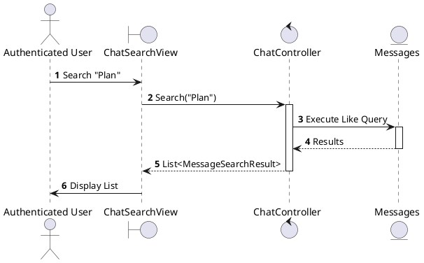

---

## 2.1.7.7 Mark Chat as Read

### Use Case Description
| Attribute | Details |
| :--- | :--- |
| **Name** | **Mark Chat as Read** |
| **Description** | Update read status when opening a chat. |
| **Actor** | Authenticated User |
| **Trigger** | ❖ User clicks to open a conversation. |
| **Pre-condition** | ❖ Conversation has unread messages. |
| **Post-condition** | ❖ The "LastReadMessageId" is updated to the latest message. ❖ Unread indicator disappears. |

### Business Rules (BR)

| Activity | BR Code | Description |
| :---: | :---: | :--- |
| (2)-(4) | BR1 | **Processing:** ❖ **Frontend**: `useEffect` on chat mount. Calls `chatApi.markRead(conversationId, lastMessageId)`. ❖ **API**: `POST /api/chat/{id}/read` Body: `{ messageId }`. ❖ **Backend**: `ChatController.Read`. ❖ **DB**: `UPDATE UserConversations SET LastReadMessageId = @msgId WHERE UserId=@me AND ConversationId=@convId`. ❖ **SignalR**: Notify other clients (optional, for "Read Receipts"). |
| (4.1) | BR_Error | **Error:** ❖ Silent failure (non-critical). Logged in backend. |

### Diagrams

**Activity Diagram**
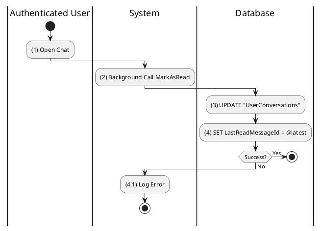

**Sequence Diagram**
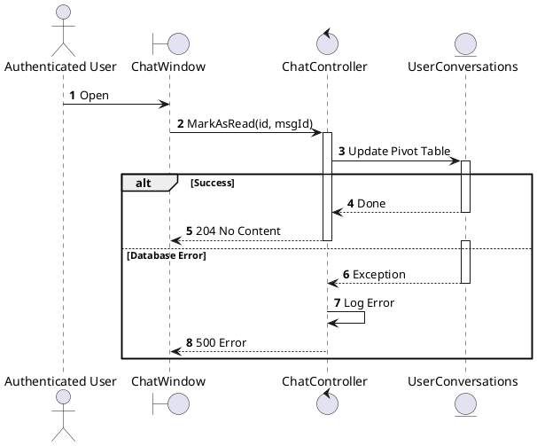

---

## 2.1.7.8 Leave Group Chat

### Use Case Description
| Attribute | Details |
| :--- | :--- |
| **Name** | **Leave Group Chat** |
| **Description** | Exit a group. |
| **Actor** | Authenticated User |
| **Trigger** | ❖ User selects "Leave Group" from group settings. |
| **Pre-condition** | ❖ User is currently a member of the group. |
| **Post-condition** | ❖ User is removed from the participant list. ❖ User no longer receives messages from this group. |

### Business Rules (BR)

| Activity | BR Code | Description |
| :---: | :---: | :--- |
| (2) | BR1 | **Confirmation:** ❖ **Frontend**: Click "Leave Group". Show Warning Modal. ❖ **Action**: `chatApi.leaveGroup(convId)`. |
| (3)-(4) | BR2 | **Processing:** ❖ **API**: `POST /api/chat/{id}/leave`. ❖ **Backend**: `ChatController.LeaveGroup`. ❖ **DB**: `DELETE FROM UserConversations WHERE UserId=@me AND ConversationId=@id`. ❖ **System Message**: `INSERT INTO Messages (Content="User left", Type=System)`. ❖ **SignalR**: Broadcast "UserLeft" event to remaining members. |
| (4.1)-(5) | BR3 | **Completion:** ❖ **Response**: `200 OK`. ❖ **Frontend**: Redirects to Inbox root. Removes chat from list. |
| (4.2)-(6) | BR_Error | **Exception:** ❖ **Error**: `500`. ❖ **Frontend**: Show detailed error message. |

### Diagrams

**Activity Diagram**
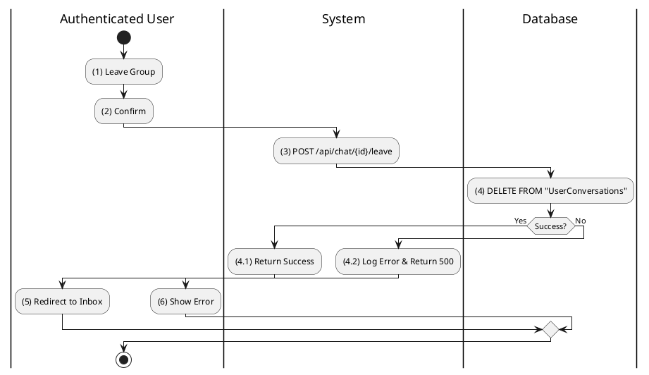

**Sequence Diagram**
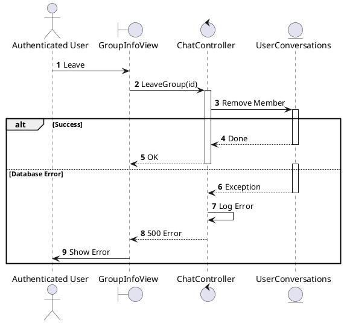
