# Use Case 2.1.7: Chat (Communication)

**Module**: Communication
**Primary Actor**: Authenticated User
**Backend Controller**: `Favi_BE.API.Controllers.ChatController`
**Database Tables**: `"Conversations"`, `"UserConversations"`, `"Messages"`

---

## 2.1.7.1 Chat (View Conversations)

### Use Case Description
| Attribute | Details |
| :--- | :--- |
| **Name** | **Chat (View Conversations)** |
| **Description** | The user views their inbox containing all active conversations. |
| **Actor** | Authenticated User |
| **Trigger** | ❖ User clicks the [iconChat] in the Navigation Bar. |
| **Pre-condition** | ❖ User is logged in. |
| **Post-condition** | ❖ System displays the "ChatList" view with sorted conversations. |

### Business Rules (BR)

| Activity | BR Code | Description |
| :---: | :---: | :--- |
| (1) | BR1 | **Selecting Rules:** When the user clicks the Chat Icon in the navigation bar, the system opens the Chat List interface. |
| (2) | BR2 | **Querying Rules:** The system calls `ChatController.GetConversations` (`GET /api/chat/conversations`) to retrieve the user's active chats. |
| (3) | BR3 | **Querying Rules:** The database queries the `UserConversations` table, joining with `Conversations` and `Profiles` to get the latest message and recipient details. |
| (4) | BR4 | **Displaying Rules:** The system returns a list of conversation summaries (DTOs) to the frontend. |
| (5) | BR5 | **Displaying Rules:** The UI renders the list of conversations (Inbox), showing the last message and timestamp for each. |

### Diagrams

**Activity Diagram**
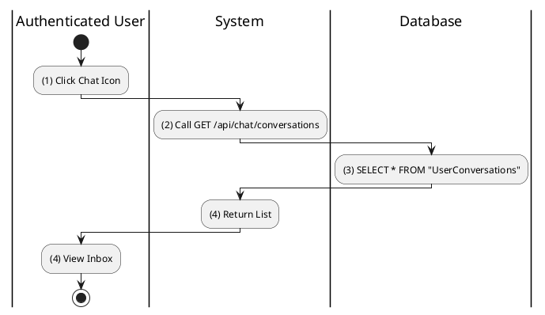

**Sequence Diagram**
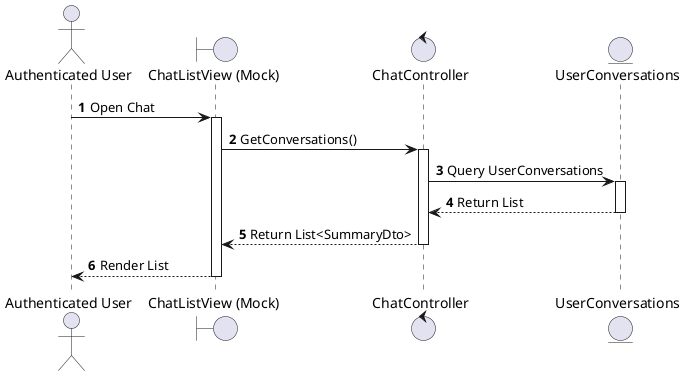

---

## 2.1.7.2 Create Chat (Direct Message)

### Use Case Description
| Attribute | Details |
| :--- | :--- |
| **Name** | **Create Chat (Direct Message)** |
| **Description** | Start a new 1-on-1 chat. |
| **Actor** | Authenticated User |
| **Trigger** | ❖ User clicks the [btnMessage] on another user's profile. |
| **Pre-condition** | ❖ Target user accepts messages (privacy settings allow). |
| **Post-condition** | ❖ A new conversation is created (or existing one retrieved). ❖ System navigates to the Chat Window. |

### Business Rules (BR)

| Activity | BR Code | Description |
| :---: | :---: | :--- |
| Activity | BR Code | Description |
| :---: | :---: | :--- |
| (1) | BR1 | **Selecting Rules:** When the user clicks the "Message" button on another user's profile, the system checks for an existing conversation. |
| (2) | BR2 | **Querying Rules:** The system calls `ChatController.GetOrCreateDm` (`POST /api/chat/dm/{targetId}`) with the target user's ID. |
| (3) | BR3 | **Querying Rules:** The database checks the `UserConversations` table to see if a direct message (DM) conversation already exists between these two users. |
| (3.1) | BR3.1 | **Displaying Rules (Existing):** If a conversation exists, the system returns its `ConversationId`, and the UI opens that chat window directly. |
| (3.2) | BR3.2 | **Processing Rules (New):** If no conversation exists, the system proceeds to step (4) to create a new one. |
| (4) | BR4 | **Storing Rules:** The database inserts a new record into the `Conversations` table (Type=DM). |
| (5) | BR5 | **Storing Rules:** The database inserts two records into `UserConversations`, linking both the current user and the target user to the new conversation. |
| (6) | BR6 | **Displaying Rules:** The system returns the new `ConversationId`. |
| (7) | BR7 | **Displaying Rules:** The UI opens the newly created chat window, allowing the user to send the first message. |

### Diagrams

**Activity Diagram**
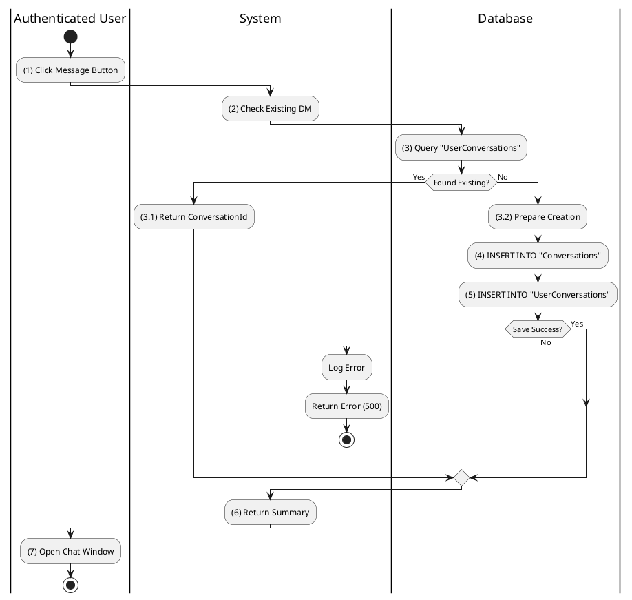

**Sequence Diagram**
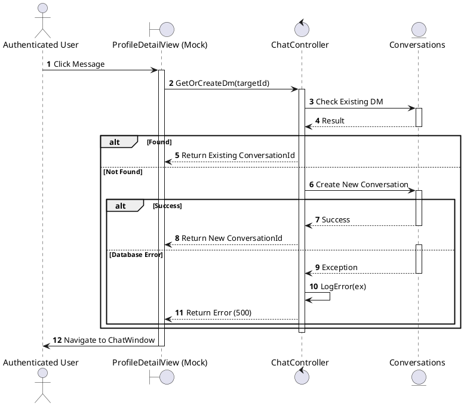

---

## 2.1.7.3 Create Group Chat

### Use Case Description
| Attribute | Details |
| :--- | :--- |
| **Name** | **Create Group Chat** |
| **Description** | Create a room with multiple users. |
| **Actor** | Authenticated User |
| **Trigger** | ❖ User initiates "New Group" and selects members. |
| **Pre-condition** | ❖ At least 2 other users are selected. |
| **Post-condition** | ❖ A group conversation record is created. ❖ All selected users are added as participants. |

### Business Rules (BR)

| Activity | BR Code | Description |
| :---: | :---: | :--- |
| (1) | BR1 | **Selecting Rules:** User selects "New Group" and checks multiple users from the friend list. |
| (2) | BR2 | **Submitting Rules:** User enters Group Name and clicks [btnCreate]. |
| (3) | BR3 | **Validating Rules:** System checks member count (Must be > 1 other person). |
| (4) | BR4 | **Storing Rules:** System calls `ChatController.CreateGroup`. Inserts into `"Conversations"` (`Type = 1` for Group). Inserts into `"UserConversations"` for **every** selected member + Creator. |
| (5) | BR5 | **Displaying Rules:** System redirects to the new Group Chat room. |

### Diagrams

**Activity Diagram**
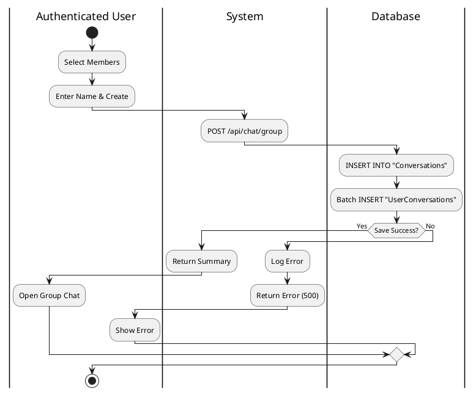

**Sequence Diagram**
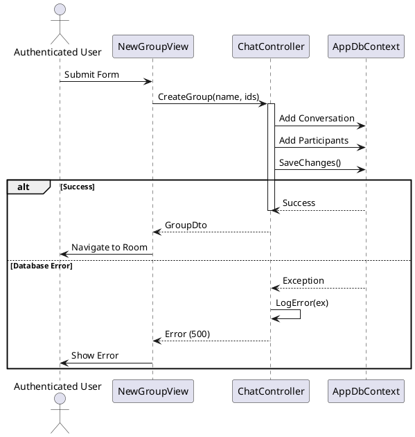

---

## 2.1.7.4 Reply Message / Send Message

### Use Case Description
| Attribute | Details |
| :--- | :--- |
| **Name** | **Reply Message / Send Message** |
| **Description** | Sending a text message. |
| **Actor** | Authenticated User |
| **Trigger** | ❖ User types text and clicks [btnSend] inside a chat window. |
| **Pre-condition** | ❖ Conversation exists. ❖ User is a participant of the conversation. |
| **Post-condition** | ❖ Message is saved to database. ❖ Other participants receive the message (Real-time). |

### Business Rules (BR)

| Activity | BR Code | Description |
| :---: | :---: | :--- |
| Activity | BR Code | Description |
| :---: | :---: | :--- |
| (1) | BR1 | **Submitting Rules:** When the user types a message and hits Enter/Send, the system triggers the send process. |
| (2) | BR2 | **Processing Rules:** The frontend performs an Optimistic UI update, showing the message as "Sending..." immediately. |
| (2.1) | BR2.1 | **Processing Rules:** The system calls `ChatController.SendMessage` (`POST /api/chat/messages`) with the content and `ConversationId`. |
| (3) | BR3 | **Storing Rules:** The database inserts a new record into the `Messages` table with the current timestamp and sender ID. |
| (4) | BR4 | **Storing Rules:** The database updates the `Conversations` table, setting `LastMessageAt` to the current time to bump the conversation to the top. |
| (5) | BR5 | **Displaying Rules:** The system returns the full `MessageDto` (including the generated ID). |
| (6) | BR6 | **Displaying Rules:** The UI updates the message status from "Sending..." to "Sent" (or displays a delivery tick). |

### Diagrams

**Activity Diagram**
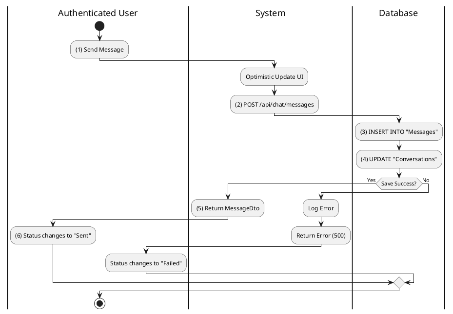

**Sequence Diagram**
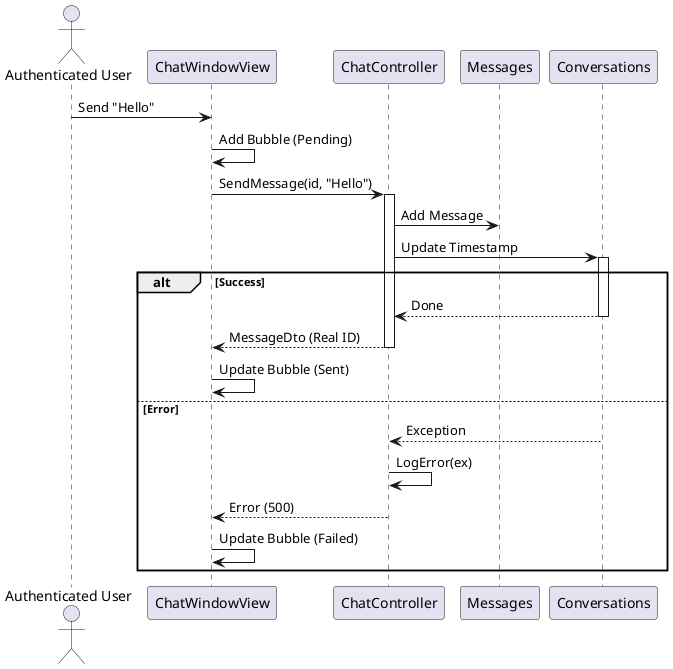

---

## 2.1.7.5 Delete Chat / Message (Unsend)

### Use Case Description
| Attribute | Details |
| :--- | :--- |
| **Name** | **Delete Chat / Message (Unsend)** |
| **Description** | Unsend a specific message. |
| **Actor** | Authenticated User |
| **Trigger** | ❖ User long-presses a message and selects "Unsend". |
| **Pre-condition** | ❖ Message was sent by the user. ❖ Time elapsed is within the allowable limit (e.g., 15 mins). |
| **Post-condition** | ❖ Message content is removed or marked as deleted in the database. |

### Business Rules (BR)

| Activity | BR Code | Description |
| :---: | :---: | :--- |
| (1) | BR1 | **Selecting Rules:** User long-presses a message bubble and selects "Unsend". |
| (2) | BR2 | **Validation Rules:** Frontend checks if message timestamp < 15 minutes. |
| (3) | BR3 | **Submitting Rules:** System calls `ChatController` to delete/soft-delete. |
| (4) | BR4 | **Storing Rules:** Backend removes the record from `"Messages"` table or sets `Content` to NULL. |

### Diagrams

**Activity Diagram**
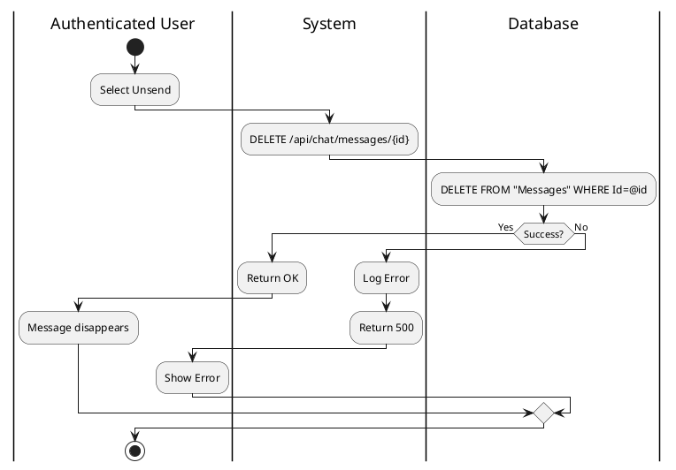

**Sequence Diagram**
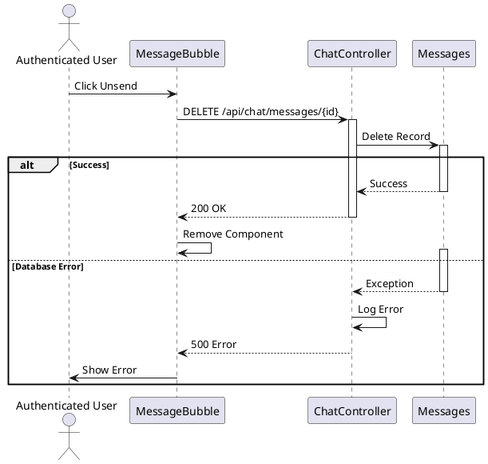

---

## 2.1.7.6 Search Chat History

### Use Case Description
| Attribute | Details |
| :--- | :--- |
| **Name** | **Search Chat History** |
| **Description** | Search within conversations. |
| **Actor** | Authenticated User |
| **Trigger** | ❖ User types a keyword in the chat search bar. |
| **Pre-condition** | ❖ User has existing conversations. |
| **Post-condition** | ❖ System displays messages matching the keyword. |

### Business Rules (BR)

| Activity | BR Code | Description |
| :---: | :---: | :--- |
| (1) | BR1 | **Selecting Rules:** User types in the Search Bar within the Chat section. |
| (2) | BR2 | **Searching Rules:** System calls `ChatController` with query string. |
| (3) | BR3 | **Querying Rules:** SQL: `SELECT * FROM "Messages" WHERE Content LIKE %q% AND ConversationId IN (Select Id from UserConversations where ProfileId = @me)`. |
| (4) | BR4 | **Displaying Rules:** System displays list of messages grouped by Conversation. |

### Diagrams

**Activity Diagram**
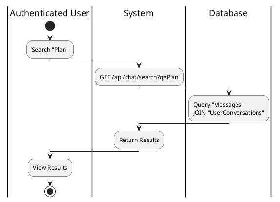

**Sequence Diagram**
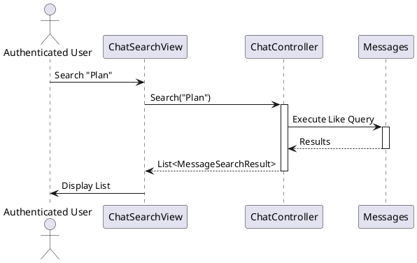

---

## 2.1.7.7 Mark Chat as Read

### Use Case Description
| Attribute | Details |
| :--- | :--- |
| **Name** | **Mark Chat as Read** |
| **Description** | Update read status when opening a chat. |
| **Actor** | Authenticated User |
| **Trigger** | ❖ User clicks to open a conversation. |
| **Pre-condition** | ❖ Conversation has unread messages. |
| **Post-condition** | ❖ The "LastReadMessageId" is updated to the latest message. ❖ Unread indicator disappears. |

### Business Rules (BR)

| Activity | BR Code | Description |
| :---: | :---: | :--- |
| (1) | BR1 | **Selecting Rules:** User clicks on a Conversation to open it. |
| (2) | BR2 | **Submitting Rules:** System calls `ChatController.MarkAsRead(convId, lastMsgId)`. |
| (3) | BR3 | **Storing Rules:** System updates `"UserConversations"` table: sets `LastReadMessageId` to the ID of the newest message in that chat. |

### Diagrams

**Activity Diagram**
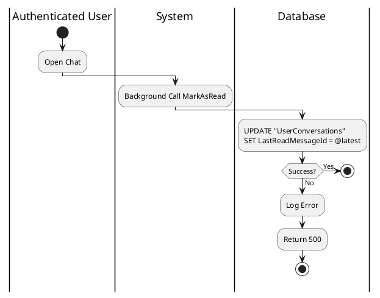

**Sequence Diagram**
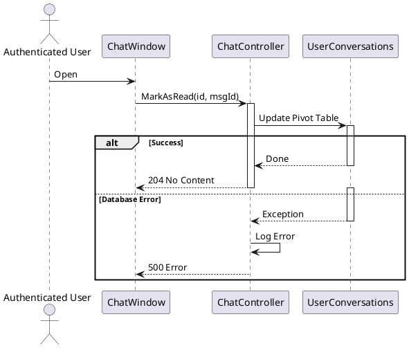

---

## 2.1.7.8 Leave Group Chat

### Use Case Description
| Attribute | Details |
| :--- | :--- |
| **Name** | **Leave Group Chat** |
| **Description** | Exit a group. |
| **Actor** | Authenticated User |
| **Trigger** | ❖ User selects "Leave Group" from group settings. |
| **Pre-condition** | ❖ User is currently a member of the group. |
| **Post-condition** | ❖ User is removed from the participant list. ❖ User no longer receives messages from this group. |

### Business Rules (BR)

| Activity | BR Code | Description |
| :---: | :---: | :--- |
| (1) | BR1 | **Selecting Rules:** User clicks "Group Info" -> "Leave Group". |
| (2) | BR2 | **Displaying Rules:** System displays Warning: "You won't receive further messages". (Refer to MSG Confirm 2). |
| (3) | BR3 | **Submitting Rules:** User confirms. System calls `ChatController.LeaveGroup`. |
| (4) | BR4 | **Storing Rules:** System deletes the `UserConversation` record for this user and this group. |

### Diagrams

**Activity Diagram**
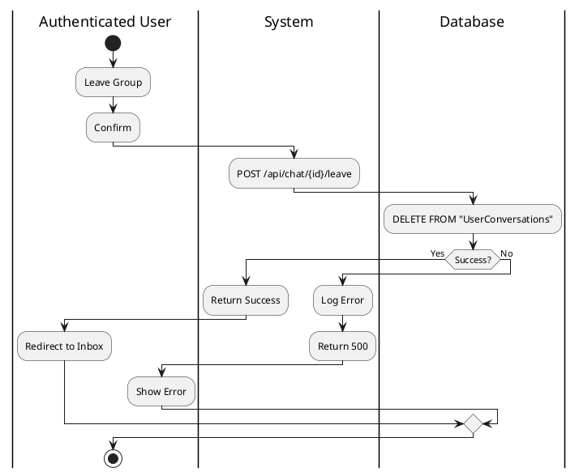

**Sequence Diagram**
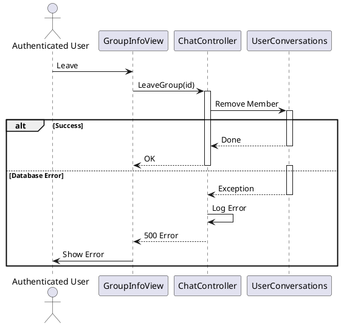
