# Use Case 2.1.7: Chat (Communication)

**Module**: Communication
**Primary Actor**: Authenticated User
**Backend Controller**: `Favi_BE.API.Controllers.ChatController`
**Database Tables**: `"Conversations"`, `"UserConversations"`, `"Messages"`

---

## 2.1.7.1 Chat (Overview)

### Use Case Description
| Attribute | Details |
| :--- | :--- |
| **Name** | **Chat Overview** |
| **Description** | Central hub for real-time communication (Inbox, Direct Messages, Group Chats). |
| **Actor** | Authenticated User |
| **Trigger** | ❖ User clicks the "Chat" icon. |
| **Post-condition** | ❖ User manages conversations or messages. |

### Business Rules (BR)

| Activity | BR Code | Description |
| :---: | :---: | :--- |
| (1) | BR1 | **Initialization:** ❖ The System fetches the user's active conversations sorted by recent activity. ❖ The System connects to the Real-time SignalR Hub to receive live updates. |

### Diagrams

**Activity Diagram**
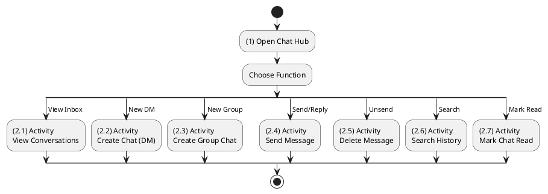

**Sequence Diagram**
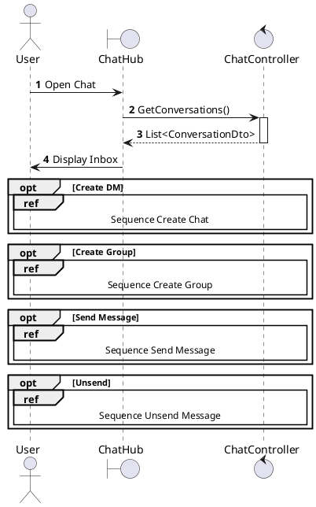

---

## 2.1.7.2 Create Chat (Direct Message)

### Use Case Description
| Attribute | Details |
| :--- | :--- |
| **Name** | **Create Chat (Direct Message)** |
| **Description** | Start a new 1-on-1 chat. |
| **Actor** | Authenticated User |
| **Trigger** | ❖ User clicks the [btnMessage] on another user's profile. |
| **Pre-condition** | ❖ Target user accepts messages (privacy settings allow). |
| **Post-condition** | ❖ A new conversation is created (or existing one retrieved). ❖ System navigates to the Chat Window. |

### Business Rules (BR)

| Activity | BR Code | Description |
| :---: | :---: | :--- |
| Activity | BR Code | Description |
| :---: | :---: | :--- |
| (2)-(3) | BR1 | **Conversation Discovery:** ❖ System calls method `GetOrCreateDm(targetId)`. ❖ System queries table “UserConversations” in the database to find a common `ConversationId` (Type=DM) between [User.ID] and [Target.ID].  **If Found**: System retrieves the existing ID and moves to step (3.1).  **If Not Found**: System moves to step (3.2) to create a new conversation record in “Conversations” table and inserts links in “UserConversations” (Steps 4-5). |
| (5.1)-(6) | BR3 | **Displaying Rules:** ❖ After obtaining the ID (Step 5.1), System displays a “ChatWindow” screen (Refer to “ChatWindow” view in “View Description” file) for the specific conversation (Step 6). ❖ System initiates the connection to the SignalR hub for real-time updates. |
| (5.2) | BR_Error | **Exception Handling Rules:** ❖ If a system failure occurs during creation:  System logs the error (Step 5.2).  System returns `500 Internal Server Error`. |

### Diagrams

**Activity Diagram**
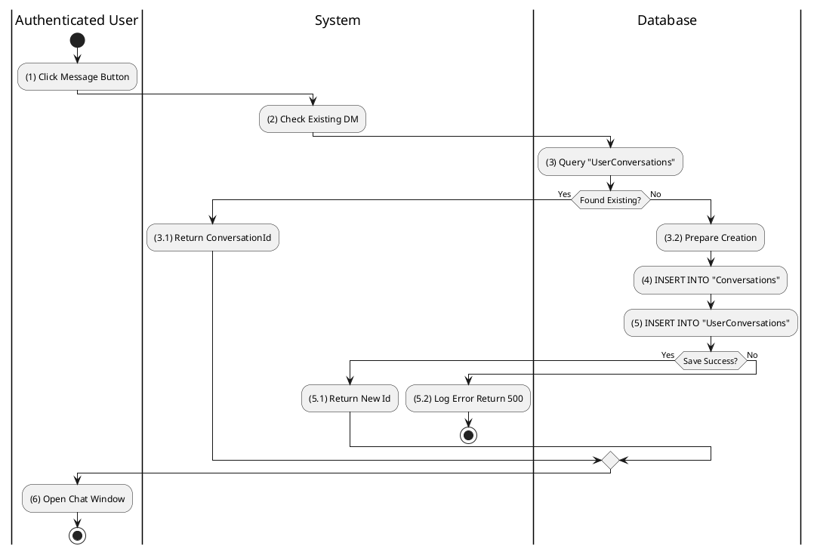

**Sequence Diagram**
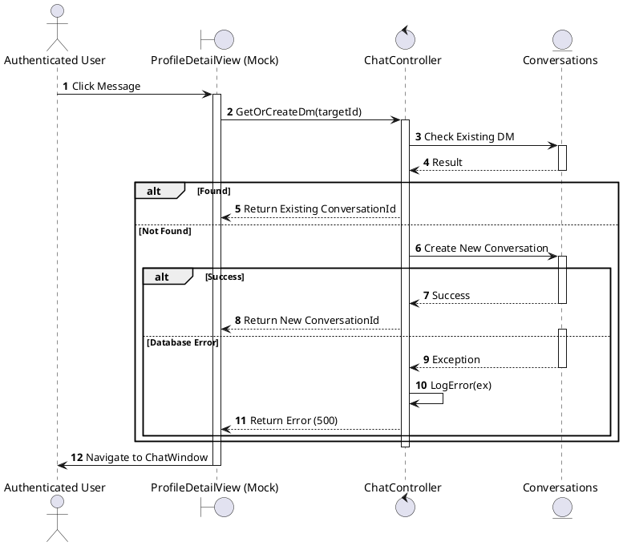

---

## 2.1.7.3 Create Group Chat

### Use Case Description
| Attribute | Details |
| :--- | :--- |
| **Name** | **Create Group Chat** |
| **Description** | Create a room with multiple users. |
| **Actor** | Authenticated User |
| **Trigger** | ❖ User initiates "New Group" and selects members. |
| **Pre-condition** | ❖ At least 2 other users are selected. |
| **Post-condition** | ❖ A group conversation record is created. ❖ All selected users are added as participants. |

### Business Rules (BR)

| Activity | BR Code | Description |
| :---: | :---: | :--- |
| (1)-(2) | BR1 | **Selecting Rules:** ❖ User navigates to “Create Group” form (Refer to “GroupCreation” view in “View Description” file). ❖ User selects members from the friend list (Step 1) and enters a Group Name (Step 2). ❖ User clicks the `[btnCreate]` button. system moves to step (3). |
| (3) | BR2 | **Group Validation Rule:** ❖ System validates the participant count.  **Invalid**: If Count < 2, System displays an error message (Refer to MSG_ERR_MIN_MEMBERS) (Step 3.1).  **Valid**: System moves to step (3.2). |
| (3.2)-(5) | BR3 | **Processing & Storing Rules:** ❖ System calls method `CreateGroup(dto)` (Step 3.2). ❖ System inserts a new record into table “Conversations” (Refer to “Conversations” table in “DB Sheet” file) with `Type` = 1 (Group) (Step 4). ❖ System inserts multiple records into “UserConversations” table for each selected member (Step 5). |
| (5.1)-(6) | BR4 | **Displaying Rules:** ❖ After creation, System returns Summary (Step 5.1). ❖ System displays the “ChatWindow” screen (Refer to “ChatWindow” view in “View Description” file) for the new group (Step 6). ❖ System sends a System Message to the chat: "Group created by [User]". |
| (5.2)-(7) | BR_Error | **Exception Handling Rules:** ❖ If a system failure occurs:  System logs the error (Step 5.2).  System returns `500 Internal Server Error`.  System shows error to user (Step 7). |

### Diagrams

**Activity Diagram**
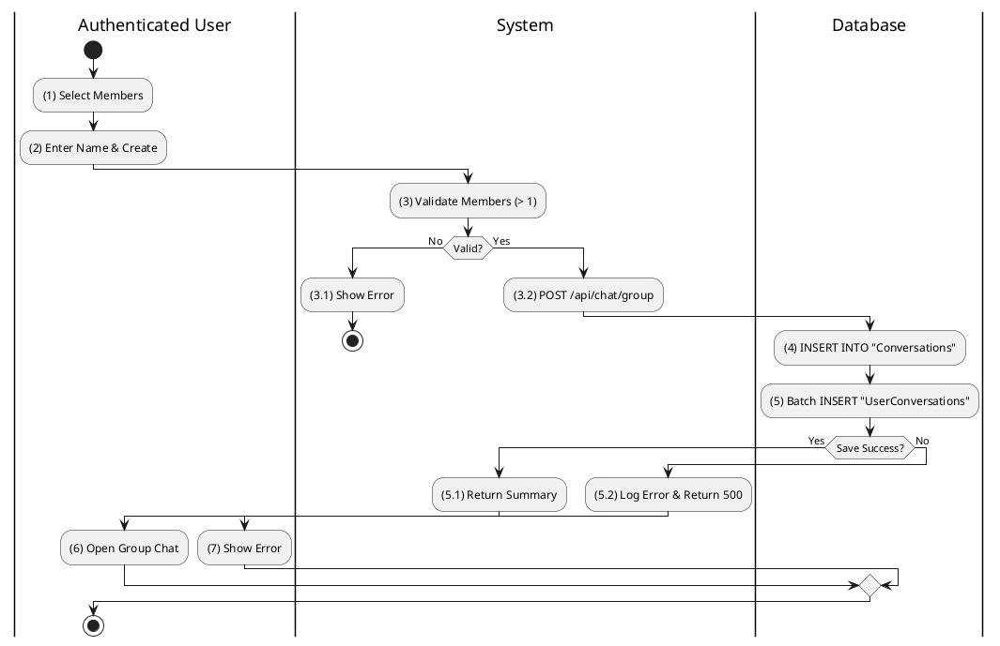

**Sequence Diagram**
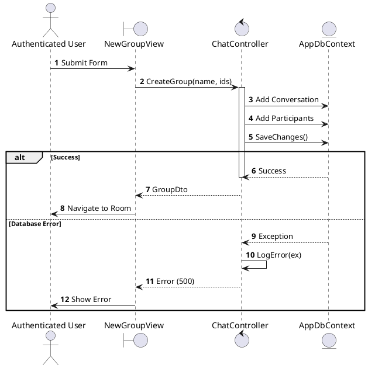

---

## 2.1.7.4 Reply Message / Send Message

### Use Case Description
| Attribute | Details |
| :--- | :--- |
| **Name** | **Reply Message / Send Message** |
| **Description** | Sending a text message. |
| **Actor** | Authenticated User |
| **Trigger** | ❖ User types text and clicks [btnSend] inside a chat window. |
| **Pre-condition** | ❖ Conversation exists. ❖ User is a participant of the conversation. |
| **Post-condition** | ❖ Message is saved to database. ❖ Other participants receive the message (Real-time). |

### Business Rules (BR)

| Activity | BR Code | Description |
| :---: | :---: | :--- |
| Activity | BR Code | Description |
| :---: | :---: | :--- |
| (1)-(2) | BR1 | **Submitting Rules:** When the user types a message and hits Enter/Send (Step 1), the system performs an Optimistic UI update (Step 2) to show the message immediately as "Sending". |
| (3)-(5) | BR2 | **Processing & Storing Rules:** ❖ System calls method `SendMessage(content, convId)` (Step 3). ❖ System inserts a new record into table “Messages” (Refer to “Messages” table in “DB Sheet” file) (Step 4). ❖ System updates `LastMessageAt` in table “Conversations” (Step 5). ❖ System broadcasts the message via SignalR to other participants. |
| (5.1)-(6) | BR3 | **Displaying Rules:** ❖ The UI receives the `MessageDto` acknowledgement (Step 5.1). ❖ The UI updates the message status from "Sending..." to "Sent" (Refer to “MessageStatus” view in “View Description” file) (Step 6). |
| (5.2)-(7) | BR_Error | **Exception Handling Rules:** ❖ If a system failure occurs:  System logs error (Step 5.2).  System returns `500 Error`.  UI marks the message as "Failed" (red icon) (Step 7). |

### Diagrams

**Activity Diagram**
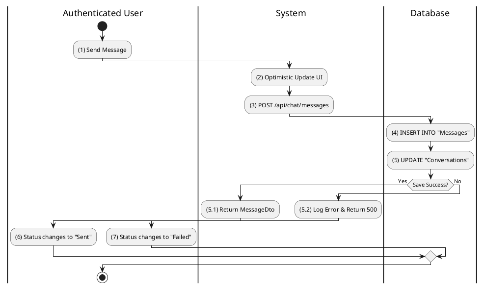

**Sequence Diagram**
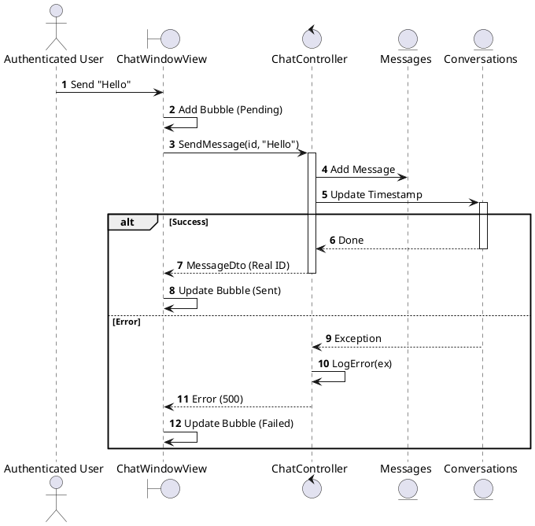

---

## 2.1.7.5 Delete Chat / Message (Unsend)

### Use Case Description
| Attribute | Details |
| :--- | :--- |
| **Name** | **Delete Chat / Message (Unsend)** |
| **Description** | Unsend a specific message. |
| **Actor** | Authenticated User |
| **Trigger** | ❖ User long-presses a message and selects "Unsend". |
| **Pre-condition** | ❖ Message was sent by the user. ❖ Time elapsed is within the allowable limit (e.g., 15 mins). |
| **Post-condition** | ❖ Message content is removed or marked as deleted in the database. |

### Business Rules (BR)

| Activity | BR Code | Description |
| :---: | :---: | :--- |
| (2) | BR2 | **Unsend Eligibility Check:** ❖ System/Frontend checks the timestamp of the message.  **Time > 15m**: The action is disabled or rejected (Refer to MSG_ERR_UNSEND_TIMEOUT) (Step 2.1).  **Time <= 15m**: System proceeds to step (2.2). |
| (2.2)-(3) | BR3 | **Processing & Storing Rules:** ❖ System calls method `DeleteMessage(msgId)` (Step 2.2). ❖ System performs a Soft Delete updates the record in table “Messages” (Refer to “Messages” table in “DB Sheet” file) setting `IsDeleted` = True or `Content` = NULL (Step 3). |
| (3.1)-(4) | BR4 | **Displaying Rules:** ❖ System returns OK (Step 3.1). ❖ Message disappears from view or content is replaced with "Message Unsent" (Step 4). |
| (3.2)-(5) | BR_Error | **Exception Handling Rules:** ❖ If a system failure occurs:  System logs the error (Step 3.2).  System returns `500 Internal Server Error`.  Show Error (Step 5). |

### Diagrams

**Activity Diagram**
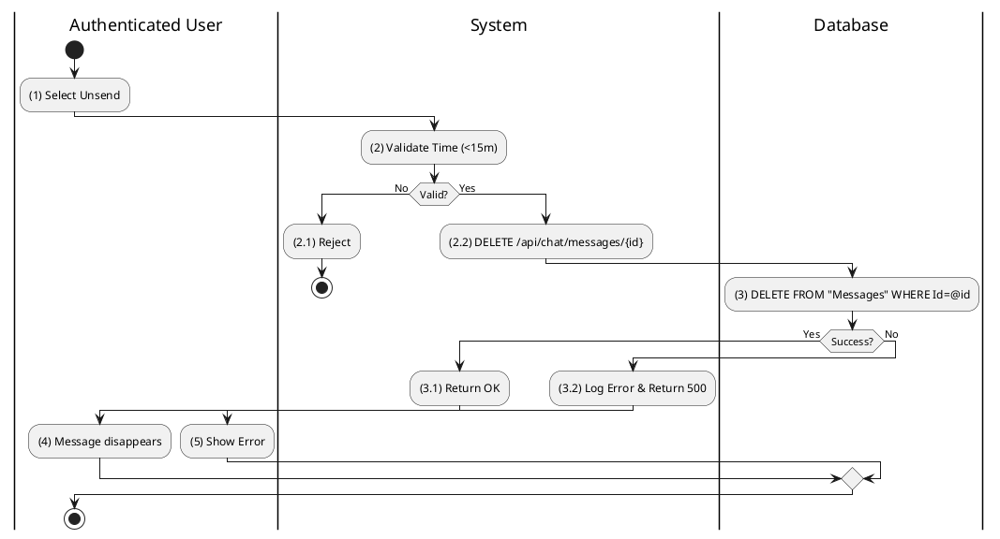

**Sequence Diagram**
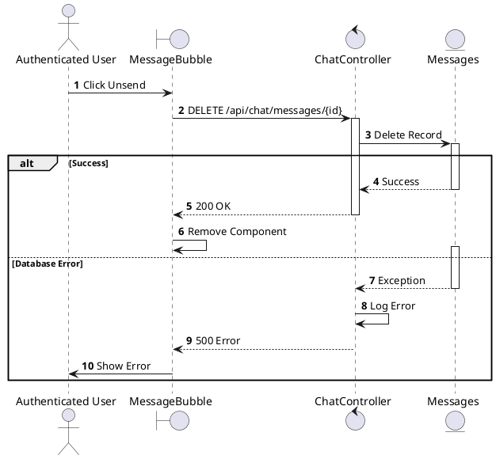

---

## 2.1.7.6 Search Chat History

### Use Case Description
| Attribute | Details |
| :--- | :--- |
| **Name** | **Search Chat History** |
| **Description** | Search within conversations. |
| **Actor** | Authenticated User |
| **Trigger** | ❖ User types a keyword in the chat search bar. |
| **Pre-condition** | ❖ User has existing conversations. |
| **Post-condition** | ❖ System displays messages matching the keyword. |

### Business Rules (BR)

| Activity | BR Code | Description |
| :---: | :---: | :--- |
| (2)-(4) | BR1 | **Querying Rules:** ❖ System calls method `SearchMessages(query)` (Step 2). ❖ System executes syntax `SELECT * FROM Messages WHERE Content LIKE %[query]%` on table “Messages” (Step 3). ❖ System joins with “UserConversations” to ensure the user has access to those messages (Step 4). |
| (5)-(6) | BR2 | **Displaying Rules:** ❖ System returns results (Step 5). ❖ System groups results by Conversation. ❖ System displays the “SearchResults” list (Refer to “SearchResults” view in “View Description” file) (Step 6). |

### Diagrams

**Activity Diagram**
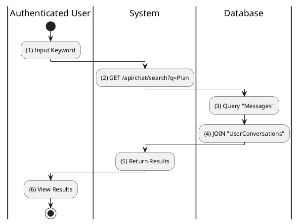

**Sequence Diagram**
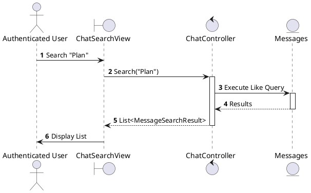

---

## 2.1.7.7 Mark Chat as Read

### Use Case Description
| Attribute | Details |
| :--- | :--- |
| **Name** | **Mark Chat as Read** |
| **Description** | Update read status when opening a chat. |
| **Actor** | Authenticated User |
| **Trigger** | ❖ User clicks to open a conversation. |
| **Pre-condition** | ❖ Conversation has unread messages. |
| **Post-condition** | ❖ The "LastReadMessageId" is updated to the latest message. ❖ Unread indicator disappears. |

### Business Rules (BR)

| Activity | BR Code | Description |
| :---: | :---: | :--- |
| (2)-(4) | BR1 | **Processing & Storing Rules:** ❖ When entering the screen, System calls method `MarkAsRead(convId)` (Step 2). ❖ System updates table “UserConversations” setting `LastReadMessageId` to the latest message ID (Steps 3-4). ❖ System triggers a badge update on the client side. |
| (4.1) | BR_Error | **Exception Handling Rules:** ❖ If a system failure occurs:  System logs the error (Step 4.1).  System returns `500 Internal Server Error`. |

### Diagrams

**Activity Diagram**
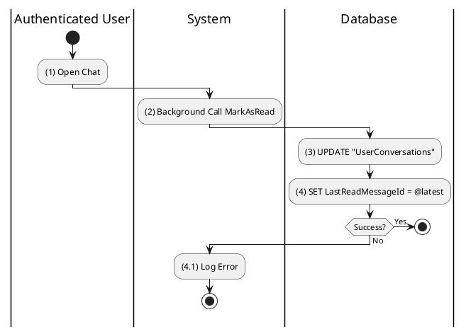

**Sequence Diagram**
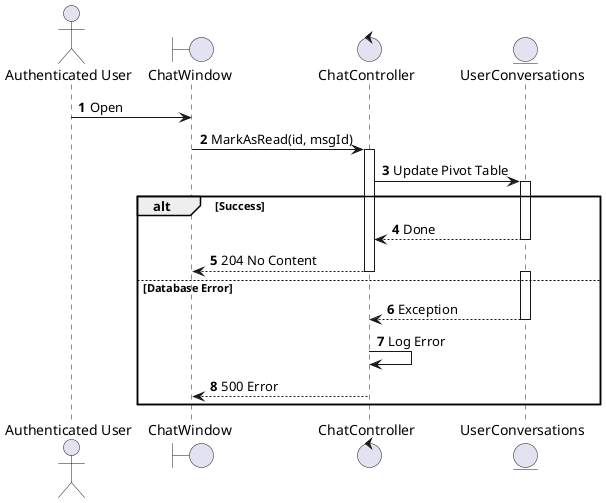

---

## 2.1.7.8 Leave Group Chat

### Use Case Description
| Attribute | Details |
| :--- | :--- |
| **Name** | **Leave Group Chat** |
| **Description** | Exit a group. |
| **Actor** | Authenticated User |
| **Trigger** | ❖ User selects "Leave Group" from group settings. |
| **Pre-condition** | ❖ User is currently a member of the group. |
| **Post-condition** | ❖ User is removed from the participant list. ❖ User no longer receives messages from this group. |

### Business Rules (BR)

| Activity | BR Code | Description |
| :---: | :---: | :--- |
| (2) | BR1 | **Leave Confirmation Logic:** ❖ System displays a Warning Dialog (Refer to MSG_CONFIRM_LEAVE).  **Confirmed**: User accepts consequences. System moves to step (3).  **Cancelled**: The dialog closes; action aborted. |
| (3)-(4) | BR2 | **Processing & Storing Rules:** ❖ System calls method `LeaveGroup(convId)` (Step 3). ❖ System deletes the record from table “UserConversations” (Refer to “UserConversations” table in “DB Sheet” file) for the current user and target group (Step 4). |
| (4.1)-(5) | BR3 | **Displaying Rules:** ❖ After leave, System returns success (Step 4.1). ❖ System redirects user to Inbox (Step 5). |
| (4.2)-(6) | BR_Error | **Exception Handling Rules:** ❖ If a system failure occurs:  System logs the error (Step 4.2).  System returns `500 Internal Server Error`.  Show Error (Step 6). |

### Diagrams

**Activity Diagram**
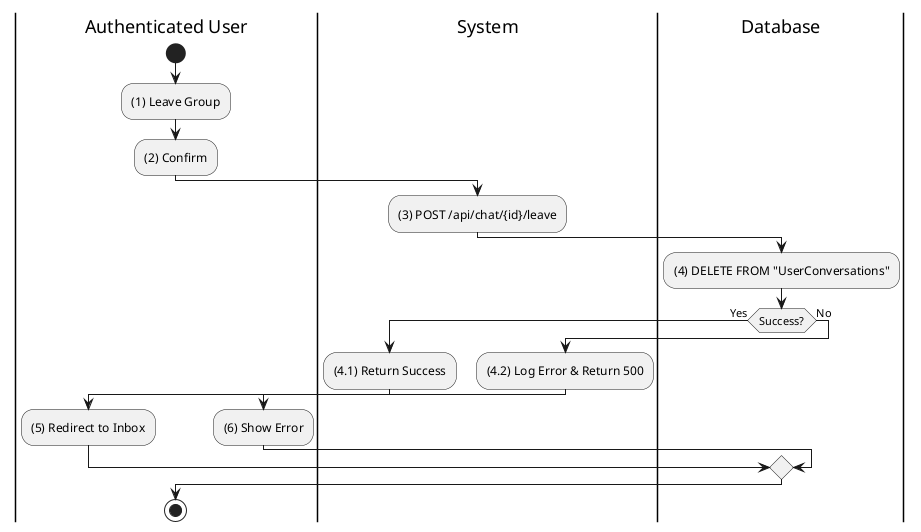

**Sequence Diagram**
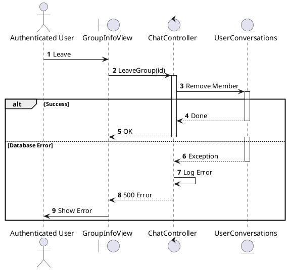
