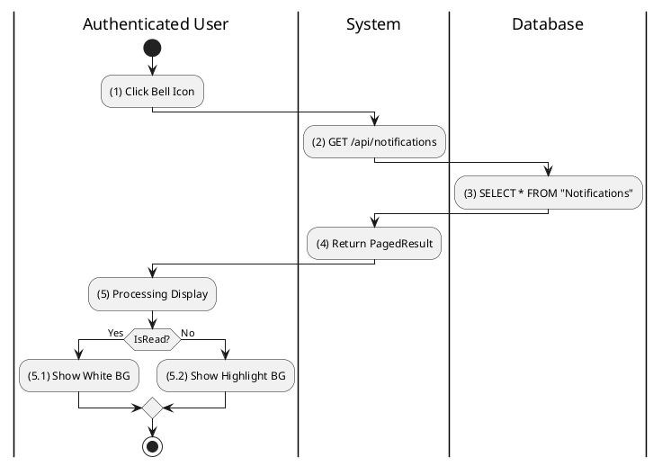
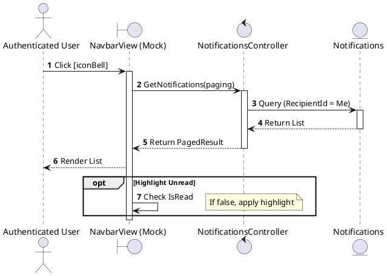
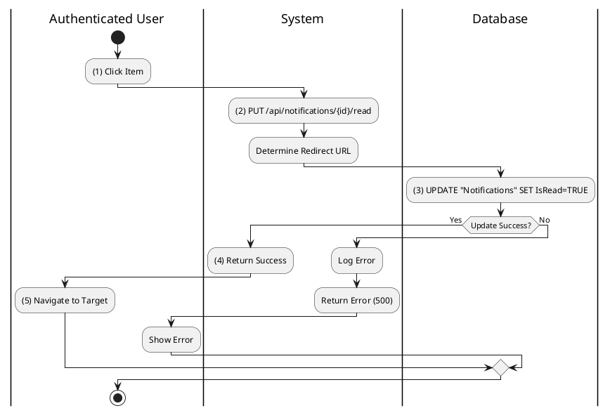
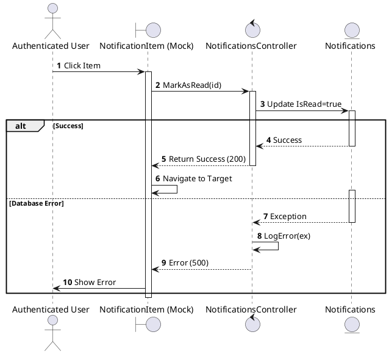
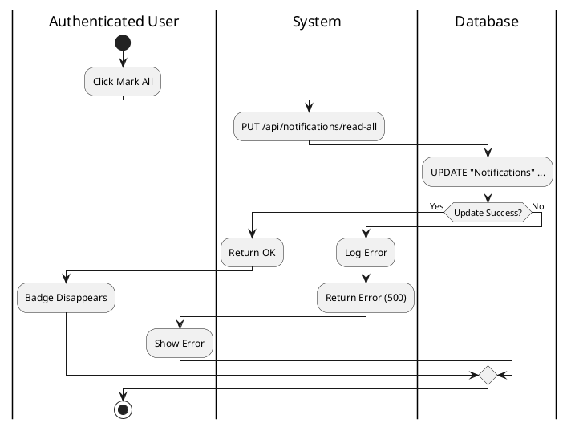
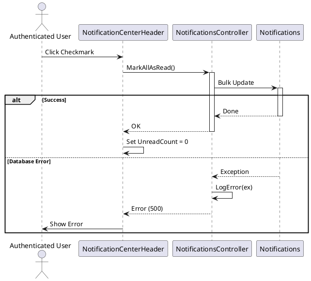
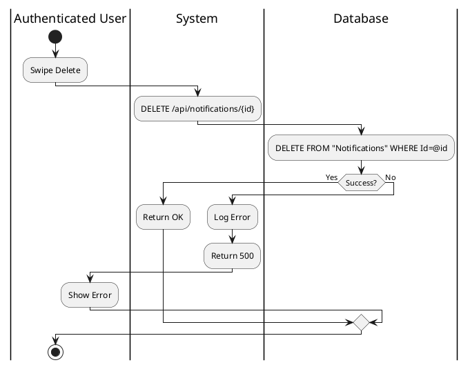
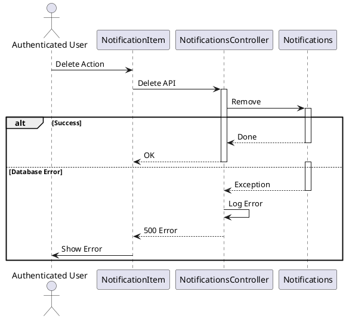
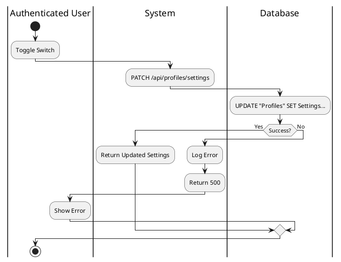
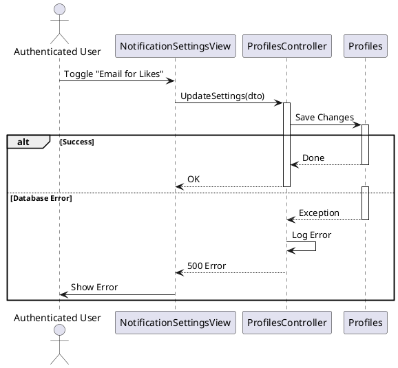

# Use Case 2.1.8: Monitor Notification

**Module**: Notifications
**Primary Actor**: Authenticated User
**Backend Controller**: `Favi_BE.API.Controllers.NotificationsController`
**Database Tables**: `"Notifications"`

---

## 2.1.8.1 Monitor Notification (View List)

### Use Case Description
| Attribute | Details |
| :--- | :--- |
| **Name** | **Monitor Notification (View List)** |
| **Description** | View the notification stream. |
| **Actor** | Authenticated User |
| **Trigger** | ❖ User clicks the [iconBell] on the Navigation Bar. |
| **Pre-condition** | ❖ User is logged in. |
| **Post-condition** | ❖ System displays the notification dropdown/page with recent alerts. |

### Business Rules (BR)

| Activity | BR Code | Description |
| :---: | :---: | :--- |
| (1) | BR1 | **Selecting Rules:** When the user clicks the Bell Icon on the navbar, the system toggles the Notification Center dropdown/page. |
| (2) | BR2 | **Querying Rules:** The system calls `NotificationsController.GetNotifications` (`GET /api/notifications`) to fetch the latest alerts. |
| (3) | BR3 | **Querying Rules:** The database executes a `SELECT` query on the `Notifications` table, filtering for records where `RecipientId` is the current user, ordered by time. |
| (4) | BR4 | **Displaying Rules:** The system returns a `PagedResult` containing notification DTOs. |
| (5) | BR5 | **Displaying Rules:** The UI renders the notification list. |
| (5.1) | BR5.1 | **Displaying Rules (Unread):** If `IsRead` is false, the item is displayed with a highlighted background (e.g., light blue) to indicate it is new. |
| (5.2) | BR5.2 | **Displaying Rules (Read):** If `IsRead` is true, the item is displayed with a standard/white background. |

### Diagrams

**Activity Diagram**

**Sequence Diagram**

---

## 2.1.8.3 Mark Notification as Read

### Use Case Description
| Attribute | Details |
| :--- | :--- |
| **Name** | **Mark Notification as Read** |
| **Description** | Click a notification to read it. |
| **Actor** | Authenticated User |
| **Trigger** | ❖ User clicks on an unread notification item. |
| **Pre-condition** | ❖ Notification exists and is unread. |
| **Post-condition** | ❖ Notification status becomes "Read". ❖ User is redirected to the relevant content. |

### Business Rules (BR)

| Activity | BR Code | Description |
| :---: | :---: | :--- |
| (1) | BR1 | **Selecting Rules:** When the user clicks on a specific notification item, the system handles the read confirmation and navigation. |
| (2) | BR2 | **Processing Rules:** The system calls `NotificationsController.MarkAsRead` (`PUT /api/notifications/{id}/read`) for that specific notification. |
| (3) | BR3 | **Storing Rules:** The database updates the record in the `Notifications` table, setting the `IsRead` column to `TRUE`. |
| (4) | BR4 | **Displaying Rules:** The system returns a success status (200 OK) to acknowledge the update. |
| (5) | BR5 | **Processing Rules:** The UI reads the `TargetUrl` or resource parameters from the notification and redirects the browser to the relevant content (e.g., specific Post, Comment, or Profile). |
| (6) | BR_Error | **Exception Handling Rules:** If a system failure occurs, the Global Exception Handler logs the error and returns a `500 Internal Server Error`. |

### Diagrams

**Activity Diagram**

**Sequence Diagram**

---

## 2.1.8.4 Mark All Notifications as Read

### Use Case Description
| Attribute | Details |
| :--- | :--- |
| **Name** | **Mark All Notifications as Read** |
| **Description** | Bulk clear unread status. |
| **Actor** | Authenticated User |
| **Trigger** | ❖ User clicks the "Mark all as read" icon. |
| **Pre-condition** | ❖ There are unread notifications. |
| **Post-condition** | ❖ All user's notifications are updated to "Read". ❖ Badge count is reset to 0. |

### Business Rules (BR)

| Activity | BR Code | Description |
| :---: | :---: | :--- |
| (1) | BR1 | **Selecting Rules:** User clicks the "Mark all as read" button/icon in the header. |
| (2) | BR2 | **Submitting Rules:** System calls `NotificationsController.MarkAllAsRead()`. |
| (3) | BR3 | **Storing Rules:** SQL: `UPDATE "Notifications" SET "IsRead" = true WHERE "RecipientProfileId" = @me`. |
| (4) | BR4 | **Displaying Rules:** Frontend clears the red badge count on the Bell Icon immediately. |
| (5) | BR_Error | **Exception Handling Rules:** If a system failure occurs, the Global Exception Handler logs the error and returns a `500 Internal Server Error`. |

### Diagrams

**Activity Diagram**

**Sequence Diagram**

---

## 2.1.8.5 Delete Notification

### Use Case Description
| Attribute | Details |
| :--- | :--- |
| **Name** | **Delete Notification** |
| **Description** | Remove an item from history. |
| **Actor** | Authenticated User |
| **Trigger** | ❖ User uses the delete action/swipe on a notification. |
| **Pre-condition** | ❖ Notification exists in the list. |
| **Post-condition** | ❖ The notification record is deleted from the database. ❖ Item is removed from the UI. |

### Business Rules (BR)

| Activity | BR Code | Description |
| :---: | :---: | :--- |
| (1) | BR1 | **Selecting Rules:** User swipes left on an item or uses the delete menu options. |
| (2) | BR2 | **Submitting Rules:** System calls `NotificationsController` DELETE endpoint. |
| (3) | BR3 | **Storing Rules:** System deletes the row from `"Notifications"`. |
| (4) | BR_Error | **Exception Handling Rules:** If a system failure occurs, the Global Exception Handler logs the error and returns a `500 Internal Server Error`. |

### Diagrams

**Activity Diagram**

**Sequence Diagram**

---

## 2.1.8.6 Configure Notification Preferences

### Use Case Description
| Attribute | Details |
| :--- | :--- |
| **Name** | **Configure Notification Preferences** |
| **Description** | Toggle types of alerts. |
| **Actor** | Authenticated User |
| **Trigger** | ❖ User navigates to Settings -> Notifications. |
| **Pre-condition** | ❖ User is logged in. |
| **Post-condition** | ❖ User's preference logic is updated in the database. |

### Business Rules (BR)

| Activity | BR Code | Description |
| :---: | :---: | :--- |
| (1) | BR1 | **Displaying Rules:** User enters "Settings -> Notifications". Displays list of toggles (Likes, Comments, Follows). |
| (2) | BR2 | **Selecting Rules:** User toggles "Email Notifications for Likes" to OFF. |
| (3) | BR3 | **Submitting Rules:** System calls `ProfilesController.UpdateSettings`. |
| (4) | BR4 | **Storing Rules:** Updates the JSONB settings column or specific columns in `"Profiles"` table. |
| (5) | BR_Error | **Exception Handling Rules:** If a system failure occurs, the Global Exception Handler logs the error and returns a `500 Internal Server Error`. |

### Diagrams

**Activity Diagram**

**Sequence Diagram**

